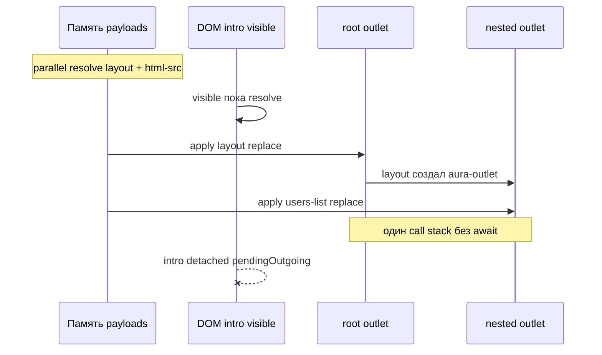

# Atomic branch commit — resolve-then-apply для enter-ветки

> **Статус:** <span style="color: #1a7f37; font-weight: bold;">✓ P0 реализовано</span> (2026-07-06).  
> **Приоритет:** P0 (roadmap engine).  
> **Связь:** [MAIN_PIPELINE.md](../MAIN_PIPELINE.md) · [OPTIMISTIC_URL.md](./OPTIMISTIC_URL.md) · [REPLACE_SUPERSEDE_ROLLBACK.md](./REPLACE_SUPERSEDE_ROLLBACK.md) · [OUTLET_AND_RENDER.md](./OUTLET_AND_RENDER.md) · [POP_NAVIGATION.md](../POP_NAVIGATION.md) · [ENGINE_ARCHITECTURE_COMPARISON.md](../comparison/ENGINE_ARCHITECTURE_COMPARISON.md)

---

## TL;DR

| Сейчас | Проблема | Цель |
|--------|----------|------|
| `runRender`: `await resolve` → `applyMount` **на каждый** enter-узел | Layout монтируется **до** fetch child view → кадр с пустым slot | **Branch resolve** (parallel, no DOM) → **sync apply** всей ветки |
| `replace` уничтожает outgoing до commit gate | Cancel/supersede после replace не откатывает DOM | **Detached snapshot** (`pendingOutgoingRoot`) до gate |
| URL пишется до render (optimistic history) | DOM может отставать | P0: **dom-deferred**; P1: **fully-atomic** (URL после promote) |

**Рекомендуемый P0 default:** `mount-strategy="branch"` (или omit) + `dom-deferred` — outgoing visible до полного resolve ветки; один sync apply root→leaf. Progressive `per-route` mount снят.

---

## 1. Проблема в терминах engine

Сейчас `NavigationTransactionPipeline.runRender` для каждого узла `enterRoutes` (root → leaf):

```text
await resolve(content) → applyMount(replace) → следующий узел
```

Для `intro → /users`:

| Шаг | DOM | Видимо пользователю |
|-----|-----|---------------------|
| Layout resolve + mount | intro уничтожен, layout с пустым nested outlet | **Частичное состояние** |
| Child fetch | layout без view | **Пустой slot** |
| Child mount | layout + users-list | OK |

Проблема не в скорости fetch, а в **granularity commit**: каждый узел ветки коммитится в DOM **независимо**, хотя navigation воспринимается как **одна смена экрана**.

Дополнительно: `replace` уничтожает outgoing **до** commit gate → нет DOM rollback при cancel/supersede (см. [REPLACE_SUPERSEDE_ROLLBACK.md](./REPLACE_SUPERSEDE_ROLLBACK.md)).

---

## 2. Что значит «atomic commit»

Три уровня атомарности — **не смешивать**:

| Уровень | Инвариант | Пример |
|---------|-----------|--------|
| **Branch** | Вся `enterRoutes` цепочка видна **целиком или не видна** | layout + index view |
| **Outlet** | В одном outlet нет промежуточного root | root outlet при смене ветки |
| **Transaction** | URL + visible DOM + `prev` меняются **в одной точке** | опционально, product policy |

**Рекомендация для P0:** Branch + Outlet. Transaction-level (URL вместе с DOM) — отдельная product-опция.

**Non-goals P0:**

- не заменять `stage` для transition-анимаций;
- не делать «always stage» (ломает patch и семантику двух слоёв);
- не требовать virtual history layer.

---

## 3. Целевая модель: два механизма + одна точка promote

Atomic commit = **`Branch Resolve`** + **`Deferred Apply`** + **`Branch Promote`**.

```text
┌──────────┐   ┌─────────────────┐   ┌──────────────────┐   ┌───────────────────┐
│ guards   │ → │ loads (data)    │ → │ branch resolve   │ → │ branch apply      │
└──────────┘   └─────────────────┘   │ (content, no DOM)│   │ (deferred)        │
                                       └──────────────────┘   └─────────┬─────────┘
                                                                         │
                    ┌────────────────────────────────────────────────────┘
                    ▼
         transitions (optional) → promote → commitNavigation → unmount → ready
```

### 3.1 Branch Resolve (новая фаза)

**До любого `outlet.apply`:**

```text
payloads = await resolveEnterBranch(enterRoutes, { parallel: true })
```

- Параллельно: `layout` (template, sync) + leaf view (html-src, fetch).
- Тот же `ContentLoadService` / prefetch cache — cache hit = без сети.
- При ошибке / abort: **DOM не тронут**, outgoing на экране.
- `load`-hooks уже отработали в `runLoads`; resolve — только view/layout content.

**Граница ответственности:**

| Слой | Что резолвит |
|------|--------------|
| DataGraph | `load` hooks, data snapshot |
| BranchResolver (новый) | view/layout payloads для enter-ветки |
| RouteViewController | mount/detach/promote (без fetch в hot path) |

### 3.2 Deferred Apply (не показывать, пока ветка не собрана)

Пока branch resolve не завершён — **outgoing остаётся visible**.

После resolve — **синхронная сборка root → leaf** без `await` между узлами:

```text
for (route of enterRoutes) {
  applyMount(route, payloads[route])  // sync, payloads уже в памяти
}
```

**Detached snapshot** (из [REPLACE_SUPERSEDE_ROLLBACK.md](./REPLACE_SUPERSEDE_ROLLBACK.md)) — для rollback и supersede:

```text
pendingOutgoing = activeHandle.detach()   // off-DOM, не в outlet
outlet.apply(incoming, replace)
// gate success → destroy pendingOutgoing
// cancel/supersede → destroy incoming, reattach pendingOutgoing
```

Закрывает P0 gap replace-vs-stage **без** второго visible слоя.

### 3.3 Branch Promote (существующий commit gate)

`commitStagedView()` + `commitNavigation()` — порядок в `runAfterRender` сохраняется, семантика state меняется:

| Состояние | Было (`markViewStaged`) | Станет |
|-----------|-------------------------|--------|
| После branch apply | «staged» (replace уже visible) | **`rendered`** / `pendingCommit` |
| После promote + gate | `committed` | `committed` |

Переименование — ENGINE_ARCHITECTURE_COMPARISON P0.2; «staged» ≠ transition stage.

---

## 4. Nested routes: как собирать ветку

### 4.1 Scope atomic unit

Atomic unit = **непрерывный суффикс `enterRoutes`**, начиная с первого узла, которому нужен mount.

| Переход | enterRoutes | Atomic scope |
|---------|-------------|--------------|
| intro → /users | `[layout, index]` | оба узла |
| /users → /users/1 | `[profile]` | только leaf (layout на LCA, **не remount**) |
| /users/1 → /users/2 | update shortcut | atomic не нужен |

**Правило LCA:** узлы на LCA и выше, уже смонтированные без remount, **не входят** в atomic batch.

### 4.2 Алгоритм сборки

**Вариант A — Resolve-then-sync-mount** (минимальный diff, P0):

```text
1. resolve all enter payloads (parallel)
2. sync mount root → leaf using pre-resolved payloads
3. discard pendingOutgoing on gate
```

Не требует off-DOM DocumentFragment.

**Вариант B — Off-DOM branch tree** (P1):

```text
1. resolve all
2. build BranchTree in DocumentFragment / detached container
3. single applyReplace at root outlet
4. wire nestedOutlet refs
```

Если e2e покажет paint между sync mount'ами — перейти на B.

### 4.3 Инвариант для layout + child

```text
∀ route ∈ enterRoutes : payload[route] resolved
⇒ только тогда первый applyReplace на изменённом outlet
```

Layout **никогда** не появляется с пустым slot при atomic policy.

### 4.4 Assembly model — как «склеиваются» кусочки

Частый вопрос: финальный HTML **склеивается строкой**, собирается **в памяти off-DOM** или кладётся на страницу **скрытым**?

**Краткий ответ для P0:** кусочки живут **в памяти как payload'ы** (fragment / HTML string), затем **одним синхронным проходом** монтируются в **живые outlet'ы** — **без** hidden DOM для incoming. Старый экран visible до конца resolve.

**Не делаем по умолчанию:** concatenation HTML-строк, `display:none` incoming в outlet, «always stage» (два visible root).

#### Что такое «кусочки» после Branch Resolve

На фазе resolve в JS-памяти лежат **payload'ы**, не финальное дерево на странице:

| Узел enter-ветки | Что в памяти после resolve |
|------------------|----------------------------|
| `layout="users-layout"` | `DocumentFragment` — клон `<template id="users-layout">` |
| `view="users-list.html"` | строка HTML (html-src) → узлы при mount через `sanitizeHtml` / `asRoot` |

```text
payloads = {
  layout: DocumentFragment { badge, chrome, <aura-outlet>… },
  index:  "<article class=\"demo-site-view\">…</article>"
}
```

Это **не** один большой HTML document и **не** DOM в `document`. Связь layout ↔ child — через **цепочку outlet'ов** при apply, не через merge строк.

#### Вариант A (P0): resolve в памяти → sync mount в живой DOM

**Recommended default.** Incoming **не** hidden — старый view visible до apply, новый появляется **целиком** после sync chain.

```text
function applyBranch(payloads, enterRoutes) {
  pendingOutgoing = activeHandle.detach(intro)   // off-DOM: только OUTGOING (rollback)

  layoutHandle = rootOutlet.apply(payloads.layout, { strategy: 'replace' })
  nestedOutlet = layoutHandle.findChildOutlet()
  nestedOutlet.apply(payloads.index, { strategy: 'replace' })
  // без await между двумя apply — один JS turn
}
```

**Почему это «atomic enough»:** между mount layout и mount child **нет yield** (`await`, timer, microtask между шагами). Браузер paint'ит **после** выхода из `applyBranch`, когда nested slot уже заполнен.

**Что видит пользователь:**

```text
intro (visible)
  … fetch layout + html-src parallel …
  intro (visible)                    ← resolve in flight
  layout + users-list (visible)      ← один sync apply, без «пустого layout»
```



**Как nested «склеивается»** — не merge HTML, а mount по outlet chain:

```text
root outlet
  └─ [data-aura-view-root]          ← layout payload
       ├─ … layout chrome …
       └─ aura-outlet               ← findChildOutlet()
            └─ [data-aura-view-root] ← index payload
                 └─ article…
```

Код опирается на существующий API: `AuraOutlet.apply` → `ViewHandle.findChildOutlet()` (`aura-outlet.ts`).

#### Вариант B (P1): off-DOM tree → один replace

Fallback, если e2e покажет промежуточный paint при варианте A (CE upgrade, вставка microtask между mount'ами).

```text
1. staging = document.createElement('div')   // НЕ в document
2. mount layout payload в staging
3. nested = staging.querySelector('aura-outlet')
4. mount index payload в nested (всё ещё off-DOM)
5. rootOutlet.applyReplace(staging.firstElementChild)   // один visible swap
6. intro → полное дерево одним replace
```

```text
[ div#staging — вне document ]
  └─ layout shell
       └─ aura-outlet
            └─ users-list article

              │ applyReplace (один раз)
              ▼

[ root outlet — на странице ]
  └─ то же дерево, visible
```

Incoming собирается **вне document**, не через `visibility:hidden` внутри outlet. Старый intro visible до шага 5.

#### Detached snapshot — только для OUTGOING

`pendingOutgoingRoot` ([REPLACE_SUPERSEDE_ROLLBACK.md](./REPLACE_SUPERSEDE_ROLLBACK.md)) — **не** способ собрать incoming:

| Subtree | Где до show | Зачем |
|---------|-------------|-------|
| **Outgoing** (intro) | `detach()` → off-DOM | rollback при cancel/supersede до gate |
| **Incoming** (layout+list) | P0: сразу в outlet, sync | показать пользователю |
| **Incoming** | P1: off-DOM staging div | один replace |

```text
success gate:  destroy pendingOutgoing
cancel:        destroy incoming, reattach pendingOutgoing
```

Не путать с `cache.dom` cache: разный lifecycle (discard на gate vs put в cache на unmount).

#### Что сознательно не используем

| Подход | Почему не default |
|--------|-------------------|
| **Склеить HTML-строку** | layout содержит `<aura-outlet>`, WC, hooks — нужны живые узлы и `findChildOutlet()` |
| **Incoming скрытый в outlet** (`hidden`, `opacity:0`) | partial tree в layout; ломает a11y, measure, focus; семантически тот же «layout без child» |
| **`stage` без transition** | два root **в outlet**, оба в layout tree — для crossfade, не для atomic |
| **Prefetch вместо atomic** | prefetch ускоряет resolve; без sync apply gap при cache miss остаётся |

#### Transitions + assembly

При `transition-order` incoming может монтироваться через **`stage`** (два root для анимации) — **после** полного branch resolve. Resolve всё равно **до** любого mount; «hidden» здесь = **ещё не mounted** или staged для crossfade, не `display:none` skeleton в nested slot.

```text
resolve branch (payloads in memory, nothing in target outlets)
→ transitionOut(outgoing)
→ applyBranch with strategy=stage (optional, transition routes only)
→ transitionIn
→ commitStagedView
```

Atomic policy и transition policy **ортogonal** (§5.4).

#### Сводка: память vs DOM vs hidden

| Вопрос | P0 (вариант A) | P1 (вариант B) |
|--------|----------------|----------------|
| Где кусочки до show? | **Память** (fragment, HTML string) | **Память** → **off-DOM div** |
| Когда попадает на экран? | Sync mount root→leaf в **живые** outlet'ы | **Один** `applyReplace` готового дерева |
| Incoming hidden в outlet? | **Нет** | **Нет** (off-DOM, не hidden visible tree) |
| Outgoing до apply? | **Visible** | **Visible** |
| Outgoing после apply? | `detach()` off-DOM (rollback) | то же |

---

## 5. Изменения pipeline

### 5.1 Новый модуль: `view-mount/branch-commit.ts`

```text
BranchCommitCoordinator
  resolveBranch(enterRoutes, signal) → Map<RouteNode, ViewPayload>
  applyBranch(enterRoutes, payloads, mode: 'deferred' | 'eager')
  promoteBranch(enterRoutes)
  rollbackBranch(enterRoutes)  // supersede / cancel
```

`runRender` (концепт):

```text
async runRender() {
  if (!shouldUseAtomicCommit(plan, config)) {
    return runRenderEager();  // legacy
  }

  const payloads = await branchCommit.resolveBranch(enterRoutes);
  if (aborted) return cancelled;

  for (route of enterRoutes) {
    await runViewCommit(route, { payload: payloads[route], deferApply: true });
  }

  branchCommit.applyBranch(enterRoutes);  // sync
  markViewRendered();
  return null;
}
```

`RouteViewController.render()` — optional pre-resolved payload + `deferApply`.

### 5.2 Fast path

`canUseFastPath`: single enter + sync content. Atomic не ломает: один узел, defer = no-op.

### 5.3 Update shortcut

`plan.update === true` — без render, atomic не участвует.

### 5.4 Transitions

Atomic и transitions **ортogonal**:

```text
resolve branch (payloads in memory, DOM unchanged)
→ transitionOut on outgoing
→ applyBranch (optional stage on root outlet)
→ transitionIn
→ commitStagedView / promote
```

`useStagedMount` остаётся при `transition-order`, не при atomic policy. Детали assembly — §4.4.

---

## 6. History / URL policy

| Режим | URL | DOM | Когда |
|-------|-----|-----|-------|
| **`optimistic`** (as-is) | после load, **до** render | после branch apply | default backward compat |
| **`dom-deferred`** (P0) | as-is | outgoing до branch apply | fix nested gap + pop defer replace |
| **`fully-atomic`** (P1) | **после** branch promote | вместе с URL | strict SPA ([OPTIMISTIC_URL.md](./OPTIMISTIC_URL.md) §B) |

**P0:** `dom-deferred` — URL может на ms опережать DOM (pop variant C), но **нет пустого layout**.

---

## 7. Loading UX

Пока branch resolve идёт — **старый экран visible**. Feedback:

| Механизм | Уровень | Статус |
|----------|---------|--------|
| `loading-template` | per-route | частично |
| `document.body.aura-route-loading` | global | есть |
| `<aura-router loading>` overlay | router | P1 |
| Nav link `aria-busy` | a11y | P1 |

**Правило:** loading UI **не монтируется в target outlet** до branch apply.

---

## 8. Config surface

```html
<aura-router mount-strategy="branch">
<!-- branch | full (P1). per-route removed — prepare/commit always branch-atomic -->

<aura-route path="/users" layout="users-layout" mount-strategy="branch">
```

**Cascade:** route → router → эвристика (`branch` для nested/async; single sync leaf тоже через prepare/commit).

**Значения:** `per-route` — mount по узлам · `branch` — mount всей enter-ветки · `full` — DOM + URL вместе (P1).

**Авто-эвристика (без attr):**

```text
atomic = enterRoutes.length > 1
      OR any enterRoute.hasAsyncContent
      OR cross-outlet replace
```

---

## 9. Cancel / supersede / error

| Момент | Поведение |
|--------|-----------|
| During branch resolve | abort signal, DOM unchanged |
| After resolve, before apply | discard payloads, DOM unchanged |
| After apply, before gate | rollback via `pendingOutgoingRoot` |
| Render error | error UI **или** restore outgoing (policy) |
| After gate | committed, discard pendingOutgoing |

`revertInFlightView`: `rollbackStaged` (transition) + `rollbackReplace` (detached snapshot).

---

## 10. Prefetch

Prefetch intent **complementary**: hover → `prefetchBranch` → click → resolve cache hit → sync apply.

Atomic commit **не зависит** от prefetch.

---

## 11. Фазы реализации

### P0 (~2–3 дня) — закрывает nested gap ✓

1. `resolveEnterBranch` — parallel resolve enter nodes (`branch-resolver.ts`).
2. `runRender` refactor: resolve → sync mount (`mountEnterBranch` in `branch-mount.ts`).
3. `RouteViewController.applyPreResolved` / `AuraRoute.applyPreResolved` — pre-resolved payload path.
4. `pendingOutgoingRoot` в `MountSnapshot` + rollback on cancel.
5. Tests: `atomic-branch-commit.integration.test.ts`; cancel during resolve; supersede before gate.

### P1 (~3–5 дней)

6. Off-DOM branch tree (вариант B) при необходимости.
7. `mount-strategy="full"` (URL + DOM).
8. Router loading overlay + a11y.
9. Transition + atomic: resolve до mount, stage только при `transition-order` (§4.4).

### P2

10. Incremental LCA — не remount layout при sibling change ([INCREMENTAL_RENDER.md](./INCREMENTAL_RENDER.md)).
11. Redirect chain collapse + atomic batch.

---

## 12. Test matrix

| Сценарий | Assert |
|----------|--------|
| intro → nested index (async child) | outlet height never drops to layout-only |
| hover prefetch + click | single paint, cache hit |
| click without prefetch | outgoing visible until full branch |
| cancel mid-fetch | DOM = from, URL preserved |
| supersede A→B mid-resolve | B wins, A payloads discarded |
| layout preserved, sibling swap | only nested outlet changes |
| transition fade + atomic | old visible during resolve |
| cache.dom + atomic | pendingOutgoing ≠ cache entry |
| render error | error UI or restore per policy |

---

## 13. Anti-patterns

| Не делать | Почему |
|-----------|--------|
| `useStagedMount = true` для всех routes | ломает patch, два visible слоя без transition |
| resolve внутри mount loop | текущий баг |
| skeleton **внутри** nested outlet до child | снова partial state |
| incoming **hidden** в outlet (`display:none`) | тот же partial state, ломает a11y/measure |
| atomic без detached snapshot | cancel после apply неоткатываем |
| history defer без product flag | surprise для optimistic URL users |

---

## 14. Рекомендуемое решение (summary)

**P0 default: `mount-strategy="branch"` + `dom-deferred`**

```text
guards → loads → history (optimistic URL)
      → resolveEnterBranch (parallel, no DOM)
      → mountEnterBranch (root→leaf, one paint)
      → [transitions]
      → promote → commitNavigation → unmount → ready
```

Ключевая идея: **разделить resolve и apply**, apply всей enter-ветки **синхронно после полного resolve**. Detached snapshot — для rollback, не для UX-анимаций.

CSS (`scrollbar-gutter`, min-height) — defense-in-depth, не primary fix.

---

## 15. Checklist по файлам (P0 PR)

| Файл | Изменение | Статус |
|------|-----------|--------|
| `aura-routing-engine/core/view-mount/branch-resolver.ts` | `resolveEnterBranch`, `shouldUseBranchMount` | ✓ |
| `aura-routing-engine/core/view-mount/branch-mount.ts` | `mountEnterBranch` — sync apply root→leaf | ✓ |
| `aura-routing-engine/core/route-tree/transition-plan.ts` | `isCrossOutletReplace` | ✓ |
| `aura-routing-engine/core/navigation/navigation-transaction-pipeline.ts` | `runRender` → resolve + sync mount | ✓ |
| `aura-route/core/view/view-controller.ts` | `applyPreResolved`, skip inline resolve | ✓ |
| `aura-route/core/view/outlet-adapter.ts` | `pendingOutgoingRoot`, `rollbackReplace` | ✓ |
| `aura-route/core/attr/mount-strategy-attr-parser.ts` | parser `mount-strategy` attr | ✓ |
| `aura-routing-engine/test/navigation/atomic-branch-commit.integration.test.ts` | integration matrix §12 | ✓ |

---

## Связанные документы

| Документ | Связь |
|----------|-------|
| [REPLACE_SUPERSEDE_ROLLBACK.md](./REPLACE_SUPERSEDE_ROLLBACK.md) | detached snapshot, replace gap |
| [OPTIMISTIC_URL.md](./OPTIMISTIC_URL.md) | stage-until-commit vs optimistic |
| [POP_NAVIGATION.md](../POP_NAVIGATION.md) | defer replace variant C |
| [OUT_IN_PREFETCH.md](./OUT_IN_PREFETCH.md) | hidden render + out-in (соседняя идея) |
| [ENGINE_ARCHITECTURE_COMPARISON.md](../comparison/ENGINE_ARCHITECTURE_COMPARISON.md) | P0 roadmap |
