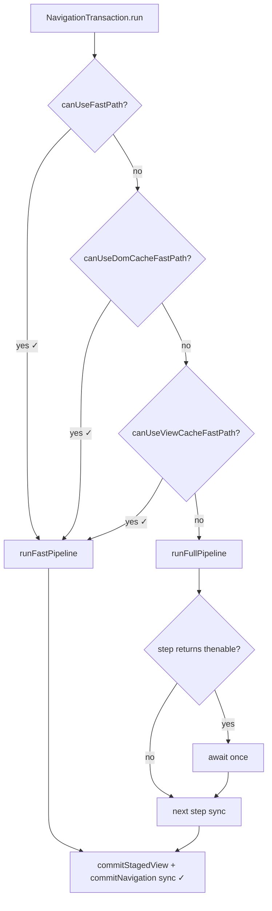

# TODO: Pipeline — sync/async шаги, fast path, step runner

> **Статус:** <span style="background:#16a34a;color:#fff;padding:2px 8px;border-radius:4px;font-weight:700">✓ ГОТОВО</span> — sync/dom/view-cache fast path + thenable ✓ · F1b ⊘ · F3 docs ✓  
> **Сверка с кодом:** 2026-07-19  
> **Связь:** оптимизация `NavigationTransactionPipeline` без смены семантики cancel/supersede.  
> **См. также:** [NAVIGATION_RUN_MANAGER.md](./NAVIGATION_RUN_MANAGER.md), [../done/REDIRECT_CHAIN_COLLAPSE.md](../done/REDIRECT_CHAIN_COLLAPSE.md) (blocking walk ✓ · полный `runBlockingOnly` ⊘), fast path: `canUseFastPath` / `canUseDomCacheFastPath` / `canUseViewCacheFastPath` → `runFastPipeline`

### Легенда

| Метка | Значение |
|-------|----------|
| <span style="background:#16a34a;color:#fff;padding:2px 8px;border-radius:4px;font-weight:700">✓ ГОТОВО</span> | в production path / покрыто тестами |
| <span style="background:#f59e0b;color:#111;padding:2px 8px;border-radius:4px;font-weight:700">~ ЧАСТИЧНО</span> | каркас / точечно есть, не полный scope документа |
| <span style="background:#dc2626;color:#fff;padding:2px 6px;border-radius:4px;font-weight:700">✗ ОСТАЛОСЬ</span> | не сделано |
| <span style="background:#6b7280;color:#fff;padding:2px 8px;border-radius:4px;font-weight:700">⊘ ОТЛОЖЕНО</span> | сознательно не в scope / by design |

### Сводка прогресса

| # | Тема | Статус | Что дальше |
|---|------|--------|------------|
| — | Tier 0 fast path (`canUseFastPath` + `runFastPipeline`) | <span style="background:#16a34a;color:#fff;padding:2px 6px;border-radius:4px;font-weight:700">✓</span> | shipped |
| — | Sync commit slice / `tryCacheRestore` / keep-alive ветки | <span style="background:#16a34a;color:#fff;padding:2px 6px;border-radius:4px;font-weight:700">✓</span> | invariant беречь |
| — | Redirect blocking walk (вместо полного `runBlockingOnly`) | <span style="background:#16a34a;color:#fff;padding:2px 6px;border-radius:4px;font-weight:700">✓</span> | [REDIRECT_CHAIN_COLLAPSE](../done/REDIRECT_CHAIN_COLLAPSE.md) |
| **F1** | Thenable-aware `runSequentially` + `isThenable` | <span style="background:#16a34a;color:#fff;padding:2px 6px;border-radius:4px;font-weight:700">✓</span> | sync steps: `runCommitHistory`, `commitEnterBranchToDom` |
| **F1b** | Lifecycle sync-return при sync hooks | <span style="background:#6b7280;color:#fff;padding:2px 6px;border-radius:4px;font-weight:700">⊘</span> | откат: много кода ради копеек |
| **F2** | Dom/view-cache fast path | <span style="background:#16a34a;color:#fff;padding:2px 6px;border-radius:4px;font-weight:700">✓</span> | `canUseDomCacheFastPath` · `canUseViewCacheFastPath` |
| **F3** | Документировать commit-slice invariant | <span style="background:#16a34a;color:#fff;padding:2px 6px;border-radius:4px;font-weight:700">✓</span> | pipeline JSDoc · ARCHITECTURE · NAVIGATION_RUN_MANAGER |
| — | Generator / trampoline driver | <span style="background:#6b7280;color:#fff;padding:2px 6px;border-radius:4px;font-weight:700">⊘</span> | overkill до профиля |
| — | Enum `sync \| async` на шагах | <span style="background:#6b7280;color:#fff;padding:2px 6px;border-radius:4px;font-weight:700">⊘</span> | хрупко |
| — | Полный `runBlockingOnly` mode | <span style="background:#6b7280;color:#fff;padding:2px 6px;border-radius:4px;font-weight:700">⊘</span> | не планируется (есть guard walk) |

---

## Контекст

Pipeline — набор шагов (`guards → loads → renderWithTransition → after`). Часть шагов **по природе** async (hooks с `await`, fetch, content loader), часть **в конкретном run** может отработать sync (cache hit, sync guard, keep-alive view).

As-is все шаги типизированы как `Promise`:

```ts
type PipelineStep = () => Promise<PipelineStepResult>;
```

`runSequentially` всегда `await step()` — даже когда тело шага завершилось синхронно.

<span style="background:#16a34a;color:#fff;padding:2px 6px;border-radius:4px;font-weight:700">✓</span> Thenable runner внедрён: `PipelineStep = () => PipelineStepResult | Promise<…>`; `isThenable` в `aura-utils/async/is-thenable.ts`; `runSequentially` await только thenable.

**Вопрос:** нужно ли pipeline «знать» sync vs async и вызывать шаги по-разному?  
**Ответ:** статические метки на шагах — **хрупко** <span style="background:#6b7280;color:#fff;padding:2px 6px;border-radius:4px;font-weight:700">⊘</span>; runtime thenable + fast path tiers — **практично**. Generator/trampoline — **overkill на текущем этапе** <span style="background:#6b7280;color:#fff;padding:2px 6px;border-radius:4px;font-weight:700">⊘</span> (см. § Generator).

---

## Проблема microtask gap — что реально, а что нет

| Утверждение | Факт |
|-------------|------|
| Между крупными шагами есть microtask ticks | Да, при `await` на Promise |
| Это заметно бьёт по performance | Обычно **нет** — DOM/fetch/анимации на порядки дороже |
| Gap ломает атомарность **всего** run | **Нет** — supersede **использует** окна между await |
| Gap ломает атомарность **commit** | Только если между view commit и history commit вставить await |

### Commit slice (invariant — не ломать) <span style="background:#16a34a;color:#fff;padding:2px 6px;border-radius:4px;font-weight:700">✓ ГОТОВО</span> код + дока (F3)

**View commit slice** в `runAfterRender` — sync pair, без `await` между:

```text
unmount (exit)                 // may await — outside slice
for enter: commitStagedView()  // promote staged → active
commitNavigation()             // view-success gate (prev, scroll, callbacks)
// ← no await between the two lines above
ready (enter)                  // may await — outside slice
```

| | |
|--|--|
| **Где в коде** | `NavigationTransactionPipeline.runAfterRender` |
| **JSDoc** | class + `runAfterRender` в `navigation-transaction-pipeline.ts` |
| **ARCHITECTURE** | `core/ARCHITECTURE.md` § Commit Vocabulary → Commit-slice invariant |
| **Cross-link** | [NAVIGATION_RUN_MANAGER.md](./NAVIGATION_RUN_MANAGER.md) («Не делать») |

History URL (`commitHistory` / `commitHistoryIfNeeded`) — **отдельный** sync step после guards / до loads; не часть view slice.

Gap **между** `markViewStaged` и slice на transition-пути **ожидаем** (transition hooks); supersede → `rollbackUncommittedViews` / `revertInFlightView`.

---

## Почему не статические метки «шаг sync / async» <span style="background:#6b7280;color:#fff;padding:2px 6px;border-radius:4px;font-weight:700">⊘</span>

| Причина | Пример |
|---------|--------|
| User hooks непредсказуемы | `enter` → `false` sync или `await fetch()` + redirect |
| Cache меняет runtime | load «async по типу», cache hit → без сети |
| `render()` async в API | `tryCacheRestore` sync внутри, снаружи `async renderPass` |
| Transitions | hooks могут ждать animation end |

Метка на шаге pipeline ≠ поведение **конкретного** прогона.

---

## Рекомендуемый подход

### 1. Thenable-aware runner (фаза 1) <span style="background:#16a34a;color:#fff;padding:2px 6px;border-radius:4px;font-weight:700">✓ ГОТОВО</span>

Шаг возвращает sync или Promise; runner различает в runtime:

```ts
type StepResult = PipelineOutcome | Promise<PipelineOutcome>;

function isThenable<T>(value: T | Promise<T>): value is Promise<T> {
  return value != null && typeof (value as Promise<T>).then === 'function';
}

async function runUntilTerminal(steps: PipelineStep[], ctx: PipelineContext) {
  for (const step of steps) {
    let outcome = step(ctx);
    if (isThenable(outcome)) outcome = await outcome;
    if (outcome) return outcome;
  }
  return null;
}
```

**Польза:** sync-return без лишнего tick; минимальный diff; hooks по-прежнему могут async.

**Не даёт:** полностью sync pipeline — outer `run()` остаётся `async`.

### 2. Fast path tiers (фаза 2) — основной perf-рычаг

| Tier | Условие | Поведение | Статус |
|------|---------|-----------|--------|
| **0** | flat nav без hooks, transitions, async content | bypass lifecycle pipeline | <span style="background:#16a34a;color:#fff;padding:2px 6px;border-radius:4px;font-weight:700">✓</span> `canUseFastPath` + `runFastPipeline` |
| **1** | flat + no blocking hooks + `cache.dom` hit (async view ok) | тот же `runFastPipeline` | <span style="background:#16a34a;color:#fff;padding:2px 6px;border-radius:4px;font-weight:700">✓</span> `canUseDomCacheFastPath` |
| **2** | полный pipeline | default | <span style="background:#16a34a;color:#fff;padding:2px 6px;border-radius:4px;font-weight:700">✓</span> `runFullPipeline` |

Критерий dom-cache fast path: lifecycle как у sync fast path + `DomCache.has` — проверка перед стартом.

**Load cache hit ≠ skip pipeline:** `onLoad` и DataGraph policy могут требовать прогона даже при cache hit (as-is комментарий в `data-graph.ts` / pipeline).

### 3. `runBlockingOnly` mode (фаза 3, с redirect collapse)

| Вариант | Статус |
|---------|--------|
| Blocking walk `leave`→`guard` + declarative collapse | <span style="background:#16a34a;color:#fff;padding:2px 6px;border-radius:4px;font-weight:700">✓</span> `followRedirectsWithGuardWalk` / `runRedirectCollapse` |
| Полный pipeline-mode `runBlockingOnly` (loads без render) | <span style="background:#6b7280;color:#fff;padding:2px 6px;border-radius:4px;font-weight:700">⊘</span> не планируется — см. [REDIRECT_CHAIN_COLLAPSE](../done/REDIRECT_CHAIN_COLLAPSE.md) |

Не смешивать с sync-оптимизацией full run.

---

## As-is sync-ветки (уже есть) <span style="background:#16a34a;color:#fff;padding:2px 6px;border-radius:4px;font-weight:700">✓ ГОТОВО</span>

| Место | Sync-поведение | Статус |
|-------|----------------|--------|
| DomCache / branch mount restore | mount из cache без fetch | <span style="background:#16a34a;color:#fff;padding:2px 6px;border-radius:4px;font-weight:700">✓</span> |
| view commit → `commitNavigation` | sync commit slice | <span style="background:#16a34a;color:#fff;padding:2px 6px;border-radius:4px;font-weight:700">✓</span> |
| `runFastPipeline` | bypass guards/loads/transitions (sync / dom-cache / view-cache) | <span style="background:#16a34a;color:#fff;padding:2px 6px;border-radius:4px;font-weight:700">✓</span> |

---

## Generator / trampoline стиль <span style="background:#6b7280;color:#fff;padding:2px 6px;border-radius:4px;font-weight:700">⊘ ОТЛОЖЕНО</span>

### Идея

Вместо `async/await` на весь pipeline — **явная state machine**: каждый шаг возвращает «продолжить sync» или «приостановиться на Promise».

```ts
type StepRunResult<T> =
  | { kind: 'done'; value: T }
  | { kind: 'suspend'; resume: Promise<StepRunResult<T>> };

type TrampolineStep = (ctx: PipelineContext) => StepRunResult<PipelineOutcome>;

async function driveTrampoline(steps: TrampolineStep[], ctx: PipelineContext) {
  let i = 0;
  let current: StepRunResult<PipelineOutcome> | undefined;

  while (i < steps.length) {
    let result = steps[i]!(ctx);

    // sync chain: пока шаги возвращают done без suspend — без microtask
    while (result.kind === 'done') {
      if (result.value) return result.value;
      i++;
      if (i >= steps.length) return null;
      result = steps[i]!(ctx);
    }

    // одна точка suspend — один await на «пачку» sync шагов
    result = await result.resume;
    if (result.kind === 'done' && result.value) return result.value;
    i++;
  }

  return null;
}
```

**Generator-вариант** — то же самое через `function*` и `yield Promise`:

```ts
function* navigationPipeline(ctx) {
  yield runGuards(ctx);           // yield Promise только если guards async
  yield runLoads(ctx);
  yield runRenderWithTransition(ctx);
  return runAfterRenderSyncPart(ctx);
}

async function drive(gen) {
  let step = gen.next();
  while (!step.done) {
    step = gen.next(await step.value);
  }
  return step.value;
}
```

Trampoline / generator дают:

- **пакетный sync-run** — несколько шагов подряд без tick, пока не встретили Promise;
- явную точку **suspend/resume**;
- единый цикл отмены вокруг «одной приостановки».

### Почему сейчас overkill

| # | Причина |
|---|---------|
| 1 | **Сложность >> выигрыш** — microtasks между 4–6 macro-шагами дешевле одного `querySelector` / patch DOM |
| 2 | **User hooks ломают sync-цепочки** — после guards почти всегда suspend; trampoline схлопнет 1–2 шага, не весь pipeline |
| 3 | **Уже есть Tier 0 fast path** — тривиальный случай уже обходит pipeline; trampoline дублировал бы цель |
| 4 | **Cancel/supersede отлажен на async model** — `job.signal`, `isJobActive`, `withCancelledTransactionScope` / NavigationRun; trampoline добавляет второй способ «где мы в pipeline» |
| 5 | **Отладка и stack traces** — generator/trampoline хуже читаются в DevTools, чем linear `async run()` |
| 6 | **TypeScript ergonomics** — typed generator pipeline с terminal outcomes, redirect, parallel transitions (`Promise.all`) — много boilerplate |
| 7 | **Parallel render+transition** — `runParallelRenderWithTransition` уже ветвится; trampoline не упрощает, а разветвляет driver |

### Когда trampoline мог бы стать оправданным

- профилирование покажет microtask churn как top bottleneck (маловероятно для router);
- понадобится **единый драйвер** для sync resolve loop + full run + prefetch с общим suspend/resume;
- incremental render / streaming commit с **многошаговым sync batch** между yield.

До таких требований — **thenable runner + fast path tiers** достаточно.

---

## Шаги внедрения

### Фаза 1 — Thenable runner <span style="background:#16a34a;color:#fff;padding:2px 6px;border-radius:4px;font-weight:700">✓ ГОТОВО</span>

1. <span style="background:#16a34a;color:#fff;padding:2px 6px;border-radius:4px;font-weight:700">✓</span> `PipelineStep` → `PipelineStepResult | Promise<PipelineStepResult>`.
2. <span style="background:#16a34a;color:#fff;padding:2px 6px;border-radius:4px;font-weight:700">✓</span> `isThenable` (`aura-utils/async/is-thenable.ts`) + thenable `runSequentially`.
3. <span style="background:#16a34a;color:#fff;padding:2px 6px;border-radius:4px;font-weight:700">✓</span> Sync-return: `runCommitHistory`, `commitEnterBranchToDom` (happy path / cancel).
4. <span style="background:#dc2626;color:#fff;padding:2px 6px;border-radius:4px;font-weight:700">✗</span> Lifecycle `runPhaseStep` sync при sync hooks (опционально, F1b).
5. <span style="background:#16a34a;color:#fff;padding:2px 6px;border-radius:4px;font-weight:700">✓</span> **Критерий:** существующие pipeline-тесты; unit `is-thenable.test.ts`.

**Файлы:**

| Файл | Изменение | Статус |
|------|-----------|--------|
| `aura-utils/async/is-thenable.ts` | `isThenable` | <span style="background:#16a34a;color:#fff;padding:2px 6px;border-radius:4px;font-weight:700">✓</span> |
| `core/navigation/navigation-transaction-pipeline.ts` | thenable `runSequentially` + sync steps | <span style="background:#16a34a;color:#fff;padding:2px 6px;border-radius:4px;font-weight:700">✓</span> |
| `core/processor/step-runner.ts` | опционально вынести runner | <span style="background:#6b7280;color:#fff;padding:2px 6px;border-radius:4px;font-weight:700">⊘</span> не нужно |

### Фаза 2 — Dom-cache fast path <span style="background:#16a34a;color:#fff;padding:2px 6px;border-radius:4px;font-weight:700">✓ ГОТОВО</span> (KISS v1)

1. <span style="background:#16a34a;color:#fff;padding:2px 6px;border-radius:4px;font-weight:700">✓</span> `canUseDomCacheFastPath(plan)` — flat + те же lifecycle gates + `cache.dom` + `DomCache.has`.
2. <span style="background:#16a34a;color:#fff;padding:2px 6px;border-radius:4px;font-weight:700">✓</span> Тот же `runFastPipeline` (отдельный body не нужен).
3. <span style="background:#6b7280;color:#fff;padding:2px 6px;border-radius:4px;font-weight:700">⊘</span> DataGraph peek / sync-guard flags — не в v1 (`hasLoad` → full path).

**Файлы:**

| Файл | Изменение | Статус |
|------|-----------|--------|
| `aura-route/.../dom-cache.ts` | `has(key)` | <span style="background:#16a34a;color:#fff;padding:2px 6px;border-radius:4px;font-weight:700">✓</span> |
| `core/route-tree/can-use-fast-path.ts` | `canUseDomCacheFastPath` / `canUseViewCacheFastPath` | <span style="background:#16a34a;color:#fff;padding:2px 6px;border-radius:4px;font-weight:700">✓</span> |
| `core/navigation/navigation-transaction.ts` | `canUseFastPath \|\| canUseDomCacheFastPath → runFastPipeline` | <span style="background:#16a34a;color:#fff;padding:2px 6px;border-radius:4px;font-weight:700">✓</span> |
| `core/data-graph/data-graph.ts` | peekCached | <span style="background:#6b7280;color:#fff;padding:2px 6px;border-radius:4px;font-weight:700">⊘</span> не в v1 |

### Фаза 3 — Документировать invariants <span style="background:#16a34a;color:#fff;padding:2px 6px;border-radius:4px;font-weight:700">✓ ГОТОВО</span>

1. <span style="background:#16a34a;color:#fff;padding:2px 6px;border-radius:4px;font-weight:700">✓</span> Commit slice invariant в pipeline JSDoc (`NavigationTransactionPipeline` / `runAfterRender`) и `core/ARCHITECTURE.md` § Commit Vocabulary.
2. <span style="background:#16a34a;color:#fff;padding:2px 6px;border-radius:4px;font-weight:700">✓</span> Cross-link из [NAVIGATION_RUN_MANAGER.md](./NAVIGATION_RUN_MANAGER.md) («Не делать» → этот § / F3).

### Не делать (пока) <span style="background:#6b7280;color:#fff;padding:2px 6px;border-radius:4px;font-weight:700">⊘</span>

- Enum `sync | async` на `MAIN_PIPELINE`.
- Generator/trampoline driver без perf evidence.
- Skip `onLoad` на cache hit без явного product decision.
- Полный `runBlockingOnly` как отдельный mode pipeline (закрыто guard-walk в redirect collapse).

---

## Схема решений



---

## Итог

| Решение | Статус |
|---------|--------|
| Статические sync/async метки на шагах | <span style="background:#6b7280;color:#fff;padding:2px 6px;border-radius:4px;font-weight:700">⊘</span> не primary design |
| Thenable runner | <span style="background:#16a34a;color:#fff;padding:2px 6px;border-radius:4px;font-weight:700">✓</span> `runSequentially` + `isThenable` |
| Fast path Tier 0 | <span style="background:#16a34a;color:#fff;padding:2px 6px;border-radius:4px;font-weight:700">✓</span> shipped |
| Dom-cache fast path | <span style="background:#16a34a;color:#fff;padding:2px 6px;border-radius:4px;font-weight:700">✓</span> `canUseDomCacheFastPath` → тот же `runFastPipeline` |
| Generator/trampoline | <span style="background:#6b7280;color:#fff;padding:2px 6px;border-radius:4px;font-weight:700">⊘</span> overkill до профиля / streaming |
| Commit slice атомарность | <span style="background:#16a34a;color:#fff;padding:2px 6px;border-radius:4px;font-weight:700">✓</span> код + JSDoc + ARCHITECTURE + NAVIGATION_RUN_MANAGER (F3) |

---

## Связанные документы

- [NAVIGATION_RUN_MANAGER.md](./NAVIGATION_RUN_MANAGER.md) — run lifecycle, rollback
- [../done/REDIRECT_CHAIN_COLLAPSE.md](../done/REDIRECT_CHAIN_COLLAPSE.md) — blocking walk ✓ · полный `runBlockingOnly` ⊘
- [INCREMENTAL_RENDER.md](./INCREMENTAL_RENDER.md) — возможный future consumer trampoline-подхода
)