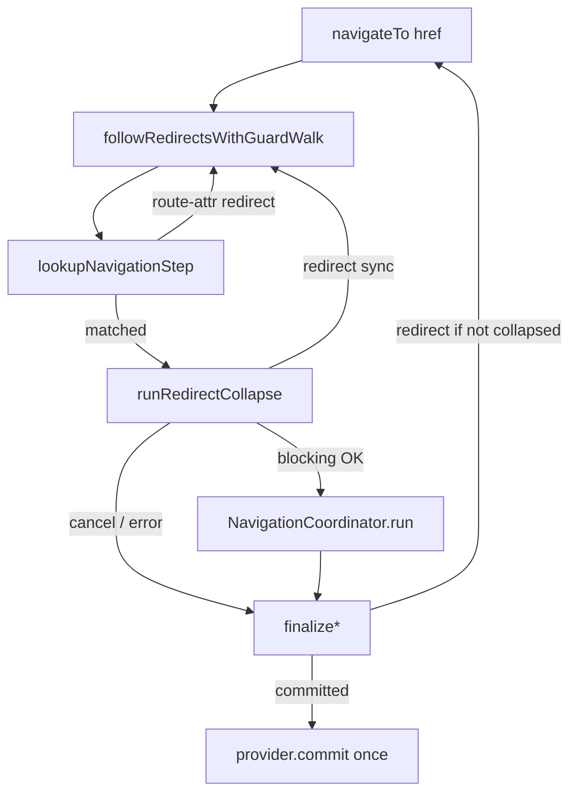

# TODO: схлопывание синхронных цепочек redirect

> **Статус:** <span style="background:#2ea043;color:#fff;padding:2px 8px;border-radius:4px;font-weight:700">✓ ГОТОВО</span> — guard/leave + declarative collapse  
> **Не планируется:** resolve с `runLoads` · отдельный класс `RedirectResolver` / `NavigationIntent` (логика в `redirect/` + `RedirectionContext`)  
> **Дизайн (2026-07-13):** redirect из **`load`** <span style="background:#57606a;color:#fff;padding:2px 8px;border-radius:4px;font-weight:700">⊘ УБРАН</span> — не backlog на collapse. `load` только данные; маршрутизация — `guard` / attr `redirect`. См. [NESTED_ROUTES_JOY_MODEL.md §Redirect chain collapse](./NESTED_ROUTES_JOY_MODEL.md#redirect-chain-collapse).  
> **As-is в коде:** <span style="color: #2ea043; font-weight: bold;">✓</span> `followRedirectsWithGuardWalk` — declarative + blocking walk; <span style="color: #2ea043; font-weight: bold;">✓</span> redirect из **`load`** удалён (payload-only).  
> **Связь:** дополнение к [P1-7](../comparison/FEATURE_PARITY_ROADMAP.md) — политика redirect уже зафиксирована; этот документ про **оптимизацию blocking-redirect**, не про post-commit redirect.  
> **См. также:** [NAVIGATION_TRANSACTION_MODEL.md §7](../NAVIGATION_TRANSACTION_MODEL.md#7-redirect-и-cancel--политика-aura-p1-7) · `src/.../core/redirect/README.md`

---

## Чеклист готовности

| Пункт | Статус |
|-------|--------|
| Declarative `redirect` attr на `<aura-route>` | <span style="background:#2ea043;color:#fff;padding:2px 8px;border-radius:4px;font-weight:700">✓</span> |
| Match-time hops (без render на заглушке) | <span style="background:#2ea043;color:#fff;padding:2px 8px;border-radius:4px;font-weight:700">✓</span> `lookupNavigationStep` / `followDeclarativeRedirects` |
| Blocking walk `leave` → `guard` + hook redirect | <span style="background:#2ea043;color:#fff;padding:2px 8px;border-radius:4px;font-weight:700">✓</span> `runRedirectCollapse` |
| Один `coordinator.run` на финальный leaf | <span style="background:#2ea043;color:#fff;padding:2px 8px;border-radius:4px;font-weight:700">✓</span> |
| Один history commit (без промежуточных URL) | <span style="background:#2ea043;color:#fff;padding:2px 8px;border-radius:4px;font-weight:700">✓</span> |
| Cycle / max depth | <span style="background:#2ea043;color:#fff;padding:2px 8px;border-radius:4px;font-weight:700">✓</span> `redirect-cycle` / `redirect-depth-exceeded` |
| `replace` OR по цепочке | <span style="background:#2ea043;color:#fff;padding:2px 8px;border-radius:4px;font-weight:700">✓</span> |
| `from` остаётся committed (не hop→hop) | <span style="background:#2ea043;color:#fff;padding:2px 8px;border-radius:4px;font-weight:700">✓</span> |
| `skipBlockingPhases` после walk | <span style="background:#2ea043;color:#fff;padding:2px 8px;border-radius:4px;font-weight:700">✓</span> |
| Redirect из `load` | <span style="background:#57606a;color:#fff;padding:2px 8px;border-radius:4px;font-weight:700">⊘ УБРАН</span> |
| Resolve с `runLoads` / полный `runBlockingOnly` | <span style="background:#57606a;color:#fff;padding:2px 8px;border-radius:4px;font-weight:700">⊘ НЕ ПЛАНИРУЕТСЯ</span> |
| `router.redirect()` sugar / intent-scoped `navigate` | <span style="background:#57606a;color:#fff;padding:2px 8px;border-radius:4px;font-weight:700">⊘ v2 / optional</span> |

---

## Проблема (legacy / до blocking walk)

> **Сейчас:** <span style="color: #2ea043; font-weight: bold;">✓</span> guard/leave redirect и declarative `redirect` схлопываются в resolve (`followRedirectsWithGuardWalk`). Ниже — как было **до** этого слоя.

```text
navigateTo(/dashboard)
  → transaction A→dashboard (leave, guard, load, render…)
  → guard hook: redirect /settings
  → finalizeNavigation → navigateTo(/settings)   // новая навигация
    → transaction A→settings (снова полный pipeline)
    → enter hook: redirect /login
    → navigateTo(/login)                          // ещё раз
      → processor A→login (полный pipeline)
```

Каждый redirect — **новый** `navigateTo` → новый job → match → **полный** pipeline. Промежуточные URL (`/dashboard`, `/settings`) могут пройти лишние фазы, хотя UI на них не должен останавливаться.

**Схлопывание** — найти финальный URL **до view commit** и выполнить **один** полный pipeline `from → finalTo`.

---

## Граница: только «синхронные» redirect

| Тип | Можно схлопнуть? | Статус |
|-----|------------------|--------|
| `leave` / `guard` hook **сразу** вернул `'/login'` (без `await`) | ✅ да | <span style="color: #2ea043; font-weight: bold;">✓</span> в blocking walk |
| hook сделал `await`, потом redirect | ❌ нет — yield; legacy `navigateTo` | <span style="color: #2ea043; font-weight: bold;">✓</span> as designed |
| redirect из post-commit (`entered`, …) | ❌ по политике P1-7 — `ctx.router.navigate()` | <span style="color: #2ea043; font-weight: bold;">✓</span> |
| `load` → redirect | ⊘ не в модели | <span style="background:#57606a;color:#fff;padding:2px 8px;border-radius:4px;font-weight:700">⊘ УБРАН</span> |

«Синхронная цепочка» = несколько redirect подряд **в одном стеке вызовов**, без приостановки на I/O.

---

## Архитектура: два слоя навигации

<span style="background:#2ea043;color:#fff;padding:2px 8px;border-radius:4px;font-weight:700">✓ РЕАЛИЗОВАНО</span> (имена as-is, не RFC-класс):

```text
AuraRoutingEngine.navigateTo()
  │
  ├─ 1. followRedirectsWithGuardWalk()   ← redirect/  (pre-commit)
  │      match (incl. route-attr redirect) → blocking walk → redirect? → rematch
  │      повтор до финала / cancel / error / max hops / cycle
  │
  └─ 2. NavigationCoordinator.run()      ← один раз
         guards? → history → prepare → render → effects
         skipBlockingPhases если walk уже отработал
```

**Правило:** <span style="color: #2ea043; font-weight: bold;">✓</span> view commit (`runRender`) **никогда** не вызывается для промежуточных URL в цепочке — только в шаге 2 для финального `to`.

---

## Новые сущности

### `NavigationIntent` / `RedirectionContext`

| RFC | As-is | Статус |
|-----|-------|--------|
| `NavigationIntent` | `RedirectionContext` (+ attempt в coordinator) | <span style="color: #2ea043; font-weight: bold;">✓</span> эквивалент |
| `redirectHop` / `visited` / `replace` | depth, visit keys, `replace` OR | <span style="color: #2ea043; font-weight: bold;">✓</span> |

### `RedirectResolver` → модуль `core/redirect/`

| RFC | As-is | Статус |
|-----|-------|--------|
| `RedirectResolver.resolve()` | `followRedirectsWithGuardWalk` | <span style="color: #2ea043; font-weight: bold;">✓</span> |
| sync declarative-only | `followDeclarativeRedirects` | <span style="color: #2ea043; font-weight: bold;">✓</span> |
| cycle / max hops errors | `redirect-error` → `NavigationFailure.redirectError` | <span style="color: #2ea043; font-weight: bold;">✓</span> |

### `runBlockingOnly` / resolve mode

| RFC | As-is | Статус |
|-----|-------|--------|
| `runBlockingOnly` (leave+enter+load) | `NavigationTransaction.runRedirectCollapse` = `runGuards` only | <span style="color: #2ea043; font-weight: bold;">✓</span> leave+guard |
| resolve с `runLoads` | — | <span style="background:#57606a;color:#fff;padding:2px 8px;border-radius:4px;font-weight:700">⊘ НЕ ПЛАНИРУЕТСЯ</span> |

---

## Источники redirect (как детектить)

### As-is (blocking return)

<span style="color: #2ea043; font-weight: bold;">✓</span> Collapsible redirect в walk — канал:

```text
hook return → normalizeHookResult → guardResultToPhaseOutcome → TransactionResult
```

Поддерживаемые return в blocking (`leave` / `guard`):

- `return '/login'`
- `return { url: '/login', replace?: boolean }`
- `return { type: 'redirect', url: '/login', replace?: boolean }`

Post-commit: return redirect **игнорируется** (warn); по P1-7 — `ctx.router.navigate()`.

`RouterInstance` as-is — только `navigate()`, **`router.redirect()` нет** (<span style="background:#57606a;color:#fff;padding:2px 8px;border-radius:4px;font-weight:700">⊘ v2</span>).

### Сводная таблица

| Способ | Collapse v1 | Статус |
|--------|-------------|--------|
| `return '/url'` в `leave`/`guard` | ✅ sync | <span style="background:#2ea043;color:#fff;padding:2px 8px;border-radius:4px;font-weight:700">✓</span> |
| return после `await` | ❌ legacy `navigateTo` | <span style="color: #2ea043; font-weight: bold;">✓</span> as designed |
| `redirect` attr на route | ✅ match-time | <span style="background:#2ea043;color:#fff;padding:2px 8px;border-radius:4px;font-weight:700">✓</span> |
| `router.navigate()` в blocking | ❌ вне collapse | <span style="color: #2ea043; font-weight: bold;">✓</span> |
| `router.navigate()` post-commit | ❌ новый run | <span style="color: #2ea043; font-weight: bold;">✓</span> |
| `router.redirect()` = sugar return | ✅ future | <span style="background:#57606a;color:#fff;padding:2px 8px;border-radius:4px;font-weight:700">⊘ v2</span> |
| redirect из `load` | ⊘ убран | <span style="background:#57606a;color:#fff;padding:2px 8px;border-radius:4px;font-weight:700">⊘ УБРАН</span> |

### Правило для implementers

> Collapse продолжается только при **sync** redirect из match-time attr или `TransactionResult.redirect` из blocking walk.  
> Resolver не дублирует детект по типу маршрута — только **результат match** и **результат `runRedirectCollapse`**.

---

## Алгоритм (as-is)

<span style="background:#2ea043;color:#fff;padding:2px 8px;border-radius:4px;font-weight:700">✓</span> Реализовано в `followRedirectsWithGuardWalk` — см. `redirect/README.md`.

```text
from ← committed route
href ← запрошенный URL
ctx ← createRedirectionContext(href)

loop while hop < MAX_REDIRECTION_STEPS:

  if href visited → redirect-error 'redirect-cycle'
  mark visited

  step ← lookupNavigationStep(href)   // match + route-attr redirect
  if step.kind === 'redirect':
    href ← normalize(step.url)
    replace ||= …
    continue

  to ← step.leaf
  if !to → not-found

  result ← probe.runRedirectCollapse()  // leave → guard

  switch result:
    case redirect → href = url; continue (from не меняем)
    case cancelled | error → return
    case ok → return { resolved, skipBlockingPhases }

→ coordinator.run({ to: final, skipBlockingPhases })
→ один history commit на финал
```

---

## Ключевые решения по семантике

| # | Решение | Статус |
|---|---------|--------|
| 1 | `from` в цикле = committed / `originalFrom` (не предыдущий hop) | <span style="color: #2ea043; font-weight: bold;">✓</span> |
| 2 | После `enter/guard(B)→C` план следующий hop `A→C`, не `B→C` | <span style="color: #2ea043; font-weight: bold;">✓</span> |
| 3 | `replace` OR по цепочке | <span style="color: #2ea043; font-weight: bold;">✓</span> |
| 4 | Один history commit после collapse | <span style="color: #2ea043; font-weight: bold;">✓</span> |
| 5 | Один attempt/job на resolve + full run | <span style="color: #2ea043; font-weight: bold;">✓</span> coordinator |

Точка входа fallback (async / post-walk redirect):

`AuraRoutingEngine.applyRedirect` → `navigateTo(...)`.

---

## Схема потоков



---

## Изменения по файлам

| Файл (RFC) | As-is | Статус |
|------------|-------|--------|
| `core/redirect-resolver.ts` | `core/redirect/redirect-resolver.ts` | <span style="background:#2ea043;color:#fff;padding:2px 8px;border-radius:4px;font-weight:700">✓</span> |
| `resolve-navigation-target.ts` | `redirect/match-step.ts` (`lookupNavigationStep`) | <span style="background:#2ea043;color:#fff;padding:2px 8px;border-radius:4px;font-weight:700">✓</span> |
| `aura-route` attr `redirect` | `@routeAttr redirect` + type `redirect` | <span style="background:#2ea043;color:#fff;padding:2px 8px;border-radius:4px;font-weight:700">✓</span> |
| `runBlockingOnly` / mode | `NavigationTransaction.runRedirectCollapse` | <span style="background:#2ea043;color:#fff;padding:2px 8px;border-radius:4px;font-weight:700">✓</span> |
| `aura-routing-engine` / coordinator | resolve → `run({ skipBlockingPhases })` | <span style="background:#2ea043;color:#fff;padding:2px 8px;border-radius:4px;font-weight:700">✓</span> |
| `navigation-error.types` cycle/depth | `NavigationFailure.redirectError` | <span style="background:#2ea043;color:#fff;padding:2px 8px;border-radius:4px;font-weight:700">✓</span> |

Тесты: `test/redirect/declarative-chain.test.ts`, `redirect-resolver.integration.test.ts`, `redirect-probe-phases.test.ts`.

---

## Что не схлопывать

- post-commit `return url` (warn-only, P1-7) — <span style="color: #2ea043; font-weight: bold;">✓</span>
- redirect после view commit (`router.navigate` — всегда новая транзакция) — <span style="color: #2ea043; font-weight: bold;">✓</span>
- ~~цепочки с `await` в load~~ — load redirect убран
- `router.navigate()` в blocking hook без intent-scope (v1 — вне collapse) — <span style="color: #2ea043; font-weight: bold;">✓</span>
- not-found на промежуточном URL — <span style="color: #2ea043; font-weight: bold;">✓</span>

---

## Что уже есть (не дублировать)

- <span style="color: #2ea043; font-weight: bold;">✓</span> supersede attempt при новой навигации (`NavigationCoordinator`)
- <span style="color: #2ea043; font-weight: bold;">✓</span> stale hook results после `await` (`isAttemptCurrent` / job active)
- <span style="color: #2ea043; font-weight: bold;">✓</span> blocking redirect только в `leave` / `guard` (не `load`)

---

## Итог

<span style="background:#2ea043;color:#fff;padding:2px 8px;border-radius:4px;font-weight:700">✓ ГОТОВО</span> — отдельная фаза resolve в engine:

1. <span style="color: #2ea043; font-weight: bold;">✓</span> крутить **только blocking** (match + leave/guard) пока sync redirect;
2. <span style="color: #2ea043; font-weight: bold;">✓</span> один раз **full pipeline** до финального `to`;
3. <span style="color: #2ea043; font-weight: bold;">✓</span> один **history commit**.

Поведение ближе к RR/TanStack (redirect до render), без лишних view commit на промежуточных URL.

**Документ можно считать закрытым** (исторический RFC + as-is map). Дальнейшие правки — только если меняется политика redirect.

---

## Связанные документы

- [ENGINE_CONSOLIDATION.md](./ENGINE_CONSOLIDATION.md) — фаза 4 ✓
- [NESTED_ROUTES_JOY_MODEL.md §Redirect chain collapse](./NESTED_ROUTES_JOY_MODEL.md#redirect-chain-collapse)
- [NAVIGATION_RUN_MANAGER.md](./NAVIGATION_RUN_MANAGER.md) — NavigationRun, resolve внутри run
- [NAVIGATION_TRANSACTION_MODEL.md §7](../NAVIGATION_TRANSACTION_MODEL.md#7-redirect-и-cancel--политика-aura-p1-7) — политика redirect
- [FEATURE_PARITY_ROADMAP.md P1-7](../comparison/FEATURE_PARITY_ROADMAP.md) — статус политики
- [REACT_ROUTER_COMPARISON.md §5](../comparison/REACT_ROUTER_COMPARISON.md) — unified redirect + dedupe в RR7
- `src/modules/aura-routing-engine/core/redirect/README.md` — канон as-is API
