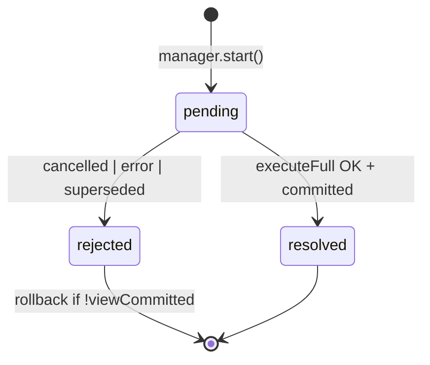

# TODO: NavigationRun + NavigationRunManager

> **Статус:** план / архитектура (не реализовано)  
> **Связь:** консолидация слоя orchestration; подготовка к [REDIRECT_CHAIN_COLLAPSE](./REDIRECT_CHAIN_COLLAPSE.md), [NAVIGATION_EVENTS](./NAVIGATION_EVENTS.md), [EVENT_BUS](./EVENT_BUS.md), devtools timeline.  
> **См. также:** [NAVIGATION_TRANSACTION_MODEL.md](../NAVIGATION_TRANSACTION_MODEL.md), [FUTURE_PROOF_ENGINE.md](../FUTURE_PROOF_ENGINE.md) (Navigation Job), [PIPELINE_STEP_RUNNER.md](./PIPELINE_STEP_RUNNER.md) (sync/async шаги, fast path), [ENGINE_CONSOLIDATION.md](./ENGINE_CONSOLIDATION.md) (roadmap всех модулей)

---

## Проблема (as-is)

Одна пользовательская навигация (один клик / один `navigateTo`) сейчас размазана по нескольким сущностям:

```text
AuraRoutingEngine.navigateTo()
  → NavigationCoordinator.run()
       NavigationPlanner          // dedupe кликов
       AuraRoutingProcessor.run()
         jobManager.begin()       // supersede
         withCancelledTransactionScope  // rollback view
         ViewCommitTracker
         ProcessorPipeline
       finalizeProcessorNavigation()    // terminal history / redirect
  commitGate (callback внутри pipeline)  // success history — sync
```

**Следствия:**

- Состояние транзакции неявное: job aborted? view staged/committed? `TransactionResult`?
- Rollback (abort listener + `finally`) живёт отдельно от coordinator и planner.
- Сложнее ввести redirect collapse (один intent → resolve + full run → один job).
- Сложнее navigation events / devtools (нет единого объекта run с `pending | resolved | rejected`).

---

## Предлагаемая модель

> **Именование:** `NavigationRun` + `NavigationRunManager`, не `ProcessorTask` — task шире pipeline (history, dedupe, intent); processor остаётся executor pipeline.

### `NavigationRun` — одна навигационная транзакция

Единица жизненного цикла **одного intent** (один клик / один `navigateTo`):

```ts
type NavigationRunStatus = 'pending' | 'resolved' | 'rejected';

interface NavigationRun {
  readonly id: number;
  readonly intent: NavigationIntent;   // см. REDIRECT_CHAIN_COLLAPSE.md
  status: NavigationRunStatus;

  // owned state (сейчас разрозненно)
  readonly job: AuraRoutingProcessorJob;
  readonly transitionPlan: TransitionMap;
  readonly viewCommitTracker: ViewCommitTracker;

  execute(): Promise<NavigationRunOutcome>;
  abort(reason?: unknown): void;      // job.abort + rollback view если !committed
}
```

**Внутри `execute()` (фазы одного run, не отдельные task в очереди):**

```text
1. resolveBlocking()    // опционально, после REDIRECT_CHAIN_COLLAPSE
2. executeFull()        // processor.run(resolvedFrom, resolvedTo)
3. map TransactionResult → NavigationRunOutcome   // terminal side effects — OutcomeHandler
```

**Rollback:** инкапсуляция текущего `withCancelledTransactionScope` — abort listener + guard-cancel в `finally`.

**History и атомарность:** run вызывает **узкие deps** для history (не весь `NavigationProvider`). Это **контракт поведения**, не обязательно отдельный interface — см. § [Deps run](#deps-navigationrun). Terminal history — в § [OutcomeHandler](#navigationoutcomehandler).

| Путь | Когда history |
|------|----------------|
| success | sync `deps.commitSuccess()` внутри pipeline callback |
| cancelled / error | `NavigationOutcomeHandler` после run |
| supersede | view rollback; history для run не commit'ился |
| redirect (legacy) | handler → новый run |
| redirect (collapse) | один commit после full run |

### `NavigationRunManager` — orchestration

**Не очередь / stack.** Семантика **latest-wins + supersede** (как сейчас):

```text
activeRun: NavigationRun | null

start(input): PlanDecision
  noop | cancel-pending | start-new-run
```

Перенимает:

- `NavigationPlanner` — dedupe (`already-active`, `duplicate-pending`, `cancel-pending`);
- `AuraRoutingProcessorJobManager.begin()` — abort предыдущего run при новом;
- создание и `await activeRun.execute()`.

**Manager не знает:** redirect hops, `visited`, blocking-only loop — это фаза **run**.

```text
Engine.navigateTo()
  → match / not-found (как сейчас)
  → NavigationRunManager.start(matchedInput)
       plan → noop | abortPending | new NavigationRun
  → run.execute() → NavigationRunOutcome
  → engine.outcomeHandler.apply(outcome)
```

### Опционально: ring buffer прошлых run

Для runtime **не обязателен** (достаточно `activeRun` + last resolved). Полезен для observability (10–20 записей):

| Use case |
|----------|
| DevTools timeline |
| Debug supersede / rollback transitions |
| `navigation:start|finish|cancel` ([NAVIGATION_EVENTS](./NAVIGATION_EVENTS.md)) |
| «какой run отменил какой» (`abortedByRunId`) |

Хранить метаданные, не DOM: `{ id, href, from, status, phases, durationMs, abortedBy? }`.

---

## Deps (`NavigationRun`)

`NavigationRun` — **внутренний** класс engine (private API). Отдельные «port interface + adapter» **не обязательны**: run под нашим контролем. Достаточно **узкого `NavigationRunDeps`** — явный контракт без лишнего indirection.

> **«Port» в документе** = что run **может** вызывать, не обязательно файл `*-port.ts`.

### History — функция в deps, не provider целиком

Не пробрасывать `NavigationProvider` в run — не «защита от себя», а **разделение ответственности** (`onNavigation`, `currentHref` — зона engine).

**Рекомендуемый v1** — `commitSuccess` в deps; engine замыкает `provider`:

```ts
interface NavigationRunDeps {
  /** Sync после commitStagedView, пока isJobActive — applyCommitGate */
  commitSuccess: (ctx: CommitGateContext) => CommitGateEffects;

  processor: AuraRoutingProcessor;
  router: RouterInstance;
  // …
}
```

```ts
new NavigationRun({
  commitSuccess: (ctx) =>
    applyCommitGate({ ...ctx, provider: engine.provider, onNavigationCommitted, scrollToHash }),
  processor: this.processor,
  router: this.router,
});
```

**Terminal history** (`cancel`, `error`, `redirect`, not-found) — **не в run**, а в `NavigationOutcomeHandler` (`applyTransactionHistory` + policy).

**Invariants** (JSDoc / код, без отдельного port-класса):

1. `commitSuccess` — **sync** в pipeline callback.
2. Run **не** трогает `provider` напрямую.
3. Scroll — внутри `commitSuccess`.

**Опционально позже:** `interface NavigationHistoryPort` — если второй consumer (SSR fake) или run в отдельном пакете.

### Остальные deps

| Dep | Что передать | Зачем run |
|-----|--------------|-----------|
| **`processor`** | `AuraRoutingProcessor` | `runBlockingOnly()` / `runFull()` |
| **`redirectResolver`** | `RedirectResolver` | collapse ([REDIRECT_CHAIN_COLLAPSE](./REDIRECT_CHAIN_COLLAPSE.md)) |
| **`router`** | `RouterInstance` | hooks |
| **`telemetry`** | `{ emit(event) }` | emit-only ([EVENT_BUS](./EVENT_BUS.md)) |
| **`reportHookError`** | callback → OutcomeHandler | hook-error из pipeline |

Конкретные типы (`processor`, `router`) OK — run internal, альтернативных impl нет.

### Вне deps run (engine / manager)

| Concern | Где |
|---------|-----|
| `UrlMatcher`, registry, match | Engine до `manager.start()` |
| `NavigationProvider` (полный) | Engine; run — только closure `commitSuccess` |
| `prev` read/write | Engine / manager |
| Dedupe | Manager |
| Prefetch | Engine |
| DOM `CustomEvent` | `AuraRouter` bridge |

### `NavigationRunDeps` (сводка v1)

```ts
interface NavigationRunDeps {
  commitSuccess: (ctx: CommitGateContext) => CommitGateEffects;
  processor: AuraRoutingProcessor;
  redirectResolver?: RedirectResolver;
  router: RouterInstance;
  telemetry?: { emit(event: EngineEvent): void };
  reportHookError?: ReportNavigationHookError;
}
```

---

## EventBus и telemetry

**Уместно** передать в run `{ emit }`, не `EventBus` целиком (run не `subscribe` / `destroy`). Тот же объект — в `PipelineContext` для fine-grained emit.

### Кто что emit'ит

```text
NavigationRun / Manager
  navigation:start, navigation:finish, navigation:cancel,
  navigation:redirect, navigation:error (terminal)

ProcessorPipeline / DataGraph  (тот же telemetry в PipelineContext)
  navigation:prepare:*, load:*, node:*, navigation:commit:*
```

Run **не дублирует** fine-grained emit из pipeline.

### DOM и legacy callbacks

```text
Engine EventBus
  → AuraRouter bridge (subscribe once)
      → CustomEvent('navigation-error', …)
```

`onNavigationCommitted` / `onNavigationError` — thin wrapper над bus/handler на переходный период (см. [EVENT_BUS](./EVENT_BUS.md)).

---

## `NavigationOutcomeHandler`

Единая точка terminal-обработки в **engine** (не в run). Run возвращает outcome; handler применяет side effects.

### As-is (размазано)

```text
error-phase-handler           → FailedNavigation
finalizeFailure               → onNavigationError / onNotFound
finalizeProcessorNavigation   → history + redirect
coordinator                   → reportHookError
engine                        → failureDeps(), applyFinalizeEffects
aura-router                   → dispatchNavigationError
```

### To-be

**Run** — только результат:

```ts
type NavigationRunOutcome =
  | { status: 'resolved'; to: MatchedRouteInfo }
  | { status: 'cancelled' }
  | { status: 'redirect'; url: string; replace: boolean }
  | { status: 'rejected'; failure: FailedNavigation };
```

**Engine — `NavigationOutcomeHandler`:**

```ts
class NavigationOutcomeHandler {
  apply(outcome: NavigationRunOutcome, ctx: RunContext): EngineEffects;
}
```

Внутри `apply()` — логика из `finalizeFailure` + `finalizeProcessorNavigation`:

- history terminal + `applyTransactionHistory` (engine `provider`);
- `setPrev`;
- telemetry emit;
- legacy callbacks (`onNavigationError`, …);
- DOM bridge (aura-router);
- redirect → `scheduleNavigate(url)`.

### Два типа ошибок (не смешивать)

| Тип | Источник | Куда |
|-----|----------|------|
| **Pipeline failure** | guard / load / render throw | `FailedNavigation` → outcome `rejected` → `OutcomeHandler` |
| **Hook error handler failed** | `error="…"` hook threw | `deps.reportHookError` → OutcomeHandler |

Pipeline error **не** диспатчит `navigation-hook-error` напрямую из coordinator.

### Pre-run NOT_FOUND

Match null до run — тот же `OutcomeHandler.apply(rejected)` с `FailedNavigation.notFound`, не отдельная ветка в coordinator.

---

## Схема слоёв (deps + errors)

```text
AuraRouter
  └─ AuraRoutingEngine
       EventBus (instance)
       NavigationOutcomeHandler     ← terminal history, errors, telemetry, DOM
       NavigationProvider
       NavigationRunManager
         └─ NavigationRun
              deps: commitSuccess (closure), processor, router, telemetry?, reportHookError?
              execute() → NavigationRunOutcome
       outcomeHandler.apply(outcome) → setPrev, scheduleNavigate
```

---

## Польза по этапам

| Этап | Польза |
|------|--------|
| **1. Extract NavigationRun** | Один объект = job + tracker + rollback; state machine `pending/resolved/rejected`; проще тесты |
| **2. NavigationRunManager** | Dedupe + supersede в одном месте; coordinator упрощается или заменяется |
| **2b. NavigationOutcomeHandler** | Ошибки, terminal history, bus/DOM — одна точка |
| **3. RedirectResolver в run** | Один intent, один job на resolve + full; без рекурсивного `navigateTo` в collapse |
| **4. Run history (ring buffer)** | Events, devtools, отладка transition supersede |
| **4b. telemetry `{ emit }`** | EventBus в run + pipeline |

---

## Границы ответственности (целевые)

```text
AuraRoutingEngine     I/O: match, provider, prev, links, registry, OutcomeHandler, EventBus
NavigationRunManager  active run, dedupe, supersede
NavigationRun         intent lifecycle: resolve → full → rollback; узкие deps
NavigationOutcomeHandler  terminal: history, errors, telemetry, DOM bridge
RedirectResolver      loop blocking redirect (коллаборатор run)
AuraRoutingProcessor  только pipeline body (guards → loads → render → after)
ProcessorPipeline     порядок шагов; telemetry `{ emit }` в ctx
```

**Не делать:**

- FIFO stack/queue pending navigations (другое UX; текущая модель — latest-wins).
- Два run на одну sync redirect-цепочку.
- God object run (matcher, prefetch, scroll внутри run).
- Async gap между view commit и history commit.

---

## Маппинг as-is → to-be

| As-is | To-be |
|-------|-------|
| `NavigationPlanner` | методы `NavigationRunManager.plan()` |
| `NavigationCoordinator.run()` | `NavigationRunManager.start()` + `NavigationRun.execute()` |
| `withCancelledTransactionScope` | `NavigationRun` (abort + rollback) |
| `AuraRoutingProcessorJobManager.begin()` | manager при `start-new-run` или run ctor |
| `ViewCommitTracker` | поле run |
| `commitGate` callback | `deps.commitSuccess` (closure над `applyCommitGate`) |
| `finalizeProcessorNavigation` | `NavigationOutcomeHandler.apply` |
| `finalizeFailure` | `NavigationOutcomeHandler.apply(rejected)` |
| `failureDeps()` / coordinator callbacks | handler deps + telemetry + DOM bridge |
| `NavigationIntent` (из collapse doc) | `run.intent` |

---

## Шаги внедрения (incremental)

### Фаза 1b — `NavigationOutcomeHandler`

1. `NavigationOutcomeHandler` — consolidate `finalizeFailure` + `finalizeProcessorNavigation` + terminal history (`provider` внутри handler, не в run).
2. Coordinator/engine вызывает `handler.apply()` вместо разрозненных finalize.
3. **Критерий:** error / cancel / redirect / not-found — поведение 1:1.

**Файлы:**

| Файл | Изменение |
|------|-----------|
| `core/navigation/navigation-outcome-handler.ts` | новый |
| `core/navigation/finalize.ts` | thin → handler или deprecated |

> Отдельный `navigation-history-port.ts` **не нужен** на v1 — достаточно `commitSuccess` closure + handler с `provider`.

### Фаза 1 — Extract `NavigationRun` (без смены публичного API engine)

1. Новый модуль `core/navigation/navigation-run.ts`.
2. Перенести логику `withCancelledTransactionScope` в методы run (`setupRollback`, `teardown`).
3. `NavigationRun.execute()` — processor + `deps.commitSuccess` в commit gate.
4. Coordinator/manager делегирует в run; `OutcomeHandler` на terminal.
5. **Критерий:** supersede mid-transition, guard cancel — rollback как сейчас.

**Файлы:**

| Файл | Изменение |
|------|-----------|
| `core/navigation/navigation-run.ts` | новый |
| `core/navigation/coordinator.ts` | thin wrapper → run |
| `core/processor/cancellation/transaction-scope.ts` | deprecated → логика в run |

### Фаза 2 — `NavigationRunManager`

1. Новый `core/navigation/navigation-run-manager.ts`.
2. Перенести `NavigationPlanner` + active run + supersede.
3. Engine/coordinator вызывает manager вместо planner + coordinator logic.
4. **Критерий:** `navigation-dedupe.test.ts`, supersede tests без регрессий.

**Файлы:**

| Файл | Изменение |
|------|-----------|
| `core/navigation/navigation-run-manager.ts` | новый |
| `core/navigation/navigation-planner.ts` | внутренний helper manager или удалить |
| `core/navigation/coordinator.ts` | упростить до glue или merge в manager |
| `core/processor/processor.ts` | `begin()` вызывается из manager/run, не дублировать |

### Фаза 3 — `resolveBlocking()` внутри run

1. Реализовать [REDIRECT_CHAIN_COLLAPSE](./REDIRECT_CHAIN_COLLAPSE.md) (`RedirectResolver`, `runBlockingOnly`).
2. `NavigationRun.execute()`:
   ```ts
   const resolved = await redirectResolver.resolve(this.intent, …);
   if (resolved.status !== 'resolved') return toRunResult(resolved);
   return this.executeFull(resolved.from, resolved.to);
   ```
3. Один job на resolve + full.
4. **Критерий:** sync redirect chain → один view commit, один history commit.

### Фаза 4 — Observability (опционально)

1. Ring buffer в manager.
2. `telemetry: { emit }` из EventBus; run + pipeline ([EVENT_BUS](./EVENT_BUS.md)).
3. AuraRouter bridge: bus → DOM ([NAVIGATION_EVENTS](./NAVIGATION_EVENTS.md)).
4. Superseded run не получает `finish` после abort.

---

## State machine run (reference)



---

## Связанные документы

- [REDIRECT_CHAIN_COLLAPSE.md](./REDIRECT_CHAIN_COLLAPSE.md) — `resolveBlocking()` как фаза run
- [EVENT_BUS.md](./EVENT_BUS.md) — EventBus, telemetry port, emit points
- [NAVIGATION_EVENTS.md](./NAVIGATION_EVENTS.md) — DOM public API поверх handler/bus
- [NAVIGATION_TRANSACTION_MODEL.md](../NAVIGATION_TRANSACTION_MODEL.md) — политика redirect / cancel
- [FUTURE_PROOF_ENGINE.md](../FUTURE_PROOF_ENGINE.md) — Navigation Job, stale guards
- [PIPELINE_STEP_RUNNER.md](./PIPELINE_STEP_RUNNER.md) — thenable runner, fast path tiers, trampoline (overkill)

---

## Итог

**NavigationRun** — явная транзакция одного intent (pipeline + job + view state + rollback + **узкие deps**).  
**NavigationRunManager** — dedupe и supersede (**не queue**).  
**NavigationOutcomeHandler** — terminal history, ошибки, telemetry, DOM — **одно место в engine**.  
**Deps, не port-адаптеры:** `commitSuccess` closure + `processor` / `router`; provider целиком только в engine/handler.

Внедрять поэтапно: OutcomeHandler → extract run → manager → redirect resolve → telemetry.

Польза — **консолидация и читаемость**, если старые слои удаляются; иначе будет лишний indirection.
