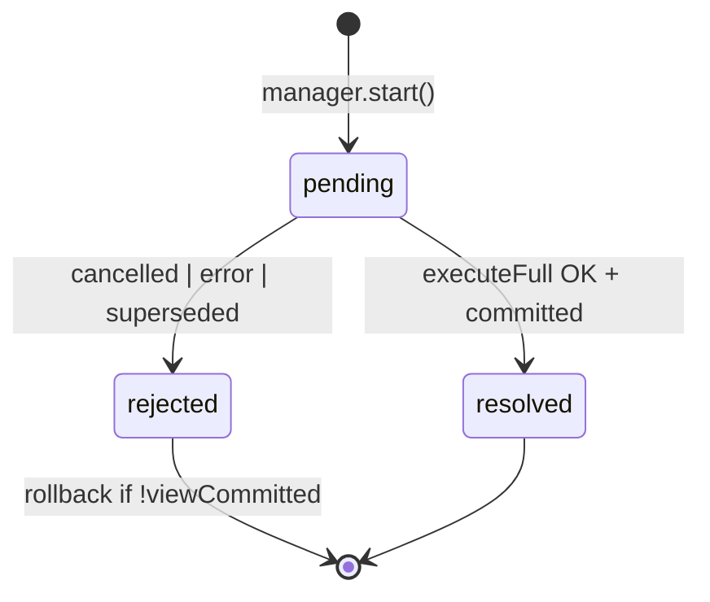

# TODO: NavigationRun + NavigationRunManager

> **Статус:** <span style="background:#f59e0b;color:#111;padding:2px 8px;border-radius:4px;font-weight:700">~ ЧАСТИЧНО</span> — ядро orchestration в коде под другими именами; rename + OutcomeHandler + узкие deps + EventBus — осталось  
> **Сверка с кодом:** 2026-07-19  
> **Связь:** консолидация слоя orchestration; redirect collapse → [../done/REDIRECT_CHAIN_COLLAPSE.md](../done/REDIRECT_CHAIN_COLLAPSE.md); [NAVIGATION_EVENTS](./NAVIGATION_EVENTS.md), [EVENT_BUS](./EVENT_BUS.md), devtools timeline.  
> **См. также:** [NAVIGATION_TRANSACTION_MODEL.md](../NAVIGATION_TRANSACTION_MODEL.md), [FUTURE_PROOF_ENGINE.md](../FUTURE_PROOF_ENGINE.md) (Navigation Job), [PIPELINE_STEP_RUNNER.md](./PIPELINE_STEP_RUNNER.md), [ENGINE_CONSOLIDATION.md](./ENGINE_CONSOLIDATION.md)

### Легенда

| Метка | Значение |
|-------|----------|
| <span style="background:#16a34a;color:#fff;padding:2px 8px;border-radius:4px;font-weight:700">✓ ГОТОВО</span> | поведение в production path / покрыто тестами |
| <span style="background:#f59e0b;color:#111;padding:2px 8px;border-radius:4px;font-weight:700">~ ЧАСТИЧНО</span> | поведение есть, целевая форма (имя/класс/API) — нет |
| <span style="background:#dc2626;color:#fff;padding:2px 8px;border-radius:4px;font-weight:700">✗ ОСТАЛОСЬ</span> | не сделано |
| <span style="background:#6b7280;color:#fff;padding:2px 8px;border-radius:4px;font-weight:700">⊘ ОТЛОЖЕНО</span> | сознательно не в scope / by design |

---

## Сводка прогресса (читай сначала)

| # | Тема | Статус | Факт в коде |
|---|------|--------|-------------|
| 1 | **NavigationRun** (транзакция одного intent) | <span style="background:#16a34a;color:#fff;padding:2px 6px;border-radius:4px;font-weight:700">✓</span> | `NavigationTransaction` — job + tracker + rollback + pipeline |
| 2 | **Dedupe + supersede + active run** | <span style="background:#16a34a;color:#fff;padding:2px 6px;border-radius:4px;font-weight:700">✓</span> | `NavigationCoordinator.plan` / `run` / `navigate` |
| 3 | **Pipeline executor** | <span style="background:#16a34a;color:#fff;padding:2px 6px;border-radius:4px;font-weight:700">✓</span> | `NavigationTransactionPipeline` |
| 4 | **Rollback uncommitted views** | <span style="background:#16a34a;color:#fff;padding:2px 6px;border-radius:4px;font-weight:700">✓</span> | `runWithStagedViewRollback` + `ViewCommitTracker` |
| 5 | **Redirect chain collapse** | <span style="background:#16a34a;color:#fff;padding:2px 6px;border-radius:4px;font-weight:700">✓</span> | `followRedirectsWithGuardWalk` до `coordinator.run` |
| 6 | **Success history commit** | <span style="background:#16a34a;color:#fff;padding:2px 6px;border-radius:4px;font-weight:700">✓</span> | `commitHistoryIfNeeded` + `commitNavigation` |
| 7 | **Terminal finalize (error/cancel/redirect/404)** | <span style="background:#f59e0b;color:#111;padding:2px 6px;border-radius:4px;font-weight:700">~</span> | методы engine + `navigation-finalize.ts`; класса `apply()` нет |
| 8 | **DOM nav events** | <span style="background:#f59e0b;color:#111;padding:2px 6px;border-radius:4px;font-weight:700">~</span> | `navigation-start`, `navigation`, errors, `not-found` ✓ · cancel ✗ · EventBus ✗ |
| 9 | **Rename → `NavigationRun` / `RunManager`** | <span style="background:#dc2626;color:#fff;padding:2px 6px;border-radius:4px;font-weight:700">✗</span> | опционально; семантика уже в Coordinator/Transaction |
| 10 | **`NavigationOutcomeHandler.apply()`** | <span style="background:#dc2626;color:#fff;padding:2px 6px;border-radius:4px;font-weight:700">✗</span> | consolidate `finalize*` в один handler |
| 11 | **Узкие deps (`commitSuccess` closure)** | <span style="background:#dc2626;color:#fff;padding:2px 6px;border-radius:4px;font-weight:700">✗</span> | transaction держит `engine` целиком |
| 12 | **Явный run status `pending\|resolved\|rejected`** | <span style="background:#dc2626;color:#fff;padding:2px 6px;border-radius:4px;font-weight:700">✗</span> | косвенно: abort + `TransactionResult` |
| 13 | **EventBus / `telemetry: { emit }`** | <span style="background:#dc2626;color:#fff;padding:2px 6px;border-radius:4px;font-weight:700">✗</span> | см. [EVENT_BUS](./EVENT_BUS.md) |
| 14 | **Ring buffer прошлых run** | <span style="background:#dc2626;color:#fff;padding:2px 6px;border-radius:4px;font-weight:700">✗</span> | опционально для devtools |
| 15 | **`NavigationIntent` тип** | <span style="background:#6b7280;color:#fff;padding:2px 6px;border-radius:4px;font-weight:700">⊘</span> | не планируется; `RedirectionContext` + resolve |
| 16 | **Отдельный класс `RedirectResolver` / `runBlockingOnly`** | <span style="background:#6b7280;color:#fff;padding:2px 6px;border-radius:4px;font-weight:700">⊘</span> | логика в `redirect/` + guard walk |

**Вердикт:** док **актуален как backlog формы/API**, не как «ничего нет». Runtime-ядро (run + manager-семантика + collapse + pipeline) — <span style="background:#16a34a;color:#fff;padding:2px 6px;border-radius:4px;font-weight:700">✓</span>. Осталось в основном **консолидация terminal-слоя и observability**.

---

## Статус реализации (сверка с кодом, 2026-07-19)

| Целевой модуль (док) | Факт в коде | Статус |
|----------------------|-------------|--------|
| **`NavigationRun`** | `NavigationTransaction` — `core/navigation/navigation-transaction.ts` | <span style="background:#16a34a;color:#fff;padding:2px 6px;border-radius:4px;font-weight:700">✓</span> |
| **`NavigationRunManager`** | `NavigationCoordinator` — dedupe + supersede + `activeTransaction` + resolve | <span style="background:#f59e0b;color:#111;padding:2px 6px;border-radius:4px;font-weight:700">~</span> (rename нет) |
| **`NavigationOutcomeHandler`** | `finalizeError` / `finalizeCancelled` / `applyRedirect` / `finalizeNotFoundNavigation` / `finalizeResolveTerminal` на engine | <span style="background:#f59e0b;color:#111;padding:2px 6px;border-radius:4px;font-weight:700">~</span> (класса нет) |
| **`NavigationCoordinator.plan()`** | `already-active`, `cancel-pending` → `run` | <span style="background:#16a34a;color:#fff;padding:2px 6px;border-radius:4px;font-weight:700">✓</span> |
| **Rollback scope** | `runWithStagedViewRollback()` + `rollbackUncommittedViews` | <span style="background:#16a34a;color:#fff;padding:2px 6px;border-radius:4px;font-weight:700">✓</span> |
| **`ViewCommitTracker`** | поле `NavigationTransaction.viewCommitTracker` | <span style="background:#16a34a;color:#fff;padding:2px 6px;border-radius:4px;font-weight:700">✓</span> |
| **Pipeline executor** | `NavigationTransactionPipeline` | <span style="background:#16a34a;color:#fff;padding:2px 6px;border-radius:4px;font-weight:700">✓</span> |
| **Redirect collapse** | `followRedirectsWithGuardWalk` в `coordinator.navigate()` | <span style="background:#16a34a;color:#fff;padding:2px 6px;border-radius:4px;font-weight:700">✓</span> |
| **`commitSuccess` closure deps** | `engine.commitHistoryIfNeeded` + `commitNavigation` (engine ref в transaction) | <span style="background:#f59e0b;color:#111;padding:2px 6px;border-radius:4px;font-weight:700">~</span> |
| **`NavigationRunOutcome`** | `TransactionResult` + short-circuit / error types | <span style="background:#f59e0b;color:#111;padding:2px 6px;border-radius:4px;font-weight:700">~</span> |
| **`NavigationIntent`** | — | <span style="background:#6b7280;color:#fff;padding:2px 6px;border-radius:4px;font-weight:700">⊘</span> |
| **Класс `RedirectResolver` / `resolveBlocking()` как фаза run** | функции в `redirect/`; resolve **до** pipeline в coordinator | <span style="background:#16a34a;color:#fff;padding:2px 6px;border-radius:4px;font-weight:700">✓</span> поведение · <span style="background:#6b7280;color:#fff;padding:2px 6px;border-radius:4px;font-weight:700">⊘</span> форма из старого плана |
| **Ring buffer прошлых run** | — | <span style="background:#dc2626;color:#fff;padding:2px 6px;border-radius:4px;font-weight:700">✗</span> |
| **EventBus / `telemetry: { emit }`** | — | <span style="background:#dc2626;color:#fff;padding:2px 6px;border-radius:4px;font-weight:700">✗</span> |
| **DOM `navigation-start` / `navigation`** | aura-router callbacks | <span style="background:#16a34a;color:#fff;padding:2px 6px;border-radius:4px;font-weight:700">✓</span> |
| **DOM cancel / redirect events** | — | <span style="background:#dc2626;color:#fff;padding:2px 6px;border-radius:4px;font-weight:700">✗</span> |
| **State machine `pending\|resolved\|rejected`** | abort + `TransactionResult` | <span style="background:#f59e0b;color:#111;padding:2px 6px;border-radius:4px;font-weight:700">~</span> |

### Фазы внедрения

| Фаза | Статус |
|------|--------|
| **1 — Extract `NavigationRun`** | <span style="background:#16a34a;color:#fff;padding:2px 6px;border-radius:4px;font-weight:700">✓</span> как `NavigationTransaction` |
| **1b — `NavigationOutcomeHandler`** | <span style="background:#f59e0b;color:#111;padding:2px 6px;border-radius:4px;font-weight:700">~</span> terminal есть; единый `apply()` — <span style="background:#dc2626;color:#fff;padding:2px 6px;border-radius:4px;font-weight:700">✗</span> |
| **2 — `NavigationRunManager`** | <span style="background:#f59e0b;color:#111;padding:2px 6px;border-radius:4px;font-weight:700">~</span> как `NavigationCoordinator`; rename — <span style="background:#dc2626;color:#fff;padding:2px 6px;border-radius:4px;font-weight:700">✗</span> |
| **3 — Redirect collapse** | <span style="background:#16a34a;color:#fff;padding:2px 6px;border-radius:4px;font-weight:700">✓</span> → [../done/REDIRECT_CHAIN_COLLAPSE.md](../done/REDIRECT_CHAIN_COLLAPSE.md) |
| **4 — Observability** | <span style="background:#f59e0b;color:#111;padding:2px 6px;border-radius:4px;font-weight:700">~</span> DOM start/commit/errors ✓ · EventBus / ring buffer / cancel — <span style="background:#dc2626;color:#fff;padding:2px 6px;border-radius:4px;font-weight:700">✗</span> |

---

## Проблема (as-is → было)

~~Одна пользовательская навигация (один клик / один `navigateTo`) сейчас размазана по нескольким сущностям:~~

**Было (до консолидации):**

```text
AuraRoutingEngine.navigateTo()
  → NavigationCoordinator.run()
       NavigationCoordinator.plan          // dedupe кликов
       NavigationTransaction.run()
         NavigationCoordinator.run() supersede       // supersede
         withCancelledTransactionScope  // rollback view
         ViewCommitTracker
         NavigationTransactionPipeline
       finalizeProcessorNavigation()    // terminal history / redirect
  commitGate (callback внутри pipeline)  // success history — sync
```

**Сейчас в коде:**

```text
AuraRoutingEngine.navigateTo()
  → match / not-found / fast-path (engine)
  → NavigationCoordinator.navigate()           ✓ dedupe attempt + followRedirectsWithGuardWalk
       plan → NavigationTransaction.run()      ✓ job + tracker + rollback
         NavigationTransactionPipeline         ✓ guards → loads → render → ready
         commitHistoryIfNeeded / commitNavigation  ~ success history на engine
  → processResult → finalize* / applyRedirect  ~ terminal — методы engine, не OutcomeHandler
```

**Что уже закрыто:** <span style="background:#16a34a;color:#fff;padding:2px 6px;border-radius:4px;font-weight:700">✓</span> rollback · dedupe/supersede · transaction object · redirect collapse · success history · DOM start/commit/errors.

**Что ещё болит:**

- <span style="background:#dc2626;color:#fff;padding:2px 6px;border-radius:4px;font-weight:700">✗</span> Terminal side effects размазаны по `AuraRoutingEngine` — нет `NavigationOutcomeHandler.apply()`.
- <span style="background:#dc2626;color:#fff;padding:2px 6px;border-radius:4px;font-weight:700">✗</span> `NavigationTransaction` держит `engine` целиком — нет узкого `NavigationRunDeps` / `commitSuccess` closure.
- <span style="background:#dc2626;color:#fff;padding:2px 6px;border-radius:4px;font-weight:700">✗</span> Observability — нет ring buffer, EventBus, DOM `navigation-cancel`.
- <span style="background:#f59e0b;color:#111;padding:2px 6px;border-radius:4px;font-weight:700">~</span> Явный run status (`pending | resolved | rejected`) — только косвенно через abort + `TransactionResult`.

---

## Предлагаемая модель

> **Именование:** `NavigationRun` + `NavigationRunManager`, не `ProcessorTask` — task шире pipeline (history, dedupe, intent); processor остаётся executor pipeline.  
> **Практика:** rename опционален — семантика уже в `NavigationTransaction` + `NavigationCoordinator`.

### `NavigationRun` — одна навигационная транзакция <span style="background:#16a34a;color:#fff;padding:2px 6px;border-radius:4px;font-weight:700">✓</span> (как `NavigationTransaction`)

Единица жизненного цикла **одного intent** (один клик / один `navigateTo`):

```ts
type NavigationRunStatus = 'pending' | 'resolved' | 'rejected';

interface NavigationRun {
  readonly id: number;
  readonly intent: NavigationIntent;   // ⊘ не вводим отдельный тип
  status: NavigationRunStatus;         // ✗ явного поля нет

  readonly job: NavigationTransaction;
  readonly transitionPlan: TransitionMap;
  readonly viewCommitTracker: ViewCommitTracker;

  execute(): Promise<NavigationRunOutcome>;
  abort(reason?: unknown): void;
}
```

**Внутри `execute()` (фазы одного run):**

```text
1. resolveBlocking()    // ✓ сделано ДО run: followRedirectsWithGuardWalk в coordinator.navigate
2. executeFull()        // ✓ processor / pipeline
3. map TransactionResult → outcome → OutcomeHandler   // ~ finalize* на engine
```

**Rollback:** <span style="background:#16a34a;color:#fff;padding:2px 6px;border-radius:4px;font-weight:700">✓</span> `NavigationTransaction.runWithStagedViewRollback`.

**History и атомарность:** <span style="background:#f59e0b;color:#111;padding:2px 6px;border-radius:4px;font-weight:700">~</span> success через engine; terminal — методы engine. Узкий `NavigationRunDeps` — <span style="background:#dc2626;color:#fff;padding:2px 6px;border-radius:4px;font-weight:700">✗</span>.

| Путь | Когда history | Статус |
|------|----------------|--------|
| success | sync `commitHistoryIfNeeded` + `commitNavigation` в pipeline | <span style="background:#16a34a;color:#fff;padding:2px 6px;border-radius:4px;font-weight:700">✓</span> |
| cancelled / error | engine `finalizeCancelled` / `finalizeError` + `applyTransactionHistory` | <span style="background:#f59e0b;color:#111;padding:2px 6px;border-radius:4px;font-weight:700">~</span> |
| supersede | view rollback; history для run не commit'ился | <span style="background:#16a34a;color:#fff;padding:2px 6px;border-radius:4px;font-weight:700">✓</span> |
| redirect (legacy post-resolve) | `applyRedirect` → новый navigate | <span style="background:#16a34a;color:#fff;padding:2px 6px;border-radius:4px;font-weight:700">✓</span> |
| redirect (collapse) | один commit после full run на leaf | <span style="background:#16a34a;color:#fff;padding:2px 6px;border-radius:4px;font-weight:700">✓</span> |

### `NavigationRunManager` — orchestration <span style="background:#f59e0b;color:#111;padding:2px 6px;border-radius:4px;font-weight:700">~</span> (как `NavigationCoordinator`)

**Не очередь / stack.** Семантика **latest-wins + supersede** (как сейчас):

```text
activeRun: NavigationRun | null

start(input): PlanDecision
  noop | cancel-pending | start-new-run
```

Перенимает:

- <span style="background:#16a34a;color:#fff;padding:2px 6px;border-radius:4px;font-weight:700">✓</span> `plan` — dedupe;
- <span style="background:#16a34a;color:#fff;padding:2px 6px;border-radius:4px;font-weight:700">✓</span> abort предыдущего run;
- <span style="background:#16a34a;color:#fff;padding:2px 6px;border-radius:4px;font-weight:700">✓</span> `followRedirectsWithGuardWalk` + `await activeTransaction.run()`;
- <span style="background:#dc2626;color:#fff;padding:2px 6px;border-radius:4px;font-weight:700">✗</span> файл/имя `navigation-run-manager.ts` (опциональный rename).

```text
Engine.navigateTo()
  → match / not-found / fast-path
  → NavigationCoordinator.navigate()          // ≈ RunManager.start
       followRedirectsWithGuardWalk
       plan → NavigationTransaction.run()     // ≈ Run.execute
  → processResult → host.finalize*            // ≈ OutcomeHandler.apply (ещё не класс)
```

### Опционально: ring buffer прошлых run <span style="background:#dc2626;color:#fff;padding:2px 6px;border-radius:4px;font-weight:700">✗</span>

Для runtime **не обязателен**. Полезен для observability (10–20 записей):

| Use case |
|----------|
| DevTools timeline |
| Debug supersede / rollback |
| `navigation-cancel` и связь `abortedByRunId` |

Хранить метаданные, не DOM: `{ id, href, from, status, phases, durationMs, abortedBy? }`.

---

## Deps (`NavigationRun`) <span style="background:#f59e0b;color:#111;padding:2px 6px;border-radius:4px;font-weight:700">~</span>

`NavigationRun` — **внутренний** класс engine (private API). Достаточно **узкого `NavigationRunDeps`**.

> **Факт:** `NavigationTransaction` держит `engine: AuraRoutingEngine` целиком — <span style="background:#dc2626;color:#fff;padding:2px 6px;border-radius:4px;font-weight:700">✗</span> узкий deps ещё не введён.

### History — функция в deps, не provider целиком <span style="background:#f59e0b;color:#111;padding:2px 6px;border-radius:4px;font-weight:700">~</span>

> <span style="background:#16a34a;color:#fff;padding:2px 6px;border-radius:4px;font-weight:700">✓</span> Поведение: `commitHistoryIfNeeded` + `commitNavigation` на engine, вызываются из pipeline.  
> <span style="background:#dc2626;color:#fff;padding:2px 6px;border-radius:4px;font-weight:700">✗</span> Форма: closure `commitSuccess` в deps вместо прямого `engine` ref.

```ts
interface NavigationRunDeps {
  commitSuccess: (ctx: CommitGateContext) => CommitGateEffects;
  processor: NavigationTransaction;
  router: RouterInstance;
  telemetry?: { emit(event: EngineEvent): void };
  reportHookError?: ReportNavigationHookError;
}
```

**Terminal history** — <span style="background:#f59e0b;color:#111;padding:2px 6px;border-radius:4px;font-weight:700">~</span> в engine-методах + `navigation-finalize.ts`; <span style="background:#dc2626;color:#fff;padding:2px 6px;border-radius:4px;font-weight:700">✗</span> единый `NavigationOutcomeHandler`.

### Остальные deps

| Dep | Что передать | Зачем | Статус |
|-----|--------------|-------|--------|
| **`processor` / pipeline** | `NavigationTransactionPipeline` | full run | <span style="background:#16a34a;color:#fff;padding:2px 6px;border-radius:4px;font-weight:700">✓</span> |
| **redirect resolve** | `followRedirectsWithGuardWalk` | collapse | <span style="background:#16a34a;color:#fff;padding:2px 6px;border-radius:4px;font-weight:700">✓</span> (в coordinator, не deps run) |
| **`router`** | `RouterInstance` | hooks | <span style="background:#16a34a;color:#fff;padding:2px 6px;border-radius:4px;font-weight:700">✓</span> через engine |
| **`telemetry`** | `{ emit(event) }` | emit-only | <span style="background:#dc2626;color:#fff;padding:2px 6px;border-radius:4px;font-weight:700">✗</span> |
| **`reportHookError`** | callback | hook-error | <span style="background:#16a34a;color:#fff;padding:2px 6px;border-radius:4px;font-weight:700">✓</span> |

### Вне deps run (engine / manager)

| Concern | Где | Статус |
|---------|-----|--------|
| `UrlMatcher`, registry, match | Engine / coordinator resolve | <span style="background:#16a34a;color:#fff;padding:2px 6px;border-radius:4px;font-weight:700">✓</span> |
| `NavigationProvider` | Engine | <span style="background:#16a34a;color:#fff;padding:2px 6px;border-radius:4px;font-weight:700">✓</span> |
| Dedupe | Coordinator `plan()` | <span style="background:#16a34a;color:#fff;padding:2px 6px;border-radius:4px;font-weight:700">✓</span> |
| Prefetch | Engine | <span style="background:#16a34a;color:#fff;padding:2px 6px;border-radius:4px;font-weight:700">✓</span> |
| DOM CustomEvent | AuraRouter bridge | <span style="background:#f59e0b;color:#111;padding:2px 6px;border-radius:4px;font-weight:700">~</span> start/commit/errors ✓ · cancel ✗ |

---

## EventBus и telemetry <span style="background:#dc2626;color:#fff;padding:2px 6px;border-radius:4px;font-weight:700">✗</span>

**Уместно** передать в run `{ emit }`, не `EventBus` целиком.

> **Факт:** EventBus и `telemetry: { emit }` в engine/run/pipeline **не подключены**.  
> **DOM уже есть:** `navigation-start`, `navigation` (commit), `navigation-error`, `navigation-hook-error`, `not-found` — через callbacks engine → aura-router (не через bus).

### Кто что emit'ит (цель)

```text
NavigationRun / Manager
  navigation:start, navigation:finish, navigation:cancel,
  navigation:redirect, navigation:error (terminal)

NavigationTransactionPipeline / DataGraph  (тот же telemetry в PipelineContext)
  navigation:prepare:*, load:*, node:*, navigation:commit:*
```

### DOM и legacy callbacks

```text
Engine EventBus                          ✗ нет
  → AuraRouter bridge (subscribe once)
      → CustomEvent(...)

Сейчас: engine callbacks → dispatch* в aura-router   ~ без bus
```

---

## `NavigationOutcomeHandler` <span style="background:#f59e0b;color:#111;padding:2px 6px;border-radius:4px;font-weight:700">~</span>

Единая точка terminal-обработки в **engine** (не в run). Run возвращает outcome; handler применяет side effects.

> **Факт:** поведение есть (`finalizeError`, `finalizeCancelled`, `applyRedirect`, `finalizeNotFoundNavigation`, `finalizeResolveTerminal`, `applyTransactionHistory`), но **класса `NavigationOutcomeHandler` и `apply(outcome)` нет**.

### Сейчас в коде <span style="background:#f59e0b;color:#111;padding:2px 6px;border-radius:4px;font-weight:700">~</span>

```text
NavigationFailureHandler      → ✓ per-route error hook phase
finalizeFailure               → ✓ failure/*
NavigationTransaction.run     → ✓ TransactionResult
NavigationCoordinator.processResult → ✓ dispatch к engine finalizers
engine.finalize* / applyRedirect    → ~ terminal (не один handler)
navigation-finalize.ts        → ✓ applyTransactionHistory, finalizeNotFoundNavigation
aura-router                   → ✓ dispatchNavigationError / Start / Committed
```

### To-be <span style="background:#dc2626;color:#fff;padding:2px 6px;border-radius:4px;font-weight:700">✗</span>

```ts
type NavigationRunOutcome =
  | { status: 'resolved'; to: MatchedRouteInfo }
  | { status: 'cancelled' }
  | { status: 'redirect'; url: string; replace: boolean }
  | { status: 'rejected'; failure: FailedNavigation };

class NavigationOutcomeHandler {
  apply(outcome: NavigationRunOutcome, ctx: RunContext): EngineEffects;
}
```

### Pre-run NOT_FOUND <span style="background:#f59e0b;color:#111;padding:2px 6px;border-radius:4px;font-weight:700">~</span>

Match null / unmatched — `finalizeNotFoundNavigation` / `handleUnmatchedNavigation` на engine. Единый `OutcomeHandler.apply(rejected)` — <span style="background:#dc2626;color:#fff;padding:2px 6px;border-radius:4px;font-weight:700">✗</span>.

---

## Схема слоёв (deps + errors)

```text
AuraRouter
  └─ AuraRoutingEngine                                    ✓
       EventBus (instance)                                ✗
       NavigationOutcomeHandler                           ~ finalize* на engine
       NavigationProvider                                 ✓
       NavigationCoordinator (= RunManager)               ~
         followRedirectsWithGuardWalk                     ✓
         └─ NavigationTransaction (= Run)                 ✓
              deps: engine ref (не узкий closure)         ~
              run() → TransactionResult                   ✓
       outcomeHandler.apply(outcome)                      ~ processResult → finalize*
```

---

## Польза по этапам

| Этап | Польза | Статус |
|------|--------|--------|
| **1. Extract NavigationRun** | Один объект = job + tracker + rollback | <span style="background:#16a34a;color:#fff;padding:2px 6px;border-radius:4px;font-weight:700">✓</span> `NavigationTransaction` |
| **2. NavigationRunManager** | Dedupe + supersede (+ resolve) в одном месте | <span style="background:#f59e0b;color:#111;padding:2px 6px;border-radius:4px;font-weight:700">~</span> `NavigationCoordinator` |
| **2b. NavigationOutcomeHandler** | Terminal — одна точка | <span style="background:#f59e0b;color:#111;padding:2px 6px;border-radius:4px;font-weight:700">~</span> / `apply()` <span style="background:#dc2626;color:#fff;padding:2px 6px;border-radius:4px;font-weight:700">✗</span> |
| **3. Redirect collapse** | Один intent → один full run на leaf | <span style="background:#16a34a;color:#fff;padding:2px 6px;border-radius:4px;font-weight:700">✓</span> |
| **4. Run history (ring buffer)** | Devtools, supersede debug | <span style="background:#dc2626;color:#fff;padding:2px 6px;border-radius:4px;font-weight:700">✗</span> |
| **4b. telemetry `{ emit }`** | EventBus в run + pipeline | <span style="background:#dc2626;color:#fff;padding:2px 6px;border-radius:4px;font-weight:700">✗</span> |

---

## Границы ответственности (целевые)

```text
AuraRoutingEngine     I/O: match, provider, prev, links, registry, OutcomeHandler, EventBus
                      ✓ без OutcomeHandler/EventBus классов
NavigationRunManager  active run, dedupe, supersede, redirect resolve
                      ~ NavigationCoordinator
NavigationRun         intent lifecycle: full + rollback; узкие deps
                      ~ NavigationTransaction (deps широкие)
NavigationOutcomeHandler  terminal: history, errors, telemetry, DOM bridge
                      ~ методы engine
Redirect resolve      followRedirectsWithGuardWalk
                      ✓
NavigationTransactionPipeline  порядок шагов; telemetry { emit } в ctx
                      ✓ pipeline · ✗ telemetry
```

**Не делать:**

- FIFO stack/queue pending navigations (latest-wins).
- Два full run на одну sync redirect-цепочку — <span style="background:#16a34a;color:#fff;padding:2px 6px;border-radius:4px;font-weight:700">✓</span> уже не делаем.
- God object run (matcher, prefetch, scroll внутри run).
- Async gap inside the **view commit slice** (`commitStagedView` → `commitNavigation`) — см. [PIPELINE_STEP_RUNNER.md](./PIPELINE_STEP_RUNNER.md) § Commit slice / F3 и `core/ARCHITECTURE.md` § Commit Vocabulary. (History URL пишется раньше, sync, отдельно от этого slice.)

---

## Маппинг as-is → to-be

| As-is (док) | To-be | Факт в коде | Статус |
|-------------|-------|-------------|--------|
| `NavigationCoordinator.plan` | `NavigationRunManager.plan()` | `NavigationCoordinator.plan()` | <span style="background:#16a34a;color:#fff;padding:2px 6px;border-radius:4px;font-weight:700">✓</span> |
| `NavigationCoordinator.run()` | `RunManager.start()` + `Run.execute()` | coordinator + `NavigationTransaction.run()` | <span style="background:#16a34a;color:#fff;padding:2px 6px;border-radius:4px;font-weight:700">✓</span> |
| `withCancelledTransactionScope` | `NavigationRun` rollback | `runWithStagedViewRollback()` | <span style="background:#16a34a;color:#fff;padding:2px 6px;border-radius:4px;font-weight:700">✓</span> |
| `ViewCommitTracker` | поле run | `NavigationTransaction.viewCommitTracker` | <span style="background:#16a34a;color:#fff;padding:2px 6px;border-radius:4px;font-weight:700">✓</span> |
| `commitGate` callback | `deps.commitSuccess` | `commitHistoryIfNeeded` + `commitNavigation` | <span style="background:#f59e0b;color:#111;padding:2px 6px;border-radius:4px;font-weight:700">~</span> |
| `finalize*` | `OutcomeHandler.apply` | engine methods | <span style="background:#f59e0b;color:#111;padding:2px 6px;border-radius:4px;font-weight:700">~</span> |
| Redirect resolve внутри run | resolve → full | resolve в `coordinator.navigate` до run | <span style="background:#16a34a;color:#fff;padding:2px 6px;border-radius:4px;font-weight:700">✓</span> |
| `NavigationIntent` | `run.intent` | — | <span style="background:#6b7280;color:#fff;padding:2px 6px;border-radius:4px;font-weight:700">⊘</span> |

---

## Шаги внедрения (incremental)

### Фаза 1b — `NavigationOutcomeHandler` <span style="background:#f59e0b;color:#111;padding:2px 6px;border-radius:4px;font-weight:700">~</span>

1. <span style="background:#dc2626;color:#fff;padding:2px 6px;border-radius:4px;font-weight:700">✗</span> `NavigationOutcomeHandler` — consolidate terminal в один `apply()`.
2. <span style="background:#f59e0b;color:#111;padding:2px 6px;border-radius:4px;font-weight:700">~</span> Coordinator/engine вызывает terminal через engine-методы.
3. <span style="background:#16a34a;color:#fff;padding:2px 6px;border-radius:4px;font-weight:700">✓</span> **Критерий поведения:** error / cancel / redirect / not-found — 1:1 (тесты coordinator / finalize / commit-history).

| Файл | Изменение | Статус |
|------|-----------|--------|
| `core/navigation/navigation-outcome-handler.ts` | новый | <span style="background:#dc2626;color:#fff;padding:2px 6px;border-radius:4px;font-weight:700">✗</span> |
| `core/navigation/navigation-finalize.ts` | thin → handler | <span style="background:#f59e0b;color:#111;padding:2px 6px;border-radius:4px;font-weight:700">~</span> |
| `core/aura-routing-engine.ts` | `finalize*` → delegate handler | <span style="background:#f59e0b;color:#111;padding:2px 6px;border-radius:4px;font-weight:700">~</span> |

### Фаза 1 — Extract `NavigationRun` <span style="background:#16a34a;color:#fff;padding:2px 6px;border-radius:4px;font-weight:700">✓</span>

| Файл | Статус |
|------|--------|
| `core/navigation/navigation-transaction.ts` | <span style="background:#16a34a;color:#fff;padding:2px 6px;border-radius:4px;font-weight:700">✓</span> |
| `core/navigation/navigation-coordinator.ts` | <span style="background:#16a34a;color:#fff;padding:2px 6px;border-radius:4px;font-weight:700">✓</span> |
| processor `transaction-scope` | <span style="background:#16a34a;color:#fff;padding:2px 6px;border-radius:4px;font-weight:700">✓</span> заменён rollback в transaction |

### Фаза 2 — `NavigationRunManager` <span style="background:#f59e0b;color:#111;padding:2px 6px;border-radius:4px;font-weight:700">~</span>

1. <span style="background:#dc2626;color:#fff;padding:2px 6px;border-radius:4px;font-weight:700">✗</span> Новый `navigation-run-manager.ts` (опциональный rename/split).
2. <span style="background:#16a34a;color:#fff;padding:2px 6px;border-radius:4px;font-weight:700">✓</span> Dedupe + active run + supersede + redirect resolve — в `NavigationCoordinator`.
3. <span style="background:#16a34a;color:#fff;padding:2px 6px;border-radius:4px;font-weight:700">✓</span> **Критерий:** `navigation-coordinator.test.ts`, dedupe/supersede без регрессий.

### Фаза 3 — Redirect collapse <span style="background:#16a34a;color:#fff;padding:2px 6px;border-radius:4px;font-weight:700">✓ ГОТОВО</span>

См. [../done/REDIRECT_CHAIN_COLLAPSE.md](../done/REDIRECT_CHAIN_COLLAPSE.md).  
`followRedirectsWithGuardWalk` · один `coordinator.run` на leaf · один history commit.  
Отдельный `runBlockingOnly` / класс `RedirectResolver` / `NavigationIntent` — <span style="background:#6b7280;color:#fff;padding:2px 6px;border-radius:4px;font-weight:700">⊘</span>.

### Фаза 4 — Observability <span style="background:#f59e0b;color:#111;padding:2px 6px;border-radius:4px;font-weight:700">~</span>

1. <span style="background:#dc2626;color:#fff;padding:2px 6px;border-radius:4px;font-weight:700">✗</span> Ring buffer в manager.
2. <span style="background:#dc2626;color:#fff;padding:2px 6px;border-radius:4px;font-weight:700">✗</span> `telemetry: { emit }` из EventBus.
3. <span style="background:#16a34a;color:#fff;padding:2px 6px;border-radius:4px;font-weight:700">✓</span> AuraRouter: `navigation-start`, `navigation`, errors, `not-found`.
4. <span style="background:#dc2626;color:#fff;padding:2px 6px;border-radius:4px;font-weight:700">✗</span> DOM cancel / redirect; supersede без ложного `finish`.

---

## State machine run (reference)



Явного поля `status` на transaction — <span style="background:#dc2626;color:#fff;padding:2px 6px;border-radius:4px;font-weight:700">✗</span> (есть `TransactionResult` + abort).

---

## Связанные документы

- [../done/REDIRECT_CHAIN_COLLAPSE.md](../done/REDIRECT_CHAIN_COLLAPSE.md) — <span style="background:#16a34a;color:#fff;padding:2px 6px;border-radius:4px;font-weight:700">✓</span> collapse
- [EVENT_BUS.md](./EVENT_BUS.md) — EventBus, telemetry port
- [NAVIGATION_EVENTS.md](./NAVIGATION_EVENTS.md) — DOM public API
- [NAVIGATION_TRANSACTION_MODEL.md](../NAVIGATION_TRANSACTION_MODEL.md) — политика redirect / cancel
- [FUTURE_PROOF_ENGINE.md](../FUTURE_PROOF_ENGINE.md) — Navigation Job
- [PIPELINE_STEP_RUNNER.md](./PIPELINE_STEP_RUNNER.md) — thenable runner / fast path
- [ENGINE_CONSOLIDATION.md](./ENGINE_CONSOLIDATION.md) — roadmap модулей

---

## Итог

| Концепт | Статус |
|---------|--------|
| **NavigationRun** (`NavigationTransaction`) | <span style="background:#16a34a;color:#fff;padding:2px 8px;border-radius:4px;font-weight:700">✓ ГОТОВО</span> |
| **Dedupe / supersede / active** (`NavigationCoordinator`) | <span style="background:#16a34a;color:#fff;padding:2px 8px;border-radius:4px;font-weight:700">✓ ГОТОВО</span> |
| **Redirect collapse** | <span style="background:#16a34a;color:#fff;padding:2px 8px;border-radius:4px;font-weight:700">✓ ГОТОВО</span> |
| **Rename Run / RunManager** | <span style="background:#dc2626;color:#fff;padding:2px 8px;border-radius:4px;font-weight:700">✗ ОСТАЛОСЬ</span> (опционально) |
| **NavigationOutcomeHandler.apply()** | <span style="background:#dc2626;color:#fff;padding:2px 8px;border-radius:4px;font-weight:700">✗ ОСТАЛОСЬ</span> |
| **Узкие deps (`commitSuccess`)** | <span style="background:#dc2626;color:#fff;padding:2px 8px;border-radius:4px;font-weight:700">✗ ОСТАЛОСЬ</span> |
| **EventBus / ring buffer / cancel event** | <span style="background:#dc2626;color:#fff;padding:2px 8px;border-radius:4px;font-weight:700">✗ ОСТАЛОСЬ</span> |
| **`NavigationIntent` / класс `RedirectResolver`** | <span style="background:#6b7280;color:#fff;padding:2px 8px;border-radius:4px;font-weight:700">⊘ ОТЛОЖЕНО</span> |

**Следующие шаги (по приоритету):**  
1. <span style="background:#dc2626;color:#fff;padding:2px 6px;border-radius:4px;font-weight:700">✗</span> `NavigationOutcomeHandler.apply()`  
2. <span style="background:#dc2626;color:#fff;padding:2px 6px;border-radius:4px;font-weight:700">✗</span> узкие deps (`commitSuccess`)  
3. <span style="background:#dc2626;color:#fff;padding:2px 6px;border-radius:4px;font-weight:700">✗</span> EventBus / telemetry (опционально ring buffer)  
4. <span style="background:#dc2626;color:#fff;padding:2px 6px;border-radius:4px;font-weight:700">✗</span> rename Run/Manager — только если мешают текущие имена  

Польза runtime уже получена (transaction + coordinator + collapse); полная выгода документа — когда OutcomeHandler и observability закроют оставшийся indirection.
