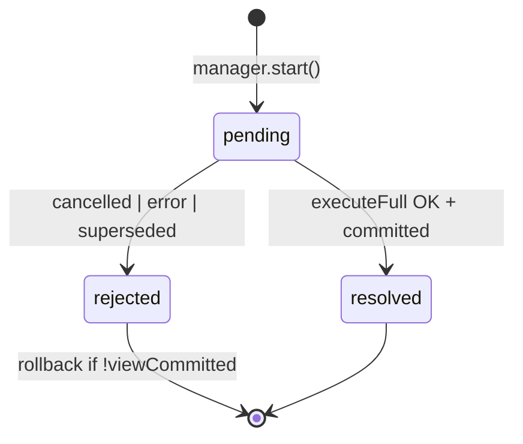

# TODO: NavigationRun + NavigationRunManager

> **Статус:** 🔶 частично реализовано (ядро есть под другими именами; rename + OutcomeHandler + observability — осталось)  
> **Легенда:** ✅ — в коде · ⬜ — осталось · 🔶 — частично (поведение есть, целевая форма — нет)  
> **Связь:** консолидация слоя orchestration; подготовка к [REDIRECT_CHAIN_COLLAPSE](./REDIRECT_CHAIN_COLLAPSE.md), [NAVIGATION_EVENTS](./NAVIGATION_EVENTS.md), [EVENT_BUS](./EVENT_BUS.md), devtools timeline.  
> **См. также:** [NAVIGATION_TRANSACTION_MODEL.md](../NAVIGATION_TRANSACTION_MODEL.md), [FUTURE_PROOF_ENGINE.md](../FUTURE_PROOF_ENGINE.md) (Navigation Job), [PIPELINE_STEP_RUNNER.md](./PIPELINE_STEP_RUNNER.md) (sync/async шаги, fast path), [ENGINE_CONSOLIDATION.md](./ENGINE_CONSOLIDATION.md) (roadmap всех модулей)

---

## Статус реализации (сверка с кодом, 2026-07)

| Целевой модуль (док) | Факт в коде | Статус |
|----------------------|-------------|--------|
| **`NavigationRun`** | `NavigationTransaction` — `core/navigation/navigation-transaction.ts` | ✅ |
| **`NavigationRunManager`** | `NavigationCoordinator` — dedupe + supersede + `activeTransaction` | 🔶 (planner внутри, rename нет) |
| **`NavigationOutcomeHandler`** | `finalizeError` / `finalizeCancelled` / `applyRedirect` / `finalizeNotFoundNavigation` на engine | 🔶 (размазано, класса нет) |
| **`NavigationCoordinator.plan()`** | `NavigationCoordinator.plan()` — `already-active`, `duplicate-pending`, `cancel-pending` | ✅ |
| **Rollback scope** | `NavigationTransaction.runWithStagedViewRollback()` + `rollbackUncommittedViews` | ✅ |
| **`ViewCommitTracker`** | поле `NavigationTransaction.viewCommitTracker` | ✅ |
| **Pipeline executor** | `NavigationTransactionPipeline` (бывший processor) | ✅ |
| **`commitSuccess` closure deps** | `engine.commitHistoryIfNeeded` + `commitNavigation` (engine ref в transaction) | 🔶 (узких deps нет) |
| **`NavigationRunOutcome`** | `TransactionResult` + `NavigationShortCircuit` / `NavigationErrorResult` | 🔶 (другие имена статусов) |
| **`NavigationIntent`** | — | ⬜ |
| **`RedirectResolver` / `resolveBlocking()`** | рекурсивный `navigateTo` на redirect | ⬜ |
| **Ring buffer прошлых run** | — | ⬜ |
| **EventBus / `telemetry: { emit }`** | — (DOM: только error/not-found в aura-router) | ⬜ |
| **`navigation:start\|finish\|cancel` events** | — | ⬜ |
| **State machine `pending\|resolved\|rejected`** | abort + `TransactionResult`; явного run status нет | 🔶 |

### Фазы внедрения

| Фаза | Статус |
|------|--------|
| **1b — `NavigationOutcomeHandler`** | 🔶 terminal history + failure есть; единый `apply()` — нет |
| **1 — Extract `NavigationRun`** | ✅ как `NavigationTransaction` |
| **2 — `NavigationRunManager`** | 🔶 как `NavigationCoordinator`; отдельного manager-файла / rename — нет |
| **3 — `resolveBlocking()` + collapse** | ⬜ |
| **4 — Observability** | ⬜ (частично: DOM error events) |

---

## Проблема (as-is → было)

~~Одна пользовательская навигация (один клик / один `navigateTo`) сейчас размазана по нескольким сущностям:~~

**Было (до консолидации):**

```text
AuraRoutingEngine.navigateTo()
  → NavigationCoordinator.run()
       NavigationCoordinator.plan          // dedupe кликов
       NavigationTransaction.run()
         NavigationCoordinator.run() supersede       // supersede
         withCancelledTransactionScope  // rollback view
         ViewCommitTracker
         NavigationTransactionPipeline
       finalizeProcessorNavigation()    // terminal history / redirect
  commitGate (callback внутри pipeline)  // success history — sync
```

**Сейчас в коде:**

```text
AuraRoutingEngine.navigateTo()
  → match / not-found (engine)
  → NavigationCoordinator.run()              ✅ dedupe + supersede в plan()
       NavigationTransaction.run()           ✅ job + tracker + rollback scope
         NavigationTransactionPipeline        ✅ guards → loads → render → ready
         commitHistoryIfNeeded / commitNavigation  🔶 success history на engine
  → processResult → finalize* / applyRedirect   🔶 terminal — методы engine, не OutcomeHandler
```

**Что уже закрыто:** ✅ rollback в transaction · ✅ dedupe/planner в coordinator · ✅ один объект транзакции (job + tracker + pipeline).

**Что ещё болит:**

- ⬜ Terminal side effects размазаны по `AuraRoutingEngine` (`finalizeError`, `finalizeCancelled`, `applyRedirect`, `finalizeNotFoundNavigation`) — нет `NavigationOutcomeHandler.apply()`.
- ⬜ `NavigationTransaction` держит `engine` целиком — нет узкого `NavigationRunDeps` / `commitSuccess` closure.
- ⬜ Redirect collapse — рекурсивный `navigateTo`, не `RedirectResolver`.
- ⬜ Observability — нет run history, EventBus, `navigation:start|finish|cancel`.
- 🔶 Явный run status (`pending | resolved | rejected`) — только косвенно через abort + `TransactionResult`.

---

## Предлагаемая модель

> **Именование:** `NavigationRun` + `NavigationRunManager`, не `ProcessorTask` — task шире pipeline (history, dedupe, intent); processor остаётся executor pipeline.

### `NavigationRun` — одна навигационная транзакция ✅ (как `NavigationTransaction`)

Единица жизненного цикла **одного intent** (один клик / один `navigateTo`):

```ts
type NavigationRunStatus = 'pending' | 'resolved' | 'rejected';

interface NavigationRun {
  readonly id: number;
  readonly intent: NavigationIntent;   // см. REDIRECT_CHAIN_COLLAPSE.md
  status: NavigationRunStatus;

  // owned state (сейчас разрозненно)
  readonly job: NavigationTransaction;
  readonly transitionPlan: TransitionMap;
  readonly viewCommitTracker: ViewCommitTracker;

  execute(): Promise<NavigationRunOutcome>;
  abort(reason?: unknown): void;      // job.abort + rollback view если !committed
}
```

**Внутри `execute()` (фазы одного run, не отдельные task в очереди):**

```text
1. resolveBlocking()    // опционально, после REDIRECT_CHAIN_COLLAPSE
2. executeFull()        // processor.run(resolvedFrom, resolvedTo)
3. map TransactionResult → NavigationRunOutcome   // terminal side effects — OutcomeHandler
```

**Rollback:** ✅ инкапсуляция в `NavigationTransaction.runWithStagedViewRollback` (abort listener + guard-cancel в `finally`).

**History и атомарность:** 🔶 success history через `engine.commitHistoryIfNeeded` / `commitNavigation`; terminal — методы engine. Узкий `NavigationRunDeps` — ⬜.

| Путь | Когда history | Статус |
|------|----------------|--------|
| success | sync `commitHistoryIfNeeded` + `commitNavigation` в pipeline | ✅ |
| cancelled / error | engine `finalizeCancelled` / `finalizeError` + `applyTransactionHistory` | 🔶 (не OutcomeHandler) |
| supersede | view rollback; history для run не commit'ился | ✅ |
| redirect (legacy) | `applyRedirect` → новый `navigateTo` | ✅ |
| redirect (collapse) | один commit после full run | ⬜ |

### `NavigationRunManager` — orchestration 🔶 (как `NavigationCoordinator`)

**Не очередь / stack.** Семантика **latest-wins + supersede** (как сейчас):

```text
activeRun: NavigationRun | null

start(input): PlanDecision
  noop | cancel-pending | start-new-run
```

Перенимает:

- ✅ `NavigationCoordinator.plan` — dedupe (`already-active`, `duplicate-pending`, `cancel-pending`) → `coordinator.plan()`;
- ✅ abort предыдущего run при новом → `activeTransaction.cancel()` + `transactionId`;
- ✅ создание и `await activeTransaction.run()` → `NavigationTransaction.run()`.

**Manager не знает:** ⬜ redirect hops, `visited`, blocking-only loop — это фаза **run** (ещё не `RedirectResolver`).

```text
Engine.navigateTo()
  → match / not-found (как сейчас)
  → NavigationRunManager.start(matchedInput)
       plan → noop | abortPending | new NavigationRun
  → run.execute() → NavigationRunOutcome
  → engine.outcomeHandler.apply(outcome)
```

### Опционально: ring buffer прошлых run ⬜

Для runtime **не обязателен** (достаточно `activeRun` + last resolved). Полезен для observability (10–20 записей):

| Use case |
|----------|
| DevTools timeline |
| Debug supersede / rollback transitions |
| `navigation:start|finish|cancel` ([NAVIGATION_EVENTS](./NAVIGATION_EVENTS.md)) |
| «какой run отменил какой» (`abortedByRunId`) |

Хранить метаданные, не DOM: `{ id, href, from, status, phases, durationMs, abortedBy? }`.

---

## Deps (`NavigationRun`) 🔶

`NavigationRun` — **внутренний** класс engine (private API). Отдельные «port interface + adapter» **не обязательны**: run под нашим контролем. Достаточно **узкого `NavigationRunDeps`** — явный контракт без лишнего indirection.

> **Факт:** `NavigationTransaction` держит `engine: AuraRoutingEngine` целиком — ⬜ узкий deps ещё не введён.

> **«Port» в документе** = что run **может** вызывать, не обязательно файл `*-port.ts`.

### History — функция в deps, не provider целиком 🔶

Не пробрасывать `NavigationProvider` в run — не «защита от себя», а **разделение ответственности** (`onNavigation`, `currentHref` — зона engine).

**Рекомендуемый v1** — `commitSuccess` в deps; engine замыкает `provider`:

> ✅ Поведение: `commitHistoryIfNeeded` + `commitNavigation` на engine, вызываются из pipeline.  
> ⬜ Форма: closure `commitSuccess` в deps вместо прямого `engine` ref.

```ts
interface NavigationRunDeps {
  /** Sync после commitStagedView, пока isJobActive — applyCommitGate */
  commitSuccess: (ctx: CommitGateContext) => CommitGateEffects;

  processor: NavigationTransaction;
  router: RouterInstance;
  // …
}
```

```ts
new NavigationRun({
  commitSuccess: (ctx) =>
    applyCommitGate({ ...ctx, provider: engine.provider, onNavigationCommitted, scrollToHash }),
  processor: this.processor,
  router: this.router,
});
```

**Terminal history** (`cancel`, `error`, `redirect`, not-found) — 🔶 в engine-методах + `navigation-finalize.ts`; ⬜ единый `NavigationOutcomeHandler`.

**Invariants** (JSDoc / код, без отдельного port-класса):

1. `commitSuccess` — **sync** в pipeline callback.
2. Run **не** трогает `provider` напрямую.
3. Scroll — внутри `commitSuccess`.

**Опционально позже:** `interface NavigationHistoryPort` — если второй consumer (SSR fake) или run в отдельном пакете.

### Остальные deps

| Dep | Что передать | Зачем run | Статус |
|-----|--------------|-----------|--------|
| **`processor`** | `NavigationTransaction` → `NavigationTransactionPipeline` | `runBlockingOnly()` / `runFull()` | ✅ pipeline в transaction |
| **`redirectResolver`** | `RedirectResolver` | collapse | ⬜ |
| **`router`** | `RouterInstance` | hooks | ✅ через `engine.router` |
| **`telemetry`** | `{ emit(event) }` | emit-only | ⬜ |
| **`reportHookError`** | callback → OutcomeHandler | hook-error из pipeline | ✅ `engine.reportNavigationHookError` |

Конкретные типы (`processor`, `router`) OK — run internal, альтернативных impl нет.

### Вне deps run (engine / manager)

| Concern | Где | Статус |
|---------|-----|--------|
| `UrlMatcher`, registry, match | Engine до `coordinator.run()` | ✅ |
| `NavigationProvider` (полный) | Engine; run — только closure `commitSuccess` | 🔶 provider только на engine |
| `prev` read/write | Engine / coordinator | ✅ |
| Dedupe | Coordinator `plan()` | ✅ |
| Prefetch | Engine | ✅ |
| DOM `CustomEvent` | `AuraRouter` bridge | 🔶 error/not-found; ⬜ start/finish/cancel |

### `NavigationRunDeps` (сводка v1)

```ts
interface NavigationRunDeps {
  commitSuccess: (ctx: CommitGateContext) => CommitGateEffects;
  processor: NavigationTransaction;
  redirectResolver?: RedirectResolver;
  router: RouterInstance;
  telemetry?: { emit(event: EngineEvent): void };
  reportHookError?: ReportNavigationHookError;
}
```

---

## EventBus и telemetry ⬜

**Уместно** передать в run `{ emit }`, не `EventBus` целиком (run не `subscribe` / `destroy`). Тот же объект — в `PipelineContext` для fine-grained emit.

> **Факт:** EventBus и `telemetry: { emit }` в engine/run/pipeline **не подключены**. DOM: только `navigation-error` / `not-found` / `navigation-hook-error` в aura-router.

### Кто что emit'ит

```text
NavigationRun / Manager
  navigation:start, navigation:finish, navigation:cancel,
  navigation:redirect, navigation:error (terminal)

NavigationTransactionPipeline / DataGraph  (тот же telemetry в PipelineContext)
  navigation:prepare:*, load:*, node:*, navigation:commit:*
```

Run **не дублирует** fine-grained emit из pipeline.

### DOM и legacy callbacks

```text
Engine EventBus
  → AuraRouter bridge (subscribe once)
      → CustomEvent('navigation-error', …)
```

`onNavigationCommitted` / `onNavigationError` — thin wrapper над bus/handler на переходный период (см. [EVENT_BUS](./EVENT_BUS.md)).

---

## `NavigationOutcomeHandler` 🔶

Единая точка terminal-обработки в **engine** (не в run). Run возвращает outcome; handler применяет side effects.

> **Факт:** поведение есть (`finalizeError`, `finalizeCancelled`, `applyRedirect`, `finalizeNotFoundNavigation`, `applyTransactionHistory`), но **класса `NavigationOutcomeHandler` и `apply(outcome)` нет** — логика в методах `AuraRoutingEngine` + `navigation-finalize.ts`.

### As-is (размазано) → было

```text
error-phase-handler           → FailedNavigation
finalizeFailure               → onNavigationError / onNotFound
finalizeProcessorNavigation   → history + redirect
coordinator                   → reportHookError
engine                        → failureDeps(), applyFinalizeEffects
aura-router                   → dispatchNavigationError
```

### Сейчас в коде 🔶

```text
NavigationFailureHandler      → ✅ per-route error hook phase
finalizeFailure               → ✅ failure/*
NavigationTransaction.run     → ✅ TransactionResult
NavigationCoordinator.processResult → ✅ dispatch к engine finalizers
engine.finalize* / applyRedirect    → 🔶 terminal (не один handler)
navigation-finalize.ts      → ✅ applyTransactionHistory, finalizeNotFoundNavigation
aura-router                   → ✅ dispatchNavigationError (error events)
```

### To-be ⬜

**Run** — только результат:

```ts
type NavigationRunOutcome =
  | { status: 'resolved'; to: MatchedRouteInfo }
  | { status: 'cancelled' }
  | { status: 'redirect'; url: string; replace: boolean }
  | { status: 'rejected'; failure: FailedNavigation };
```

**Engine — `NavigationOutcomeHandler`:**

```ts
class NavigationOutcomeHandler {
  apply(outcome: NavigationRunOutcome, ctx: RunContext): EngineEffects;
}
```

Внутри `apply()` — логика из `finalizeFailure` + `finalizeProcessorNavigation`:

- history terminal + `applyTransactionHistory` (engine `provider`);
- `setPrev`;
- telemetry emit;
- legacy callbacks (`onNavigationError`, …);
- DOM bridge (aura-router);
- redirect → `scheduleNavigate(url)`.

### Два типа ошибок (не смешивать)

| Тип | Источник | Куда |
|-----|----------|------|
| **Pipeline failure** | guard / load / render throw | `FailedNavigation` → outcome `rejected` → `OutcomeHandler` |
| **Hook error handler failed** | `error="…"` hook threw | `deps.reportHookError` → OutcomeHandler |

Pipeline error **не** диспатчит `navigation-hook-error` напрямую из coordinator.

### Pre-run NOT_FOUND 🔶

Match null до run — `finalizeNotFoundNavigation` на engine. ⬜ тот же `OutcomeHandler.apply(rejected)` (единая точка).

---

## Схема слоёв (deps + errors)

```text
AuraRouter
  └─ AuraRoutingEngine                                    ✅
       EventBus (instance)                                ⬜
       NavigationOutcomeHandler                           🔶 finalize* на engine
       NavigationProvider                                 ✅
       NavigationCoordinator (= RunManager)               🔶
         └─ NavigationTransaction (= Run)                 ✅
              deps: engine ref (не узкий closure)         🔶
              run() → TransactionResult                  ✅
       outcomeHandler.apply(outcome)                      🔶 processResult → finalize*
```

---

## Польза по этапам

| Этап | Польза | Статус |
|------|--------|--------|
| **1. Extract NavigationRun** | Один объект = job + tracker + rollback; state machine; проще тесты | ✅ `NavigationTransaction` |
| **2. NavigationRunManager** | Dedupe + supersede в одном месте; coordinator упрощается | 🔶 `NavigationCoordinator` (rename + split planner — ⬜) |
| **2b. NavigationOutcomeHandler** | Ошибки, terminal history, bus/DOM — одна точка | 🔶 поведение есть; класс `apply()` — ⬜ |
| **3. RedirectResolver в run** | Один intent, один job на resolve + full | ⬜ |
| **4. Run history (ring buffer)** | Events, devtools, отладка transition supersede | ⬜ |
| **4b. telemetry `{ emit }`** | EventBus в run + pipeline | ⬜ |

---

## Границы ответственности (целевые)

```text
AuraRoutingEngine     I/O: match, provider, prev, links, registry, OutcomeHandler, EventBus  🔶 без OutcomeHandler/EventBus
NavigationRunManager  active run, dedupe, supersede                                         🔶 NavigationCoordinator
NavigationRun         intent lifecycle: resolve → full → rollback; узкие deps                🔶 NavigationTransaction
NavigationOutcomeHandler  terminal: history, errors, telemetry, DOM bridge                 🔶 методы engine
RedirectResolver      loop blocking redirect (коллаборатор run)                              ⬜
NavigationTransaction  только pipeline body (guards → history → prepare → render → effects)                 ✅ NavigationTransactionPipeline
NavigationTransactionPipeline     порядок шагов; telemetry `{ emit }` в ctx                              🔶 без telemetry
```

**Не делать:**

- FIFO stack/queue pending navigations (другое UX; текущая модель — latest-wins).
- Два run на одну sync redirect-цепочку.
- God object run (matcher, prefetch, scroll внутри run).
- Async gap между view commit и history commit.

---

## Маппинг as-is → to-be

| As-is (док) | To-be | Факт в коде | Статус |
|-------------|-------|-------------|--------|
| `NavigationCoordinator.plan` | `NavigationRunManager.plan()` | `NavigationCoordinator.plan()` | ✅ |
| `NavigationCoordinator.run()` | `RunManager.start()` + `Run.execute()` | coordinator + `NavigationTransaction.run()` | ✅ |
| `withCancelledTransactionScope` | `NavigationRun` rollback | `runWithStagedViewRollback()` | ✅ |
| `NavigationCoordinator.begin()` | manager при start-new-run | `activeTransaction.cancel()` + new id | ✅ |
| `ViewCommitTracker` | поле run | `NavigationTransaction.viewCommitTracker` | ✅ |
| `commitGate` callback | `deps.commitSuccess` | `commitHistoryIfNeeded` + `commitNavigation` | 🔶 |
| `finalizeProcessorNavigation` | `OutcomeHandler.apply` | engine `finalize*` / `applyRedirect` | 🔶 |
| `finalizeFailure` | `OutcomeHandler.apply(rejected)` | `finalizeFailure` + engine methods | 🔶 |
| `failureDeps()` / coordinator callbacks | handler deps + telemetry | `failureDeps()` на engine | 🔶 |
| `NavigationIntent` (collapse doc) | `run.intent` | — | ⬜ |

---

## Шаги внедрения (incremental)

### Фаза 1b — `NavigationOutcomeHandler` 🔶

1. ⬜ `NavigationOutcomeHandler` — consolidate `finalizeFailure` + terminal history в один `apply()`.
2. 🔶 Coordinator/engine вызывает terminal через engine-методы (`processResult` → `finalize*` / `applyRedirect`).
3. ✅ **Критерий:** error / cancel / redirect / not-found — поведение 1:1 (тесты: `navigation-coordinator.test.ts`, `navigation-finalize.test.ts`, `commit-history.test.ts`).

**Файлы:**

| Файл | Изменение | Статус |
|------|-----------|--------|
| `core/navigation/navigation-outcome-handler.ts` | новый | ⬜ |
| `core/navigation/navigation-finalize.ts` | thin → handler | 🔶 есть, не thin wrapper |
| `core/aura-routing-engine.ts` | `finalize*` → delegate handler | 🔶 методы на engine |

> Отдельный `navigation-history-port.ts` **не нужен** на v1 — ✅ достаточно history на engine + `applyTransactionHistory`.

### Фаза 1 — Extract `NavigationRun` ✅

1. ✅ `core/navigation/navigation-transaction.ts` (имя отличается от дока).
2. ✅ `runWithStagedViewRollback` — abort + rollback.
3. ✅ `NavigationTransaction.run()` — pipeline + success history через engine.
4. ✅ Coordinator делегирует в transaction; terminal на engine.
5. ✅ **Критерий:** supersede mid-transition, guard cancel — rollback (тесты coordinator + pipeline).

**Файлы:**

| Файл | Изменение | Статус |
|------|-----------|--------|
| `core/navigation/navigation-transaction.ts` | новый (≈ NavigationRun) | ✅ |
| `core/navigation/navigation-coordinator.ts` | orchestration | ✅ |
| `core/processor/cancellation/transaction-scope.ts` | deprecated | ✅ удалён / заменён rollback в transaction |

### Фаза 2 — `NavigationRunManager` 🔶

1. ⬜ Новый `navigation-run-manager.ts` (rename/split из coordinator).
2. ✅ Dedupe + active run + supersede — в `NavigationCoordinator`.
3. 🔶 Engine вызывает coordinator (не отдельный manager API).
4. ✅ **Критерий:** `navigation-dedupe.test.ts`, supersede tests без регрессий.

**Файлы:**

| Файл | Изменение | Статус |
|------|-----------|--------|
| `core/navigation/navigation-run-manager.ts` | новый | ⬜ |
| `core/navigation/navigation-planner.ts` | helper manager | ✅ внутри coordinator |
| `core/navigation/navigation-coordinator.ts` | glue / merge | 🔶 monolith manager+run |
| processor `begin()` | из manager/run | ✅ supersede в coordinator |

### Фаза 3 — `resolveBlocking()` внутри run ⬜

1. ⬜ [REDIRECT_CHAIN_COLLAPSE](./REDIRECT_CHAIN_COLLAPSE.md) (`RedirectResolver`, `runBlockingOnly`).
2. ⬜ `NavigationRun.execute()` — resolve → full.
3. ⬜ Один job на resolve + full.
4. ⬜ **Критерий:** sync redirect chain → один view commit, один history commit.

### Фаза 4 — Observability (опционально) ⬜

1. ⬜ Ring buffer в manager.
2. ⬜ `telemetry: { emit }` из EventBus; run + pipeline.
3. 🔶 AuraRouter bridge: bus → DOM — только error/not-found сейчас.
4. ⬜ Superseded run не получает `finish` после abort.

---

## State machine run (reference)



---

## Связанные документы

- [REDIRECT_CHAIN_COLLAPSE.md](./REDIRECT_CHAIN_COLLAPSE.md) — `resolveBlocking()` как фаза run
- [EVENT_BUS.md](./EVENT_BUS.md) — EventBus, telemetry port, emit points
- [NAVIGATION_EVENTS.md](./NAVIGATION_EVENTS.md) — DOM public API поверх handler/bus
- [NAVIGATION_TRANSACTION_MODEL.md](../NAVIGATION_TRANSACTION_MODEL.md) — политика redirect / cancel
- [FUTURE_PROOF_ENGINE.md](../FUTURE_PROOF_ENGINE.md) — Navigation Job, stale guards
- [PIPELINE_STEP_RUNNER.md](./PIPELINE_STEP_RUNNER.md) — thenable runner, fast path tiers, trampoline (overkill)

---

## Итог

| Концепт | Статус |
|---------|--------|
| **NavigationRun** (`NavigationTransaction`) | ✅ pipeline + job + view state + rollback |
| **NavigationRunManager** (`NavigationCoordinator`) | 🔶 dedupe/supersede есть; rename/split — ⬜ |
| **NavigationOutcomeHandler** | 🔶 terminal history/errors работают; `apply()` — ⬜ |
| **Узкие deps** (`commitSuccess` closure) | ⬜ transaction держит `engine` |
| **RedirectResolver / collapse** | ⬜ |
| **Observability** (ring buffer, EventBus, nav events) | ⬜ |

**NavigationRun** — явная транзакция одного intent (pipeline + job + view state + rollback + **узкие deps**).  
**NavigationRunManager** — dedupe и supersede (**не queue**).  
**NavigationOutcomeHandler** — terminal history, ошибки, telemetry, DOM — **одно место в engine**.  
**Deps, не port-адаптеры:** `commitSuccess` closure + `processor` / `router`; provider целиком только в engine/handler.

**Следующие шаги:** ⬜ OutcomeHandler (`apply()`) → 🔶 узкие deps → ⬜ rename Run/Manager (опционально) → ⬜ redirect collapse → ⬜ telemetry.

Польза уже частично получена (transaction + coordinator); полная выгода — когда ⬜ OutcomeHandler и ⬜ observability закроют оставшийся indirection.
