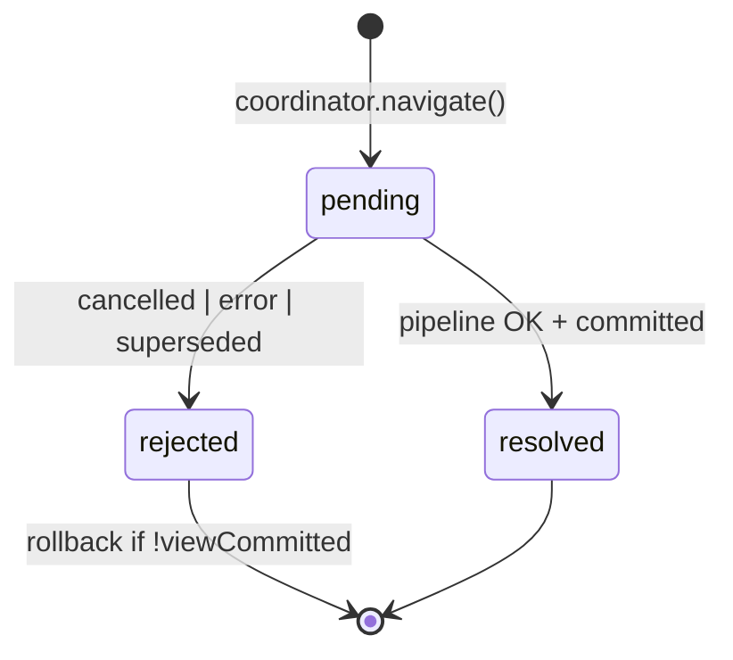

# TODO: Navigation orchestration (Transaction + Coordinator)

> **Статус:** <span style="background:#f59e0b;color:#111;padding:2px 8px;border-radius:4px;font-weight:700">~ ЧАСТИЧНО</span> — runtime-оркестрация и EventBus ✓; OutcomeHandler — осталось · rename / узкие deps ⊘ 
> **Сверка с кодом:** 2026-07-19  
> **Связь:** консолидация слоя orchestration; redirect collapse → [../done/REDIRECT_CHAIN_COLLAPSE.md](../done/REDIRECT_CHAIN_COLLAPSE.md); [NAVIGATION_EVENTS](./NAVIGATION_EVENTS.md), [../done/EVENT_BUS.md](../done/EVENT_BUS.md), `NavigationPulse`.  
> **См. также:** [NAVIGATION_TRANSACTION_MODEL.md](../NAVIGATION_TRANSACTION_MODEL.md), [FUTURE_PROOF_ENGINE.md](../FUTURE_PROOF_ENGINE.md) (Navigation Job), [PIPELINE_STEP_RUNNER.md](./PIPELINE_STEP_RUNNER.md), [ENGINE_CONSOLIDATION.md](./ENGINE_CONSOLIDATION.md)

### Легенда

| Метка | Значение |
|-------|----------|
| <span style="background:#16a34a;color:#fff;padding:2px 8px;border-radius:4px;font-weight:700">✓ ГОТОВО</span> | поведение в production path / покрыто тестами |
| <span style="background:#f59e0b;color:#111;padding:2px 8px;border-radius:4px;font-weight:700">~ ЧАСТИЧНО</span> | поведение есть, целевая форма (имя/класс/API) — нет |
| <span style="background:#dc2626;color:#fff;padding:2px 8px;border-radius:4px;font-weight:700">✗ ОСТАЛОСЬ</span> | не сделано |
| <span style="background:#6b7280;color:#fff;padding:2px 8px;border-radius:4px;font-weight:700">⊘ ОТЛОЖЕНО</span> | сознательно не в scope / by design |

---

## Сводка прогресса (читай сначала)

| # | Тема | Статус | Факт в коде |
|---|------|--------|-------------|
| 1 | **NavigationRun** (транзакция одного intent) | <span style="background:#16a34a;color:#fff;padding:2px 6px;border-radius:4px;font-weight:700">✓</span> | `NavigationTransaction` — job + tracker + rollback + pipeline |
| 2 | **Dedupe + supersede + active run** | <span style="background:#16a34a;color:#fff;padding:2px 6px;border-radius:4px;font-weight:700">✓</span> | `NavigationCoordinator.plan` / `run` / `navigate` |
| 3 | **Pipeline executor** | <span style="background:#16a34a;color:#fff;padding:2px 6px;border-radius:4px;font-weight:700">✓</span> | `NavigationTransactionPipeline` |
| 4 | **Rollback uncommitted views** | <span style="background:#16a34a;color:#fff;padding:2px 6px;border-radius:4px;font-weight:700">✓</span> | `runWithStagedViewRollback` + `ViewCommitTracker` |
| 5 | **Redirect chain collapse** | <span style="background:#16a34a;color:#fff;padding:2px 6px;border-radius:4px;font-weight:700">✓</span> | `followRedirectsWithGuardWalk` до `coordinator.run` |
| 6 | **Success history commit** | <span style="background:#16a34a;color:#fff;padding:2px 6px;border-radius:4px;font-weight:700">✓</span> | `commitHistoryIfNeeded` + `commitNavigation` |
| 7 | **Terminal finalize (error/cancel/redirect/404)** | <span style="background:#f59e0b;color:#111;padding:2px 6px;border-radius:4px;font-weight:700">~</span> | методы engine + `navigation-finalize.ts`; класса `apply()` нет |
| 8 | **DOM nav events** | <span style="background:#16a34a;color:#fff;padding:2px 6px;border-radius:4px;font-weight:700">✓</span> | start / commit / complete / cancel / redirect / errors / `not-found` — bus → aura-router |
| 9 | **Rename → `NavigationRun` / `RunManager`** | <span style="background:#6b7280;color:#fff;padding:2px 6px;border-radius:4px;font-weight:700">⊘</span> | **не делаем** — остаются `NavigationCoordinator` + `NavigationTransaction` |
| 10 | **`NavigationOutcomeHandler.apply()`** | <span style="background:#dc2626;color:#fff;padding:2px 6px;border-radius:4px;font-weight:700">✗</span> | consolidate `finalize*` в один handler |
| 11 | **Узкие deps (`commitSuccess` closure)** | <span style="background:#6b7280;color:#fff;padding:2px 6px;border-radius:4px;font-weight:700">⊘</span> | **не делаем** — остаётся `tx.engine` без прослоек |
| 12 | **Явный run status `pending\|resolved\|rejected`** | <span style="background:#dc2626;color:#fff;padding:2px 6px;border-radius:4px;font-weight:700">✗</span> | косвенно: abort + `TransactionResult` |
| 13 | **EventBus / `NavigationPulse`** | <span style="background:#16a34a;color:#fff;padding:2px 6px;border-radius:4px;font-weight:700">✓</span> | `engine.events` + `engine.pulse`; см. [../done/EVENT_BUS.md](../done/EVENT_BUS.md) |
| 14 | **Ring buffer прошлых run** | <span style="background:#6b7280;color:#fff;padding:2px 6px;border-radius:4px;font-weight:700">⊘</span> | EB4 / devtools — не блокер; см. [CACHE_DEVTOOLS](./CACHE_DEVTOOLS.md) |
| 15 | **`NavigationIntent` тип** | <span style="background:#6b7280;color:#fff;padding:2px 6px;border-radius:4px;font-weight:700">⊘</span> | не планируется; `RedirectionContext` + resolve |
| 16 | **Отдельный класс `RedirectResolver` / `runBlockingOnly`** | <span style="background:#6b7280;color:#fff;padding:2px 6px;border-radius:4px;font-weight:700">⊘</span> | логика в `redirect/` + guard walk |

**Вердикт:** док **актуален как backlog консолидации API**, не как «ничего нет». Runtime-ядро (Transaction + Coordinator + collapse + pipeline + EventBus) — <span style="background:#16a34a;color:#fff;padding:2px 6px;border-radius:4px;font-weight:700">✓</span>. Осталось в основном **OutcomeHandler**. Rename и узкие deps (`commitSuccess`) — <span style="background:#6b7280;color:#fff;padding:2px 6px;border-radius:4px;font-weight:700">⊘</span>.

---

## Статус реализации (сверка с кодом, 2026-07-19)

| Целевой модуль (док) | Факт в коде | Статус |
|----------------------|-------------|--------|
| **`NavigationRun`** | `NavigationTransaction` — `core/navigation/navigation-transaction.ts` | <span style="background:#16a34a;color:#fff;padding:2px 6px;border-radius:4px;font-weight:700">✓</span> |
| **`NavigationRunManager`** (имя из старого плана) | `NavigationCoordinator` — dedupe + supersede + `activeTransaction` + resolve | <span style="background:#16a34a;color:#fff;padding:2px 6px;border-radius:4px;font-weight:700">✓</span> семантика · <span style="background:#6b7280;color:#fff;padding:2px 6px;border-radius:4px;font-weight:700">⊘</span> rename |
| **`NavigationOutcomeHandler`** | `finalizeError` / `finalizeCancelled` / `applyRedirect` / `finalizeNotFoundNavigation` / `finalizeResolveTerminal` на engine | <span style="background:#f59e0b;color:#111;padding:2px 6px;border-radius:4px;font-weight:700">~</span> (класса нет) |
| **`NavigationCoordinator.plan()`** | `already-active`, `cancel-pending` → `run` | <span style="background:#16a34a;color:#fff;padding:2px 6px;border-radius:4px;font-weight:700">✓</span> |
| **Rollback scope** | `runWithStagedViewRollback()` + `rollbackUncommittedViews` | <span style="background:#16a34a;color:#fff;padding:2px 6px;border-radius:4px;font-weight:700">✓</span> |
| **`ViewCommitTracker`** | поле `NavigationTransaction.viewCommitTracker` | <span style="background:#16a34a;color:#fff;padding:2px 6px;border-radius:4px;font-weight:700">✓</span> |
| **Pipeline executor** | `NavigationTransactionPipeline` | <span style="background:#16a34a;color:#fff;padding:2px 6px;border-radius:4px;font-weight:700">✓</span> |
| **Redirect collapse** | `followRedirectsWithGuardWalk` в `coordinator.navigate()` | <span style="background:#16a34a;color:#fff;padding:2px 6px;border-radius:4px;font-weight:700">✓</span> |
| **`commitSuccess` closure deps** | прямой `tx.engine` (`commitHistoryIfNeeded` / `commitNavigation`) | <span style="background:#16a34a;color:#fff;padding:2px 6px;border-radius:4px;font-weight:700">✓</span> by design · <span style="background:#6b7280;color:#fff;padding:2px 6px;border-radius:4px;font-weight:700">⊘</span> узкий deps |
| **`NavigationRunOutcome`** | `TransactionResult` + short-circuit / error types | <span style="background:#f59e0b;color:#111;padding:2px 6px;border-radius:4px;font-weight:700">~</span> |
| **`NavigationIntent`** | — | <span style="background:#6b7280;color:#fff;padding:2px 6px;border-radius:4px;font-weight:700">⊘</span> |
| **Класс `RedirectResolver` / `resolveBlocking()` как фаза run** | функции в `redirect/`; resolve **до** pipeline в coordinator | <span style="background:#16a34a;color:#fff;padding:2px 6px;border-radius:4px;font-weight:700">✓</span> поведение · <span style="background:#6b7280;color:#fff;padding:2px 6px;border-radius:4px;font-weight:700">⊘</span> форма из старого плана |
| **EventBus + `NavigationPulse`** | `engine.events` / `engine.pulse`; emit из pipeline + `processResult` | <span style="background:#16a34a;color:#fff;padding:2px 6px;border-radius:4px;font-weight:700">✓</span> |
| **Ring buffer прошлых run** | — | <span style="background:#6b7280;color:#fff;padding:2px 6px;border-radius:4px;font-weight:700">⊘</span> (EB4) |
| **DOM P0 lifecycle** | start / commit / complete / cancel / redirect / errors | <span style="background:#16a34a;color:#fff;padding:2px 6px;border-radius:4px;font-weight:700">✓</span> |
| **State machine `pending\|resolved\|rejected`** | abort + `TransactionResult` | <span style="background:#f59e0b;color:#111;padding:2px 6px;border-radius:4px;font-weight:700">~</span> |

### Фазы внедрения

| Фаза | Статус |
|------|--------|
| **1 — Extract `NavigationRun`** | <span style="background:#16a34a;color:#fff;padding:2px 6px;border-radius:4px;font-weight:700">✓</span> как `NavigationTransaction` |
| **1b — `NavigationOutcomeHandler`** | <span style="background:#f59e0b;color:#111;padding:2px 6px;border-radius:4px;font-weight:700">~</span> terminal есть; единый `apply()` — <span style="background:#dc2626;color:#fff;padding:2px 6px;border-radius:4px;font-weight:700">✗</span> |
| **2 — orchestration (`NavigationCoordinator`)** | <span style="background:#16a34a;color:#fff;padding:2px 6px;border-radius:4px;font-weight:700">✓</span> · rename в RunManager — <span style="background:#6b7280;color:#fff;padding:2px 6px;border-radius:4px;font-weight:700">⊘</span> |
| **3 — Redirect collapse** | <span style="background:#16a34a;color:#fff;padding:2px 6px;border-radius:4px;font-weight:700">✓</span> → [../done/REDIRECT_CHAIN_COLLAPSE.md](../done/REDIRECT_CHAIN_COLLAPSE.md) |
| **4 — Observability** | <span style="background:#16a34a;color:#fff;padding:2px 6px;border-radius:4px;font-weight:700">✓</span> EventBus + DOM P0 · ring buffer ⊘ EB4 |

---

## Проблема (as-is → было)

~~Одна пользовательская навигация (один клик / один `navigateTo`) сейчас размазана по нескольким сущностям:~~

**Было (до консолидации):**

```text
AuraRoutingEngine.navigateTo()
  → NavigationCoordinator.run()
       NavigationCoordinator.plan          // dedupe кликов
       NavigationTransaction.run()
         NavigationCoordinator.run() supersede       // supersede
         withCancelledTransactionScope  // rollback view
         ViewCommitTracker
         NavigationTransactionPipeline
       finalizeProcessorNavigation()    // terminal history / redirect
  commitGate (callback внутри pipeline)  // success history — sync
```

**Сейчас в коде:**

```text
AuraRoutingEngine.navigateTo()
  → match / not-found / fast-path (engine)
  → NavigationCoordinator.navigate()           ✓ dedupe attempt + followRedirectsWithGuardWalk
       plan → NavigationTransaction.run()      ✓ job + tracker + rollback
         NavigationPulse.begin / phase emits   ✓ via engine.pulse
         NavigationTransactionPipeline         ✓ guards → loads → render → ready
         commitHistoryIfNeeded / commitNavigation  ~ success history на engine
  → processResult → pulse.settle → finalize* / applyRedirect  ~ terminal — методы engine, не OutcomeHandler
```

**Что уже закрыто:** <span style="background:#16a34a;color:#fff;padding:2px 6px;border-radius:4px;font-weight:700">✓</span> rollback · dedupe/supersede · transaction object · redirect collapse · success history · EventBus/`NavigationPulse` · DOM P0 (start/commit/complete/cancel/redirect/errors).

**Что ещё болит:**

- <span style="background:#dc2626;color:#fff;padding:2px 6px;border-radius:4px;font-weight:700">✗</span> Terminal side effects размазаны по `AuraRoutingEngine` — нет `NavigationOutcomeHandler.apply()`.
- <span style="background:#f59e0b;color:#111;padding:2px 6px;border-radius:4px;font-weight:700">~</span> Явный run status (`pending | resolved | rejected`) — только косвенно через abort + `TransactionResult`.

**By design (не делаем):**

- <span style="background:#6b7280;color:#fff;padding:2px 6px;border-radius:4px;font-weight:700">⊘</span> Узкий `NavigationRunDeps` / `commitSuccess` — остаётся прямой `tx.engine` (без прослоек при разборе кода).

---

## Предлагаемая модель

> **Именование (финальное):** `NavigationTransaction` + `NavigationCoordinator`.  
> Ярлыки Run / RunManager ниже — только исторический маппинг из старого плана; **rename не делаем**.

### `NavigationTransaction` — одна навигационная транзакция <span style="background:#16a34a;color:#fff;padding:2px 6px;border-radius:4px;font-weight:700">✓</span>

> Старый план-ярлык: `NavigationRun`.

Единица жизненного цикла **одного intent** (один клик / один `navigateTo`):

```ts
type NavigationRunStatus = 'pending' | 'resolved' | 'rejected';

interface NavigationRun {
  readonly id: number;
  readonly intent: NavigationIntent;   // ⊘ не вводим отдельный тип
  status: NavigationRunStatus;         // ✗ явного поля нет

  readonly job: NavigationTransaction;
  readonly transitionPlan: TransitionMap;
  readonly viewCommitTracker: ViewCommitTracker;

  execute(): Promise<NavigationRunOutcome>;
  abort(reason?: unknown): void;
}
```

**Внутри `execute()` (фазы одного run):**

```text
1. resolveBlocking()    // ✓ сделано ДО run: followRedirectsWithGuardWalk в coordinator.navigate
2. executeFull()        // ✓ processor / pipeline (+ NavigationPulse phase emits)
3. map TransactionResult → outcome → OutcomeHandler   // ~ pulse.settle + finalize* на engine
```

**Rollback:** <span style="background:#16a34a;color:#fff;padding:2px 6px;border-radius:4px;font-weight:700">✓</span> `NavigationTransaction.runWithStagedViewRollback`.

**History и атомарность:** <span style="background:#f59e0b;color:#111;padding:2px 6px;border-radius:4px;font-weight:700">~</span> success через engine; terminal — методы engine. Узкий `NavigationRunDeps` — <span style="background:#6b7280;color:#fff;padding:2px 6px;border-radius:4px;font-weight:700">⊘</span> (остаётся `tx.engine`).

| Путь | Когда history | Статус |
|------|----------------|--------|
| success | sync `commitHistoryIfNeeded` + `commitNavigation` в pipeline | <span style="background:#16a34a;color:#fff;padding:2px 6px;border-radius:4px;font-weight:700">✓</span> |
| cancelled / error | engine `finalizeCancelled` / `finalizeError` + `applyTransactionHistory` | <span style="background:#f59e0b;color:#111;padding:2px 6px;border-radius:4px;font-weight:700">~</span> |
| supersede | view rollback; history для run не commit'ился; bus `navigation:cancel` | <span style="background:#16a34a;color:#fff;padding:2px 6px;border-radius:4px;font-weight:700">✓</span> |
| redirect (legacy post-resolve) | `applyRedirect` → новый navigate | <span style="background:#16a34a;color:#fff;padding:2px 6px;border-radius:4px;font-weight:700">✓</span> |
| redirect (collapse) | один commit после full run на leaf | <span style="background:#16a34a;color:#fff;padding:2px 6px;border-radius:4px;font-weight:700">✓</span> |

### `NavigationCoordinator` — orchestration <span style="background:#16a34a;color:#fff;padding:2px 6px;border-radius:4px;font-weight:700">✓</span>

> Бывший план-ярлык `NavigationRunManager` — **не вводим**. Имя в коде: `NavigationCoordinator`.

**Не очередь / stack.** Семантика **latest-wins + supersede**:

```text
activeTransaction: NavigationTransaction | null

plan(input): PlanDecision
  noop | cancel-pending | run
```

Делает:

- <span style="background:#16a34a;color:#fff;padding:2px 6px;border-radius:4px;font-weight:700">✓</span> `plan` — dedupe;
- <span style="background:#16a34a;color:#fff;padding:2px 6px;border-radius:4px;font-weight:700">✓</span> abort предыдущего transaction;
- <span style="background:#16a34a;color:#fff;padding:2px 6px;border-radius:4px;font-weight:700">✓</span> `followRedirectsWithGuardWalk` + `await activeTransaction.run()`;
- <span style="background:#16a34a;color:#fff;padding:2px 6px;border-radius:4px;font-weight:700">✓</span> `processResult` → `pulse.settle` + host finalize.

```text
Engine.navigateTo()
  → match / not-found / fast-path
  → NavigationCoordinator.navigate()
       followRedirectsWithGuardWalk
       plan → NavigationTransaction.run()
  → processResult → pulse.settle → host.finalize*   // ≈ OutcomeHandler.apply (ещё не класс)
```

### Опционально: ring buffer прошлых run <span style="background:#6b7280;color:#fff;padding:2px 6px;border-radius:4px;font-weight:700">⊘</span>

Для runtime **не обязателен**. Полезен для observability (10–20 записей) — часть EB4 / [CACHE_DEVTOOLS](./CACHE_DEVTOOLS.md):

| Use case |
|----------|
| DevTools timeline |
| Debug supersede / rollback |
| Связь cancel ↔ `abortedByRunId` |

Хранить метаданные, не DOM: `{ id, href, from, status, phases, durationMs, abortedBy? }`.

---

## Deps (`NavigationTransaction`) <span style="background:#16a34a;color:#fff;padding:2px 6px;border-radius:4px;font-weight:700">✓</span> by design

`NavigationTransaction` — **внутренний** класс engine (private API).

> **Решение:** держим `engine: AuraRoutingEngine` целиком. Узкий `NavigationRunDeps` / `commitSuccess` closure — <span style="background:#6b7280;color:#fff;padding:2px 6px;border-radius:4px;font-weight:700">⊘</span> **не вводим** (лишняя прослойка при разборе кода).  
> Emit — через `engine.pulse` / `engine.events`.

### History

> <span style="background:#16a34a;color:#fff;padding:2px 6px;border-radius:4px;font-weight:700">✓</span> `tx.engine.commitHistoryIfNeeded` + `commitNavigation` из pipeline — прямой вызов, без deps-порта.

**Terminal history** — <span style="background:#f59e0b;color:#111;padding:2px 6px;border-radius:4px;font-weight:700">~</span> в engine-методах + `navigation-finalize.ts`; <span style="background:#dc2626;color:#fff;padding:2px 6px;border-radius:4px;font-weight:700">✗</span> единый `NavigationOutcomeHandler`.

### Что transaction берёт через `engine`

| Через `tx.engine` | Зачем | Статус |
|-------------------|-------|--------|
| `commitHistoryIfNeeded` / `commitNavigation` / `notifyUrlAligned` | history + commit | <span style="background:#16a34a;color:#fff;padding:2px 6px;border-radius:4px;font-weight:700">✓</span> |
| `pulse` / `events` | telemetry | <span style="background:#16a34a;color:#fff;padding:2px 6px;border-radius:4px;font-weight:700">✓</span> |
| `resourceGraph` / `viewGraph` | loads / fast path | <span style="background:#16a34a;color:#fff;padding:2px 6px;border-radius:4px;font-weight:700">✓</span> |
| `router` / `hooksRegistry` / `reportNavigationHookError` | hooks | <span style="background:#16a34a;color:#fff;padding:2px 6px;border-radius:4px;font-weight:700">✓</span> |

### Вне transaction (engine / coordinator)

| Concern | Где | Статус |
|---------|-----|--------|
| `UrlMatcher`, registry, match | Engine / coordinator resolve | <span style="background:#16a34a;color:#fff;padding:2px 6px;border-radius:4px;font-weight:700">✓</span> |
| `NavigationProvider` | Engine | <span style="background:#16a34a;color:#fff;padding:2px 6px;border-radius:4px;font-weight:700">✓</span> |
| Dedupe | Coordinator `plan()` | <span style="background:#16a34a;color:#fff;padding:2px 6px;border-radius:4px;font-weight:700">✓</span> |
| Prefetch | Engine | <span style="background:#16a34a;color:#fff;padding:2px 6px;border-radius:4px;font-weight:700">✓</span> |
| EventBus + DOM CustomEvent | `engine.events` → aura-router `onEngineEvent` | <span style="background:#16a34a;color:#fff;padding:2px 6px;border-radius:4px;font-weight:700">✓</span> |

---

## EventBus и telemetry <span style="background:#16a34a;color:#fff;padding:2px 6px;border-radius:4px;font-weight:700">✓ ГОТОВО</span>

> Полный контракт: [../done/EVENT_BUS.md](../done/EVENT_BUS.md).  
> Emit-порт в коде — **`NavigationPulse`** (`engine.pulse`), не отдельный `{ emit }` в deps transaction.

### Как устроено

```text
AuraRoutingEngine
  events: EventBus
  pulse: NavigationPulse(events)
       ↓
NavigationTransaction / Pipeline / Coordinator.processResult
  pulse.begin | prepare* | load* | alignUrl | commit* | settle
       ↓
aura-router.onEngineEvent → CustomEvent (DOM P0 + load:*)
```

### Кто что emit'ит

```text
NavigationPulse (единая точка payload shape)
  navigation:start / finish / cancel / redirect / error
  navigation:prepare:*, load:*, commit:*, url-aligned, node:*

Coordinator.processResult
  → pulse.settle(TransactionResult)   // terminal bus events

Pipeline
  → pulse phase methods вокруг guards / loads / commit slice
```

### DOM bridge (aura-router)

| Bus | DOM | Статус |
|-----|-----|--------|
| `navigation:start` / url-aligned | `navigation-start` | <span style="background:#16a34a;color:#fff;padding:2px 6px;border-radius:4px;font-weight:700">✓</span> |
| `commit:end` | `navigation` (commit) | <span style="background:#16a34a;color:#fff;padding:2px 6px;border-radius:4px;font-weight:700">✓</span> |
| `navigation:finish` | `navigation-complete` | <span style="background:#16a34a;color:#fff;padding:2px 6px;border-radius:4px;font-weight:700">✓</span> |
| `navigation:cancel` | `navigation-cancel` | <span style="background:#16a34a;color:#fff;padding:2px 6px;border-radius:4px;font-weight:700">✓</span> |
| `navigation:redirect` | `navigation-redirect` | <span style="background:#16a34a;color:#fff;padding:2px 6px;border-radius:4px;font-weight:700">✓</span> |
| `navigation:error` | `navigation-error` (+ hook / not-found) | <span style="background:#16a34a;color:#fff;padding:2px 6px;border-radius:4px;font-weight:700">✓</span> |

**Supersede:** устаревший job → `navigation:cancel` (не `finish`); новый — свой `navigation:start`.

---

## `NavigationOutcomeHandler` <span style="background:#f59e0b;color:#111;padding:2px 6px;border-radius:4px;font-weight:700">~</span>

Единая точка terminal-обработки в **engine** (не в run). Run возвращает outcome; handler применяет side effects.

> **Факт:** поведение есть (`finalizeError`, `finalizeCancelled`, `applyRedirect`, `finalizeNotFoundNavigation`, `finalizeResolveTerminal`, `applyTransactionHistory`), но **класса `NavigationOutcomeHandler` и `apply(outcome)` нет**.  
> Bus-часть terminal уже централизована в `NavigationPulse.settle`.

### Сейчас в коде <span style="background:#f59e0b;color:#111;padding:2px 6px;border-radius:4px;font-weight:700">~</span>

```text
NavigationFailureHandler      → ✓ per-route error hook phase
finalizeFailure               → ✓ failure/*
NavigationTransaction.run     → ✓ TransactionResult
NavigationCoordinator.processResult
  → pulse.settle              → ✓ terminal bus events
  → host.finalize* / applyRedirect  → ~ side effects (не один handler)
navigation-finalize.ts        → ✓ applyTransactionHistory, finalizeNotFoundNavigation
aura-router                   → ✓ onEngineEvent → DOM P0
```

### To-be <span style="background:#dc2626;color:#fff;padding:2px 6px;border-radius:4px;font-weight:700">✗</span>

```ts
type NavigationRunOutcome =
  | { status: 'resolved'; to: MatchedRouteInfo }
  | { status: 'cancelled' }
  | { status: 'redirect'; url: string; replace: boolean }
  | { status: 'rejected'; failure: FailedNavigation };

class NavigationOutcomeHandler {
  apply(outcome: NavigationRunOutcome, ctx: RunContext): EngineEffects;
}
```

### Pre-run NOT_FOUND <span style="background:#f59e0b;color:#111;padding:2px 6px;border-radius:4px;font-weight:700">~</span>

Match null / unmatched — `finalizeNotFoundNavigation` / `handleUnmatchedNavigation` на engine. Единый `OutcomeHandler.apply(rejected)` — <span style="background:#dc2626;color:#fff;padding:2px 6px;border-radius:4px;font-weight:700">✗</span>.

---

## Схема слоёв (deps + errors)

```text
AuraRouter
  └─ AuraRoutingEngine                                    ✓
       EventBus + NavigationPulse                         ✓
       NavigationOutcomeHandler                           ~ finalize* на engine
       NavigationProvider                                 ✓
       NavigationCoordinator                              ✓
         followRedirectsWithGuardWalk                     ✓
         processResult → pulse.settle + finalize*         ~
         └─ NavigationTransaction                         ✓
              engine ref (by design, без deps-прослойки)  ✓
              run() → TransactionResult                   ✓
       outcomeHandler.apply(outcome)                      ~ processResult → finalize*
```

---

## Польза по этапам

| Этап | Польза | Статус |
|------|--------|--------|
| **1. Extract NavigationRun** | Один объект = job + tracker + rollback | <span style="background:#16a34a;color:#fff;padding:2px 6px;border-radius:4px;font-weight:700">✓</span> `NavigationTransaction` |
| **2. NavigationCoordinator** | Dedupe + supersede (+ resolve) в одном месте | <span style="background:#16a34a;color:#fff;padding:2px 6px;border-radius:4px;font-weight:700">✓</span> |
| **2b. NavigationOutcomeHandler** | Terminal — одна точка | <span style="background:#f59e0b;color:#111;padding:2px 6px;border-radius:4px;font-weight:700">~</span> / `apply()` <span style="background:#dc2626;color:#fff;padding:2px 6px;border-radius:4px;font-weight:700">✗</span> |
| **3. Redirect collapse** | Один intent → один full run на leaf | <span style="background:#16a34a;color:#fff;padding:2px 6px;border-radius:4px;font-weight:700">✓</span> |
| **4. EventBus / NavigationPulse** | Observability runtime | <span style="background:#16a34a;color:#fff;padding:2px 6px;border-radius:4px;font-weight:700">✓</span> |
| **4b. Run history (ring buffer)** | Devtools timeline | <span style="background:#6b7280;color:#fff;padding:2px 6px;border-radius:4px;font-weight:700">⊘</span> EB4 |

---

## Границы ответственности (целевые)

```text
AuraRoutingEngine     I/O: match, provider, prev, links, registry, OutcomeHandler, EventBus/Pulse
                      ✓ EventBus/Pulse · ~ без OutcomeHandler класса
NavigationCoordinator  active transaction, dedupe, supersede, redirect resolve
                      ✓
NavigationTransaction  intent lifecycle: full + rollback; `tx.engine` by design
                      ✓
NavigationOutcomeHandler  terminal: history, errors (bus уже в Pulse.settle)
                      ~ методы engine
Redirect resolve      followRedirectsWithGuardWalk
                      ✓
NavigationTransactionPipeline  порядок шагов; pulse phase emits
                      ✓
```

**Не делать:**

- FIFO stack/queue pending navigations (latest-wins).
- Два full run на одну sync redirect-цепочку — <span style="background:#16a34a;color:#fff;padding:2px 6px;border-radius:4px;font-weight:700">✓</span> уже не делаем.
- God object run (matcher, prefetch, scroll внутри run).
- Async gap inside the **view commit slice** (`commitStagedView` → `commitNavigation`) — см. [PIPELINE_STEP_RUNNER.md](./PIPELINE_STEP_RUNNER.md) § Commit slice / F3 и `core/ARCHITECTURE.md` § Commit Vocabulary. (History URL пишется раньше, sync, отдельно от этого slice.)

---

## Маппинг as-is → to-be

| As-is (док) | To-be | Факт в коде | Статус |
|-------------|-------|-------------|--------|
| `NavigationCoordinator.plan` | (без rename) | `NavigationCoordinator.plan()` | <span style="background:#16a34a;color:#fff;padding:2px 6px;border-radius:4px;font-weight:700">✓</span> |
| `NavigationCoordinator.run()` / `navigate()` | (без rename) | coordinator + `NavigationTransaction.run()` | <span style="background:#16a34a;color:#fff;padding:2px 6px;border-radius:4px;font-weight:700">✓</span> |
| `withCancelledTransactionScope` | transaction rollback | `runWithStagedViewRollback()` | <span style="background:#16a34a;color:#fff;padding:2px 6px;border-radius:4px;font-weight:700">✓</span> |
| `ViewCommitTracker` | поле run | `NavigationTransaction.viewCommitTracker` | <span style="background:#16a34a;color:#fff;padding:2px 6px;border-radius:4px;font-weight:700">✓</span> |
| `commitGate` callback | (без deps-порта) | `tx.engine.commitHistoryIfNeeded` + `commitNavigation` | <span style="background:#16a34a;color:#fff;padding:2px 6px;border-radius:4px;font-weight:700">✓</span> · <span style="background:#6b7280;color:#fff;padding:2px 6px;border-radius:4px;font-weight:700">⊘</span> `commitSuccess` |
| `finalize*` | `OutcomeHandler.apply` | engine methods + `pulse.settle` | <span style="background:#f59e0b;color:#111;padding:2px 6px;border-radius:4px;font-weight:700">~</span> |
| `telemetry: { emit }` | emit-port | `NavigationPulse` на engine | <span style="background:#16a34a;color:#fff;padding:2px 6px;border-radius:4px;font-weight:700">✓</span> |
| Redirect resolve внутри run | resolve → full | resolve в `coordinator.navigate` до run | <span style="background:#16a34a;color:#fff;padding:2px 6px;border-radius:4px;font-weight:700">✓</span> |
| `NavigationIntent` | `run.intent` | — | <span style="background:#6b7280;color:#fff;padding:2px 6px;border-radius:4px;font-weight:700">⊘</span> |

---

## Шаги внедрения (incremental)

### Фаза 1b — `NavigationOutcomeHandler` <span style="background:#f59e0b;color:#111;padding:2px 6px;border-radius:4px;font-weight:700">~</span>

1. <span style="background:#dc2626;color:#fff;padding:2px 6px;border-radius:4px;font-weight:700">✗</span> `NavigationOutcomeHandler` — consolidate terminal в один `apply()`.
2. <span style="background:#f59e0b;color:#111;padding:2px 6px;border-radius:4px;font-weight:700">~</span> Coordinator/engine вызывает terminal через engine-методы; bus уже через `pulse.settle`.
3. <span style="background:#16a34a;color:#fff;padding:2px 6px;border-radius:4px;font-weight:700">✓</span> **Критерий поведения:** error / cancel / redirect / not-found — 1:1 (тесты coordinator / finalize / commit-history / event-bus).

| Файл | Изменение | Статус |
|------|-----------|--------|
| `core/navigation/navigation-outcome-handler.ts` | новый | <span style="background:#dc2626;color:#fff;padding:2px 6px;border-radius:4px;font-weight:700">✗</span> |
| `core/navigation/navigation-finalize.ts` | thin → handler | <span style="background:#f59e0b;color:#111;padding:2px 6px;border-radius:4px;font-weight:700">~</span> |
| `core/aura-routing-engine.ts` | `finalize*` → delegate handler | <span style="background:#f59e0b;color:#111;padding:2px 6px;border-radius:4px;font-weight:700">~</span> |

### Фаза 1 — Extract `NavigationRun` <span style="background:#16a34a;color:#fff;padding:2px 6px;border-radius:4px;font-weight:700">✓</span>

| Файл | Статус |
|------|--------|
| `core/navigation/navigation-transaction.ts` | <span style="background:#16a34a;color:#fff;padding:2px 6px;border-radius:4px;font-weight:700">✓</span> |
| `core/navigation/navigation-coordinator.ts` | <span style="background:#16a34a;color:#fff;padding:2px 6px;border-radius:4px;font-weight:700">✓</span> |
| processor `transaction-scope` | <span style="background:#16a34a;color:#fff;padding:2px 6px;border-radius:4px;font-weight:700">✓</span> заменён rollback в transaction |

### Фаза 2 — `NavigationCoordinator` <span style="background:#16a34a;color:#fff;padding:2px 6px;border-radius:4px;font-weight:700">✓ ГОТОВО</span>

1. <span style="background:#16a34a;color:#fff;padding:2px 6px;border-radius:4px;font-weight:700">✓</span> Dedupe + active transaction + supersede + redirect resolve — в `NavigationCoordinator`.
2. <span style="background:#6b7280;color:#fff;padding:2px 6px;border-radius:4px;font-weight:700">⊘</span> Rename в `NavigationRunManager` / `navigation-run-manager.ts` — **не делаем**.
3. <span style="background:#16a34a;color:#fff;padding:2px 6px;border-radius:4px;font-weight:700">✓</span> **Критерий:** `navigation-coordinator.test.ts`, dedupe/supersede без регрессий.

### Фаза 3 — Redirect collapse <span style="background:#16a34a;color:#fff;padding:2px 6px;border-radius:4px;font-weight:700">✓ ГОТОВО</span>

См. [../done/REDIRECT_CHAIN_COLLAPSE.md](../done/REDIRECT_CHAIN_COLLAPSE.md).  
`followRedirectsWithGuardWalk` · один `coordinator.run` на leaf · один history commit.  
Отдельный `runBlockingOnly` / класс `RedirectResolver` / `NavigationIntent` — <span style="background:#6b7280;color:#fff;padding:2px 6px;border-radius:4px;font-weight:700">⊘</span>.

### Фаза 4 — Observability <span style="background:#16a34a;color:#fff;padding:2px 6px;border-radius:4px;font-weight:700">✓ ГОТОВО</span>

1. <span style="background:#16a34a;color:#fff;padding:2px 6px;border-radius:4px;font-weight:700">✓</span> `EventBus` + `NavigationPulse` (EB0–EB3).
2. <span style="background:#16a34a;color:#fff;padding:2px 6px;border-radius:4px;font-weight:700">✓</span> AuraRouter DOM P0: start / commit / complete / cancel / redirect / errors.
3. <span style="background:#6b7280;color:#fff;padding:2px 6px;border-radius:4px;font-weight:700">⊘</span> Ring buffer — EB4 / [CACHE_DEVTOOLS](./CACHE_DEVTOOLS.md), не блокер.
4. Подробности — [../done/EVENT_BUS.md](../done/EVENT_BUS.md).

---

## State machine run (reference)



Явного поля `status` на transaction — <span style="background:#dc2626;color:#fff;padding:2px 6px;border-radius:4px;font-weight:700">✗</span> (есть `TransactionResult` + abort + `pulse.settle`).

---

## Связанные документы

- [../done/REDIRECT_CHAIN_COLLAPSE.md](../done/REDIRECT_CHAIN_COLLAPSE.md) — <span style="background:#16a34a;color:#fff;padding:2px 6px;border-radius:4px;font-weight:700">✓</span> collapse
- [../done/EVENT_BUS.md](../done/EVENT_BUS.md) — <span style="background:#16a34a;color:#fff;padding:2px 6px;border-radius:4px;font-weight:700">✓</span> EventBus, `NavigationPulse`, DOM P0
- [NAVIGATION_EVENTS.md](./NAVIGATION_EVENTS.md) — DOM public API (аудит может отставать от кода)
- [NAVIGATION_TRANSACTION_MODEL.md](../NAVIGATION_TRANSACTION_MODEL.md) — политика redirect / cancel
- [FUTURE_PROOF_ENGINE.md](../FUTURE_PROOF_ENGINE.md) — Navigation Job
- [PIPELINE_STEP_RUNNER.md](./PIPELINE_STEP_RUNNER.md) — thenable runner / fast path
- [ENGINE_CONSOLIDATION.md](./ENGINE_CONSOLIDATION.md) — roadmap модулей

---

## Итог

| Концепт | Статус |
|---------|--------|
| **NavigationTransaction** (бывш. Run) | <span style="background:#16a34a;color:#fff;padding:2px 8px;border-radius:4px;font-weight:700">✓ ГОТОВО</span> |
| **NavigationCoordinator** (бывш. RunManager) | <span style="background:#16a34a;color:#fff;padding:2px 8px;border-radius:4px;font-weight:700">✓ ГОТОВО</span> |
| **Redirect collapse** | <span style="background:#16a34a;color:#fff;padding:2px 8px;border-radius:4px;font-weight:700">✓ ГОТОВО</span> |
| **EventBus / NavigationPulse / DOM P0** | <span style="background:#16a34a;color:#fff;padding:2px 8px;border-radius:4px;font-weight:700">✓ ГОТОВО</span> |
| **Rename Run / RunManager** | <span style="background:#6b7280;color:#fff;padding:2px 8px;border-radius:4px;font-weight:700">⊘ ОТЛОЖЕНО</span> — остаётся Coordinator / Transaction |
| **NavigationOutcomeHandler.apply()** | <span style="background:#dc2626;color:#fff;padding:2px 8px;border-radius:4px;font-weight:700">✗ ОСТАЛОСЬ</span> |
| **Узкие deps (`commitSuccess`)** | <span style="background:#6b7280;color:#fff;padding:2px 8px;border-radius:4px;font-weight:700">⊘ ОТЛОЖЕНО</span> — остаётся `tx.engine` |
| **Ring buffer прошлых run** | <span style="background:#6b7280;color:#fff;padding:2px 8px;border-radius:4px;font-weight:700">⊘ ОТЛОЖЕНО</span> (EB4) |
| **`NavigationIntent` / класс `RedirectResolver`** | <span style="background:#6b7280;color:#fff;padding:2px 8px;border-radius:4px;font-weight:700">⊘ ОТЛОЖЕНО</span> |

**Следующие шаги (по приоритету):**  
1. <span style="background:#dc2626;color:#fff;padding:2px 6px;border-radius:4px;font-weight:700">✗</span> `NavigationOutcomeHandler.apply()`  

Польза runtime уже получена (transaction + coordinator + collapse + EventBus); из консолидации остаётся в основном OutcomeHandler.
