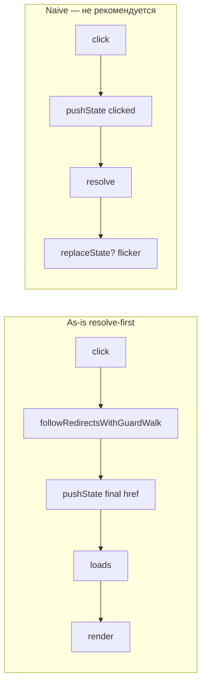

# Optimistic URL — политика history vs view

> **Статус:** <span style="color: #2ea043; font-weight: bold;">✅ resolve-first as-is</span> (сверка с кодом: 2026-07-13).  
> **As-is:** resolve-first optimistic — history **после** guards (post redirect collapse), **до** load/render (`commitHistoryIfNeeded`).  
> **Product policy:** rollback URL при load/render error **не делаем** — URL остаётся на target.  
> **RFC открыт:** demo/integration, stage-until-commit alternative, tiered declarative-only write.  
> **Связь:** [MAIN_PIPELINE.md](../MAIN_PIPELINE.md) · [REDIRECT_CHAIN_COLLAPSE.md](./REDIRECT_CHAIN_COLLAPSE.md) · [OUTLET_AND_RENDER.md](./OUTLET_AND_RENDER.md) · [NAVIGATION_EVENTS.md](./NAVIGATION_EVENTS.md) · [REPLACE_SUPERSEDE_ROLLBACK.md](./REPLACE_SUPERSEDE_ROLLBACK.md)

> **Сверка с кодом:** 2026-07-13 · <span style="color: #2ea043; font-weight: bold;">✅</span> готово · <span style="color: #cf222e; font-weight: bold;">⬜</span> осталось · <span style="color: #bf8700; font-weight: bold;">🟡</span> частично

### Сводка (2026-07-13)

| Область | Статус |
|---------|--------|
| Resolve-first `commitHistoryIfNeeded` (после guards, до load/render) | <span style="color: #2ea043; font-weight: bold;">✅</span> |
| `commitNavigation` без повторного `pushState` | <span style="color: #2ea043; font-weight: bold;">✅</span> |
| `navigation-start` / `navigation` на `<aura-router>` | <span style="color: #2ea043; font-weight: bold;">✅</span> |
| `syncActiveLinks` на history commit (`onNavigationHistoryCommitted`) | <span style="color: #2ea043; font-weight: bold;">✅</span> |
| Unit: порядок pipeline, skip guard, fast/update path | <span style="color: #2ea043; font-weight: bold;">✅</span> |
| Preserve URL при cancel/error после early commit (без rollback) | <span style="color: #2ea043; font-weight: bold;">✅</span> (product policy + test) |
| Rollback URL при load/render error | <span style="color: #2ea043; font-weight: bold;">✅</span> **не делаем** (осознанное решение) |
| Redirect collapse до первого history write | <span style="color: #2ea043; font-weight: bold;">✅</span> |
| Naive click-optimistic (`pushState` по кликнутому href) | <span style="color: #cf222e; font-weight: bold;">⬜</span> · **не рекомендуется** (§ collapse) |
| Stage-until-commit default | <span style="color: #cf222e; font-weight: bold;">⬜</span> |
| Demo shell на `navigation-start` (без click-workaround) | <span style="color: #bf8700; font-weight: bold;">🟡</span> |
| Integration / e2e | <span style="color: #cf222e; font-weight: bold;">⬜</span> |
| [NAVIGATION_EVENTS.md](./NAVIGATION_EVENTS.md) as-is семантика | <span style="color: #cf222e; font-weight: bold;">⬜</span> |
| [POP_NAVIGATION.md](../POP_NAVIGATION.md) asymmetry | <span style="color: #cf222e; font-weight: bold;">⬜</span> |

---

## TL;DR

| Было (до 2026-07) | Сейчас в коде | Осознанно не делаем |
|-------------------|---------------|---------------------|
| `pushState` в `commitNavigation()` **после** render | `commitHistoryIfNeeded()` **после** guards, **до** load/render | rollback URL при load/render error |
| URL отстаёт от DOM на plain-маршрутах | URL опережает load и render на sync-маршрутах | naive click-optimistic (ломает collapse) |
| Shell sync только через `navigation` (post-commit) | `navigation-start` после history commit; nested URL **не** зависит от root-outlet DOM | — |

Текущая политика — **resolve-first optimistic**: первый `pushState` / `replaceState` — по **схлопнутому** `chain.target.href` **после** sync guard-walk, **до** blocking load.

---

## Зачем

При клике по `[data-router-link]` пользователь ожидает, что **адресная строка и активная ссылка** обновятся сразу — как при обычном переходе браузера.

Документ фиксирует:

1. исходную проблему (**render first, history second**);
2. что уже реализовано в движке;
3. две целевые политики (**optimistic URL** vs **stage-until-commit**) и оставшийся RFC.

---

## Историческая проблема (до post-load history commit)

### Симптом (демо и любой shell поверх `location.pathname`)

При in-app переходе на plain-маршруте (без transition):

1. **Контент во viewport уже новый** (страница B, профиль User 2, …).
2. **URL в адресной строке и UI-shell — ещё старый** (страница A, `/features/routing/users/1`, …).
3. Подсветка `aria-current` на nav-ссылках тоже отстаёт.

В demo (`src/examples/demo/main.ts`) это проявлялось как «URL на шаг позади», если синхронизировать UI только через `MutationObserver` + `location.pathname`.

### Корневая причина (legacy)

Старый порядок:

1. **Processor** — guards → load → **`runRender`** (view commit в outlet).
2. **`commitNavigation()`** — `pushState` / `replaceState` + обновление `prev`.

| Шаг | Где | Что видит пользователь |
|-----|-----|------------------------|
| `runRender` → `mountContent(..., strategy: 'replace')` | pipeline | **Новый HTML уже в DOM** |
| `runAfterRender` → `commitStagedView()` | pipeline | Часто no-op (view уже replace) |
| `runAfterRender` → `commitNavigation()` | `aura-routing-engine.ts` | **Только здесь менялся URL** |

Рассинхрон — следствие модели **«render first, history second»** + **`replace` без staging** на enter-маршруте.

### Ловушки для UI-sync

- **`MutationObserver` на outlet** — может опережать или отставать от URL; для nested (User 1→2) root outlet часто **не мутирует** → observer **ненадёжен** для shell.
- **`pushState` не генерирует `popstate`** — слушатель `popstate` alone недостаточен после programmatic navigate.
- **Legacy:** при «render first, history second» nested переход давал рассинхрон и «залипание» URL в shell на observer. **As-is:** `commitHistoryIfNeeded` пишет URL **до** render/update и **не зависит** от root-outlet mutation; shell может синхронизироваться через `location` или **`navigation-start`**.

**Рекомендация для shell:** слушать **`navigation-start`** (URL уже записан) и **`navigation`** (view committed), не DOM mutation.

---

## As-is в коде (2026-07-13)

### Порядок pipeline

```text
followRedirectsWithGuardWalk (coordinator)
  → guards → commitHistoryIfNeeded → loads → render (+ transitions) → commitNavigation (prev, callbacks)
```

| Путь | History commit | View commit |
|------|----------------|-------------|
| Full pipeline | `runCommitHistory()` после guards, до load | `runRender` → `runAfterRender` |
| Fast path (Tier 0) | `commitHistory()` до `runViewCommit` | без guards/load |
| Update shortcut | `runCommitHistory()` до load, до `update` hooks | без render |

Код:

- `AuraRoutingEngine.commitHistoryIfNeeded()` — `pushState` / `replaceState`, idempotent (`historyCommitted`).
- `AuraRoutingEngine.commitNavigation()` — **без** повторного `pushState`: `prev`, scroll, `onNavigationCommitted`.
- `NavigationTransactionPipeline` — `commitHistory` / `runCommitHistory` (private).
- `AuraRouter.onNavigationHistoryCommitted` → `dispatchNavigationStart` + `syncActiveLinks(to.href)`.

### Когда URL **не** пишется

- guard cancel / redirect, leave cancel (**до** `runCommitHistory`);
- `action: pop` или `syncHistory: false`;
- `isSameNavigationTarget(from, to)`.

### Когда URL **уже записан**, но навигация упала

- load error / render error после `commitHistoryIfNeeded` (push/replace): URL **остаётся на target**, rollback **не** выполняется;
- `shouldApplyTerminalHistoryPolicy` → `false` для push/replace при `historyCommitted === true`.

### Terminal policy после early commit

Если `historyCommitted === true` и навигация отменена/упала **до** view commit:

- **`shouldApplyTerminalHistoryPolicy`** → `false` для push/replace;
- URL **остаётся на target**, rollback **не** выполняется (комментарий + тест в `navigateTo` / `commit-history.test.ts`).

Это сознательное product-решение: optimistic URL без rollback; shell/error UI выравнивает UX при необходимости.

### События на `<aura-router>`

| Событие | Когда | Для shell |
|---------|-------|-----------|
| **`navigation-start`** | после `commitHistoryIfNeeded` | URL в `location` + `detail.pathname` — **до render** |
| **`navigation`** | после `commitNavigation` | view committed, scroll/restoration |

Константы: `AURA_ROUTER_NAVIGATION_START`, `AURA_ROUTER_NAVIGATION` в `navigation-events.ts`.

### Nested param change (User 1 → User 2) — <span style="color: #2ea043; font-weight: bold;">✅</span>

Layout `/users` остаётся LCA; меняется только leaf `:id` outlet. History commit идёт по `transaction.href`, **без** мутации root outlet:

| Case | Pipeline | History | Root outlet DOM |
|------|----------|---------|-----------------|
| A — same `viewKey` | `runUpdate` | до load, до `update` | часто без изменений |
| B/C — per-id remount | full | после guards, до load/render nested leaf | без изменений |

Shell с `navigation-start` или `location.pathname` после history commit получает `/users/2` независимо от root-outlet observer.

Unit: `param-change-lifecycle.test.ts`, `navigation-transaction-pipeline-update.test.ts`. Demo/integration — см. §5 и критерии готовности.

### Mount / outlet (без изменений)

| Компонент | Поведение |
|-----------|-----------|
| `OutletStrategy` | `replace` (default) / `stage` (transitions) |
| `useStagedMount` | `true` только при transition policy на route |
| `html-src` routes | full pipeline; DOM на шаге `runRender` |

### Demo (`src/examples/demo/main.ts`) — <span style="color: #bf8700; font-weight: bold;">🟡</span>

| Что | As-is |
|-----|-------|
| `#demo-site-url` | `location.pathname` в `syncSiteUrl()` |
| События router | только `navigation` (`AURA_ROUTER_NAVIGATION`) — **не** `navigation-start` |
| Workaround | `click` capture + `queueMicrotask` / `setTimeout(0)` на `[data-router-link]` — ранний refresh URL |
| `popstate` / `hashchange` | подключены |
| `MutationObserver` | **не** для URL: в `demo-route-facts.ts` / `view-transition.ts` — facts и staged attr |

`<aura-router>` сам обновляет `data-router-active-class` / `aria-current` на **`navigation-start`** (`syncNavState`). Demo shell URL-блок этим не пользуется.

### Тесты

| Файл | Покрытие |
|------|----------|
| `commit-history.test.ts` | engine: push/replace, pop, same target, idempotency; `finalizeCancelled` preserve URL |
| `navigation-transaction-pipeline-history.test.ts` | порядок guard → history → load → render; skip при guard/leave/redirect; load error после history |
| `navigation-transaction-pipeline-fast-path.test.ts` | fast path вызывает `commitHistoryIfNeeded` |
| `navigation-transaction-pipeline-update.test.ts` | update path: history до load, до `update` |
| `param-change-lifecycle.test.ts` | nested User 1→2: layout LCA, update vs full remount |
| `router-active-class.test.ts` | active class / `aria-current` после navigate (через router wiring) |

**Нет** unit-теста на dispatch `navigation-start`; **нет** integration e2e.

---

## Оставшиеся разрывы (почему RFC ещё открыт)

| Сценарий | Поведение as-is | Альтернатива (не выбрана) |
|----------|-----------------|--------------------------|
| Sync route, blocking guard | URL ждёт guard (в т.ч. в resolve walk) | naive click-optimistic |
| Async `load` / `html-src` | URL **уже** на target, load/render догоняют | stage-until-commit |
| Render error после history | URL на target, UI может не совпасть | rollback `replaceState(from)` |
| Load error после history | URL на target, UI на `from` | rollback `replaceState(from)` |
| Cancel после history | URL сохраняется (preserve) | rollback на `from` |
| Redirect chain (A→B→C) | один `commitHistoryIfNeeded` на **финальный** `chain.target.href` | naive click-optimistic |

---

## Redirect chain collapse vs optimistic history

> **Связь:** [REDIRECT_CHAIN_COLLAPSE.md](./REDIRECT_CHAIN_COLLAPSE.md) · `followRedirectsWithGuardWalk` в `navigation-coordinator.ts` · `redirect/README.md`

### Конфликт

**Collapse** и **naive click-optimistic** противоречат друг другу:

| Политика | Что обещает |
|----------|-------------|
| Redirect chain collapse | В history — **один финальный URL**; промежуточные hop'ы (`/dashboard`, `/settings`) **не коммитятся** |
| Naive optimistic | `pushState` **сразу по клику** на запрошенный href — до resolve |

Клик на `/dashboard`, цепочка `dashboard → settings → login`:

```text
navigateTo(/dashboard)
  → followRedirectsWithGuardWalk: /dashboard → /settings → /login   // без history
  → runFullPipeline(from, to=/login)
  → commitHistoryIfNeeded(/login)                                   // один write
```

Модуль `redirect` **не пишет history** — только вычисляет `chain.target`. Coordinator передаёт в pipeline уже **схлопнутый** `found.href`, не href клика. При `viaRedirect` накапливается `replace` (`chain.replace || found.viaRedirect`).

### Что ломает naive `pushState` по клику

| Момент | Naive optimistic | Проблема |
|--------|------------------|----------|
| click | `pushState('/dashboard')` | Пользователь видит URL, куда **не попадёт** |
| resolve завершён | финал `/login` | нужен `replaceState('/login')` — **мигание** адресной строки |
| guard cancel в blocking walk | — | URL уже «врёт», нужен rollback на `from` |
| `viaRedirect` | — | цепочка → `replace`, а не `push` на каждый hop |

**Правило collapse:** промежуточные URL не попадают в history. **Правило naive optimistic:** первый URL = кликнутый. Вместе — несовместимы без костылей.

### As-is порядок (совместим с collapse)

```text
click
  → followRedirectsWithGuardWalk     // declarative redirect + leave/guard walk
  → coordinator.run(full pipeline)   // href = chain.target.href
  → guards? (skip если skipBlockingPhases)
  → commitHistoryIfNeeded            // один push/replace на финал
  → loads
  → render
```

History commit **после** redirect collapse и sync guard-walk, **до** load — collapse и guard-walk уже отработали; промежуточные hop'ы не попадают в history.

### Рекомендуемые варианты для optimistic RFC

#### 1. Resolve-first optimistic — <span style="color: #2ea043; font-weight: bold;">✅ as-is</span>

Первый meaningful `pushState` — по **схлопнутому** href, **после** sync guard-walk, **до** load:

```text
click
  → followRedirectsWithGuardWalk (blocking only, без load/render)
  → commitHistoryIfNeeded(chain.target.href)
  → loads → render
```

| Критерий | Оценка |
|----------|--------|
| Один финальный URL в history; `viaRedirect` / cycle / depth — до write | <span style="color: #2ea043; font-weight: bold;">✅</span> |
| Совместимо с текущим collapse и coordinator | <span style="color: #2ea043; font-weight: bold;">✅</span> |
| URL ждёт sync guard-walk (без прыжков на промежуточных redirect) | <span style="color: #2ea043; font-weight: bold;">✅</span> |
| Rollback при load/render error | <span style="color: #2ea043; font-weight: bold;">✅</span> **не делаем** (product policy) |

#### 2. Двухуровневая политика

```text
click
  → followDeclarativeRedirects (sync, без hooks)
  → если финал известен без guard-walk → pushState(final)
  → иначе → followRedirectsWithGuardWalk → pushState(final)
  → loads → render
```

Declarative-only цепочки (`redirect` attr) — URL почти сразу. Guard-redirect — после blocking walk. Product contract: «мгновенный URL только когда redirect детерминирован sync-слоем».

#### 3. Provisional URL + replace — <span style="color: #cf222e; font-weight: bold;">не default</span>

```text
click → pushState(clicked)
resolve → replaceState(final) если final ≠ clicked
cancel  → replaceState(from)
```

Технически возможно, но на цепочках — мигание и рассинхрон с политикой collapse. Только как явный opt-in.

#### 4. Intent URL ≠ history URL

| Слой | Когда обновляется | Источник |
|------|-------------------|----------|
| **Intent** (shell pending, optional) | сразу по клику | запрошенный href |
| **History** (`location`) | после resolve | `chain.target.href` |

Collapse не страдает, shell может быть быстрым, но два источника правды до commit — нужна семантика в `navigation-start` / pending UI.

### Async redirect (выход из collapse)

Если hook сделал `await`, потом redirect — collapse **не продолжается** (legacy `navigateTo` / новый run). При раннем history commit нужны supersede + rollback/preserve — отдельный RFC (см. TODO §3).

### Практическое правило для implementers

> **Первый `pushState` / `replaceState` использует `chain.target.href`, а не href клика.**

Guard-walk — часть pre-commit resolve, не отдельная «вторая навигация». Naive «URL по клику» с collapse не совмещаются; целевой optimistic — **resolve-first**.



---

## Две политики (выбор архитектуры)

### A. Optimistic URL (resolve-first) — <span style="color: #2ea043; font-weight: bold;">✅ as-is</span>

**Идея:** address bar обновляется **после** redirect collapse и sync guard-walk, **до** load и view commit.

**As-is (рекомендуемый resolve-first):**

```text
click → resolve redirect chain + guard-walk → pushState(final) → loads → render
```

| Плюсы | Минусы |
|-------|--------|
| URL и nav-shell опережают load/render | При ошибке load/render URL уже на target — **rollback не делаем** |
| Один финальный URL при redirect chain | Back во время in-flight — особая политика (pop) |
| Нет мигания на промежуточных redirect hop'ах | Два источника правды, пока render не завершён |
| Не нужен observer на DOM | URL ждёт sync guard-walk (задуманно) |

---

### B. Stage-until-commit (atomic commit) — **не выбрано**

**Идея:** новый view **не показывается**, пока transaction не успешна; URL и visible view меняются **в одной точке**.

```text
click → guards → load → render to stage (hidden) → commit stage + pushState
```

| Плюсы | Минусы |
|-------|--------|
| URL и видимый контент **никогда не расходятся** | Старый экран дольше при async `html-src` |
| Ошибка render — старый UI + старый URL | Loading template по умолчанию |
| Механизм есть для transitions (`stage` + `commitStage`) | Смена default mount policy |

---

## Предлагаемые шаги (TODO)

### 1. RFC: default navigation UX policy

- <span style="color: #cf222e; font-weight: bold;">⬜</span> Зафиксировать product default: **optimistic** vs **stage-until-commit** vs **config flag** (`<aura-router history="optimistic|deferred">`).
- <span style="color: #cf222e; font-weight: bold;">⬜</span> Описать matrix: sync content, async `html-src`, nested `:id` update, pop navigation.

### 2. Resolve-first history (as-is)

- <span style="color: #2ea043; font-weight: bold;">✅</span> `commitHistoryIfNeeded` после guards, до load/render (`push` / `replace`, `syncHistory: true`).
- <span style="color: #2ea043; font-weight: bold;">✅</span> Разделить address-bar write и `commitNavigation` (prev + callbacks).
- <span style="color: #2ea043; font-weight: bold;">✅</span> Unit-тесты: порядок pipeline, skip при guard failure, load error после history, update/fast path.
- <span style="color: #2ea043; font-weight: bold;">✅</span> Preserve URL при `finalizeCancelled` / load+render error после early commit (product policy + tests).
- <span style="color: #2ea043; font-weight: bold;">✅</span> Rollback URL при load/render error — **не делаем** (осознанное решение).
- <span style="color: #cf222e; font-weight: bold;">⬜</span> Integration: click → URL до load/render; failed load после history → URL на target; render fail → согласованность URL/UI.
- <span style="color: #cf222e; font-weight: bold;">⬜</span> Обновить [POP_NAVIGATION.md](../POP_NAVIGATION.md) — asymmetry с optimistic push.

### 3. Дополнительные улучшения (опционально)

- <span style="color: #cf222e; font-weight: bold;">⬜</span> Tiered policy — sync `followDeclarativeRedirects` до первого write, guard-walk — отложенный write (§ двухуровневая политика).
- <span style="color: #cf222e; font-weight: bold;">⬜</span> Back during in-flight; async-redirect после early commit — supersede + preserve policy.

### 4. Stage-until-commit (альтернатива §B)

- <span style="color: #cf222e; font-weight: bold;">⬜</span> Default `useStagedMount: true` для enter routes (или router-level flag).
- <span style="color: #cf222e; font-weight: bold;">⬜</span> Loading template / inherited `loading-template` для async routes.
- <span style="color: #cf222e; font-weight: bold;">⬜</span> Документировать в [OUTLET_AND_RENDER.md](./OUTLET_AND_RENDER.md).

### 5. Navigation events + demo

- <span style="color: #2ea043; font-weight: bold;">✅</span> `navigation-start` после resolve-first history commit (`dispatchNavigationStart`).
- <span style="color: #2ea043; font-weight: bold;">✅</span> `navigation` после view commit (`dispatchNavigationCommitted`).
- <span style="color: #2ea043; font-weight: bold;">✅</span> `syncActiveLinks` на history commit (router; `router-active-class.test.ts`).
- <span style="color: #cf222e; font-weight: bold;">⬜</span> Обновить [NAVIGATION_EVENTS.md](./NAVIGATION_EVENTS.md) — as-is семантика `navigation-start`.
- <span style="color: #bf8700; font-weight: bold;">🟡</span> Demo: shell на `navigation-start` + `navigation` + `popstate`; убрать click-`queueMicrotask` workaround для URL.
- <span style="color: #2ea043; font-weight: bold;">✅</span> Синхронизировать [MAIN_PIPELINE.md](../MAIN_PIPELINE.md) (resolve-first history до load/render).

---

## Критерии готовности

### Engine

- <span style="color: #2ea043; font-weight: bold;">✅</span> Plain sync route: URL обновляется **до** `runLoads` и `runRender` (resolve-first history).
- <span style="color: #2ea043; font-weight: bold;">✅</span> Guard cancel / redirect: URL **не** меняется.
- <span style="color: #2ea043; font-weight: bold;">✅</span> Load error после history: URL **остаётся** на target (без rollback).
- <span style="color: #2ea043; font-weight: bold;">✅</span> User 1 → User 2 (nested): URL и `navigation-start` **не зависят** от root-outlet mutation.
- <span style="color: #2ea043; font-weight: bold;">✅</span> Cancel / error после early history: URL **сохраняется** на target (preserve policy).
- <span style="color: #2ea043; font-weight: bold;">✅</span> Rollback URL при load/render error — **не делаем** (product decision).

### Demo + integration

- <span style="color: #bf8700; font-weight: bold;">🟡</span> Shell на `navigation-start` + `navigation` + `popstate` (сейчас: `navigation` + `popstate` + click-workaround; без `navigation-start`).
- <span style="color: #bf8700; font-weight: bold;">🟡</span> Первый клик: demo shell частично согласован (microtask refresh URL; не engine events).
- <span style="color: #cf222e; font-weight: bold;">⬜</span> User 1 → User 2 (nested): e2e — shell обновляется при отсутствии root-outlet mutation.
- <span style="color: #cf222e; font-weight: bold;">⬜</span> Integration tests + пункт в demo «Роутинг».

---

## Ссылки на код

- History commit: `src/modules/aura-routing-engine/core/aura-routing-engine.ts` — `commitHistoryIfNeeded`, `commitNavigation`, `shouldApplyTerminalHistoryPolicy`, `navigateTo` (комментарий § порядок history).
- Redirect collapse: `src/modules/aura-routing-engine/core/redirect/redirect-resolver.ts` — `followRedirectsWithGuardWalk`; `navigation-coordinator.ts` — resolve → `run({ href: found.href })`.
- Pipeline: `src/modules/aura-routing-engine/core/navigation/navigation-transaction-pipeline.ts` — `commitHistory`, `runCommitHistory`, `runRender`, `runAfterRender`, `runUpdate`, `runFastPipeline`.
- History policy: `src/modules/aura-routing-engine/core/history/history-policy.ts`.
- Mount: `src/modules/aura-route/core/view/outlet.ts` — `resolveStageStrategy`, `mountContent`.
- Router events: `src/modules/aura-router/core/navigation-events.ts` — `dispatchNavigationStart`, `dispatchNavigationCommitted`.
- Router wiring: `src/modules/aura-router/core/aura-router.ts` — `onNavigationHistoryCommitted`, `onNavigationCommitted`, `syncNavState`.
- Demo shell: `src/examples/demo/main.ts` (URL sync + events).
- Demo observers (не URL): `src/examples/demo/demo-route-facts.ts`, `src/examples/demo/hooks/view-transition.ts`.
- Tests: `commit-history.test.ts`, `navigation-transaction-pipeline-history.test.ts`, `navigation-transaction-pipeline-update.test.ts`, `param-change-lifecycle.test.ts`, `router-active-class.test.ts`.
