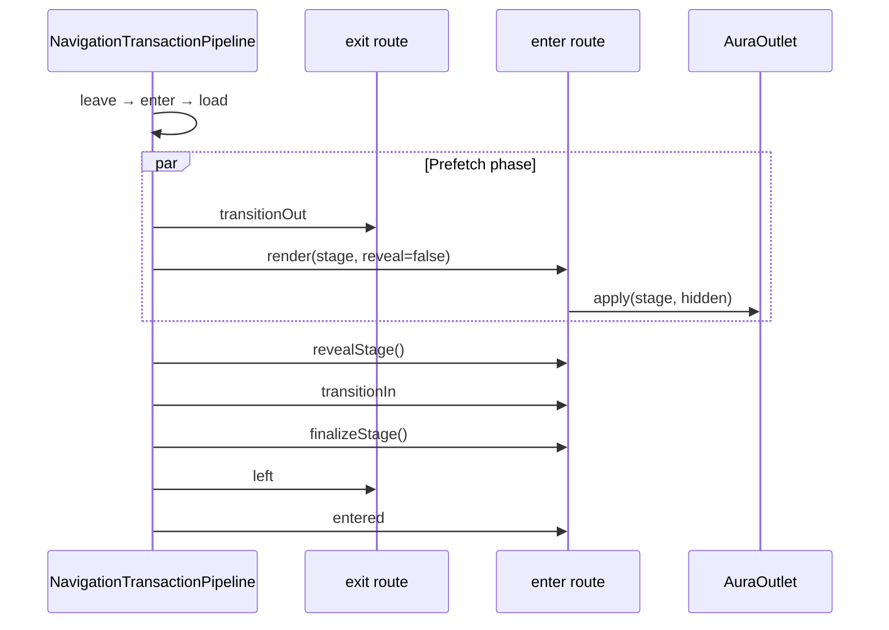

# TODO: `out-in-prefetch` — параллельный render при строгом out-in

> **Статус:** план / архитектура (не реализовано)  
> **Связь:** [OUTLET_AND_RENDER.md](./OUTLET_AND_RENDER.md) · [MAIN_PIPELINE.md](../MAIN_PIPELINE.md) · [PHASE_NAMING.md](../PHASE_NAMING.md)  
> **Контекст:** обсуждение transition policy (2026-06); классический `out-in` блокирует `render` до завершения `transitionOut`.

---

## Проблема

Текущий `out-in` в `NavigationTransactionPipeline`:

```text
transitionOut → render → transitionIn → finalizeStage → left → entered
```

Визуально корректно (как Vue `<Transition mode="out-in">`), но **view commit входящего роута ждёт** окончания exit-анимации. При тяжёлом `render` (большой template, `component-src`, cold cache) задержка суммируется:

```text
T_until_in ≈ T_out + T_render
```

`load` уже идёт до transition-фаз, но `render()` в `AuraRouteViewController` всё равно async (`resolvePayload`, mount, layout).

---

## Решение (TL;DR)

Новая политика **`out-in-prefetch`** — визуально как `out-in`, по времени ближе к `parallel`:

```text
transitionOut ║ render(stage, hidden)  →  reveal  →  transitionIn  →  finalizeStage  →  left  →  entered
              └──── max(T_out, T_render) ────┘
```

| | Видимый overlap | Render vs Out | Когда |
|--|-----------------|---------------|-------|
| `out-in` (сейчас) | нет | последовательно | лёгкий render, простой wait |
| **`out-in-prefetch`** | нет | параллельно, incoming скрыт | строгий out-in + тяжёлый render |
| `parallel` (default) | да (crossfade) | render first, anim ‖ | типичный SPA |
| `in-out` | да (новый поверх) | render → in → out | спец. UX |

**Классический `out-in` не меняем** — семантика как у Vue `mode="wait"`.

### Ожидаемый выигрыш

```text
Экономия до transitionIn = min(T_out, T_render)
```

Ощутимо при `T_render` ≥ ~100 ms и `T_out` сопоставим (150–500 ms). При кэше и `T_render` < 50 ms выигрыш незаметен — тогда достаточно `parallel` или агрессивного `load`.

---

## API

### Router

```html
<aura-router data-transition="out-in-prefetch">
  <aura-outlet></aura-outlet>
  ...
</aura-router>
```

Существующие значения без изменений: `parallel` (default), `out-in`, `in-out`.

### Per-route override

Наследование как у `data-transition` сейчас:

```html
<aura-route path="/heavy" data-transition="out-in-prefetch" ...>
```

Принудительный instant replace на route: `data-transition=""`.

---

## Pipeline

### `policy.ts`

```typescript
export type TransitionPolicy =
  | 'out-in'
  | 'out-in-prefetch'   // NEW
  | 'in-out'
  | 'parallel';

export function parseTransitionPolicy(value: string | null | undefined): TransitionPolicy {
  if (value === 'out-in-prefetch') return 'out-in-prefetch';
  // ...
}
```

### `processor-pipeline.ts` — новая ветка

```typescript
async runRenderWithTransition(ctx: PipelineContext): Promise<PipelineOutcome> {
  const { transitionPolicy } = ctx.transaction;

  switch (transitionPolicy) {
    case 'parallel':
      return this.runParallelRenderWithTransition(ctx);

    case 'out-in-prefetch':
      return this.runOutInPrefetchRenderWithTransition(ctx);

    case 'out-in':
      return this.runUntilTerminal([
        (c) => this.runExitTransition(c),
        (c) => this.runRender(c),
        (c) => this.runEnterTransition(c),
      ], ctx);

    case 'in-out':
      // без изменений
  }
}
```

### Ядро `runOutInPrefetchRenderWithTransition`

```typescript
/**
 * out-in-prefetch:
 *   parallel(transitionOut, render-hidden) → reveal → transitionIn
 *   gate перед transitionIn: обе ветки settled
 */
private async runOutInPrefetchRenderWithTransition(
  ctx: PipelineContext,
): Promise<PipelineOutcome> {
  const [exitOutcome, renderOutcome] = await Promise.all([
    this.runExitTransition(ctx),
    this.runRender(ctx, { stageMount: true, reveal: false }),
  ]);

  const terminal = firstTerminalOutcome(exitOutcome, renderOutcome);
  if (terminal) return terminal;

  this.revealEnterStages(ctx);
  return this.runEnterTransition(ctx);
}

private revealEnterStages(ctx: PipelineContext): void {
  for (const matched of ctx.transaction.plan.enterRoutes) {
    matched.route.revealStage?.();
  }
}
```

`runAfterRender` **без изменений**: `finalizeStage` → `left` → `entered`.

### Диаграмма



---

## View layer

### `RouteRenderOptions`

```typescript
export type RouteRenderOptions = {
  signal?: AbortSignal;
  stageMount?: boolean;
  /** mount в stage, но не показывать до reveal (out-in-prefetch) */
  reveal?: boolean; // default: true
};
```

### `ViewMountContext` / `outlet-adapter.ts`

Проброс `reveal` в `mountRoute` → `outlet.apply`.  
`resolveMountStrategy`: при `out-in-prefetch` — `stage`, если outlet занят (как у `parallel`).

### `AuraOutlet.apply`

```typescript
export type OutletReplaceOptions = {
  strategy?: 'replace' | 'stage';
  key?: string;
  signal?: AbortSignal;
  reveal?: boolean; // default: true
};
```

В `applyStage`:

```typescript
if (!reveal) {
  root.setAttribute('data-aura-staged-hidden', '');
  root.setAttribute('aria-hidden', 'true');
  root.inert = true;
}
```

### `AuraRouteViewController`

```typescript
revealStage(): void {
  const root = this.activeHandle?.viewRoot;
  if (!root) return;
  root.removeAttribute('data-aura-staged-hidden');
  root.removeAttribute('aria-hidden');
  root.inert = false;
}
```

`finalizeStage()` — как сейчас (`commitStage` после `transitionIn`).

### `RouteInstance` (aura-route-hooks)

```typescript
interface RouteInstance {
  // ...
  revealStage?(): void;
  getViewRoot?(): HTMLElement | null; // опционально для hooks
}
```

### `RouteLifecycleContext` — опционально

```typescript
/** true когда incoming смонтирован, но ещё скрыт (только out-in-prefetch) */
prefetched?: boolean;
```

---

## CSS-контракт (документация)

```css
[data-aura-view-root][data-aura-staged-hidden] {
  visibility: hidden;
  pointer-events: none;
}

/* опционально для тяжёлых страниц */
[data-aura-view-root][data-aura-staged-hidden] {
  content-visibility: hidden;
}
```

`visibility: hidden` предпочтительнее `opacity: 0` — layout готов, paint не виден.

---

## Hook-контракт

| Фаза | Параллельность | Видимость | DOM target |
|------|----------------|-----------|------------|
| `transitionOut` | ‖ render | только старый view | active root |
| `render` | ‖ transitionOut | старый view | staged incoming (hidden) |
| `reveal` | — | снятие hidden | engine |
| `transitionIn` | после gate | новый view | staged incoming |
| `finalizeStage` | — | новый active | engine |
| `left` | — | только новый | unmount старого |

Post-commit правила для `transitionOut` / `transitionIn` — как сейчас (`LIFECYCLE_STEPS`).

### Пример hook

```typescript
defineRouteHook({
  name: 'fade-in',
  version: '1.0.0',
  fn: async (ctx) => {
    if (ctx.phase !== 'transitionIn') return;
    const root = ctx.route.getViewRoot?.();
    if (!root) return;
    await root.animate(
      [{ opacity: 0 }, { opacity: 1 }],
      { duration: 200, fill: 'forwards' },
    ).finished;
  },
});
```

---

## Edge cases

| Ситуация | Поведение |
|----------|-----------|
| `render` быстрее `transitionOut` | ждём out; incoming уже в DOM → `transitionIn` |
| `transitionOut` быстрее `render` | после out старый ещё виден; incoming скрыт до render |
| `render` error | `cancelStage`, `left` на exit, `error`, `viewCommitted: false` |
| `transitionOut` error | `cancelStage` incoming, error, active = старый |
| job superseded | `cancelStage` + abort, `cancelled` |
| cold enter (`from = null`) | нет exit; render без hidden / reveal сразу |
| `reenter` | shortcut без изменений |
| nested routes | reveal / finalize per enter route (как в pipeline сейчас) |
| `loadingTemplate` | skeleton тоже hidden в stage |

---

## Альтернатива без новой политики

Паттерн на уровне приложения (без ядра):

```text
data-transition="parallel"
+ CSS на [data-aura-staged-hidden]
+ координация transitionIn с transitionOut в hook (animationend / Promise)
```

Минусы: нет `prefetched` в ctx, race при быстрых кликах, дублирование логики.

---

## Файлы (чеклист)

```text
aura-routing-engine/
  core/transition/policy.ts
  core/navigation/navigation-transaction-pipeline.ts
  test/processor/processor-pipeline.test.ts

aura-outlet/
  core/aura-outlet.ts
  test/aura-outlet.test.ts

aura-route/
  core/view/view-controller.types.ts
  core/view/view-controller.ts
  core/view/outlet-adapter.ts
  core/aura-route.ts
  test/view/view-flow.test.ts

aura-route-hooks/
  core/types.ts

aura-router/
  core/aura-router.ts              # комментарий к attr

docs/
  PHASE_NAMING.md                  # строка в таблице policy
  OUTLET_AND_RENDER.md             # ссылка в секции «Анимация»
```

---

## Тесты (минимум)

```typescript
describe('out-in-prefetch', () => {
  it('runs transitionOut and render concurrently before transitionIn');
  it('keeps staged root hidden until reveal');
  it('cancels staged mount when exit transition fails');
  it('cancels staged mount when render fails');
  it('reveals only after both branches complete');
});
```

---

## Порядок внедрения

```text
1. Outlet: reveal option + data-aura-staged-hidden + тесты
2. ViewController: revealStage() + проброс reveal
3. Pipeline: out-in-prefetch branch + тесты порядка
4. Docs + пример hooks (fade-in / fade-out)
5. Не трогать классический out-in
```

**Оценка:** ~150–250 строк prod + ~100–150 строк тестов.

---

## Связанные политики (сводка)

```text
out-in:           [out] ──► [render] ──► [in]
out-in-prefetch:  [out ║ render(hidden)] ──► reveal ──► [in]
parallel:         [render] ──► [out ‖ in] ──► commit
in-out:           [render] ──► [in] ──► [out]
```
