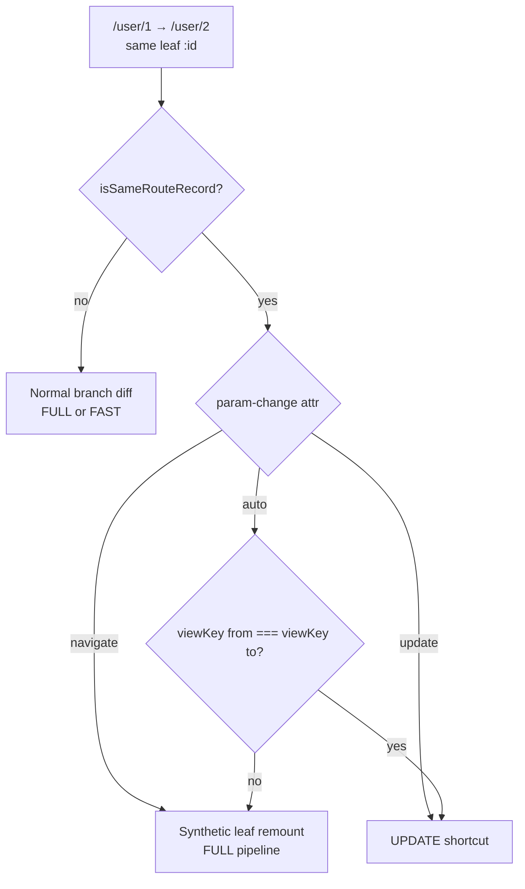

# Param-change policy — view-key inference + override

> **Статус:** draft · **частично в коде** (`param-change`, view-key inference)  
> **Заменяет:** безусловный `update: true` при `isSameRouteRecord` (as-is)  
> **Default:** inference по `viewKey` (атрибут не задаётся)  
> **Связь:** [HOOKS.md § update shortcut](../HOOKS.md#update-shortcut--query-hash-и-params) · [LIFECYCLE_PLACEMENT.md](../LIFECYCLE_PLACEMENT.md) · [MAIN_PIPELINE.md](../MAIN_PIPELINE.md) · [route-tree/README.md](../../src/modules/aura-routing-engine/core/route-tree/README.md)

---

## 1. Проблема

Один маршрут `path="user/:id"` в реальности бывает в двух режимах:

| Режим | View | При `/user/1` → `/user/2` |
|-------|------|---------------------------|
| **Client-driven** | один shell / один WC | patch data, **без remount** |
| **Server-driven** | свой HTML на каждый id | fetch + **remount** |

As-is engine всегда выбирает update shortcut (`buildTransitionPlan` → `isSameRouteRecord` → `update: true` → `runUpdate()`). Нужно разделение **без лишнего API**, с редким override.

---

## 2. Решение

```text
resolveParamChangePolicy(from, to, route):

  if route.paramChange === 'navigate'  → NAVIGATE
  if route.paramChange === 'update'    → UPDATE
  else (auto):
    if viewKey(from) === viewKey(to)  → UPDATE
    if viewKey(from) !== viewKey(to)  → NAVIGATE
```

**viewKey** = `resolveViewRef(view.content, params)` → `{type}:{resolvedRef}`

Пример: `html-src:content/user/2.html`

### Правило для автора (DX)

```text
Один view на все id?           → ничего не указывать, update + update-хук
Свой html на каждый id?         → view="…/{{id}}.html", auto → full pipeline
Один html, но каждый раз fetch → param-change="navigate"
```

---

## 3. Pipeline vocabulary

| Pipeline | Entry | Фазы |
|----------|-------|------|
| **UPDATE** | `plan.update === true` | `load?` → `update?` → history commit |
| **FULL** | `plan.update === false`, synthetic leaf remount | `leave` → `guard` → `load?` → `render` → promote → `transition-*` → `unmount` → `ready` |
| **FAST** | flat trivial swap | render → promote → `ready` (не про param-change) |

- `load?` — только если на route объявлен `load="…"`.
- `update?` — только если `update="…"`.

Layout-parent при NAVIGATE внутри nested tree **не** входит в exit/enter (LCA = parent).

---

## 4. viewKey — что сравниваем

```typescript
// view-identity-key.ts (концепт)
function viewIdentityKey(routeInfo: MatchedRouteInfo, view: ViewAttrDescriptor): string {
  const ref = resolveViewRef(view.content, routeInfo.params); // users/{{id}}.html → users/2.html
  return `${view.type}:${ref}`;
}
```

| Навигация | view attr | viewKey(from) | viewKey(to) | auto |
|-----------|-----------|---------------|-------------|------|
| `/user/1` → `/user/2` | `html-src::partials/user-shell.html` | `html-src:partials/user-shell.html` | **тот же** | **UPDATE** |
| `/user/1` → `/user/2` | `html-src::content/user/{{id}}.html` | `…user/1.html` | `…user/2.html` | **NAVIGATE** |
| `/user/1` → `/user/2` | `component-src::user-profile` | `component-src:user-profile` | **тот же** | **UPDATE** |

Query-only (`/user/1?tab=a` → `/user/1?tab=b`): pathname + leaf тот же, viewKey тот же → **UPDATE** (dedupe noop если нет update-hooks — как as-is).

---

## 5. Таблицы фаз: три кейса

Условие: **тот же leaf** `user/:id`, переход **`/user/1` → `/user/2`**, nested layout `users` (если есть).

Обозначения: **✅** выполняется · **—** пропуск · **⚠** только если attr/hook объявлен

---

### A. Auto → UPDATE (default SPA)

```html
<aura-route path="user/:id"
            view="html-src::partials/user-shell.html"
            load="fetch-user"
            update="apply-user" />
```

**viewKey:** одинаковый  
**Policy:** auto → **UPDATE**

#### Exit-ветка (старый id=1)

| Фаза | Статус | Комментарий |
|------|--------|-------------|
| `leave` | — | exitRoutes пуст |
| `transition-out` | — | |
| `unmount` | — | view остаётся в DOM |

#### Enter / shortcut

| Фаза | Статус | Комментарий |
|------|--------|-------------|
| `guard` | — | blocking pre-render не запускается |
| `load` | ⚠ ✅ | DataGraph: `fetch-user` с `to.params.id = 2` |
| `render` | — | **shell не перезагружается** |
| `transition-in` | — | |
| `update` | ⚠ ✅ | `apply-user`: patch DOM / WC из `ctx.to.params` + `ctx.data` |
| `ready` | — | post-commit enter не идёт |
| history commit | ✅ | URL → `/user/2` |

#### Nested layout `users`

| Узел | При UPDATE |
|------|------------|
| layout `users` | не трогается |
| leaf `:id` | тот же DOM instance, patch через update |

---

### B. Auto → NAVIGATE (SSG / HTML per id)

```html
<aura-route path="user/:id"
            view="html-src::content/user/{{id}}.html"
            ready="analytics" />
```

**viewKey:** `html-src:content/user/1.html` ≠ `html-src:content/user/2.html`  
**Policy:** auto → **NAVIGATE** (synthetic leaf remount)

#### Plan shape

```text
exitRoutes:  [leaf@id=1]
enterRoutes: [leaf@id=2]
lca:         layout users (или null если flat)
update:      false
```

#### Exit-ветка

| Фаза | Статус | Комментарий |
|------|--------|-------------|
| `leave` | ⚠ ✅ | если `leave="…"` на leaf или inherit |
| `transition-out` | ⚠ ✅ | |
| `unmount` | ✅ | teardown leaf@1, outlet очищается |

#### Enter-ветка

| Фаза | Статус | Комментарий |
|------|--------|-------------|
| `guard` | ⚠ ✅ | |
| `load` | — | нет `load` — данные не через DataGraph |
| `render` | ✅ | view loader: fetch `content/user/2.html`, mount |
| `transition-in` | ⚠ ✅ | |
| `update` | — | shortcut не используется |
| `ready` | ⚠ ✅ | `analytics` |
| history commit | ✅ | |

#### Layout

| Узел | При NAVIGATE |
|------|--------------|
| layout `users` | **остаётся** (LCA) |
| leaf | unmount@1 → render@2 |

#### View cache key

```text
/user/1 | html-src:content/user/1.html
/user/2 | html-src:content/user/2.html
```

Разные ключи → корректный fetch, без «протекания» HTML от user/1.

---

### C. Override → NAVIGATE (same file, force re-fetch)

```html
<aura-route path="user/:id"
            param-change="navigate"
            view="html-src::partials/user-shell.html"
            ready="track-page" />
```

**viewKey:** одинаковый для 1 и 2  
**Policy:** **`param-change="navigate"`** → NAVIGATE (escape hatch)

#### Зачем

- partial на CDN без client patch;
- каждый id = «новая страница» с тем же шаблоном;
- A/B или edge-версия shell должна подтягиваться заново.

#### Plan shape

Как в **B**, хотя ref один:

```text
exitRoutes:  [leaf@id=1]
enterRoutes: [leaf@id=2]
update:      false
```

#### Отличия от A

| Фаза | A (auto update) | C (override navigate) |
|------|-----------------|------------------------|
| `load` | ⚠ DataGraph | ⚠ только если объявлен |
| `render` | — | ✅ **re-fetch** `user-shell.html` |
| `update` | ⚠ patch | — |
| `unmount` | — | ✅ |
| `ready` | — | ⚠ `track-page` |

#### Cache note

При одинаковом ref, но разном pathname, ключ cache **должен** включать pathname (или policy bypass), иначе re-fetch не произойдёт:

```text
/user/1 | html-src:partials/user-shell.html
/user/2 | html-src:partials/user-shell.html   ← другой cache slot
```

---

## 6. Дополнительные кейсы

### Query-only: `/user/1?tab=a` → `/user/1?tab=b`

| | |
|-|-|
| leaf | тот же |
| viewKey | тот же |
| auto | **UPDATE** |
| `render` | — |
| dedupe | если `isSameNavigationTarget` и нет `update`-hooks → noop (as-is) |

### Override `param-change="update"` при разных html (экзотика)

```html
<aura-route path="user/:id" param-change="update"
            view="html-src::content/user/{{id}}.html" />
```

| | |
|-|-|
| viewKey | разный, но override |
| pipeline | **UPDATE** — без render, риск stale/wrong HTML |
| use case | prefetch всех html, patch в update-hook (осознанно) |

Dev-warn: `param-change="update"` + diff viewKey → «stale HTML risk».

---

## 7. Сводная матрица

| Кейс | viewKey | `param-change` | Pipeline | render | update | ready |
|------|---------|----------------|----------|--------|--------|-------|
| **A** SPA shell | same | auto | UPDATE | — | ⚠ | — |
| **B** HTML per id | diff | auto | FULL | ✅ | — | ⚠ |
| **C** same file, re-fetch | same | **navigate** | FULL | ✅ | — | ⚠ |
| rare force patch | diff | **update** | UPDATE | — | ⚠ | — |
| query only | same | auto | UPDATE | — | ⚠ | — |

---

## 8. API surface (минимальный)

```html
<!-- 95% — ничего не пишем -->
<aura-route path="user/:id" view="..." />

<!-- escape hatch: same view key, нужен remount + re-fetch -->
<aura-route path="user/:id" param-change="navigate" view="html-src::partials/user-shell.html" />

<!-- site-wide static MPA (опционально) -->
<aura-router param-change="navigate"> … </aura-router>
```

| Attr | Values | Default |
|------|--------|---------|
| `param-change` | `update` \| `navigate` | *(не задан — inference)* |
| inherit | `<aura-router>` → children | да |

---

## 9. Организация кода

```text
aura-route/
  attr/param-change-attr-parser.ts    update | navigate

aura-routing-engine/
  route-tree/resolved-view.ts         attachResolvedView, viewKey на match
  route-tree/transition-plan.ts     resolveParamChangeMode (inline)
  content/cache/data-key.ts         resolvedView.ref fallback
```

### Поток в `buildTransitionPlan` (псевдокод)

```typescript
if (!isSameRouteRecord(from, to)) {
  return normalBranchDiff(from, to);
}

const mode = resolveParamChangePolicy(from, to, getEnterRoute(to));

if (mode === 'update') {
  return { exitRoutes: [], enterRoutes: [toLeaf], lca: toLeaf, update: true };
}

// mode === 'navigate' — synthetic leaf remount
const chain = getActiveChain(from);
const parentIndex = chain.length - 2;
return {
  exitRoutes: [fromLeaf],
  enterRoutes: [toLeaf],
  lca: parentIndex >= 0 ? chain[parentIndex]! : null,
  update: false,
};
```

`NavigationTransaction.run()` не меняется — только shape `TransitionMap`.

---

## 10. Decision flow



---

## 11. Acceptance criteria

- [ ] `/user/1` → `/user/2` + static shell → UPDATE, render 0 раз, update-hook 1 раз
- [ ] `/user/1` → `/user/2` + `{{id}}.html` → FULL, render 1 раз, unmount 1 раз
- [ ] same shell + `param-change="navigate"` → FULL, refetch shell
- [ ] nested layout не unmount при NAVIGATE leaf
- [ ] view cache keys согласованы с viewKey
- [ ] dev warn: `param-change="update"` + diff viewKey → stale HTML risk

---

## 12. Non-goals (v1)

- `shouldRevalidate(from, to)` hook — отдельная фаза DataGraph ([DATAGRAPH_GAPS.md](./DATAGRAPH_GAPS.md))
- auto-detect только по `hasAsyncContent` без viewKey
- `navigate({ force: true })` на imperative API

---

## Changelog

| Дата | Изменение |
|------|-----------|
| 2026-07-05 | Initial RFC: view-key inference + `param-change` override |
