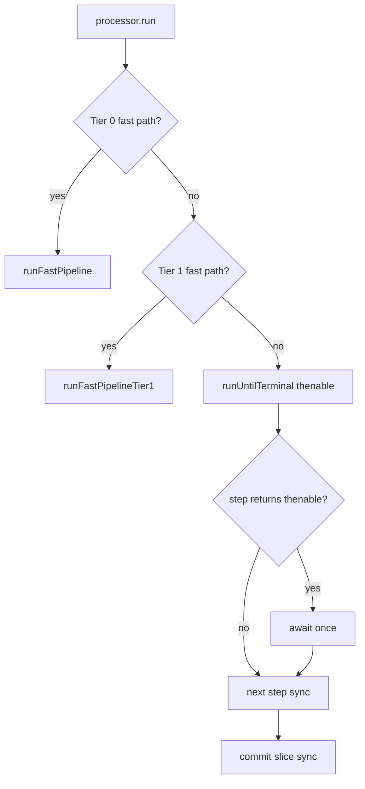

# TODO: Pipeline — sync/async шаги, fast path, step runner

> **Статус:** план / архитектура (не реализовано)  
> **Связь:** оптимизация `NavigationTransactionPipeline` без смены семантики cancel/supersede.  
> **См. также:** [NAVIGATION_RUN_MANAGER.md](./NAVIGATION_RUN_MANAGER.md), [REDIRECT_CHAIN_COLLAPSE.md](./REDIRECT_CHAIN_COLLAPSE.md) (`runBlockingOnly`), fast path as-is: `canUseFastPath / runFastPipeline`

---

## Контекст

Pipeline — набор шагов (`guards → loads → renderWithTransition → after`). Часть шагов **по природе** async (hooks с `await`, fetch, content loader), часть **в конкретном run** может отработать sync (cache hit, sync guard, keep-alive view).

As-is все шаги типизированы как `Promise`:

```ts
type PipelineStep = (ctx: PipelineContext) => Promise<PipelineOutcome>;
```

`runUntilTerminal` всегда `await step()` — даже когда тело шага завершилось синхронно.

**Вопрос:** нужно ли pipeline «знать» sync vs async и вызывать шаги по-разному?  
**Ответ:** статические метки на шагах — **хрупко**; runtime thenable + fast path tiers — **практично**. Generator/trampoline — **overkill на текущем этапе** (см. §5).

---

## Проблема microtask gap — что реально, а что нет

| Утверждение | Факт |
|-------------|------|
| Между крупными шагами есть microtask ticks | Да, при `await` на Promise |
| Это заметно бьёт по performance | Обычно **нет** — DOM/fetch/анимации на порядки дороже |
| Gap ломает атомарность **всего** run | **Нет** — supersede **использует** окна между await |
| Gap ломает атомарность **commit** | Только если между view commit и history commit вставить await |

### Commit slice (invariant — не ломать)

```text
commitEnterViews()   // sync
commitGate()         // sync, сразу после — без await между
```

Сейчас в `runAfterRender` это соблюдено. Для transition-пути gap **между** `markViewStaged` и `commitGate` **ожидаем** — там transition hooks; supersede + `revertInFlightView`.

---

## Почему не статические метки «шаг sync / async»

| Причина | Пример |
|---------|--------|
| User hooks непредсказуемы | `enter` → `false` sync или `await fetch()` + redirect |
| Cache меняет runtime | load «async по типу», cache hit → без сети |
| `render()` async в API | `tryCacheRestore` sync внутри, снаружи `async renderPass` |
| Transitions | hooks могут ждать animation end |

Метка на шаге pipeline ≠ поведение **конкретного** прогона.

---

## Рекомендуемый подход

### 1. Thenable-aware runner (фаза 1)

Шаг возвращает sync или Promise; runner различает в runtime:

```ts
type StepResult = PipelineOutcome | Promise<PipelineOutcome>;

function isThenable<T>(value: T | Promise<T>): value is Promise<T> {
  return value != null && typeof (value as Promise<T>).then === 'function';
}

async function runUntilTerminal(steps: PipelineStep[], ctx: PipelineContext) {
  for (const step of steps) {
    let outcome = step(ctx);
    if (isThenable(outcome)) outcome = await outcome;
    if (outcome) return outcome;
  }
  return null;
}
```

**Польза:** sync-return без лишнего tick; минимальный diff; hooks по-прежнему могут async.

**Не даёт:** полностью sync pipeline — outer `run()` остаётся `async`.

### 2. Fast path tiers (фаза 2) — основной perf-рычаг

As-is **Tier 0** (`canUseFastPath`): flat nav без hooks, transitions, async content.

Расширение:

| Tier | Условие | Поведение |
|------|---------|-----------|
| **0** | как сейчас | bypass lifecycle pipeline |
| **1** | load cache hit + sync blocking hooks + render cache/keep-alive | укороченный run до commit slice |
| **2** | полный pipeline | default |

Критерий: **«этот run гарантированно без await до commit?»** — проверка перед стартом, не enum на каждый шаг.

**Load cache hit ≠ skip pipeline:** `onLoad` и DataGraph policy могут требовать прогона даже при cache hit (as-is комментарий в `data-graph.ts`).

### 3. `runBlockingOnly` mode (фаза 3, с redirect collapse)

Отдельный режим pipeline без render — см. [REDIRECT_CHAIN_COLLAPSE.md](./REDIRECT_CHAIN_COLLAPSE.md). Не смешивать с sync-оптимизацией full run.

---

## As-is sync-ветки (уже есть)

| Место | Sync-поведение |
|-------|----------------|
| `view-controller.tryCacheRestore` | mount из cache без fetch |
| `commitEnterViews` + `commitGate` | sync commit slice |
| `runFastPipeline` | bypass guards/loads/transitions для Tier 0 |

---

## Generator / trampoline стиль

### Идея

Вместо `async/await` на весь pipeline — **явная state machine**: каждый шаг возвращает «продолжить sync» или «приостановиться на Promise».

```ts
type StepRunResult<T> =
  | { kind: 'done'; value: T }
  | { kind: 'suspend'; resume: Promise<StepRunResult<T>> };

type TrampolineStep = (ctx: PipelineContext) => StepRunResult<PipelineOutcome>;

async function driveTrampoline(steps: TrampolineStep[], ctx: PipelineContext) {
  let i = 0;
  let current: StepRunResult<PipelineOutcome> | undefined;

  while (i < steps.length) {
    let result = steps[i]!(ctx);

    // sync chain: пока шаги возвращают done без suspend — без microtask
    while (result.kind === 'done') {
      if (result.value) return result.value;
      i++;
      if (i >= steps.length) return null;
      result = steps[i]!(ctx);
    }

    // одна точка suspend — один await на «пачку» sync шагов
    result = await result.resume;
    if (result.kind === 'done' && result.value) return result.value;
    i++;
  }

  return null;
}
```

**Generator-вариант** — то же самое через `function*` и `yield Promise`:

```ts
function* navigationPipeline(ctx) {
  yield runGuards(ctx);           // yield Promise только если guards async
  yield runLoads(ctx);
  yield runRenderWithTransition(ctx);
  return runAfterRenderSyncPart(ctx);
}

async function drive(gen) {
  let step = gen.next();
  while (!step.done) {
    step = gen.next(await step.value);
  }
  return step.value;
}
```

Trampoline / generator дают:

- **пакетный sync-run** — несколько шагов подряд без tick, пока не встретили Promise;
- явную точку **suspend/resume**;
- единый цикл отмены вокруг «одной приостановки».

### Почему сейчас overkill

| # | Причина |
|---|---------|
| 1 | **Сложность >> выигрыш** — microtasks между 4–6 macro-шагами дешевле одного `querySelector` / patch DOM |
| 2 | **User hooks ломают sync-цепочки** — после guards почти всегда suspend; trampoline схлопнет 1–2 шага, не весь pipeline |
| 3 | **Уже есть Tier 0 fast path** — тривиальный случай уже обходит pipeline; trampoline дублировал бы цель |
| 4 | **Cancel/supersede отлажен на async model** — `job.signal`, `isJobActive`, `withCancelledTransactionScope` / NavigationRun; trampoline добавляет второй способ «где мы в pipeline» |
| 5 | **Отладка и stack traces** — generator/trampoline хуже читаются в DevTools, чем linear `async run()` |
| 6 | **TypeScript ergonomics** — typed generator pipeline с terminal outcomes, redirect, parallel transitions (`Promise.all`) — много boilerplate |
| 7 | **Parallel render+transition** — `runParallelRenderWithTransition` уже ветвится; trampoline не упрощает, а разветвляет driver |

### Когда trampoline мог бы стать оправданным

- профилирование покажет microtask churn как top bottleneck (маловероятно для router);
- понадобится **единый драйвер** для sync resolve loop + full run + prefetch с общим suspend/resume;
- incremental render / streaming commit с **многошаговым sync batch** между yield.

До таких требований — **thenable runner + fast path tiers** достаточно.

---

## Шаги внедрения

### Фаза 1 — Thenable runner

1. `StepResult = PipelineOutcome | Promise<PipelineOutcome>`.
2. `isThenable` + обновить `runUntilTerminal`.
3. По возможности — lifecycle `runPhaseStep` возвращает sync при sync hooks.
4. **Критерий:** тесты pipeline без регрессий; sync guard cancel без лишних ticks (опционально assert через instrumentation).

**Файлы:**

| Файл | Изменение |
|------|-----------|
| `core/navigation/navigation-transaction-pipeline.ts` | thenable `runUntilTerminal` |
| `core/processor/step-runner.ts` | опционально вынести runner |

### Фаза 2 — Fast path Tier 1

1. `canUseFastPathTier1(plan, ctx, dataGraph, routes)` — cache peek + hook capability flags.
2. `runFastPipelineTier1` или расширить `runFastPipeline`.
3. **Критерий:** keep-alive / load cache hit nav быстрее full pipeline, semantics 1:1.

**Файлы:**

| Файл | Изменение |
|------|-----------|
| `core/route-tree/can-use-fast-path.ts` | Tier 1 predicate |
| `core/navigation/…/runFastPipeline` | Tier 1 body |
| `core/data-graph/data-graph.ts` | опционально `peekCached(key)` |

### Фаза 3 — Документировать invariants

1. Commit slice invariant в `processor-pipeline` JSDoc или ARCHITECTURE.
2. Cross-link из [NAVIGATION_RUN_MANAGER.md](./NAVIGATION_RUN_MANAGER.md).

### Не делать (пока)

- Enum `sync | async` на `MAIN_PIPELINE`.
- Generator/trampoline driver без perf evidence.
- Skip `onLoad` на cache hit без явного product decision.

---

## Схема решений



---

## Итог

- **Статические sync/async метки на шагах** — не primary design (hooks и cache runtime-dependent).
- **Thenable runner** — да, дёшево, полезно.
- **Fast path tiers** — главный perf-рычаг, уже начат Tier 0.
- **Generator/trampoline** — мощный паттерн для «длинных sync-цепочек с редким suspend»; для Aura router с 4–6 macro-шагами и user async hooks — **overkill** до появления профиля или streaming/incremental commit.
- **Атомарность** — беречь **commit slice**, не пытаться убрать все gaps между фазами (supersede).

---

## Связанные документы

- [NAVIGATION_RUN_MANAGER.md](./NAVIGATION_RUN_MANAGER.md) — run lifecycle, rollback
- [REDIRECT_CHAIN_COLLAPSE.md](./REDIRECT_CHAIN_COLLAPSE.md) — blocking-only pipeline mode
- [INCREMENTAL_RENDER.md](./INCREMENTAL_RENDER.md) — возможный future consumer trampoline-подхода
