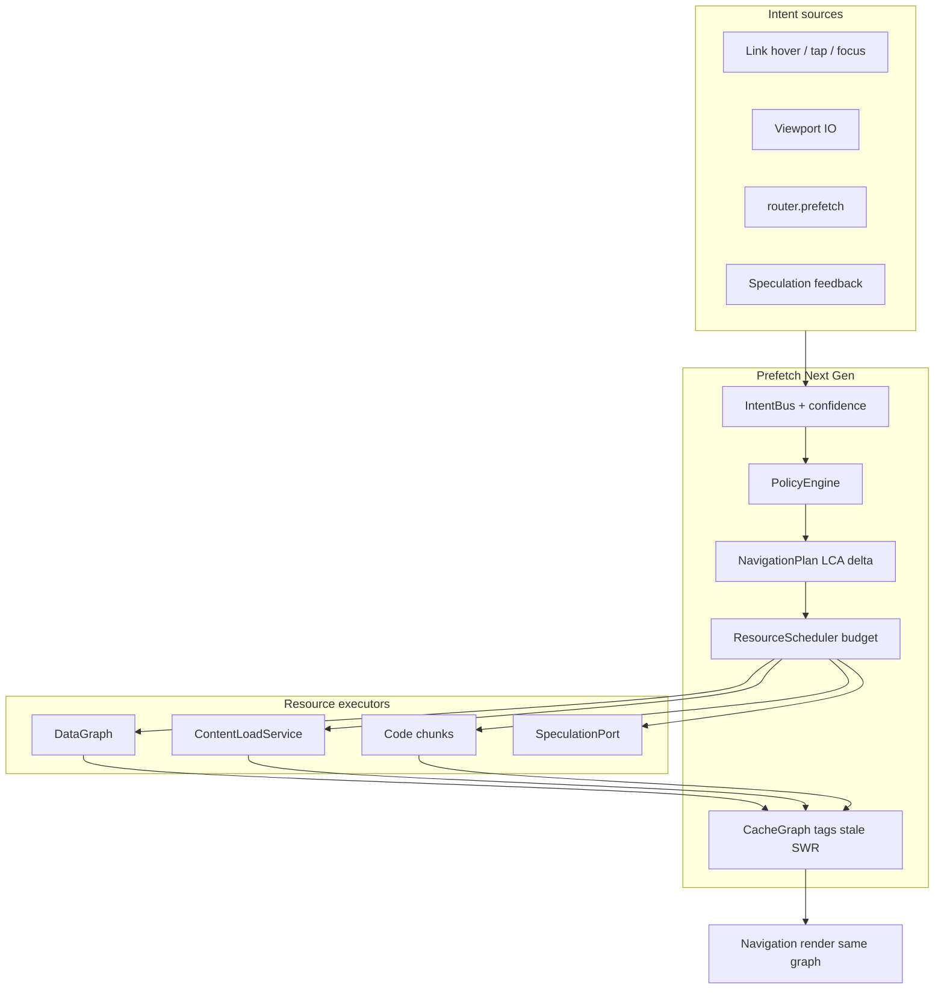

# TODO: Prefetch следующего поколения (ISNR)

> **Статус:** дизайн / стратегия (не реализовано)  
> **Дата:** 2026-06-27 00:31  
> **Контекст:** отчёт по задаче «оценить мировые роутеры по prefetch → спроектировать next gen с заделом на будущее»  
> **Связь:** [../PREFETCH_ARCHITECTURE.md](../PREFETCH_ARCHITECTURE.md) · [../comparison/PREFETCH_INDUSTRY_COMPARISON.md](../comparison/PREFETCH_INDUSTRY_COMPARISON.md) · [LINK_DRIVEN_PRELOAD.md](./LINK_DRIVEN_PRELOAD.md) · [DATAGRAPH.md](./DATAGRAPH.md)

---

## TL;DR

**Следующее поколение prefetch — не «быстрее hover», а intent-driven планировщик ресурсов навигации** с LCA-delta, единым cache graph, confidence/budget и native speculation — при **одном pipeline** с render.

У Aura уже есть правильный скелет (`PrefetchPipeline`, executors, plan resolver, **~8/10** по оркестрации). Эволюция, не переписывание:

1. **Phase A** — parity с лидерами (DataGraph, viewport, SWR, v1 cache)
2. **Phase B** — LCA-delta + confidence scheduler + network budget
3. **Phase C** — unified Resource Graph, Speculation Rules, tag invalidation, devtools

Условное имя целевой модели: **Intent-Scheduled Navigation Resources (ISNR)**.  
**Почему graph:** §[3. Зачем unified graph](#3-зачем-unified-graph-почему-а-не-только-как).  
**Что не требует ISNR:** §[3.1. ISNR vs v1 — честная граница](#31-isnr-vs-v1--честная-граница).  
**Уже есть в `aura-cache-store`:** §[3.2. Что покрывает AuraResolvableCache](#32-что-покрывает-auraresolvablecache).

**Ближайший спринт (мин. архитектура, не полный ISNR):** §[Foundation sprint](#foundation-sprint-ближайший-спринт).

**Что делать первым после parity:** §[Топ-3 приоритета (SSR)](#топ-3-приоритета-ssr-post-parity).

---

## Foundation sprint (ближайший спринт)

> **Решение:** полный ISNR (Phase C) **не строим сейчас**; **тонкий orchestration-слой закладываем** — иначе при появлении DataGraph придётся ломать executors.  
> **Storage не трогаем:** `AuraResolvableCache` + `DataCache` уже покрывают кеш; graph — позже, по триггерам из §[3.1](#31-isnr-vs-v1--честная-граница).

### Цель спринта

Зафиксировать форму API и сразу получить **document-first moat** (LCA-delta + tap-gate), без Phase C.

```text
intent → PrefetchPlan (+ enterRoutes)
      → resolveResources(plan, ctx)     // stub: только content[]
      → executors[kind].run(...)
      → DataCache.resolve()        // AuraResolvableCache, prefetch = render
```

### Делать в спринте

| # | Задача | Где | Зачем |
|---|--------|-----|-------|
| F1 | `enterRoutes` в `PrefetchPlan` | `prefetch/plan.ts`, `types.ts` | `currentHref` + `buildTransitionPlan`; симметрия с navigation |
| F2 | LCA-delta в prefetch | `ContentPrefetchExecutor` | `prefetchBranch(enterRoutes)` вместо `plan.chain` |
| F3 | `confidence` в `PrefetchRunContext` | `prefetch/types.ts` | default `1.0`; задел под tiers |
| F4 | Tap-gate для `html-src` | `resolveResources` или content executor | `mode: intent` / низкий confidence → skip content; `tap` / `manual` → fetch |
| F5 | `resolveResources()` stub | `prefetch/resolve-resources.ts` (новый) | возвращает `{ kind: 'content', targets: enterRoutes }`; executors вызывают его, не loader напрямую |
| F6 | Проверить shared cache | `ContentLoadService` | prefetch и render — один `DataCache`, без отдельного prefetch-store |
| F7 | Тесты | `test/prefetch/` | nested sibling: только leaf partial; intent не грузит html-src; tap грузит; click = cache hit |

```typescript
// F5 — черновик API (content-only stub)
type NavigationResource = { kind: 'content' | 'data' | 'chunk'; targets: MatchedRouteInfo[] };

function resolveResources(
  plan: PrefetchPlan,
  ctx: PrefetchRunContext,
): NavigationResource[] {
  const routes = plan.enterRoutes;
  const resources: NavigationResource[] = [];

  const allowContent =
    ctx.confidence >= 0.8 || ctx.mode === 'tap' || ctx.mode === 'manual';

  if (allowContent && routes.length) {
    resources.push({ kind: 'content', targets: routes });
  }
  // kind: 'data' — добавить, когда DataGraph (Phase A), без смены сигнатуры

  return resources;
}
```

### Сознательно не в этом спринте

| Не делать | Почему |
|-----------|--------|
| Cache Graph / `TagIndex` | `aura-cache-store` + dispatcher позже |
| Полный confidence scheduler | достаточно F3 + F4 |
| `NetworkBudget` | hygiene, не moat |
| `DataPrefetchExecutor` реальный | пока редкий `load` — Phase A |
| `CodePrefetchExecutor` | редкий `component-src` |
| Speculation Rules executor | после partial + policy |
| Devtools panel | события можно позже |

### Порядок внутри спринта

```text
F1 enterRoutes → F5 resolveResources stub → F2 LCA в executor
→ F3 confidence → F4 tap-gate → F6 audit cache → F7 tests
```

### Критерий готовности

- [ ] `/settings/profile` → `/settings/security`: prefetch **только** `security.html`, не layout/parent
- [ ] hover (`intent`) на `html-src` ссылке: **нет** fetch partial
- [ ] `pointerdown` / `tap` / `router.prefetch()`: partial в cache
- [ ] click после tap-prefetch: **0** duplicate fetch в network
- [ ] `resolveResources()` — единая точка; добавление `kind: 'data'` не ломает executors

### Связь с Phase A / B / C

| Foundation | Переносит вперёд | Остаётся в roadmap |
|------------|------------------|-------------------|
| F1, F2 | B1 LCA-delta | — |
| F3, F4 | часть B2 confidence | полный scheduler, viewport tiers |
| F5 | заготовка C1 | graph, tags, readiness `N/M` |
| F6 | A2 shared content load | — |
| — | — | A1 DataGraph, A3 viewport, A4 SWR navigation |

---

## Топ-3 приоритета (SSR, post-parity)

> **Предпосылка:** DataGraph, viewport, SWR, v1 cache — **считаем реализованными** (parity ~7.5/10).  
> **Контекст:** Aura — SSR / MPA→SPA / `html-src` partials; малоизвестный продукт → нужен **измеримый moat**, не ещё три parity-фичи.

Цель: вырваться вперёд по prefetch относительно TanStack / Remix / SvelteKit — у них сильный **data-first** preload; у Aura — **document-first** под server HTML fragments.

### Позиционирование (одна фраза)

> Aura prefetch греет не «route loader», а **SSR-дельту**: JSON на слабом намерении, **server HTML partial** на почти-клике — только узлы `enterRoutes`.

---

### 1. LCA-delta prefetch — только `enterRoutes`, leaf `html-src`

| | Конкуренты | Aura (цель) |
|--|------------|-------------|
| Unit | часто вся ветка root → leaf | **только delta** после LCA |
| SSR | loaders / RSC | **html-src partial** leaf |

```text
/settings/profile → /settings/security
  не грузим: layout template, parent route
  грузим:   security.html (html-src) + load hooks leaf
```

**Почему первым**

- Синергия с engine: `buildTransitionPlan` / `enterRoutes` уже есть — prefetch симметричен navigation.
- Измеримо: −30%+ bytes на nested hover (метрика из §10).
- Демо: соседние nested-ссылки на SSR-сайте — один маленький partial, не весь route.
- React-роутеры оптимизируют JSON; **server HTML fragment** — редкость.

**Roadmap:** B1 + §nested [CONTENT_CACHE.md](./CONTENT_CACHE.md).

```typescript
// вместо prefetchBranch(getActiveChain(leaf))
prefetchEnterRoutes(lcaDelta(plan, currentChain));
```

---

### 2. Confidence-tiered prefetch — data на hover, document на tap

| Confidence | Сигнал | Что prefetch |
|------------|--------|----------------|
| ~0.3 | hover (intent) | только **data** (DataGraph) |
| ~0.5 | viewport | data |
| ~0.8 | tap / pointerdown | data + **html-src partial** |
| 1.0 | `router.prefetch()` | full delta + chunks |

**Почему вторым**

- На SSR **HTML partial тяжелее JSON** — не качаем `users.html` на каждый mouseover.
- На tap partial уже в cache → клик ≈ patch, не cold fetch.
- SvelteKit/TanStack: разные **триггеры**, но часто **один объём** работы; tiering по **типу ресурса** — дифференциатор.

**Маркетинг:** *«на hover — данные, server HTML — только когда вы почти кликнули»*.

**Roadmap:** B2 — confidence в `PrefetchRunStore` / scheduler → фильтр `ResourceSet` по `kind`.

---

### 3. Unified `resolveResources()` — document-first resource graph

Единый API, чтобы #1 и #2 не разъехались между executors:

```text
plan (LCA delta)
  → resources[
       { kind: data,    priority: high @ confidence ≥ 0.3 },
       { kind: content, ref: html-src, priority: high @ confidence ≥ 0.8 },
       { kind: chunk,   deps: [content], priority: medium },
     ]
  → один CacheGraph (tags, in-flight, stale)
```

**Порядок deps как у SSR:** template (local, skip prefetch) → **server partial** → data → hydration chunks.

```typescript
resolveResources(plan, { purpose: 'prefetch' | 'render', confidence, signal })
```

**Почему третьим**

- TanStack/Remix: graph по сути data-first; HTML — побочный продукт компонента.
- Aura: **document-first** — prefetch зеркалит выдачу сервера (fragment + hydrate).
- Prefetch и navigation — **один** resolver; tiered + LCA-delta без drift.

**Roadmap:** C1 (первый пункт Phase C, до Speculation Rules и devtools).

---

### Порядок работ

```text
1. LCA-delta (prefetchEnterRoutes)   → быстрый выигрыш, демо
2. Confidence tiers                  → уникальная SSR-политика
3. resolveResources (document-first) → платформа, не костыли
```

После топ-3: Speculation Rules на `html-src` URL, devtools с «document partial hit» — история, которую data-first роутеры не копируют без смены модели.

### Сознательно не в топ-3

| Фича | Почему позже |
|------|----------------|
| Speculation Rules | после graph + partial; иначе дубль JS-fetch |
| Devtools | adoption, не leap |
| Network budget | hygiene |
| `patchRouteContent` | edge case |
| `out-in-prefetch` | transition; умножает эффект после топ-3 | [OUT_IN_PREFETCH.md](./OUT_IN_PREFETCH.md) |

---

## 1. Как оценивать мировые роутеры

Не бинарно «есть preload / нет», а **единая scorecard** по 12 осям:

| # | Ось | Вопрос |
|---|-----|--------|
| 1 | **Intent model** | hover / viewport / tap / pointerdown / manual / programmatic |
| 2 | **Unit of work** | route / segment / loader / resource / RSC flight |
| 3 | **Granularity** | leaf only vs full branch vs partial tree |
| 4 | **Cache identity** | ключ: href, pattern, loader deps, tags |
| 5 | **Coherence** | prefetch → navigation = тот же cache graph? |
| 6 | **Cancellation** | abort on leave, priority preemption |
| 7 | **Stale policy** | TTL, SWR, background revalidate, `invalidate()` |
| 8 | **Network awareness** | save-data, effectiveType, concurrency budget |
| 9 | **Code + data** | chunks, loaders, HTML, server components |
| 10 | **Native browser** | Speculation Rules, prefetch/prerender hints |
| 11 | **Observability** | devtools, metrics, skip reasons |
| 12 | **Safety** | auth routes, POST-only, side-effect loaders |

### Обязательный бенчмарк

| Роутер | Эталон |
|--------|--------|
| **TanStack Router** | `preloadRoute`, staleTime/gcTime, loaderDeps, invalidation |
| **Remix / React Router 7** | single-flight loaders, revalidation, fetcher model |
| **SvelteKit** | `preload-data` / `preload-code`, tap vs hover, save-data |
| **Next.js App Router** | segment-level prefetch, RSC payload, partial static |
| **Nuxt** | payload cache + component preload |
| **Astro / client islands** | лёгкий prefetch view, не всего app shell |

### Вывод аудита индустрии

Индустрия сошлась на **link-intent + router-owned cache**, но раскололась на:

| Парадигма | Примеры | Фокус prefetch |
|-----------|---------|----------------|
| **data-first** | TanStack, Remix, SvelteKit | JSON / loaders |
| **document-first** | Next RSC | сегменты, flight |
| **HTML-first** | Aura | content loaders, DOM templates |

Next gen для Aura — **unified resource graph** с intent-driven scheduling, не «ещё один hover».

Текущая оценка Aura: [PREFETCH_INDUSTRY_COMPARISON.md](../comparison/PREFETCH_INDUSTRY_COMPARISON.md) — **6.5/10** overall.

---

## 2. Общий потолок у конкурентов (возможность для next gen)

Почти везде сегодня:

1. **Prefetch = отдельный путь** от navigation (два pipeline, риск drift).
2. **Нет единого бюджета сети** — prefetch конкурирует с текущей страницей.
3. **Слабая приоритизация** — все ссылки в viewport равны.
4. **Мало «confidence»** — hover ≠ tap ≠ keyboard; редко dwell time.
5. **Branch = всё или ничего** — whole chain, не delta от LCA.
6. **Speculation Rules** — bolt-on, не в cache graph.
7. **Нет cross-layer dedupe** — chunk + data + HTML отдельно.
8. **Auth / side-effects** — loaders с cookies prefetch'ят «наугад».

**Задел на будущее:** prefetch как **планировщик ресурсов навигации**, а не «вызов loader раньше».

---

## 3. Зачем unified graph (почему, а не только как)

Graph — не «одна корзина для всего», а **общий реестр ресурсов навигации** с едиными правилами: ключ, in-flight, stale, abort, tags. Prefetch и navigation читают **один и тот же реестр**, а не три несвязанных кеша.

### Проблема раздельных слоёв (сейчас и у конкурентов)

```text
prefetch:   DataCache + ContentPrefetchExecutor
            DataGraph?    + DataPrefetchExecutor (stub)
navigation: RouteContentLoader + load hooks + ViewCache
```

| Симптом | Причина |
|---------|---------|
| Hover был, клик всё равно ждёт | prefetch согрел HTML, **data** cold |
| Сбросили user в DataGraph, UI старый | Data cache не знает про tag `user:42` |
| Два fetch одного URL | content и chunk грузят один `component-src` параллельно |
| Непонятно «насколько готов клик» | три независимых слоя, нет одной метрики |

**Graph решает coherence** — prefetch и click смотрят на одни и те же записи. Это и есть смысл «next gen» относительно v1 link-driven с silo-executors.

### Три типа ресурсов в Aura (термины)

В документе «chunks» и «data loaders» — не абстракция, а конкретные механизмы фреймворка:

#### 1. Content (view / разметка)

**Что:** то, что задаётся attrs `source` + `data-content` / `layout`.

```html
<aura-route path="/users" source="html-src" data-content="users.html">
<aura-route path="/shell" layout="app-layout">
```

**Кто грузит:** `ContentLoadService` → `ContentResolver` → loaders (`html`, `html-src`, `template`, `component`, `component-src`).  
**Кеш сегодня:** `DataCache` ([CONTENT_CACHE.md](./CONTENT_CACHE.md)).

Это **не** JSON и не бизнес-логика — это HTML-строка, template или custom element для outlet.

#### 2. Data loaders (`load` hooks)

**Что:** attr `load` на route — имена зарегистрированных hooks (как `enter`, но для данных).

```html
<aura-route path="/users/:id" load="fetch-user,fetch-permissions">
```

**Когда:** фаза `runLoads` в navigation pipeline — **после guards, до render** ([DATAGRAPH.md](./DATAGRAPH.md)).  
**Зачем:** fetch JSON, permissions, props для view — логика приложения, не разметка.

**Сегодня:** hooks вызываются без engine-level cache; **планируется** DataGraph + `DataPrefetchExecutor`.

В TanStack/Remix это аналог `loader()` / `load` function — отдельный слой от component HTML.

#### 3. Chunks (JS-модули)

**Что:** файлы JavaScript, которые подтягивает bundler при dynamic import.

```html
<aura-route path="/f" source="component-src" data-content="modules/test-element">
```

→ `import('./modules/test-element.js')` → Vite/webpack отдаёт **chunk** (`.js` файл).

**Зачем в graph:** prefetch может **прогреть сеть и module graph** до клика, чтобы `define()` / registry custom element уже отработали. Это не то же самое, что HTML в `DataCache` — chunk живёт в loader cache браузера / import map.

**Cross-layer dedupe:** если и `component-src` loader, и отдельный prefetch chunk тянут один URL — graph держит **один in-flight** на ключ `chunk:modules/test-element`.

### Invalidate «один раз» — не значит «всегда всё вместе»

**Важное уточнение:** unified graph **не требует** сбрасывать HTML каждый раз при смене data. Data действительно меняется чаще — и это как раз аргумент **за** graph с **гранулярными tags**, а не за три отдельных мира.

| Подход | Поведение |
|--------|-----------|
| **Раздельные кеши (сейчас)** | `invalidate user` в DataGraph → content/html остаётся → UI показывает старый view с новыми данными **или** наоборот |
| **Graph + tags** | `invalidate({ tag: 'user:42' })` → только записи с этим tag |
| **Graph + tags** | `invalidate({ tag: 'content:/about' })` → только static HTML, data не трогаем |

Пример:

```typescript
// POST /api/user/42 — обновили профиль
router.invalidate({ tag: 'user:42' });        // data hooks, зависящие от user
// layout и static html-src /users/list.html — НЕ сбрасываются

// деплой новой версии users.html
router.invalidate({ tag: 'content:/users' }); // только content resources
```

**Единый graph нужен не для «одной кнопки сбросить всё»**, а чтобы:

1. **Один API** `invalidate` понимал связи (опционально tag cascade по deps).
2. **Один in-flight** — не дублировать fetch между слоями.
3. **Одна метрика готовности** — «2/3 resources fresh для /users/42».

Если приложение **только static HTML** без `load` hooks — graph избыточен, достаточно `DataCache` (см. §«Когда graph не нужен»).

### Что даёт graph (кратко)

| Выгода | Без graph | С graph |
|--------|-----------|---------|
| Click после hover | частичный hit | все нужные resource kinds учтены |
| Invalidate | 2–3 места | tags, выборочно |
| Tiered prefetch | full branch HTML | data-only на слабом confidence |
| Devtools | три лога | `2/3 resources ready` |
| LCA-delta | риск drift | тот же plan, что navigation |

### Когда graph не нужен

- Только `source="html"` / `template`, нет `load`, нет `component-src`.
- Нет nested prefetch веток, нет invalidate по сущностям.
- MPA с редкими client navigations.

Для Aura с [DATAGRAPH.md](./DATAGRAPH.md) + content loaders graph — **следующий логичный шаг**, не обязательный для MVP. Подробнее: §[3.1. ISNR vs v1](#31-isnr-vs-v1--честная-граница).

### Поколения (почему next gen)

| Поколение | Модель |
|-----------|--------|
| v0 | route-driven `preload` attr |
| v1 (Aura сейчас) | link intent → silo executors (content / data stub) |
| v2 (ISNR) | intent → **navigation resources** → scheduler + shared graph |

v1 уже есть у TanStack/SvelteKit для **data**. v2 — coherence **data + HTML + chunks** в одном плане; у большинства фреймворков это ещё не доведено.

---

## 3.1. ISNR vs v1 — честная граница

> **Контекст:** профиль Aura — в основном `html-src`, реже `component-src`, `load` ещё реже.  
> **Вопрос:** нужен ли полный ISNR (Phase C) на старте, или достаточно эволюции v1 executors?

**Короткий ответ:** большинство performance-выигрышей **не требуют** unified graph. ISNR — **страховка от drift** при росте `load` + chunks + invalidate, не единственный способ их получить.

### Что не требует ISNR (достаточно v1 executors / loaders)

| Фича | Где реализовать | Примечание |
|------|-----------------|------------|
| **LCA-delta** (`enterRoutes`) | `ContentPrefetchExecutor` или `PrefetchPlanResolver` + `buildTransitionPlan` | `currentHref` уже в `PrefetchConfig`; graph не нужен |
| **Параллель data ‖ content** | `PrefetchPipeline.runExecutors` | Уже `Promise.all(executors)`; второй executor — когда появится DataGraph |
| **Network budget** | `PrefetchRunStore` / `PrefetchPipelineDeps` | Лимитер поверх executors, без graph |
| **Tag invalidation** | 3 кеша + `router.invalidate({ tag })` dispatcher | `DataCache`, `dataGraph`, chunk registry — отдельные `invalidateTag()` |
| **Cross-layer dedupe** | общий fetch registry (опционально) | Внутри слоя — `AuraResolvableCache` + `Singleflight`; см. §[3.2](#32-что-покрывает-auraresolvablecache) |
| **Confidence → skip html-src на hover** | policy в executor или `PrefetchRunContext.confidence` | Для html-src-only: hover = skip, tap = partial |
| **Shared prefetch/render cache** | `ContentLoadService` + `DataCache` | Уже заложено; anti-pattern — отдельный prefetch-cache |

```typescript
// LCA-delta — локальный фикс, не Phase C
const { enterRoutes } = buildTransitionPlan(current, target);
await content.prefetchBranch(enterRoutes, signal);

// Параллель — уже в pipeline
await Promise.all(executors.map((e) => e.run(plan, ctx)));
```

### Что оправдывает unified graph (Phase C)

| Фича | Почему без graph больно / неудобно |
|------|-------------------------------------|
| **`resolveResources()` один контракт** | prefetch и navigation не разъезжаются при добавлении kind'ов |
| **Централизованная confidence-policy** | один фильтр `ResourceSet` по kind, не три копии в executors |
| **Метрика готовности** | `2/3 resources ready` — один счётчик, не три silo-лога |
| **Tag cascade / deps** | `invalidate user:42` → связанные content entries; вручную — хрупко |
| **Cross-layer dedupe (mixed app)** | один URL из content + chunk executor — один in-flight на graph key |
| **Observability + devtools** | единая модель skip/hit/bytes по resource id |

Graph — не про «иначе нельзя», а про **один язык** когда активны **два и более** слоя (content + data + chunks) и нужна coherence + invalidate.

### Performance: scheduler vs текущий подход

| | v1 + фиксы (LCA, tiers) | ISNR |
|--|-------------------------|------|
| CPU на intent | минимум | +десятки–сотни µs (confidence, filter) — **шум** vs HTTP |
| Сеть nested | хуже при full `plan.chain` | лучше при LCA-delta — **но LCA без graph** |
| Клик, html-src-only | ≈ при shared `DataCache` | ≈ |
| Клик, частый `load` | хуже: navigation `loads → render` seq | лучше: prefetch греет оба **параллельно заранее** — **и без graph, если 2 executor'а** |

**Scheduler не замедлит роутер ощутимо.** Медленнее станет только плохая политика (очередь на `pointerdown`, лишние sync-проходы в resolver).

**Главный performance-win сейчас (html-src профиль):**

1. LCA-delta — меньше bytes на nested.
2. Shared Data cache — prefetch → click без duplicate fetch.
3. Confidence gate — не тянуть partial на mouseover.

Параллель data ‖ content — главный win **когда `load` частый**; для html-src-only почти не играет роли.

### Дёшевый фундамент сейчас vs дорогой Phase C

**Заложить на старте (мало кода, не переписывать API потом):**

```text
PrefetchPlan.enterRoutes     // или вычислять из currentHref + buildTransitionPlan
PrefetchRunContext.confidence  // default 1.0
resolveResources()           // thin wrapper: пока только content[], позже data/chunk
executors по kind            // как сейчас; не отдельный prefetch-cache
```

**Отложить до роста `load` / `component-src` / entity-invalidate:**

```text
полный CacheGraph + tag cascade
CodePrefetchExecutor
cross-layer dedupe registry
devtools «N/M resources ready»
```

### Триггеры «пора в graph»

- `load` hooks на **>30%** интерактивных маршрутов;
- регулярный `component-src` + warmup chunks;
- баги coherence: prefetch согрел HTML, клик ждёт data (или наоборот);
- `invalidate({ tag })` по бизнес-сущностям с deps между слоями.

До триггеров ISNR в этом документе — **north star**, ближайший sprint — **Phase B без полного graph** (B1 LCA-delta, B2 confidence, shared Data cache).

### Сводка

| | v1 executors + фундамент | полный ISNR (Phase C) |
|--|--------------------------|------------------------|
| Performance html-src | **достаточно** | marginal без второго слоя |
| Защита от drift при росте | частично (`resolveResources` stub) | **полная** |
| Сложность сейчас | низкая | высокая |
| Переписывание потом | риск средний, если заложен фундамент | минимальный |

---

## 3.2. Что покрывает AuraResolvableCache

> **Модуль:** [`aura-cache-store/core/aura-resolvable-cache.ts`](../../src/modules/aura-cache-store/core/aura-resolvable-cache.ts)  
> **Уже используется:** `DataCache` → `AuraResolvableCache`; `ViewCache` → `AuraCacheStore`.  
> **Планируется:** DataGraph store — тот же infra ([CONTENT_CACHE.md](./CONTENT_CACHE.md), [DATAGRAPH.md](./DATAGRAPH.md)).

В ISNR-документе «Cache Graph» легко спутать с **ещё одним кешом**. На практике graph в Phase C — в основном **оркестратор поверх N экземпляров** `AuraResolvableCache`, а не замена `aura-cache-store`.

### Уже закрыто `aura-cache-store` (не ISNR)

| Возможность ISNR / parity | Где в проекте |
|---------------------------|---------------|
| In-flight dedupe (singleflight) | `AuraResolvableCache.resolve()` → `Singleflight` |
| SWR (stale + background revalidate) | `AuraCacheStore` + `staleTime` / `lookup()` |
| LRU, TTL, gc sweep | `AuraCacheStore` |
| Invalidate по ключу | `invalidate(key)` |
| Invalidate по фильтру | `invalidateMatch(predicate)` — аналог tag, если tag в ключе или predicate по префиксу |
| Prefetch → navigation hit (content) | `ContentLoadService` + один `DataCache` на оба пути |

```typescript
// DataCache — тонкая обёртка, не отдельная вселенная
DataCache.resolve(key, () => loader(...));  // prefetch и render — один store
```

### Что ISNR **реально** добавляет поверх cache-store

Если большинство «кешовой» работы уже в `aura-cache-store`, **ISNR (Phase C) сжимается до orchestration layer**:

```text
Intent + confidence + LCA plan
  → resolveResources()     // ЧТО грузить, в каком порядке, при каком confidence
  → PrefetchPipeline       // КОГДА, budget, abort, executors
  → DataCache           // AuraResolvableCache (content namespace)
  → DataGraph store        // AuraResolvableCache (data namespace) — когда будет
  → chunk warmup           // import map / fetch registry — если нужен
```

| Слой | ISNR / Phase C | `aura-cache-store` |
|------|----------------|-------------------|
| **План работ** (`enterRoutes`, kind filter) | `resolveResources`, policy | — |
| **Intent, debounce, confidence** | `PrefetchPipeline`, `PrefetchRunStore` | — |
| **Network budget, safety** | pipeline / policy engine | — |
| **Параллель executors** | `Promise.all(executors)` | — |
| **Хранение + dedupe + SWR** | — | **да** |
| **Tag → many keys** | опциональный `TagIndex` поверх stores | `invalidateMatch` по predicate — частично |
| **Cross-namespace in-flight** | общий `FetchRegistry` (редко) | только **внутри** одного cache instance |
| **Readiness `N/M`** | агрегатор поверх stores | — |
| **Speculation Rules** | port в pipeline | — |

**Итог:** ISNR в проекте — не «новый мега-кеш», а **координатор**: plan → executors → существующие `AuraResolvableCache` (+ тонкий dispatcher для `router.invalidate`).

### Переименование для ясности (опционально)

| Термин в документе | Точнее для Aura |
|--------------------|-----------------|
| Cache Graph | **Resource orchestrator** + N × `AuraResolvableCache` |
| `resolveResources()` | planner API (не storage) |
| Phase C graph | glue + tags + observability, не замена `aura-cache-store` |

### Для html-src профиля — минимальный стек

```text
PrefetchPipeline
  + enterRoutes в plan (B1)
  + confidence gate (B2)
  + DataCache (AuraResolvableCache)   ← уже есть
  + DataGraph store                      ← только когда появится load
```

Полный ISNR Phase C оправдан, когда нужны **два и более namespace** + единая policy/readiness/invalidate — иначе `aura-cache-store` + pipeline закрывают 80–90% «кешовой» части ISNR.

---

## 4. Целевая модель: ISNR

### 4.1. Единый Resource Graph (не content vs data)

```text
NavigationIntent(href, confidence, mode)
  → NavigationPlan (match + LCA delta)
    → ResourceSet[
         { id, kind: data|content|chunk|style|speculation, deps, priority, policy }
       ]
    → Scheduler(budget, network, user state)
    → CacheGraph (shared keys, tags, generation)
```

**Задел в текущем коде:**

| Сейчас | Next gen |
|--------|----------|
| `PrefetchPlan` + executors | `ResourceSet` + scheduler |
| `ContentPrefetchExecutor` | executor `kind: content` |
| `DataPrefetchExecutor` (stub) | executor `kind: data` |
| — | `CodePrefetchExecutor`, `SpeculationExecutor` |

**Принцип:** navigation `load` phase и prefetch вызывают **один** API:

```typescript
resolveResources(plan, { purpose: 'render' | 'prefetch', signal, confidence })
```

### 4.2. Confidence-based scheduling

Не только `PrefetchMode`, а **скоринг намерения**:

| Сигнал | Confidence (пример) |
|--------|----------------------|
| mouseover 50ms+ | 0.3 |
| focusin | 0.4 |
| touchstart | 0.7 |
| pointerdown | 0.85 |
| Enter на focused link | 0.9 |
| viewport 50% visible 2s | 0.5 |
| `router.prefetch()` | 1.0 |

**Что грузить при confidence:**

| Confidence | Ресурсы |
|------------|---------|
| ≥ 0.3 | data tier-0 (лёгкое) |
| ≥ 0.6 | data + critical chunks |
| ≥ 0.8 | full enter-branch content |
| ≥ 0.95 | Speculation Rules prefetch/prerender (если policy разрешает) |

Сейчас: debounce → full `prefetchBranch`. Next gen: **tiered prefetch**.

### 4.3. LCA-delta prefetch (не вся ветка)

**Сейчас:**

```typescript
prefetchBranch(getActiveChain(leaf))  // вся ветка root → leaf
```

**Next gen:**

```text
from = currentRoute.chain
to   = target.chain
lca  = lowestCommonAncestor(from, to)
delta = to.slice(lcaIndex + 1)   // только enterRoutes
reuse = shared prefix из ViewCache / DataCache
```

Симметрия с `buildTransitionPlan` (engine уже считает LCA). Prefetch = **тот же diff**, что navigation.

### 4.4. Единый Cache Graph + tags

Поверх `dataCacheKey`:

```typescript
{
  key: string;
  tags: string[];           // ['route:/users/:id', 'user:42']
  staleAt: number;
  gcAt: number;
  purpose: 'prefetch' | 'render';
}
```

- `router.invalidate({ tag: 'user:42' })` — **выборочно** все resources с tag (обычно data; content — только если помечен тем же tag)
- `router.invalidate({ tag: 'content:/users' })` — только view/html, data не трогаем (см. §3)
- prefetch и navigation пишут в **один** graph
- **SWR:** navigation показывает stale → background revalidate (gap сегодня)

См. [CONTENT_CACHE.md](./CONTENT_CACHE.md), [DATAGRAPH.md](./DATAGRAPH.md).

### 4.5. Network Budget Manager

Глобальный лимитер на `<aura-router>`:

```typescript
{
  maxConcurrent: 4;
  maxPrefetchBytes: 2_000_000;
  respectSaveData: true;
  downgradeOnEffectiveType: ['2g', 'slow-2g'];
}
```

Правила:

- navigation in-flight **вытесняет** prefetch (abort lower priority)
- `save-data` / `2g` → только data tier-0
- очередь с приоритетами вместо слепого `Promise.all`

### 4.6. Policy engine (declarative)

Три уровня: global → route snapshot → per-link.

```html
<a href="/users" data-router-link data-prefetch="intent" data-prefetch-tier="data-only">
<aura-route path="/admin" prefetch-policy="none">
<aura-route path="/users/:id" prefetch-policy="data+content" stale-time="60">
```

В registry snapshot — не только `node.content`, но `prefetchPolicy` (расширение `RouteNode`).

### 4.7. Speculation Rules как first-class port

В pipeline уже есть `SpeculationPrefetchPort`:

```typescript
interface SpeculationPrefetchPort {
  hint(plan: PrefetchPlan, ctx: PrefetchRunContext): void;
}
```

Next gen:

- confidence ≥ 0.95 + static route → `speculationRules.prefetch([href])` или prerender
- fallback на JS executors где API нет
- **один plan** → native **или** JS (без дублирования fetch)

### 4.8. Safety layer

Перед executor:

| Условие | Действие |
|---------|----------|
| `prefetchPolicy === 'none'` | skip |
| loader с side-effects | skip на `purpose: prefetch` |
| `requiresAuth` && !session | skip data; shell only опционально |
| POST-only route | skip |

### 4.9. Observability

События на `<aura-router>`:

```typescript
// aura-router:prefetch
{
  phase: 'schedule' | 'start' | 'complete' | 'skip' | 'abort';
  href: string;
  resources: string[];
  hit?: boolean;
  skipReason?: string;
  ms?: number;
  bytes?: number;
}
```

+ devtools panel — [CACHE_DEVTOOLS.md](./CACHE_DEVTOOLS.md).

---

## 5. Архитектурная схема (целевая)



---

## 6. Эволюция от текущего `PrefetchPipeline`

| Компонент сегодня | Роль в ISNR |
|-------------------|-------------|
| `PrefetchIntentBus` | + confidence scoring |
| `PrefetchRunStore` | + priority queue, budget |
| `PrefetchPlanResolver` | → `NavigationPlan` + LCA delta |
| `shouldSkipPrefetch` | → `PolicyEngine` |
| `ContentPrefetchExecutor` | executor `content` |
| `DataPrefetchExecutor` | executor `data` |
| `DataCache` | узел `CacheGraph` |
| `generationId` | + content tags / selective invalidation |

**Не переписывать** — расширять executors и plan.

---

## 7. План внедрения для Aura

> **Старт:** §[Foundation sprint](#foundation-sprint-ближайший-спринт) — мин. архитектура + LCA + tap-gate **до** полного Phase A/B/C.

### Phase A — parity (6.5 → 7.5)

| # | Задача | Документ |
|---|--------|----------|
| A1 | DataGraph + реальный `DataPrefetchExecutor` | [DATAGRAPH.md](./DATAGRAPH.md) |
| A2 | v1 render → `router.contentLoad` | [PREFETCH_ARCHITECTURE.md](../PREFETCH_ARCHITECTURE.md) |
| A3 | `ViewportIntentSource` | [LINK_DRIVEN_PRELOAD.md](./LINK_DRIVEN_PRELOAD.md) |
| A4 | SWR on navigation (stale + revalidate) | [CONTENT_CACHE.md](./CONTENT_CACHE.md) |

### Phase B — delta + tiers (7.5 → 8.5)

> **SSR post-parity:** приоритет B1 → B2, затем C1 — см. [Топ-3 приоритета (SSR)](#топ-3-приоритета-ssr-post-parity).

| # | Задача |
|---|--------|
| B1 | LCA-delta prefetch (`enterRoutes` only) |
| B2 | Confidence scheduler поверх `PrefetchRunStore` |
| B3 | Network budget в pipeline |
| B4 | `patchRouteContent` / attr sync | [ROUTE_CONTENT_SNAPSHOT_PATCH.md](./ROUTE_CONTENT_SNAPSHOT_PATCH.md) |
| B5 | `prefetchPolicy` в `RouteNode` snapshot |

### Phase C — next gen (8.5 → 9+)

| # | Задача |
|---|--------|
| C1 | Unified `resolveResources()` API |
| C2 | Tag invalidation cross content/data |
| C3 | Speculation Rules executor (не только `hint`) |
| C4 | `CodePrefetchExecutor` для `component-src` |
| C5 | Devtools + prefetch analytics |
| C6 | Safety layer (auth, side-effects) |

---

## 8. Чем ISNR может быть лучше мира

| Идея | TanStack / SvelteKit | Aura ISNR |
|------|----------------------|-----------|
| Prefetch unit | mostly loaders | **resource graph** (data + HTML + chunk) |
| Branch | often full route | **LCA delta** |
| Scheduling | mode enum | **confidence + budget** |
| WC / HTML-first | слабо | **нативная сила** (template, html-src) |
| Engine без framework | нет | **framework-agnostic pipeline** |
| Speculation Rules | bolt-on | **port в том же plan** |

**Moat Aura:** HTML-in-DOM routes + MPA→SPA — prefetch греет **реальные template/html-src** до гидрации; React-роутеры это не делают нативно. При связке с cache graph и LCA-delta — дифференциатор.

---

## 9. Чего не делать

| Антипаттерн | Почему |
|-------------|--------|
| Вернуть route-driven `preload` как основу | нет целевого URL, broken cache |
| Отдельный cache для prefetch vs navigation | drift, двойной fetch |
| Prefetch всех `load` hooks без policy | auth, mutations, лишний трафик |
| Prerender всего приложения | батарея, память |
| «AI prefetch» без explainable skip reasons | невозможно отладить |
| `generationId++` на каждый content patch | убивает plan-cache |

---

## 10. Метрики успеха

| Метрика | Цель |
|---------|------|
| Click после intent prefetch → 0 duplicate fetch | 95%+ случаев |
| LCA-delta vs full branch | −30%+ bytes на nested |
| Navigation TTI после hover 200ms+ | −40% vs cold |
| Skip reasons в devtools | 100% покрытие policy |
| Оценка [PREFETCH_INDUSTRY_COMPARISON](../comparison/PREFETCH_INDUSTRY_COMPARISON.md) | **8.5/10** после Phase C |

---

## 11. Чеклист (сводный)

### Foundation sprint (сейчас)

- [ ] F1 `PrefetchPlan.enterRoutes`
- [ ] F2 LCA-delta в `ContentPrefetchExecutor`
- [ ] F3 `PrefetchRunContext.confidence`
- [ ] F4 tap-gate (`html-src` не на hover)
- [ ] F5 `resolveResources()` content-only stub
- [ ] F6 shared `DataCache` prefetch + render
- [ ] F7 тесты nested / intent / tap / hit

### Phase A
- [ ] `DataPrefetchExecutor` реальный
- [ ] v1 → shared `ContentLoadService`
- [ ] `ViewportIntentSource`
- [ ] SWR на navigation

### Phase B
- [ ] `prefetchEnterRoutes(delta)` — *частично в Foundation F1–F2*
- [ ] Confidence в `handleIntent` — *частично в Foundation F3–F4*
- [ ] `NetworkBudget` в `PrefetchPipelineDeps`
- [ ] `patchRouteContent`
- [ ] `RouteNode.prefetchPolicy`

### Phase C
- [ ] `resolveResources()` unified API — *stub в Foundation F5; расширить data/chunk*
- [ ] `invalidate({ tag })`
- [ ] `SpeculationRulesExecutor`
- [ ] `CodePrefetchExecutor`
- [ ] `aura-router:prefetch` events + devtools
- [ ] Safety preflight в policy

---

## См. также

- [../PREFETCH_ARCHITECTURE.md](../PREFETCH_ARCHITECTURE.md) — реализовано сегодня
- [../comparison/PREFETCH_INDUSTRY_COMPARISON.md](../comparison/PREFETCH_INDUSTRY_COMPARISON.md) — оценка vs индустрия
- [LINK_DRIVEN_PRELOAD.md](./LINK_DRIVEN_PRELOAD.md) — принятая стратегия
- [../comparison/FEATURE_PARITY_ROADMAP.md](../comparison/FEATURE_PARITY_ROADMAP.md) — P1-2 prefetch
- [OUT_IN_PREFETCH.md](./OUT_IN_PREFETCH.md) — prefetch + transitions
