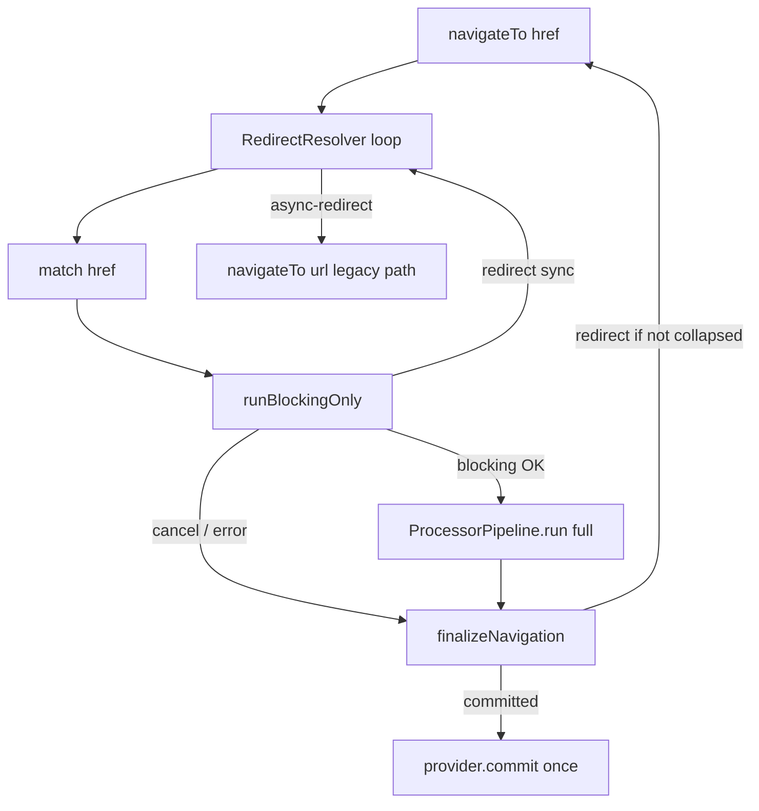

# TODO: схлопывание синхронных цепочек redirect

> **Статус:** план / архитектура (не реализовано)  
> **Связь:** дополнение к [P1-7](../comparison/FEATURE_PARITY_ROADMAP.md) — политика redirect уже зафиксирована; этот документ про **оптимизацию blocking-redirect**, не про post-commit redirect.  
> **См. также:** [NAVIGATION_TRANSACTION_MODEL.md §7](../NAVIGATION_TRANSACTION_MODEL.md#7-redirect-и-cancel--политика-aura-p1-7)

---

## Проблема (as-is)

```text
navigateTo(/dashboard)
  → processor A→dashboard (leave, enter, load, render…)
  → enter hook: redirect /settings
  → finalizeNavigation → navigateTo(/settings)   // новая навигация
    → processor A→settings (снова полный pipeline)
    → enter hook: redirect /login
    → navigateTo(/login)                          // ещё раз
      → processor A→login (полный pipeline)
```

Каждый redirect — **новый** `navigateTo` → новый job → match → **полный** pipeline. Промежуточные URL (`/dashboard`, `/settings`) могут пройти лишние фазы, хотя UI на них не должен останавливаться.

**Схлопывание** — найти финальный URL **до view commit** и выполнить **один** полный pipeline `from → finalTo`.

---

## Граница: только «синхронные» redirect

| Тип | Можно схлопнуть? |
|-----|------------------|
| `enter` / `load` hook **сразу** вернул `'/login'` (без `await`) | ✅ да |
| hook сделал `await fetch()`, потом redirect | ❌ нет — нужен yield; остаётся текущая модель (redirect → новый `navigateTo`) |
| redirect из post-commit (`entered`, …) | ❌ по политике P1-7 — не redirect, а `ctx.router.navigate()` |

«Синхронная цепочка» = несколько redirect подряд **в одном стеке вызовов**, без приостановки на I/O.

---

## Архитектура: два слоя навигации

```text
AuraRoutingEngine.navigateTo()
  │
  ├─ 1. RedirectResolver.resolve()     ← новый слой (только pre-commit)
  │      match → blocking (leave/enter/load) → redirect? → rematch
  │      повтор до финала / cancel / error / max hops / cycle
  │
  └─ 2. ProcessorPipeline.run()        ← как сейчас, один раз
         guards → loads → render → effects
         для финального matchedRoute
```

**Правило:** view commit (`runRender`) **никогда** не вызывается для промежуточных URL в цепочке — только в шаге 2 для финального `to`.

---

## Новые сущности

### `NavigationIntent` (engine)

Контекст одной пользовательской навигации (один клик / один `navigateTo`):

```ts
interface NavigationIntent {
  id: number;                    // корневой id (для логов / devtools)
  originalFrom: MatchedRouteInfo | null;
  originalAction: HistoryAction;
  redirectHop: number;
  replace: boolean;              // OR по цепочке: любой replace → true
  visited: Set<string>;          // нормализованные URL (cycle detect)
}
```

### `RedirectResolver` (новый модуль в `core/`)

```ts
type ResolveResult =
  | { status: 'resolved'; to: MatchedRouteInfo; from: MatchedRouteInfo | null }
  | { status: 'cancelled' }
  | { status: 'error'; error: unknown; phase: NavigationErrorPhase; committed: boolean }
  | { status: 'async-redirect'; url: string; replace?: boolean }; // выход из collapse

resolve(intent, href, options): Promise<ResolveResult>
```

### `ProcessorPipeline.runBlockingOnly()` (или флаг `mode: 'resolve' | 'full'`)

Только pre-commit:

```text
runGuards  (leave + enter)
runLoads
```

Без: `runRenderWithTransition`, `runAfterRender` (и без view commit).

Возвращает тот же `TransactionResult` (`redirect` | `cancelled` | `committed` | `error`).

Для режима resolve `committed` означает: «blocking прошёл, redirect не было» — можно переходить к full run.

---

## Алгоритм `RedirectResolver`

```text
from ← engine.prev
href ← запрошенный URL
intent ← новый NavigationIntent

loop while intent.redirectHop < MAX_REDIRECTS (например 5):

  if href in intent.visited → error 'redirect-cycle'
  intent.visited.add(href)

  to ← matcher.match(href)
  if !to → not-found (как сейчас)

  result ← processor.runBlockingOnly({ from, to, action, router, intent })

  switch result.status:
    case 'redirect':
      href ← normalize(result.url)
      intent.replace ||= result.replace
      intent.redirectHop++
      // from НЕ меняем: UI ещё на originalFrom, view commit не было
      continue loop

    case 'cancelled' | 'error':
      return result

    case 'committed':
      // blocking прошёл, redirect не было
      return { status: 'resolved', from, to }

// если hook вернул redirect после await — runBlockingOnly возвращает async-redirect
// → выходим из collapse, engine делает обычный navigateTo(url) (как сейчас)
```

Затем engine:

```ts
const resolved = await redirectResolver.resolve(...)
if (resolved.status === 'resolved') {
  const result = await processor.run({ from: resolved.from, to: resolved.to, ... })
  finalizeNavigation(result, { url: resolved.to.url, ... })  // один history commit
}
```

---

## Ключевые решения по семантике

### 1. Что такое `from` при внутренних hop?

Пока **не было view commit**, визуально пользователь на `originalFrom`:

- `from` в цикле resolve остаётся `engine.prev`
- план перехода пересчитывается на каждом hop (`buildTransitionPlan(from, to)`), но **без render** промежуточных маршрутов

**Не рекомендуется:** на каждом hop ставить `from = предыдущий to` — появятся лишние `leave` / `enter` для маршрутов, которые пользователь не видел.

### 2. `leave` при redirect из `enter`

```text
A → B, enter(B) → redirect C
```

Пользователь **не уходил** с A (render B не было). Корректно:

- в resolve-цикле: план `A→B`, enter B → redirect
- следующий hop: план **`A→C`** (не `B→C`)
- один набор `leave*` по ветке A→C, один `enter*` на C

### 3. `replace` по цепочке

```ts
intent.replace = intent.replace || result.replace ?? (action === 'pop')
```

Финальный `provider.commit` — один раз с накопленным `replace`.

### 4. History commit

Только **один** `commit(finalUrl)` после успешного полного pipeline. Промежуточные URL не попадают в history (аналог collapsed redirects в TanStack / RR).

### 5. Job / supersede

Один `job` на всю цепочку resolve + full run:

```ts
const job = jobManager.begin()  // один раз в начале navigateTo
// resolve + full pipeline делят один job и isJobActive
```

Не вызывать `navigateTo` рекурсивно из `finalizeNavigation` при collapsed chain — иначе новый job и смысл теряется.

Точка входа as-is (fallback для async / без collapse):

`AuraRoutingEngine.finalizeNavigation` → `case 'redirect'` → `navigateTo(...)`.

---

## Где ловить «async redirect»

В `RouteHookRunner` / `evaluateGuardResult` (или в resolve-режиме pipeline):

```ts
// псевдокод
const hookResult = await runLifecycleHooks(...)
if (navigationAsyncBoundaryCrossed && isRedirect(hookResult)) {
  return { status: 'async-redirect', url }  // не продолжаем collapse
}
```

**v1 (простой вариант):** collapse только если redirect получен в blocking-фазе **без сетевого await** в load hooks на этом hop. Load с `await` → при redirect после await = `async-redirect` → legacy path через `navigateTo`.

---

## Схема потоков



---

## Изменения по файлам (при реализации)

| Файл | Изменение |
|------|-----------|
| `core/redirect-resolver.ts` | новый: loop, cycle, max hops |
| `processor-pipeline.ts` | `runBlockingOnly()` или `run({ mode: 'resolve' \| 'full' })` |
| `processor.ts` | проброс mode / два публичных метода |
| `aura-routing-engine.ts` | `navigateTo`: resolve → full run; `finalizeNavigation` redirect — fallback для async |
| `navigation-error.types.ts` | опционально `redirect-cycle`, `redirect-depth-exceeded` |

---

## Что не схлопывать

- post-commit `return url` (warn-only, P1-7)
- redirect после view commit (`router.navigate` — всегда новая транзакция)
- цепочки с `await` в load (без отдельной доработки async-границы)
- not-found на промежуточном URL (resolver обрабатывает как сейчас в engine)

---

## Что уже есть (не дублировать)

- ✅ supersede job при новой навигации (`AuraRoutingProcessorJobManager.begin`)
- ✅ stale hook results после `await` (`isJobActive`)
- ✅ blocking redirect только в `leave` / `enter` / `load`

---

## Итог

**Схлопывание** — не правка политики P1-7, а **отдельная фаза resolve** в engine:

1. крутить **только blocking** (match + leave/enter/load) пока sync redirect;
2. один раз **full pipeline** до финального `to`;
3. один **history commit**.

Поведение ближе к RR/TanStack (redirect до render), без лишних view commit на промежуточных URL.

---

## Связанные документы

- [NAVIGATION_TRANSACTION_MODEL.md §7](../NAVIGATION_TRANSACTION_MODEL.md#7-redirect-и-cancel--политика-aura-p1-7) — политика redirect
- [FEATURE_PARITY_ROADMAP.md P1-7](../comparison/FEATURE_PARITY_ROADMAP.md) — статус политики
- [REACT_ROUTER_COMPARISON.md §5](../comparison/REACT_ROUTER_COMPARISON.md) — unified redirect + dedupe в RR7
