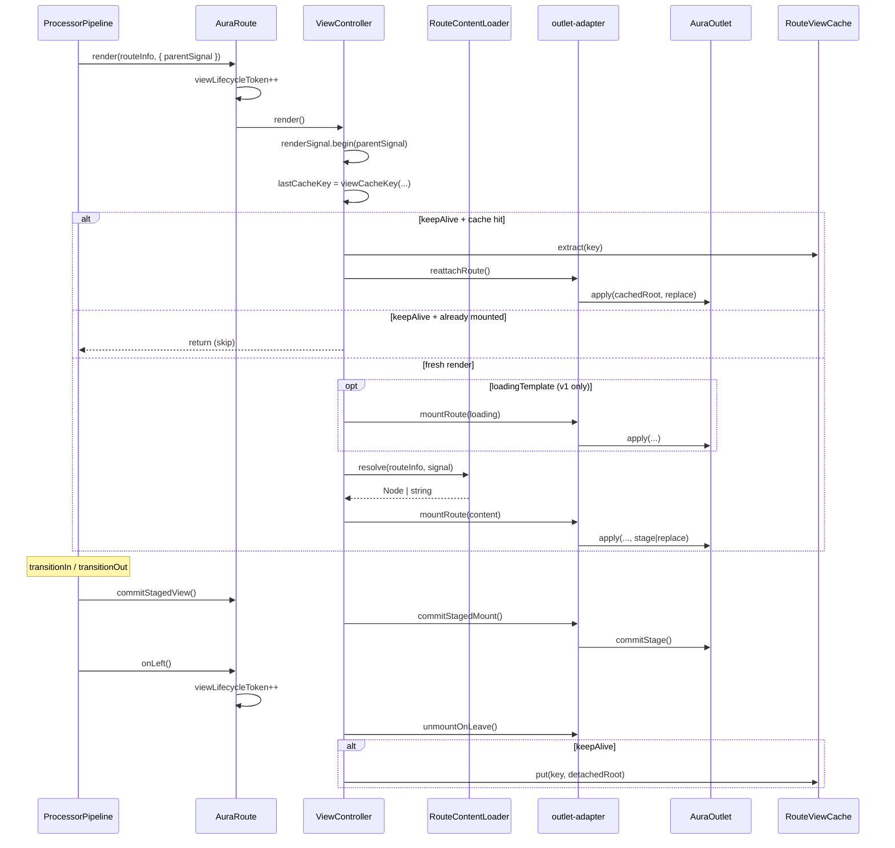

# View-слой — поток, слабые места, greenfield-архитектура

> **Статус документа:** актуализирован 2026-06-25  
> **Уровень кода:** greenfield **не полностью** реализован — см. [сводку статуса](#сводка-статуса)  
> **Связь:** [OUTLET_AND_RENDER.md](./OUTLET_AND_RENDER.md) · [CONTENT_CACHE.md](./CONTENT_CACHE.md) · [view/README.md](../../src/modules/aura-route/core/view/README.md)

### Легенда пометок

| Метка | Значение |
|-------|----------|
| ✅ **v1** | сделано в `src/modules/aura-route/core/view/` (production path) |
| ✅ **v2** | сделано в `src/modules/aura-route-2/` (изолированный модуль) |
| ⚠️ **v1** / ⚠️ **v2** | частично |
| ❌ | не сделано ни в v1, ни в v2 |
| 🔌 | требует интеграции с engine / router / demo |

---

## Сводка статуса

| Область | v1 `aura-route` | v2 `aura-route-2` | Production |
|---------|-----------------|-------------------|------------|
| **Базовый поток** render → commit → onLeft | ✅ работает | ✅ реализован | только v1 |
| **Рефакторинг adapter / cache / key** | ✅ | — (новый код) | v1 |
| **RenderPass** | ❌ | ✅ | — |
| **RouteViewCoordinator + 4 порта** | ❌ (6 deps controller) | ✅ | — |
| **Loading без double mount** | ❌ (TODO в controller) | ✅ plugins | — |
| **`transition` ≠ staged mount** | ❌ (`data-transition`) | ✅ (`data-crossfade`) | v1: transition |
| **Data cache (`preserve="data"`)** | ✅ | ❌ | v1 |
| **View cache (keep-alive)** | ✅ | ✅ | v1 |
| **Plugin hooks** | ❌ | ✅ | — |
| **Тесты view-слоя** | ✅ 6 файлов | ❌ | v1 |
| **Engine / matcher / demo** | ✅ | 🔌 не подключён | v1 |

**Итог:** документ описывает **две линии** — эволюцию v1 (частично) и greenfield v2 (~**75%** целевой архитектуры в коде, **0%** интеграции в routing engine). Полной реализации документа **нет**.

**Текущий production path:** `<aura-route>` + `AuraRouteViewController` + engine hardcode на `aura-route`.

**Экспериментальный path:** `<aura-route-2>` — компилируется, не участвует в `buildRouteTree`, не в demo.

---

## Карта модулей

### v1 — `aura-route/core/view/` (production)

| Модуль | Роль | Статус |
|--------|------|--------|
| `view-controller.ts` | orchestration, guards, cache, errors | ✅ рефакторинг 2026-06 |
| `outlet-adapter.ts` | mount policy (`replace`/`stage`), leave/commit | ✅ |
| `render-signal.ts` | local + parent `AbortSignal` | ✅ `parentSignal` в options |
| `view-cache.ts` + `view-cache-key.ts` | keep-alive (`extract` / `put`), `viewCacheKey()` | ✅ API урезан |
| `route-error-view.ts` | HTML ошибки + warn layout | ✅ |
| `view-controller.types.ts` | `RouteContentPort`, `RouteRenderOptions` | ✅ |

Загрузка: `route-content-loader.ts` → `RouteContentPort`.

### v2 — `aura-route-2/view/` (greenfield)

| Модуль | Роль в доке | Фактический файл | Статус |
|--------|-------------|------------------|--------|
| Coordinator | `coordinator.ts` | `coordinator.ts` | ✅ |
| RenderPass | pass object | `render-pass.ts` | ✅ |
| Порты | `ports.ts` | `ports.ts` | ✅ 4 порта |
| Signal | `signal.ts` | `signal.ts` | ✅ |
| View cache | `stash/` → cache | `view-cache.ts` + `cacheKey()` | ✅ |
| Outlet ops | `outlet/` | `outlet.ts` (snapshot + ops в одном файле) | ✅ ⚠️ не отдельный `OutletMountPort` |
| Payloads | `content/payloads.ts` | `payloads.ts` | ✅ |
| Plugins | `plugins/loading-overlay.ts` | `plugins.ts` | ✅ |
| Facade | `RouteView` | `route-view.ts` | ✅ |
| Element | — | `core/aura-route.ts` (`aura-route-2`) | ✅ 🔌 |
| Content resolver | `content/resolver.ts` | `core/route-content-loader.ts` | ✅ ⚠️ без Data cache |

---

## Полный поток: engine → DOM

Актуален для **v1**. v2 повторяет тот же контракт lifecycle, но через `RouteView` / `RenderPass`.



**v2 отличия в этом потоке:**
- `RenderPass` создаётся один раз (`cacheKey`, `viewKind`, `useStagedMount` из `data-crossfade`)
- loading — plugins (`onPassStart` / `onPassEnd`), **без** промежуточного `outlet.apply`
- staged mount: `crossfade` attr, не `data-transition`

**Порядок в pipeline (parallel policy):** без изменений.

1. `runRender` → `route.render()`  
2. `transitionOut` ‖ `transitionIn`  
3. `commitEnterViews` → `commitStagedView()`  
4. `runExitCleanup` → `onLeft()` → cache put / destroy  

---

## Что уже хорошо

1. **Разделение orchestration / outlet policy** — ✅ v1, ✅ v2  
2. **Порты для DI** — ✅ v1 (`RouteContentPort`, `RouteViewCachePort`); ✅ v2 (4 порта)  
3. **`lifecycleToken` / pass id + abort signal** — ✅ v1 (token callback); ✅ v2 (`RenderPass.id` + `RenderSignal`)  
4. **`RouteMountSnapshot` / staged lifecycle** — ✅ v1, ✅ v2  
5. **Урезанный view cache API** (`extract` / `put`) — ✅ v1, ✅ v2  

---

## Слабые места

### Производительность

| Проблема | Где | v1 | v2 |
|----------|-----|----|----|
| Двойной mount при loading | controller | ❌ | ✅ plugins |
| `resolveViewKind()` многократно | view-controller | ❌ | ✅ в pass |
| `cacheKey` дважды | render + restore | ❌ `viewCacheKey` ×2 | ✅ один раз в pass |
| `findChildOutlet()` на каждый mount | outlet | ❌ | ❌ (тот же outlet API) |
| Два кэша: `preserve="data"` vs keep-alive | loader / view | ✅ v1 | ❌ |

### Модульность / связность

| Проблема | v1 | v2 |
|----------|----|----|
| Много зависимостей в orchestrator | ❌ 6 в constructor | ✅ config + ports |
| `nestedOutlet` через `node.parent.route` | ❌ | ⚠️ тот же паттерн в `MountTargetPort` |
| `data-transition` = policy + stage | ❌ | ✅ `crossfade` отдельно |
| Два типа mount state | ⚠️ | ⚠️ `MountSnapshot` в outlet.ts |
| Token split element / controller | ⚠️ callback | ✅ passId на element |

### Расширяемость

| Возможность | v1 | v2 |
|-------------|----|----|
| Loading className / event | ❌ TODO | ✅ `loadingBodyClass`, `loadingEvent` |
| Plugin hooks | ❌ | ✅ `ViewRenderPlugin` |
| Единый `ViewPayload` | ⚠️ разбросано | ✅ `payloads.ts` |

---

## Greenfield: целевая архитектура

Ниже — **целевое состояние** из первоначального плана. Статус реализации — в правой колонке.

### Принцип: один проход = один `RenderPass` — ✅ **v2**

```typescript
type RenderPass = {
  readonly id: number;
  readonly routeInfo: MatchedRouteInfo;
  readonly signal: AbortSignal;
  readonly cacheKey: string;
  readonly viewKind: 'layout' | 'content';
  readonly useStagedMount: boolean;
};
```

❌ **v1** — token + разрозненные поля; `viewCacheKey` вычисляется дважды.

### Три порта + координатор — ✅ **v2** (4 порта)

```text
┌─────────────────────────────────────────┐
│           RouteViewCoordinator          │  ✅ v2
├─────────────────────────────────────────┤
│  ContentResolverPort   (async DOM/HTML) │  ✅
│  outlet ops (sync)     в outlet.ts      │  ✅ ⚠️ не отдельный OutletMountPort
│  ViewCachePort         (keep-alive)     │  ✅
│  MountTargetPort       (куда монтировать)│  ⚠️ closure + tree walk
│  ViewRenderPlugin[]    (loading, etc.)  │  ✅
└─────────────────────────────────────────┘
```

**`RouteViewCoordinator.render(pass)`** — ✅ **v2**:

```text
1. tryCacheRestore(pass)           ✅
2. shouldSkipKeepAlive(pass)       ✅
3. loading (plugin, не remount)    ✅
4. resolve content                 ✅
5. mount content                   ✅
6. on error → mount error view     ✅
```

### Разделение файлов — ⚠️ **v2** (упрощённая структура)

Планировалось `stash/`, `outlet/`, `content/`, `plugins/` — фактически плоский `view/` + `core/`. Семантика совпадает, папки не разбиты.

### Производительность: конкретные решения

| Решение | v1 | v2 |
|---------|----|----|
| 1. Loading без remount | ❌ | ✅ |
| 2. Pass вычисляется один раз | ❌ | ✅ |
| 3. `MountTargetPort` вынесен | ⚠️ closures в aura-route | ✅ интерфейс, ❌ tree walk остался |
| 4. Развести DataCache и ViewCache | ❌ | ❌ |
| 5. Nested batch (layout sync → leaf async) | ❌ | ❌ |
| 6. Stage flag отдельно от transition | ❌ | ✅ `data-crossfade` |

### Plugin-точки — ✅ **v2**

Реализовано: `onPassStart`, `onPassEnd`, `onContentResolved`, `onMounted`, `onPassError`.

Отличие от черновика: `onMounted(pass)` без `snapshot` в сигнатуре.

### Что оставить из текущего кода

| Элемент | Статус |
|---------|--------|
| outlet-adapter / outlet.ts pure DOM | ✅ v1 + v2 |
| render-signal | ✅ оба |
| view-cache-key / cacheKey | ✅ оба |
| engine lifecycle order | ✅ без изменений |

---

## Сравнение: v1 сейчас vs v2 greenfield vs production

| Критерий | v1 (prod) | v2 (изолирован) | Цель документа |
|----------|-----------|-----------------|----------------|
| Понятность | 7/10 | 9/10 | Pass + coordinator |
| Производительность | 6/10 | 8/10 | loading plugin, single pass |
| Модульность | 7/10 | 8/10 | порты; MountTarget всё ещё хрупкий |
| Расширяемость | 5/10 | 8/10 | plugins |
| Интеграция | **10/10** | **0/10** | engine + demo |
| Тесты | **8/10** | **0/10** | — |

---

## Прагматичный план эволюции

### В v1 (`aura-route`) — эволюция без переписывания

- [ ] **`RenderPass`** внутри `render()` — ❌
- [ ] **`MountTargetPort`** — ❌ (closures в `aura-route.ts`)
- [ ] **Loading** без двойного `apply` — ❌ (TODO в `view-controller.ts:175`)
- [ ] **Разделить `transition` и staged mount** — ❌ (`data-transition` на route)
- [ ] **`readCache` / `writeCache`** — ⚠️ заглушки в `route-content-loader.ts`
- [ ] **Обновить `view/README.md`** — ❌ (диаграмма pass + порты)

### В v2 (`aura-route-2`) — greenfield

- [x] **`RenderPass`** + `isStale` — `render-pass.ts`
- [x] **`RouteViewCoordinator`** — `coordinator.ts`
- [x] **4 порта** — `ports.ts`
- [x] **`RouteView` facade** — `route-view.ts`
- [x] **Loading plugins** — `plugins.ts`
- [x] **`data-crossfade`** для staged mount — `aura-route.ts`
- [x] **View cache** (`cacheKey`, `ViewCachePort`) — `view-cache.ts`
- [x] **Payloads** (empty, error, layout) — `payloads.ts`
- [x] **`<aura-route-2>` element** — `core/aura-route.ts`
- [ ] **Тесты coordinator / outlet / cache** — ❌
- [ ] **Engine: `buildRouteTree` + registry** — 🔌 только `AuraRoute`
- [ ] **Demo / `index.html`** — 🔌
- [x] **Data cache (`preserve="data"`)** — ✅ v1
- [ ] **`MountTargetPort` без tree walk** — ❌ (нужен engine / tree builder)
- [ ] **Nested batch render** — ❌
- [ ] **`OutletMountPort` как интерфейс** — ❌ (функции в `outlet.ts`)
- [ ] **Экспорт из пакета / AuraRouter** — 🔌

### Миграция v1 → v2 (не начата)

- [ ] Подключить v2 к engine (generic `RouteInstance` / dual tag)
- [ ] Перенести тесты с v1 на v2
- [ ] Deprecate `AuraRouteViewController` или сделать thin wrapper над v2
- [ ] Добавить `data-crossfade` на `<aura-router>` для inherit

---

## Заметки по `lifecycleToken` — ✅ учтено

**v1:** token как параметр / callback (`getLifecycleToken`), не mutable-поле controller — ✅  
**v2:** `passId` на element + `RenderPass.id` — ✅  

`viewKind` выводится из `route` без протаскивания — ✅ **v2** (в pass); ⚠️ **v1** (`resolveViewKind` многократно).

---

## Что осталось для «полной» реализации документа

1. **Интеграция v2** — engine, matcher types, demo (блокер «готовности»).
2. **View loader cache** — `preserve="view"` / router `DataCache` (см. [CONTENT_CACHE.md](./CONTENT_CACHE.md)).
3. **MountTarget из tree builder** — убрать `routeInfo.node?.parent?.route.nestedOutlet`.
4. **Тесты v2** — parity с v1 test suite.
5. **v1 backlog** — либо дотянуть эволюцией, либо заморозить в пользу v2.
