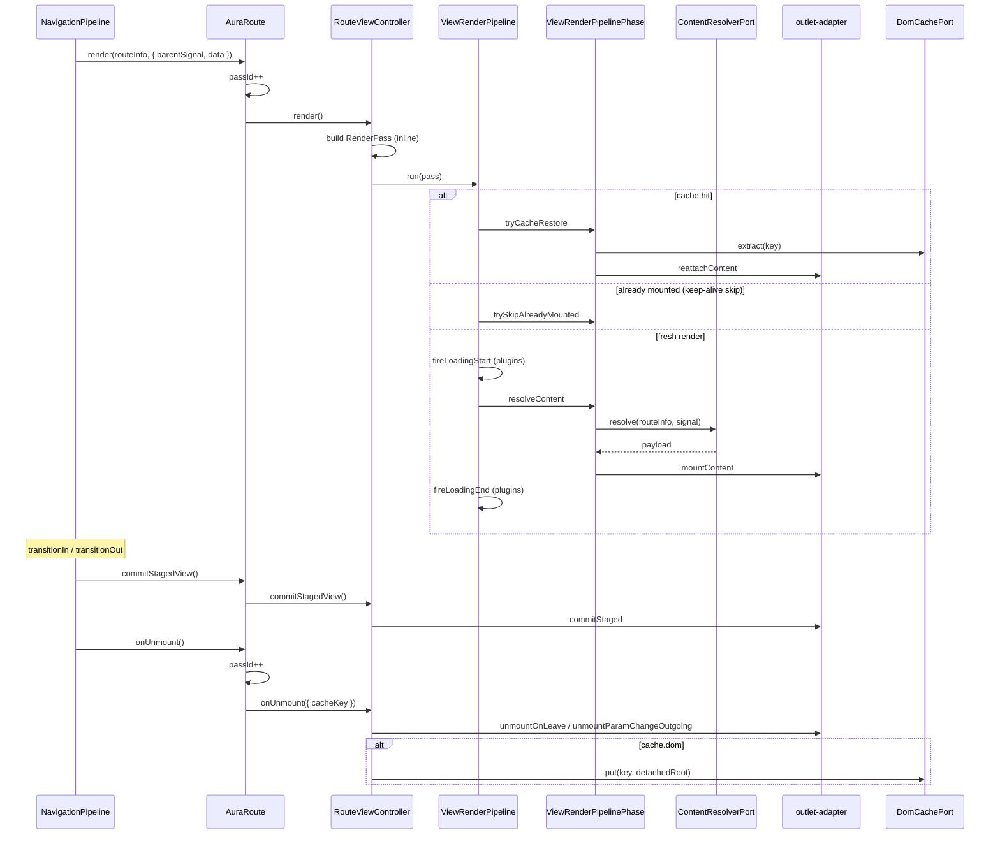

# View-слой — поток, статус, что осталось

> **Статус документа:** актуализирован **2026-07-06** (после merge pipeline-архитектуры в production `view/`)  
> **Сверка с кодом:** `src/modules/aura-route/core/view/`  
> **Связь:** [OUTLET_AND_RENDER.md](./OUTLET_AND_RENDER.md) · [CONTENT_CACHE.md](./CONTENT_CACHE.md)

### Легенда

| Метка | Значение |
|-------|----------|
| <span style="color: #2ea043; font-weight: bold;">✓ ГОТОВО</span> | реализовано в production path |
| <span style="color: #bf8700; font-weight: bold;">~ ЧАСТИЧНО</span> | есть, но не доведено до цели документа |
| <span style="color: #cf222e; font-weight: bold;">✗ ОСТАЛОСЬ</span> | не сделано |
| <span style="color: #8250df; font-weight: bold;">⊘ СНЯТО</span> | было в плане, отменено / неактуально |

---

## Сводка (одна production-линия)

> **2026-07:** greenfield pipeline (`view2`) **влит в** `aura-route/core/view/`.  
> Отдельного `aura-route-2` в репозитории **нет**. Сравнение «v1 vs v2» ниже — **историческое**.

| Область | Статус | Где |
|---------|--------|-----|
| **Базовый поток** render → commitStaged → onUnmount | <span style="color: #2ea043; font-weight: bold;">✓ ГОТОВО</span> | engine + `RouteViewController` |
| **RenderPass** (id, cacheKey, viewKind, useStagedMount) | <span style="color: #2ea043; font-weight: bold;">✓ ГОТОВО</span> | inline в `view-controller.ts`, тип в `types.ts` |
| **Pipeline orchestration** (cache → skip → resolve → mount) | <span style="color: #2ea043; font-weight: bold;">✓ ГОТОВО</span> | `view-render-pipeline.ts` + `view-render-pipeline-phase.ts` |
| **Teardown pipeline** (commit / rollback / unmount) | <span style="color: #2ea043; font-weight: bold;">✓ ГОТОВО</span> | `view-teardown-pipeline.ts` |
| **Тонкий controller** (state + делегирование) | <span style="color: #2ea043; font-weight: bold;">✓ ГОТОВО</span> | `view-controller.ts` ~70 строк |
| **4 порта + config** | <span style="color: #2ea043; font-weight: bold;">✓ ГОТОВО</span> | `types.ts` |
| **Loading без double mount** | <span style="color: #2ea043; font-weight: bold;">✓ ГОТОВО</span> | `plugins/view-loading-plugins.ts` |
| **Plugin hooks** | <span style="color: #2ea043; font-weight: bold;">✓ ГОТОВО</span> | `ViewRenderPlugin` в `types.ts` |
| **View cache (keep-alive)** | <span style="color: #2ea043; font-weight: bold;">✓ ГОТОВО</span> | `dom-cache.ts` + `domCacheKey()` |
| **Data cache (`cache="data"`)** | <span style="color: #2ea043; font-weight: bold;">✓ ГОТОВО</span> | loader / engine (не view-слой) |
| **Stale pass** (`passId` + `AbortSignal`) | <span style="color: #2ea043; font-weight: bold;">✓ ГОТОВО</span> | `isStale` inline в phase |
| **Тесты view-слоя** | <span style="color: #2ea043; font-weight: bold;">✓ ГОТОВО</span> | 8 файлов + engine integration (~202 теста) |
| **`data-crossfade` ≠ `transition`** | <span style="color: #cf222e; font-weight: bold;">✗ ОСТАЛОСЬ</span> | staging по `transition.order` |
| **`MountTargetPort` без tree walk** | <span style="color: #cf222e; font-weight: bold;">✗ ОСТАЛОСЬ</span> | `routeInfo.node?.parent?.route` в `aura-route.ts` |
| **`OutletMountPort` как интерфейс** | <span style="color: #cf222e; font-weight: bold;">✗ ОСТАЛОСЬ</span> | функции в `outlet-adapter.ts` |
| **Nested batch render** | <span style="color: #cf222e; font-weight: bold;">✗ ОСТАЛОСЬ</span> | layout sync → leaf async |
| **`view/README.md`** | <span style="color: #cf222e; font-weight: bold;">✗ ОСТАЛОСЬ</span> | файл не создан |
| **Миграция v1→v2 / `aura-route-2`** | <span style="color: #8250df; font-weight: bold;">⊘ СНЯТО</span> | merge в `view/`, отдельный CE не нужен |

**Итог:** целевая **orchestration-архитектура view-слоя — готова** в production.  
Остались **точечные улучшения** (crossfade attr, MountTarget, nested batch, docs).

**Production path:** `<aura-route>` → `RouteViewController` → `ViewRenderPipeline` / `ViewTeardownPipeline`.

---

## Карта модулей (актуальная)

`src/modules/aura-route/core/view/`

| Файл | Роль | Статус |
|------|------|--------|
| `view-controller.ts` | фасад: `render`, `onUnmount`, `commitStagedView`, `revertInFlightView` | <span style="color: #2ea043; font-weight: bold;">✓</span> |
| `view-context.ts` | mutable state: mount, signal, passId flags | <span style="color: #2ea043; font-weight: bold;">✓</span> |
| `view-render-pipeline.ts` | оглавление render: cache → skip → loading → resolve | <span style="color: #2ea043; font-weight: bold;">✓</span> |
| `view-render-pipeline-phase.ts` | шаги: cache, skip, resolve, mount, error | <span style="color: #2ea043; font-weight: bold;">✓</span> |
| `view-teardown-pipeline.ts` | commit / rollback / unmount | <span style="color: #2ea043; font-weight: bold;">✓</span> |
| `types.ts` | `RenderPass`, порты, `ViewRenderPlugin`, `RouteViewConfig` | <span style="color: #2ea043; font-weight: bold;">✓</span> |
| `outlet-adapter.ts` | mount policy (`replace`/`stage`), snapshot ops | <span style="color: #2ea043; font-weight: bold;">✓</span> |
| `payloads.ts` | empty content, error UI, layout warn | <span style="color: #2ea043; font-weight: bold;">✓</span> |
| `dom-cache.ts` | keep-alive LRU + `domCacheKey()` | <span style="color: #2ea043; font-weight: bold;">✓</span> |
| `render-signal.ts` | local + parent `AbortSignal` | <span style="color: #2ea043; font-weight: bold;">✓</span> |
| `index.ts` | barrel export | <span style="color: #2ea043; font-weight: bold;">✓</span> |

`src/modules/aura-route/core/plugins/`

| Файл | Роль | Статус |
|------|------|--------|
| `view-loading-plugins.ts` | `loadingBodyClass`, `loadingEvent` | <span style="color: #2ea043; font-weight: bold;">✓</span> |

Загрузка контента: `route-content-loader.ts` → `ContentResolverPort` (вне view/).

---

## Полный поток: engine → DOM



---

## Render pipeline (код)

`ViewRenderPipeline.run(pass)`:

```text
1. tryCacheRestore(pass)              → ok | continue
2. trySkipAlreadyMounted(pass)        → ok | continue
3. fireLoadingStart(pass)             → plugins only, без outlet mount
4. resolveContent(pass)               → content.resolve + mount
5. fireLoadingEnd(pass)               → finally
   catch → handleError(pass)           → recovery UI, { status: 'error' }
```

`isStale(pass)` = `signal.aborted || getPassId() !== pass.id` — inline в phase.

---

## Plugin hooks (актуальные имена)

| Hook | Когда | Статус |
|------|-------|--------|
| `onLoadingStart` | перед async resolve | <span style="color: #2ea043; font-weight: bold;">✓</span> |
| `onLoadingEnd` | после resolve / в finally | <span style="color: #2ea043; font-weight: bold;">✓</span> |
| `onContentResolved` | payload получен | <span style="color: #2ea043; font-weight: bold;">✓</span> |
| `onMounted` | DOM смонтирован | <span style="color: #2ea043; font-weight: bold;">✓</span> |
| `onPassError` | ошибка resolve | <span style="color: #2ea043; font-weight: bold;">✓</span> |

В production подключаются только **внутренние** loading-plugins при `loading-template` на `<aura-route>`.

---

## Что уже хорошо

1. <span style="color: #2ea043; font-weight: bold;">✓</span> **Orchestration / outlet policy разделены** — pipeline vs `outlet-adapter.ts`
2. <span style="color: #2ea043; font-weight: bold;">✓</span> **Порты для DI** — `types.ts`
3. <span style="color: #2ea043; font-weight: bold;">✓</span> **`passId` + `RenderPass.id` + abort signal** — supersede in-flight render
4. <span style="color: #2ea043; font-weight: bold;">✓</span> **Staged lifecycle** — `MountSnapshot`, commit / rollback
5. <span style="color: #2ea043; font-weight: bold;">✓</span> **View cache API** — `extract` / `put`, `domCacheKey()`
6. <span style="color: #2ea043; font-weight: bold;">✓</span> **Читаемость** — pipeline как оглавление (аналог `navigation-transaction-pipeline.ts`)

---

## Слабые места (что осталось)

### Производительность

| Проблема | Статус |
|----------|--------|
| Двойной mount при loading | <span style="color: #2ea043; font-weight: bold;">✓ исправлено</span> (plugins) |
| `viewKind` / `cacheKey` пересчёт | <span style="color: #2ea043; font-weight: bold;">✓ исправлено</span> (один `RenderPass`) |
| `findChildOutlet()` на каждый mount | <span style="color: #cf222e; font-weight: bold;">✗ ОСТАЛОСЬ</span> (outlet API) |
| Два кэша: `cache="data"` vs keep-alive | <span style="color: #bf8700; font-weight: bold;">~ ЧАСТИЧНО</span> (разные слои, слабая связность) |
| Nested batch (layout sync → leaf async) | <span style="color: #cf222e; font-weight: bold;">✗ ОСТАЛОСЬ</span> |

### Модульность

| Проблема | Статус |
|----------|--------|
| Толстый orchestrator | <span style="color: #2ea043; font-weight: bold;">✓ исправлено</span> |
| `nestedOutlet` через tree walk | <span style="color: #cf222e; font-weight: bold;">✗ ОСТАЛОСЬ</span> |
| `transition` = policy + stage flag | <span style="color: #cf222e; font-weight: bold;">✗ ОСТАЛОСЬ</span> (`useStagedMount` от `transition.order`) |
| `OutletMountPort` как интерфейс | <span style="color: #cf222e; font-weight: bold;">✗ ОСТАЛОСЬ</span> |

### Расширяемость

| Возможность | Статус |
|-------------|--------|
| Loading class / event | <span style="color: #2ea043; font-weight: bold;">✓ ГОТОВО</span> |
| Plugin hooks | <span style="color: #2ea043; font-weight: bold;">✓ ГОТОВО</span> |
| Публичный API plugins для приложений | <span style="color: #cf222e; font-weight: bold;">✗ ОСТАЛОСЬ</span> (только `loading-template`) |
| Единый `ViewPayload` | <span style="color: #2ea043; font-weight: bold;">✓ ГОТОВО</span> |

---

## Чеклист: сделано / осталось

### <span style="color: #2ea043; font-weight: bold;">✓ СДЕЛАНО</span>

- [x] `RenderPass` + inline сборка в `view-controller.render()`
- [x] `ViewRenderPipeline` + `ViewRenderPipelinePhase` + `ViewTeardownPipeline`
- [x] `ViewContext` (shared mutable state)
- [x] 4 порта в `types.ts`
- [x] `ViewRenderPlugin` + loading plugins (`onLoadingStart` / `onLoadingEnd`)
- [x] Loading **без** промежуточного `outlet.apply`
- [x] `outlet-adapter.ts` (replace / stage / rollback / unmount)
- [x] `payloads.ts`, `dom-cache.ts`, `render-signal.ts`
- [x] Keep-alive + param remount + staged transition
- [x] Error recovery UI (`{ status: 'error' }`)
- [x] Тесты: controller, flow, outlet, cache, payloads, render-pass rules, engine integration
- [x] Merge pipeline в production `view/` (бывший `view2`)

### <span style="color: #cf222e; font-weight: bold;">✗ ОСТАЛОСЬ</span>

- [ ] **`data-crossfade`** — отдельный attr для staged mount (не смешивать с `transition`)
- [ ] **`MountTargetPort`** из tree builder — убрать `routeInfo.node?.parent?.route.nestedOutlet`
- [ ] **`OutletMountPort`** — формальный интерфейс вместо pure functions
- [ ] **Nested batch render** — layout sync, leaf async в одном navigation pass
- [ ] **Публичный plugin API** на `<aura-route>` (если нужен apps)
- [ ] **`view/README.md`** — диаграмма pass + pipeline для onboarding
- [ ] **Явное разведение Data cache / View cache** в документации loader ↔ view

### <span style="color: #8250df; font-weight: bold;">⊘ СНЯТО / неактуально</span>

- [ ] ~~`aura-route-2` element~~ — merge в `view/`
- [ ] ~~`RouteViewCoordinator`~~ — переименовано в pipeline + `RouteViewController`
- [ ] ~~`createRenderPass()`~~ — inline в controller
- [ ] ~~`isStale()` export~~ — private inline в phase
- [ ] ~~`ports.ts` / `render-pass.ts`~~ — сведены в `types.ts`
- [ ] ~~Миграция v1→v2~~ — выполнена in-place

---

## Историческая справка (до 2026-07)

До рефакторинга `view-controller.ts` был монолитом (~250 строк): cache, resolve, mount, plugins, teardown в одном классе.  
Greenfield-план (`aura-route-2`, `RouteViewCoordinator`) описывал целевую декомпозицию.  
**Июль 2026:** pipeline-архитектура внедрена **напрямую в production** `view/` без отдельного CE.

| Критерий | До (2026-06) | Сейчас (2026-07) |
|----------|--------------|------------------|
| Понятность | 7/10 | <span style="color: #2ea043; font-weight: bold;">9/10</span> |
| Производительность | 6/10 | <span style="color: #2ea043; font-weight: bold;">8/10</span> |
| Модульность | 7/10 | <span style="color: #2ea043; font-weight: bold;">8/10</span> |
| Расширяемость | 5/10 | <span style="color: #2ea043; font-weight: bold;">7/10</span> |
| Интеграция engine | 10/10 | <span style="color: #2ea043; font-weight: bold;">10/10</span> |
| Тесты | 8/10 | <span style="color: #2ea043; font-weight: bold;">9/10</span> |

---

## Связанные TODO

- [RENDERER_ABSTRACTION.md](./RENDERER_ABSTRACTION.md) — engine-level `Renderer.renderNode()`
- [CONTENT_CACHE.md](./CONTENT_CACHE.md) — `cache="data"` vs view keep-alive
- [REPLACE_SUPERSEDE_ROLLBACK.md](./REPLACE_SUPERSEDE_ROLLBACK.md) — rollback semantics stage vs replace
