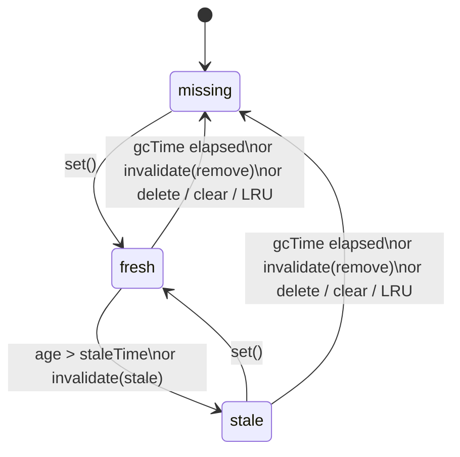

# aura-cache-store

String-key in-memory cache for content and DOM snapshots. `Map` + doubly-linked list for O(1) lookup, LRU promotion, and eviction.

```ts
import { AuraCacheStore, DEFAULT_GC_TIME } from './modules/aura-cache-store/core';
```

## Key concepts

### SWR (stale-while-revalidate)

A caching strategy: **return cached data immediately**, then **refresh it in the background** when it becomes outdated.

1. **Fresh** — data is up to date; serve from cache, no fetch.
2. **Stale** — data is outdated but still in cache; serve it now and revalidate in the background.
3. **Missing** — no cache entry; fetch and store.

Enable with `staleTime` (how long data stays fresh). Use `lookup()` to get the status and decide whether to revalidate.

### Invalidation

Manually mark cache entries as outdated or delete them — for example after a mutation, route change, or logout.

| Policy | What happens |
|--------|----------------|
| `'stale'` (default) | Entry stays readable; `lookup()` reports `stale` so you can revalidate |
| `'remove'` | Entry is deleted from cache immediately |

Methods: `invalidate(key)`, `invalidateMatch(predicate)`, `invalidateAll()`.

## Operating modes

| Mode | Options | Behavior |
|------|---------|----------|
| Unlimited | none | Entries never expire. `max` still limits size. |
| Simple GC | `gcTime` | Evict on access after TTL. No stale phase. |
| SWR | `staleTime` | Stale-while-revalidate: `fresh` → `stale` (still served) → evicted after `gcTime`. Default `gcTime` is 5 min. |

`gcTime: Infinity` disables TTL eviction — entries stay until LRU or explicit removal.

GC runs lazily on access (`get`, `has`, `lookup`, `isStale`) and proactively via `purgeExpired()` or background sweep. `has`, `isStale`, and `lookup` without `touch` do not promote LRU order.

The diagram below shows the **SWR** lifecycle (`staleTime` set). In simple GC mode (`gcTime` only), entries skip the `stale` phase and go straight to `missing` once TTL elapses and the entry is accessed or swept.



## Configuration

```ts
type CacheStoreOptions<T> = {
  max?: number;
  staleTime?: number;                  // SWR fresh window (ms)
  gcTime?: number;                     // max age since storedAt (ms)
  gcSweepInterval?: number | false;
  invalidatePolicy?: 'remove' | 'stale'; // default: 'stale'
  onEvict?: (key: string, value: T) => void;
};
```

| Option | Description |
|--------|-------------|
| `max` | LRU capacity; evicts least recently used key first |
| `staleTime` | Enables SWR. Entries become stale after this age but stay readable |
| `gcTime` | Evict after max age since `storedAt`. Defaults to `DEFAULT_GC_TIME` (5 min) when `staleTime` is set. `Infinity` disables TTL |
| `invalidatePolicy` | Default for `invalidate`, `invalidateMatch`, `invalidateAll` |
| `onEvict` | Called on LRU/GC eviction, `delete`, `clear`, `invalidate(..., 'remove')` |

### `gcSweepInterval`

- `undefined` — auto when `gcTime` is set: `clamp(gcTime / 2, 5s … 60s)`
- `number` — run `purgeExpired()` every N ms (no-op without `gcTime`)
- `false` — disabled; eviction on access or manual `purgeExpired()` only

Background sweep lifecycle:

- **Start** — on the first `set()` while the store is non-empty
- **Stop** — when the store becomes empty (last entry evicted) or on `clear()` / `destroy()`
- **Restart** — on the next `set()` after `clear()`

## API

| Method | LRU | Description |
|--------|:---:|-------------|
| `get(key)` | yes | Returns value (fresh or stale), or `undefined` if missing/GC-expired |
| `lookup(key, touch?)` | if `touch` | `{ status: 'fresh' \| 'stale' \| 'missing', value? }` — evicts GC-expired entries; use for SWR revalidate decisions |
| `set(key, value)` | yes | Resets stale flag and `storedAt`. Update in place skips LRU trim |
| `has(key)` | no | `true` if readable entry exists; evicts GC-expired |
| `isStale(key)` | no | `true` if stale and readable; `false` if missing, fresh, or GC-expired |
| `invalidate(key, policy?)` | no | Mark outdated (`'stale'`) or delete (`'remove'`). Returns `false` if key missing. Default: `invalidatePolicy` |
| `invalidateMatch(predicate, policy?)` | no | Same as `invalidate`, for keys matching a filter |
| `invalidateAll(policy?)` | no | Same as `invalidate`, for every entry |
| `delete(key)` | — | Remove one entry; invokes `onEvict` |
| `purgeExpired()` | — | Evict all GC-expired entries; returns count. No-op without `gcTime` |
| `clear()` / `destroy()` | — | Remove all entries and stop background sweep; `destroy()` is an alias for `clear()` |
| `size` | — | Entry count (includes stale and not-yet-swept entries) |

## Examples

### Basic usage

```ts
const cache = new AuraCacheStore<string>();

cache.set('/home', '<h1>Home</h1>');
cache.get('/home');   // '<h1>Home</h1>'
cache.has('/home');   // true
cache.delete('/home');
cache.get('/home');   // undefined
```

### TTL without SWR

```ts
const cache = new AuraCacheStore<string>({
  gcTime: 60_000,
  gcSweepInterval: false,
});

cache.set('fragment', '<nav>...</nav>');
// after 61s:
cache.get('fragment'); // undefined — evicted on read
```

### SWR: stale-while-revalidate

Serve cached content immediately; when `lookup()` returns `stale`, show it and refresh in the background:

```ts
const cache = new AuraCacheStore<string>({
  staleTime: 30_000, // fresh for 30s; gcTime defaults to DEFAULT_GC_TIME (5 min)
});

async function loadPage(url: string): Promise<string> {
  const hit = cache.lookup(url);

  if (hit.status === 'fresh') return hit.value;

  if (hit.status === 'stale') {
    revalidate(url).catch(console.error);
    return hit.value;
  }

  const html = await fetch(url).then((r) => r.text());
  cache.set(url, html);
  return html;
}

async function revalidate(url: string): Promise<void> {
  cache.set(url, await fetch(url).then((r) => r.text()));
}
```

### LRU capacity

```ts
const cache = new AuraCacheStore<string>({ max: 2 });

cache.set('a', 'A');
cache.set('b', 'B');
cache.get('a');      // promote 'a'
cache.set('c', 'C'); // evicts 'b' (LRU)

cache.has('b'); // false — has() does not promote LRU
```

Use `get` or `lookup(key, true)` when access should protect an entry from eviction.

### Invalidation

Mark entries outdated after a mutation or event without deleting them immediately (default `'stale'` policy):

```ts
const cache = new AuraCacheStore<string>({ staleTime: 60_000 });

cache.set('data:users', '{"users":[]}');
cache.set('html:/about', '<main>About</main>');

// API data changed — mark stale, keep serving until revalidate
cache.invalidateMatch((key) => key.startsWith('data:'));
cache.isStale('data:users');  // true
cache.get('data:users');      // still returns JSON (stale)

// Or delete immediately
cache.invalidate('html:/about', 'remove');
cache.invalidateAll('remove');
```

### Proactive GC

```ts
const cache = new AuraCacheStore<string>({
  gcTime: 60_000,
  // gcSweepInterval omitted → auto sweep every 30s (gcTime / 2)
});

cache.set('temp', 'value');
// expired entries removed by background sweep even without reads

cache.purgeExpired(); // or trigger manually
cache.destroy();      // stop sweep and release all entries
```

### `onEvict` callback

```ts
const cache = new AuraCacheStore<HTMLElement>({
  max: 10,
  onEvict: (_key, el) => el.remove(),
});
```

## Exported types

```ts
export const DEFAULT_GC_TIME = 5 * 60_000;

type InvalidatePolicy = 'remove' | 'stale';
type CacheEntryStatus = 'fresh' | 'stale' | 'missing';

type CacheLookup<T> =
  | { status: 'missing' }
  | { status: 'fresh'; value: T }
  | { status: 'stale'; value: T };
```

## Tests

```bash
npx jest src/modules/aura-cache-store/test/aura-cache-store.test.ts
```

## Benchmark

```bash
npm run bench:cache
npm run bench:cache:gc   # with --expose-gc
```

## Comparison with SPA router caches

See [docs/comparison/CACHE_STORE_COMPARISON.md](../../docs/comparison/CACHE_STORE_COMPARISON.md) — SWR/LRU parity with TanStack Router, ratings (7/10 as engine), benchmark numbers, roadmap to router integration.
