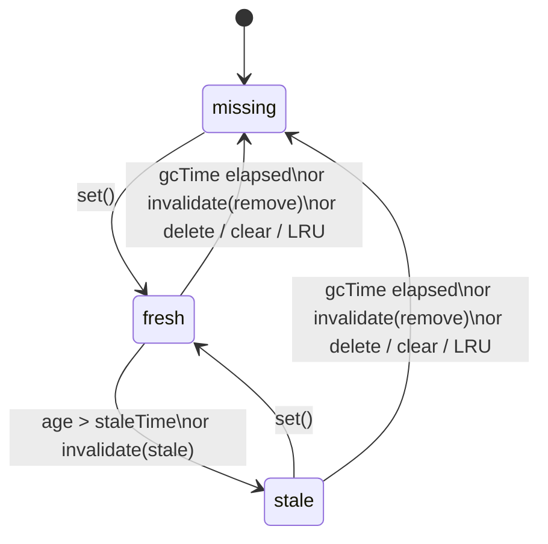

# aura-cache-store

In-memory string-key cache for content and DOM snapshots. Built for router-level caching with optional **stale-while-revalidate (SWR)** semantics, **LRU eviction**, and **time-based garbage collection**.

Implementation: `Map` for O(1) lookup + doubly-linked list for O(1) LRU promotion and eviction.

```ts
import { AuraCacheStore } from './modules/aura-cache-store/core';
```

## Features

- **Simple cache** — store and read values with no expiry.
- **TTL / GC** — evict entries after `gcTime` milliseconds.
- **SWR mode** — serve stale data while revalidating in the background (`staleTime`; optional `gcTime` for time-based eviction).
- **LRU cap** — limit memory with `max`; least recently used keys are evicted first.
- **Invalidation** — mark entries stale or remove them (`invalidate`, `invalidateMatch`, `invalidateAll`).
- **Proactive GC** — lazy eviction on access, manual `purgeExpired()`, or background sweep.
- **Eviction hook** — `onEvict` for cleanup (detach DOM nodes, abort requests, etc.).

## Operating modes

| Mode | Options | Behavior |
|------|---------|----------|
| Unlimited | none | Entries never expire. LRU still applies when `max` is set. |
| Simple GC | `gcTime` | After `gcTime`, entries are evicted on access (`get`, `has`, `lookup`, `isStale`). No stale phase. |
| SWR | `staleTime` (+ optional `gcTime`) | `fresh` → `stale` (still readable). Evicted when `gcTime` elapses, or kept until LRU / explicit removal if `gcTime` is omitted. |

The diagram below applies when both `staleTime` and `gcTime` are configured:



Without `gcTime`, stale entries stay in memory until removed by LRU, `delete`, `clear`, or `invalidate(..., 'remove')`.

## Configuration

```ts
type CacheStoreOptions<T> = {
  max?: number;                        // LRU capacity
  staleTime?: number;                  // SWR fresh window (ms); optional gcTime evicts stale entries
  gcTime?: number;                     // max age since storedAt (ms); eviction on access or sweep
  gcSweepInterval?: number | false;    // background sweep interval
  invalidatePolicy?: 'remove' | 'stale'; // default: 'stale'
  onEvict?: (key: string, value: T) => void;
};
```

### `gcSweepInterval`

- `undefined` — auto when `gcTime` is set: `clamp(gcTime / 2, 5s … 60s)`
- `number` — run `purgeExpired()` every N ms
- `false` — disabled; eviction happens only on access or via `purgeExpired()`

## API overview

| Method | Promotes LRU | Notes |
|--------|:------------:|-------|
| `get(key)` | yes | Returns value or `undefined`. Evicts GC-expired entries. |
| `lookup(key, touch?)` | if `touch` | Returns `{ status, value? }` — use for SWR decisions. |
| `set(key, value)` | yes | Resets stale flag and `storedAt`. Update in place does not trigger LRU trim. |
| `has(key)` | no | Evicts GC-expired entries, returns `false`. |
| `isStale(key)` | no | `true` when entry is stale but still readable. Evicts GC-expired entries, returns `false`. |
| `invalidate(key, policy?)` | — | `'stale'` keeps value; `'remove'` deletes. |
| `invalidateMatch(predicate, policy?)` | — | Bulk invalidation by key prefix/pattern. |
| `invalidateAll(policy?)` | — | Invalidate every entry. |
| `delete(key)` | — | Remove one entry. |
| `purgeExpired()` | — | Evict all GC-expired entries. Returns count. |
| `clear()` / `destroy()` | — | Remove all entries and stop background sweep. |

## Examples

### Basic usage

```ts
const cache = new AuraCacheStore<string>();

cache.set('/home', '<h1>Home</h1>');
cache.get('/home'); // '<h1>Home</h1>'
cache.has('/home'); // true
cache.delete('/home');
cache.get('/home'); // undefined
```

### TTL without SWR

Entries disappear after `gcTime` — no stale phase.

```ts
const cache = new AuraCacheStore<string>({
  gcTime: 60_000,
  gcSweepInterval: false, // lazy eviction on access only
});

cache.set('fragment', '<nav>...</nav>');

// 61 seconds later:
cache.get('fragment'); // undefined — evicted on read
```

### SWR: stale-while-revalidate

Show cached content immediately; revalidate when stale.

```ts
const cache = new AuraCacheStore<string>({
  staleTime: 30_000,  // fresh for 30s
  gcTime: 5 * 60_000, // evict after 5 min
});

async function loadPage(url: string): Promise<string> {
  const hit = cache.lookup(url);

  if (hit.status === 'fresh') {
    return hit.value;
  }

  if (hit.status === 'stale') {
    // Serve stale content now, revalidate in background
    revalidate(url).catch(console.error);
    return hit.value;
  }

  // Cache miss — fetch and store
  const html = await fetch(url).then((r) => r.text());
  cache.set(url, html);
  return html;
}

async function revalidate(url: string): Promise<void> {
  const html = await fetch(url).then((r) => r.text());
  cache.set(url, html);
}
```

### LRU capacity

```ts
const cache = new AuraCacheStore<string>({ max: 2 });

cache.set('a', 'A');
cache.set('b', 'B');
cache.get('a');     // promote 'a' — it was accessed recently
cache.set('c', 'C'); // evicts 'b' (least recently used)

cache.has('b'); // false
cache.get('a'); // 'A'
cache.get('c'); // 'C'
```

`has` does **not** promote LRU order. Use `get` or `lookup(key, true)` when access should protect an entry from eviction.

### Invalidation

Default policy is `'stale'` — values stay readable for SWR until replaced or GC'd.

```ts
const cache = new AuraCacheStore<string>({
  staleTime: 60_000,
  invalidatePolicy: 'stale',
});

cache.set('data:users', '{"users":[]}');
cache.set('data:posts', '{"posts":[]}');
cache.set('html:/about', '<main>About</main>');

// Mark API cache stale, keep HTML
cache.invalidateMatch((key) => key.startsWith('data:'));

cache.isStale('data:users'); // true
cache.isStale('html:/about'); // false
cache.get('data:users');      // still returns stale JSON

// Or remove immediately
cache.invalidate('html:/about', 'remove');
cache.invalidateAll('remove'); // clear everything
```

### Eviction callback

`onEvict` runs on LRU eviction, GC eviction, `delete`, `clear`, and `invalidate(..., 'remove')`.

```ts
const roots = new Map<string, HTMLElement>();

const cache = new AuraCacheStore<HTMLElement>({
  max: 10,
  onEvict: (key, el) => {
    el.remove();
    roots.delete(key);
  },
});

function mount(key: string, el: HTMLElement): void {
  cache.set(key, el);
  roots.set(key, el);
}
```

### Proactive garbage collection

```ts
const cache = new AuraCacheStore<string>({
  gcTime: 60_000,
  // gcSweepInterval omitted → auto sweep every 30s (gcTime / 2)
});

cache.set('temp', 'value');

// Expired entries are removed by background sweep even without reads.
// Or trigger manually:
const evicted = cache.purgeExpired();
```

Call `cache.destroy()` (or `clear()`) when the store is no longer needed — this stops the background sweep and releases all entries.

## Types

```ts
type InvalidatePolicy = 'remove' | 'stale';
type CacheEntryStatus = 'fresh' | 'stale' | 'missing';

type CacheLookup<T> =
  | { status: 'missing' }
  | { status: 'fresh'; value: T }
  | { status: 'stale'; value: T };
```

## Tests

```bash
npx jest src/modules/aura-cache-store/test/aura-cache-store.test.ts
```
