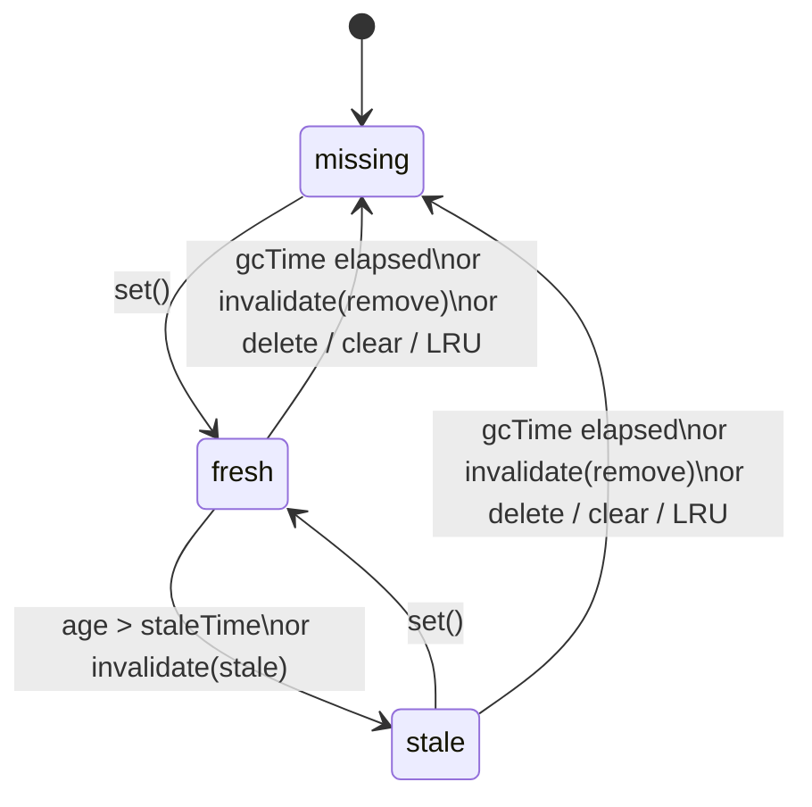

# aura-cache

In-memory cache module for router content, DOM snapshots, and loader data.

| Export | Role |
|--------|------|
| [`AuraSwrCache`](#auraswrcache) | String-key LRU store with SWR, GC, and invalidation |
| [`AuraResolvableSwrCache`](#auraresolvableswrcache) | Same store + in-flight dedupe + `resolve(key, load)` |

```ts
import {
  AuraSwrCache,
  AuraResolvableSwrCache,
  DEFAULT_GC_TIME,
} from './modules/aura-cache/core';
```

## AuraSwrCache

`Map` + doubly-linked list for O(1) lookup, LRU promotion, and removal.

## Key concepts

### SWR (stale-while-revalidate)

A caching strategy: **return cached data immediately**, then **refresh it in the background** when it becomes outdated.

1. **Fresh** — data is up to date; serve from cache, no fetch.
2. **Stale** — data is outdated but still in cache; serve it now and revalidate in the background.
3. **Missing** — no cache entry; fetch and store.

Enable with `staleTime` (how long data stays fresh). Use `lookup()` to get the status and decide whether to revalidate.

### Invalidation

Manually mark cache entries as outdated or delete them — for example after a mutation, route change, or logout.

| Policy | What happens |
|--------|----------------|
| `'stale'` (default) | Entry stays readable; `lookup()` reports `stale` so you can revalidate |
| `'remove'` | Entry is deleted from cache immediately |

Methods: `invalidate(key)`, `invalidateMatch(predicate)`, `invalidateAll()`.

## Operating modes

| Mode | Options | Behavior |
|------|---------|----------|
| Unlimited | none (no `staleTime`, no `gcTime`) | Entries never expire by age. `max` still enforces LRU capacity. |
| Simple GC | `gcTime` only | Remove on access after TTL. No age-based stale phase (`lookup()` reports `fresh` unless manually invalidated). |
| SWR | `staleTime` | Stale-while-revalidate: `fresh` → `stale` (still served) → removed after `gcTime`. Default `gcTime` is `DEFAULT_GC_TIME` (5 min) when omitted. |

`gcTime: Infinity` disables TTL removal — entries stay until LRU or explicit removal. With `staleTime`, the age-based stale phase still works; only hard removal is disabled (and auto background sweep is off).

GC runs lazily on access (`get`, `lookup`, `has`, `peek`, `isStale`, `extract`) and proactively via `purgeExpired()` or background sweep (`gcSweepInterval`). `size` and `keys` are passive introspection (may include GC-expired entries until swept or accessed). `peek`, `keys`, `isStale`, and `lookup` without `touch` do not promote LRU order. See [Read API](#read-api-get-vs-lookup-vs-has-vs-peek-vs-isstale-vs-extract) for read accessors.

The diagram below shows the **SWR** lifecycle (`staleTime` set). In simple GC mode (`gcTime` only), entries skip the `stale` phase and go straight to `missing` once TTL elapses and the entry is accessed or swept.



## Configuration

```ts
type SwrCacheOptions<T> = {
  max?: number;
  staleTime?: number;                  // SWR fresh window (ms)
  gcTime?: number;                     // max age since storedAt (ms)
  gcSweepInterval?: number | false;
  invalidatePolicy?: 'remove' | 'stale'; // default: 'stale'
  onRemove?: (key: string, value: T) => void;
};
```

| Option | Description |
|--------|-------------|
| `max` | LRU capacity; evicts the least recently used key when a **new** key pushes `map.size` above `max`. Must be `>= 1` when set. Updating an existing key does not trigger LRU eviction |
| `staleTime` | Enables SWR (`>= 0` or `Infinity`). After this age, entries become stale but stay readable. `Infinity` keeps entries age-fresh forever |
| `gcTime` | Max age since `storedAt` before removal (`>= 0` or `Infinity`). Defaults to `DEFAULT_GC_TIME` (5 min) when `staleTime` is set and `gcTime` is omitted. `Infinity` disables TTL removal. Omitted entirely (no `staleTime`) → no TTL unless you set `gcTime` explicitly |
| `gcSweepInterval` | Background `purgeExpired()` interval. See [below](#gcsweepinterval) |
| `invalidatePolicy` | Default for `invalidate`, `invalidateMatch`, `invalidateAll` (`'stale'` by default) |
| `onRemove` | Called when a value is discarded. **Yes:** LRU eviction; GC (`purgeExpired()`, background sweep, or lazy GC on `get` / `lookup` / `has` / `peek` / `isStale` / GC-expired `extract`); `set` overwrite when the value **changes**; `delete` / `clear`; `invalidate` / `invalidateMatch` / `invalidateAll` with `'remove'`. **No:** live `extract`; `set` overwrite with the **same** reference; `invalidate(..., 'stale')`; `size` / `keys` |

When both `staleTime` and `gcTime` are finite, keep `staleTime <= gcTime`. If `staleTime > gcTime`, the entry is removed at `gcTime` while still `fresh` — the age-based stale phase never happens. Manual `invalidate(..., 'stale')` still marks entries stale.

### `gcSweepInterval`

- `undefined` — auto when resolved `gcTime` is **finite**: `clamp(gcTime / 2, 5s … 60s)`. Off when `gcTime` is omitted, or when `gcTime` is `Infinity`
- `number` — run `purgeExpired()` every N ms; **requires** a finite `gcTime` (constructor throws otherwise)
- `false` — no background sweep; TTL cleanup via read accessors, `purgeExpired()`, or LRU eviction only

`staleTime`, `gcTime`, and explicit `gcSweepInterval` must be `>= 0` (or `Infinity` for the timings). Negative or `NaN` values throw at construction.

**Note:** SWR with default options (`staleTime` set, `gcTime` omitted, `gcSweepInterval` omitted) enables both default TTL **and** auto background sweep.

Background sweep lifecycle:

- **Start** — on the first `set()` while the store is non-empty
- **Stop** — when the store becomes empty (last entry removed) or on `clear()` / `destroy()`
- **Restart** — on the next `set()` after `clear()`

## API

| Method | LRU | Description |
|--------|:---:|-------------|
| `get(key)` | yes | Returns value (fresh or stale), or `undefined` if missing/GC-expired. Lazy GC removes expired entries |
| `lookup(key, touch?)` | if `touch` | `{ status: 'fresh' \| 'stale' \| 'missing', value? }`. Lazy GC on expired entries. Use for SWR revalidate decisions |
| `has(key)` | no | `true` if a readable entry exists; lazy GC removes expired entries |
| `peek(key)` | no | Returns value without LRU promote; lazy GC removes expired entries |
| `isStale(key)` | no | `true` if stale and readable; `false` if missing, fresh, or GC-expired (lazy GC removes expired) |
| `set(key, value)` | yes* | Resets stale flag and `storedAt`. Overwrite calls `onRemove` only when the value changes. New keys may trigger LRU eviction; overwrite updates in place |
| `extract(key)` | no | Keep-alive checkout; see [`extract`](#extract) |
| `delete(key)` | — | Remove one entry; always calls `onRemove` |
| `invalidate(key, policy?)` | no | Mark outdated (`'stale'`) or delete (`'remove'`). Returns `false` if key missing. Does not check TTL expiry before applying policy |
| `invalidateMatch(predicate, policy?)` | no | Same as `invalidate`, for keys matching a filter |
| `invalidateAll(policy?)` | no | Same as `invalidate`, for every entry |
| `purgeExpired()` | — | Remove all GC-expired entries; returns count. No-op when `gcTime` is omitted; with `gcTime: Infinity`, scans but removes nothing |
| `clear()` / `destroy()` | — | Remove all entries, stop background sweep, call `onRemove` for each. `destroy()` is an alias for `clear()`. Store is reusable |
| `keys()` | — | Snapshot of `map` keys in insertion order (not LRU order). Includes stale and GC-expired until removed. No LRU promote, no GC |
| `size` | — | `map.size` (includes stale and GC-expired until removed). No GC |

\*`set` promotes an existing entry to LRU tail; only **new** keys can evict via `max`.

### Read API: `get` vs `lookup` vs `has` vs `peek` vs `isStale` vs `extract`

Use this table to pick the right read path. **`RouteDomCache`** (`has` / `peek` / `extract`) follows the same rules via `AuraSwrCache` for those methods; use `AuraSwrCache.lookup` directly for SWR status.

| Method | Returns value | Promotes LRU | Always unlinks | Calls `onRemove` | GC-expired entry |
|--------|:-------------:|:------------:|:--------------:|:----------------:|------------------|
| `get` | yes | yes | no | on lazy GC only | removed from map on read → `undefined` |
| `lookup` | if readable | if `touch` | no | on lazy GC only | removed from map on read → `{ status: 'missing' }` |
| `has` | no (`boolean`) | no | no | on lazy GC only | removed from map on read → `false` |
| `peek` | yes | no | no | on lazy GC only | removed from map on read → `undefined` |
| `isStale` | no (`boolean`) | no | no | on lazy GC only | removed from map on read → `false` |
| `extract` | if readable | no | yes | live: no; GC-expired: yes | removed via `onRemove` → `undefined` |
| `size` | no (number) | no | no | no | stays in map until removed elsewhere |
| `keys` | no (key[]) | no | no | no | included until removed elsewhere |
| `delete` | no | — | yes | yes | — |

**`lookup` result (SWR and simple mode)**

| `status` | Value returned | Typical next step |
|----------|:--------------:|-------------------|
| `fresh` | yes | serve from cache |
| `stale` | yes | serve from cache and revalidate in background |
| `missing` | no | fetch and `set()` |

In simple GC mode (`gcTime` without `staleTime`), readable entries report `fresh` unless manually invalidated (`invalidate(..., 'stale')`).

**When to use what**

- **`get`** — normal cache hit; returns the value without status; stale entries in SWR mode are still returned; promotes LRU.
- **`lookup`** — when you need `fresh` / `stale` / `missing` (SWR revalidate decisions). Stale entries stay in cache and remain readable. Pass `touch: true` to promote LRU; default `false` like `peek` / `has`.
- **`has`** — cheap existence check when promotion is unwanted; lazy GC on expired entries.
- **`isStale`** — `true` only when entry is stale **and** still readable; lazy GC on expired entries.
- **`peek`** — read the value without status and without LRU promotion; lazy GC on expired entries. Prefer over `keys()` when probing a single key.
- **`extract`** — keep-alive checkout; see [`extract`](#extract).
- **`size` / `keys`** — passive map introspection; no GC, no LRU promote. May include GC-expired entries until `purgeExpired()`, background sweep, or a read accessor removes them. Use `lookup()` or `purgeExpired()` first when you need readable-only counts.

### `extract`

Removes the entry from the store. Unlike `delete`, a **live** checkout skips `onRemove` so the value can be reattached (e.g. detached DOM).

| Result | `onRemove` |
|--------|------------|
| value returned | no |
| `undefined` (missing) | no |
| `undefined` (GC-expired) | yes |

For most callers both `undefined` cases mean the same fallback (e.g. re-render). On the expired path cleanup already ran in `onRemove`.

```ts
const root = cache.extract(key);
if (root) {
  outlet.append(root);
  return;
}
await renderFresh(key);
```

## Examples

### Basic usage

```ts
const cache = new AuraSwrCache<string>();

cache.set('/home', '<h1>Home</h1>');
cache.get('/home');   // '<h1>Home</h1>'
cache.has('/home');   // true
cache.delete('/home');
cache.get('/home');   // undefined
```

### TTL without SWR

```ts
const cache = new AuraSwrCache<string>({
  gcTime: 60_000,
  gcSweepInterval: false,
});

cache.set('fragment', '<nav>...</nav>');
// after 61s:
cache.get('fragment'); // undefined — removed on read
```

### SWR: stale-while-revalidate

Serve cached content immediately; when `lookup()` returns `stale`, show it and refresh in the background:

```ts
const cache = new AuraSwrCache<string>({
  staleTime: 30_000, // fresh for 30s; gcTime defaults to DEFAULT_GC_TIME (5 min)
});

async function loadPage(url: string): Promise<string> {
  const hit = cache.lookup(url);

  if (hit.status === 'fresh') return hit.value;

  if (hit.status === 'stale') {
    revalidate(url).catch(console.error);
    return hit.value;
  }

  const html = await fetch(url).then((r) => r.text());
  cache.set(url, html);
  return html;
}

async function revalidate(url: string): Promise<void> {
  cache.set(url, await fetch(url).then((r) => r.text()));
}
```

### LRU capacity

```ts
const cache = new AuraSwrCache<string>({ max: 2 });

cache.set('a', 'A');
cache.set('b', 'B');
cache.get('a');      // promote 'a' to LRU tail
cache.set('c', 'C'); // evicts 'b' (LRU head)

cache.has('b'); // false — 'b' was evicted on set('c'), not because has() skips promotion
```

Use `get` or `lookup(key, true)` when access should protect an entry from removal.

### Invalidation

Mark entries outdated after a mutation or event without deleting them immediately (default `'stale'` policy):

```ts
const cache = new AuraSwrCache<string>({ staleTime: 60_000 });

cache.set('data:users', '{"users":[]}');
cache.set('html:/about', '<main>About</main>');

// API data changed — mark stale, keep serving until revalidate
cache.invalidateMatch((key) => key.startsWith('data:'));
cache.isStale('data:users');  // true
cache.get('data:users');      // still returns JSON (stale)

// Or delete immediately
cache.invalidate('html:/about', 'remove');
cache.invalidateAll('remove');
```

### Proactive GC

```ts
const cache = new AuraSwrCache<string>({
  gcTime: 60_000,
  // gcSweepInterval omitted → auto sweep every 30s (gcTime / 2)
});

cache.set('temp', 'value');
// expired entries removed by background sweep even without reads

cache.purgeExpired(); // or trigger manually
cache.destroy();      // stop sweep and release all entries
```

### `onRemove` callback

Called when the store **discards** a value (caller no longer owns it in the cache):

| Trigger | `onRemove` |
|---------|:----------:|
| LRU eviction (`max` exceeded on **new** key) | yes |
| GC — `purgeExpired()`, background sweep, or lazy GC on read accessors | yes |
| `set` overwrite with a **different** value | yes (previous value) |
| `delete`, `clear` / `destroy`, `invalidate*(..., 'remove')` | yes |
| Live `extract` (keep-alive checkout) | no |
| `set` overwrite with the **same** reference | no |
| `invalidate(..., 'stale')` | no |
| `size`, `keys` | no |

Use it to release resources — e.g. remove a DOM node from a detached keep-alive subtree.

**Do not call store methods inside `onRemove`.** While the callback runs, the store may be walking its internal list or updating an entry. Calling `set`, `delete`, `clear`, `get`, `extract`, or `invalidate` from `onRemove` is unsupported: it can double-invoke callbacks, skip entries, or recurse indefinitely. Only clean up the `value` you receive.

```ts
const cache = new AuraSwrCache<HTMLElement>({
  max: 10,
  onRemove: (_key, el) => el.remove(), // OK — release the element
});

// ❌ unsupported
const bad = new AuraSwrCache<HTMLElement>({
  onRemove: (key) => cache.delete(key),
});
```

Live `extract` skips `onRemove` (keep-alive reattach); GC-expired `extract` calls it. See [`extract`](#extract).

## AuraResolvableSwrCache

Composes [`AuraSwrCache`](#auraswrcache) + singleflight for loader-style flows (`DataGraph`, view payload cache, handoff).

```ts
const cache = new AuraResolvableSwrCache<string>({
  staleTime: 30_000,
  write: true, // default — store settled values
  onSettled: (key, value) => {
    /* optional side-effect; does not replace write */
  },
});

const html = await cache.resolve('/about', () => fetch('/about').then((r) => r.text()));
```

| Method | Description |
|--------|-------------|
| `resolve(key, load)` | Fresh → cached value; stale → cached value + background `load`; missing → await `load`. Concurrent callers share one in-flight `load` |
| `join(key)` | Join in-flight work or a settled value — never starts a load |
| `get` / `has` / `set` / `delete` | Delegate to the underlying store (`delete` also drops in-flight) |
| `invalidate` / `invalidateMatch` / `invalidateAll` | Delegate to the store |
| `clear` / `destroy` | Clear store + in-flight; bump epoch so late settles cannot resurrect entries |

Constructor extras (`ResolvableSwrCacheOptions` = `SwrCacheOptions` + policy):

| Option | Description |
|--------|-------------|
| `write` | `boolean` or predicate — whether to `set` the settled value (default `true`). In-flight dedupe still applies when `false` |
| `onSettled` | Extra callback after a successful load settle (not on fresh hits) |

## Exported types

```ts
export const DEFAULT_GC_TIME = 5 * 60_000;

type SwrCacheOptions<T> = { /* see Configuration */ };
type ResolvableSwrCacheOptions<T> = SwrCacheOptions<T> & ResolvableSwrCachePolicy;
type ResolvableSwrCachePolicy = {
  write?: boolean | ((value: unknown) => boolean);
  onSettled?: (key: string, value: unknown) => void;
};

type InvalidatePolicy = 'remove' | 'stale';
type CacheEntryStatus = 'fresh' | 'stale' | 'missing';

type CacheLookup<T> =
  | { status: 'missing' }
  | { status: 'fresh'; value: T }
  | { status: 'stale'; value: T };
```

## Tests

```bash
npx jest src/modules/aura-cache/test/aura-swr-cache.test.ts
npx jest src/modules/aura-cache/test/aura-resolvable-swr-cache.test.ts
```

## Benchmark

```bash
npm run bench:cache
npm run bench:cache:gc   # with --expose-gc
```

## Comparison with SPA router caches

See [docs-wip/comparison/CACHE_STORE_COMPARISON.md](../../docs-wip/comparison/CACHE_STORE_COMPARISON.md) — SWR/LRU parity with TanStack Router, ratings (7/10 as engine), benchmark numbers, roadmap to router integration.
