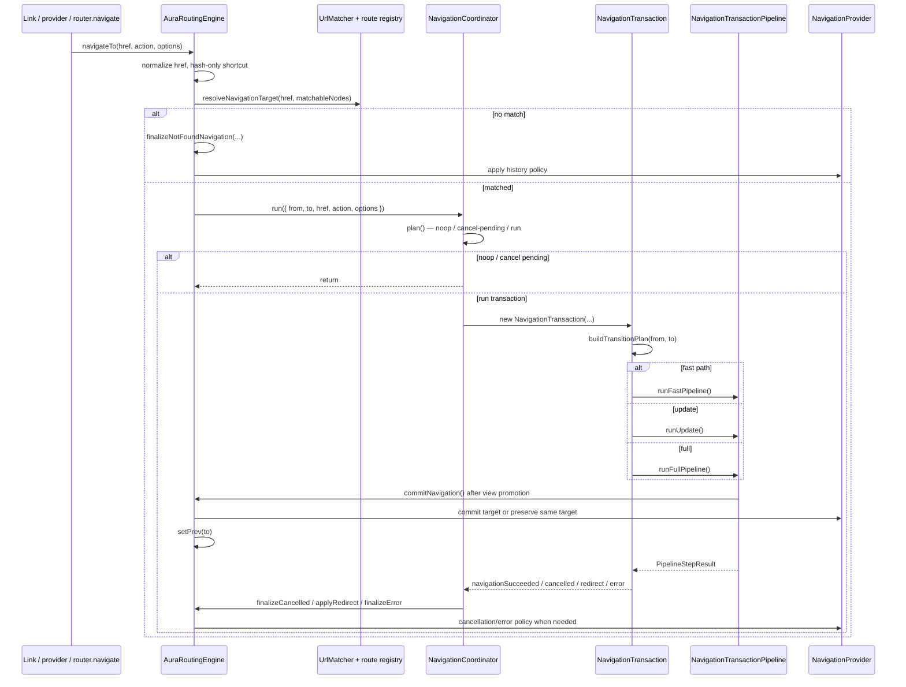

# Aura Routing Engine Architecture

This document is the top-level map for `aura-routing-engine/core`. The more
specific nested route tree model lives in `route-tree/README.md`.

## Module Map

| Area | Responsibility |
| --- | --- |
| `aura-routing-engine.ts` | Public engine adapter: provider/link/prefetch wiring, route registry, hash-only and not-found pre-match paths, `invalidateData()`. |
| `navigation/` | Coordinator, transaction, pipeline, phase metadata (`PHASES`), lifecycle types/context, phase execution, failure lifecycle (`navigation-failure-handler`, `not-found-exit-cleanup`), history finalize (`navigation-finalize.ts`), scroll policy, terminal result types. |
| `hooks/` | Global hook registry, hook name resolution (`resolve-hook-names`), and hook result normalization. |
| `route-tree/` | Nested route tree, active chain, LCA branch diff, and `TransitionMap`. |
| `match/` | URL matching and `MatchedRouteInfo` creation. |
| `history/` | Browser/fake providers and post-outcome history policy. |
| `view-mount/` | View staging, commit tracking, and route render adapter. |
| `failure/` | Structured navigation errors, failure snapshots, and failure callbacks. |
| `content/` | Route attrs → `ContentLoadService` → cache → loader payload. |
| `data-graph/` | Route `load` hooks, SWR cache, prefetch intent, cache invalidation. |
| `prefetch/` | Intent-driven prefetch side channel. |

## Navigation Flow

## Ownership Boundaries

`AuraRoutingEngine` owns external I/O: history provider lifecycle, link tracking,
route registration, prefetch setup, hash-only navigation, pre-match `NOT_FOUND`,
and `DataGraph` cache invalidation via `invalidateData()`.

`NavigationCoordinator` owns matched navigation control flow: duplicate pending
requests, aborting a pending transaction when the active route is clicked,
superseding in-flight transactions, and routing terminal outcomes back to the
engine.

`NavigationTransaction` owns a single run: `AbortSignal`, transition plan,
view commit tracker, staged-view rollback on cancel/supersede, and the lifecycle
runtime slice passed to hooks.

`NavigationTransactionPipeline` owns phase order, rendering, transitions, and
the commit gate (`commitNavigation`). It delegates route lifecycle execution to
`NavigationTransactionPipelinePhase`. Blocking phases may
cancel or redirect before view commit.

## Commit Vocabulary

The engine keeps three related concepts separate:

- `PipelineStepResult` with `status: 'navigationSucceeded'`: the pipeline
  completed successfully.
- `ViewCommitSnapshot.view === 'committed'`: the target view was promoted and should
  be treated as user-visible.
- History commit: `provider.commit()` writes the target URL according to
  `resolveHistoryPolicy()`.

`commitNavigation()` on the engine is the success-path boundary where the staged
view is already promoted, history may be committed, `prev` is updated, and
`onNavigationCommitted` runs.

## Data Invalidation

`<aura-router>.invalidate()` delegates to `AuraRoutingEngine.invalidateData()`:

- Filters: exact `key`, route `path` prefix, or custom `match` predicate.
- `policy: 'stale'` (default) — keep readable values, mark outdated (SWR on next load).
- `policy: 'remove'` — drop entries immediately.
- Return value: number of affected entries; `-1` when a full invalidate ran against an empty cache.
- Dispatches `data-invalidated` on the router element.

`NavigationCoordinator.invalidate()` is unrelated — it aborts in-flight navigation
and bumps router generation on teardown.

## Hook Registry Model

`defaultHookRegistry` is intentionally a process-wide singleton. `AuraRouter.use()`
and `AuraRouter.unuse()` mutate this shared registry; `AuraRoutingEngine` reads it
via `hooksRegistry`.

Implications:

- Hooks registered through `AuraRouter.use()` are global for all router instances
  on the page.
- Tests that need isolation should construct `new HookRegistry()` and inject it
  when per-router registries become supported.
- A future per-router hook model should be introduced explicitly rather than
  changing `defaultHookRegistry` semantics silently.

## Public Entry Points

Use `src/modules/aura-routing-engine/core.ts` as the canonical public API for
router/engine consumers and hook authors. Types such as `RouterInstance` should
be imported from this barrel.

`src/modules/aura-routing-engine/route-api.ts` is the lighter route-facing API
for `<aura-route>`. It deliberately avoids importing the engine orchestrator to
prevent route-tree cycles.
