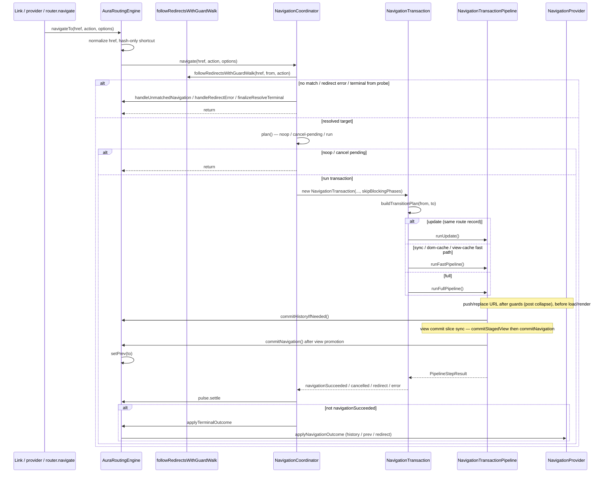

# Aura Routing Engine Architecture

This document is the top-level map for `aura-routing-engine/core`. The nested route
tree model lives in `route-tree/README.md`; view loading in `view-graph/README.md`;
failure handling in `failure/README.md`.

## Module Map

| Area | Responsibility |
| --- | --- |
| `aura-routing-engine.ts` | Public engine adapter: provider/link/prefetch wiring, route registry, hash-only and pre-match `NOT_FOUND`, `commitHistoryIfNeeded`, `commitNavigation`, `invalidate({ cache: 'data' | 'view' | 'all' })`. |
| `aura-routing-route-registry.ts` | Route catalog snapshot, tree rebuild, `matchableNodes` for matcher. |
| `navigation/` | Coordinator, transaction, pipeline, phase registry (`lifecycle-phases.ts` / `PHASES`), lifecycle execution (`navigation-transaction-pipeline-phase.ts`), **observe-only** `navigation-pulse.ts`, **apply** (`navigation-outcome.ts`), failure lifecycle (`pipeline-failure.ts`, `unmount-prev-on-not-found.ts`), outcome types. |
| `events/` | Typed `EventBus` + `EngineEvent`. Emit goes through `NavigationPulse`, not ad-hoc from pipeline. |
| `route/` | `RouteInstance`, lifecycle phase vocabulary (`RoutePhase`, `RouteLifecycleContext`, …), hook attr props. |
| `guard.types.ts` | Shared blocking-hook contract: `GuardResult`, `RedirectTarget` (normalized from hook return values). |
| `hooks/` | Global hook registry, `resolve-hook-names`, `normalizeHookResult`. |
| `route-tree/` | Nested route tree, active chain, LCA branch diff, `TransitionMap` (+ derived `canUseFastPath`), cache fast-path probes (`can-use-fast-path.ts`). |
| `match/` | URL matching (`url-matcher.ts`), `MatchedRouteInfo`, resource keys. |
| `redirect/` | Declarative redirect hops (`followDeclarativeRedirects`), pre-commit blocking walk (`followRedirectsWithGuardWalk`). See `redirect/README.md`. |
| `history/` | Browser/fake providers and history policy (`history-policy.ts`, incl. `applyTransactionHistory`). |
| `view-mount/` | View staging/commit tracking, fast-path `runViewCommit`, branch mount (`branch-mount` → `mountResolvedView`), staged-view rollback. |
| `failure/` | Model only: `NavigationError` (cause) in `navigation-error.ts`, `NavigationFailure` (terminal snapshot) in `navigation-failure.ts`. Apply side effects → `navigation-outcome.ts`. |
| `resource-graph/` | Prepare composition root: owns `HandoffCache`, `DataGraph`, `ViewGraph`; sole `load()` entry for navigation and speculative prepare; supersede pin (`pinSharedBufferFor`). |
| `document/` | Document meta contract: `DocumentMetaValues`, extract from HTML, resolve attrs vs htmlMeta. Host apply stays in `aura-router`. See [`document/README.md`](document/README.md). |
| `view-graph/` | Route view attrs → payload cache → loader payload. Owned by `ResourceGraph` (not called directly from pipeline). |
| `data-graph/` | Route `load` hooks, SWR `cache.data`. Owned by `ResourceGraph` (not called directly from pipeline). |
| `invalidate-router-cache.ts` | Shared invalidate helpers for data/view caches (`key` / route pattern / `match` / all). |
| `prefetch/` | `PrefetchPipeline`: intent bus → policy → plan → speculative prepare via `ResourceGraph.load`. |
| `user-actions/` | Link click interception (`link-navigation.ts`), href resolution (`link-resolve.ts`), link prefetch intent. |
| `link-active/` | App href resolution/comparison (`app-href.ts`), active link matching (`match.ts`), DOM class sync (`sync.ts`), and `router.activeRouteBranch` (`active-route-branch.ts`). |

## Navigation Flow



### Pipeline tiers

`NavigationTransaction.run()` picks one path after `buildTransitionPlan`:

| Tier | Entry | Skips | Order (high level) |
| --- | --- | --- | --- |
| **Update** | `runUpdate()` | guards, render, unmount, ready | history → loads → `update` → `commitNavigation` |
| **Fast** | `runFastPipeline()` | guards, loads, transitions | history → single `runViewCommit` → after-render |
| **Full** | `runFullPipeline()` | `runGuards` when `skipBlockingPhases` | `runGuards`? → history → **loads** (`showLoading` → `ResourceGraph.load` → `hideLoading`) → commit + transitions → after-render |

`skipBlockingPhases`: redirect walk already ran `leave` → `guard` — see `redirect/README.md`.

Fast path eligibility (any → same `runFastPipeline` body):

- `TransitionMap.canUseFastPath` — flat + sync inline content + lifecycle gates
- `canUseDomCacheFastPath` — flat + `cache.dom` hit + same gates (`hasLoad` → full)
- `canUseViewCacheFastPath` — flat + warm `cache.view` + same gates (no `hasLoad` / layout / `viewLoaderNeedsData`)

View commit slice (`commitStagedView` → `commitNavigation`) must stay sync — see § Commit Vocabulary.

Full render is always **branch loads → commit**:

1. `runLoads()` — `ResourceGraph.load` → `dataSnapshot` / `viewSnapshot`
2. `commitEnterBranchToDom()` — sync `mountEnterBranch` → per-route `mountResolvedView` (incl. `paramChangeRemount`)
3. Dom restore for `cache.dom` happens inside route view code (`aura-route` `ViewRenderPipeline.syncBranchMount`), not as a separate engine pipeline step

## Ownership Boundaries

`AuraRoutingEngine` owns external I/O: history provider lifecycle, link tracking,
route registration, prefetch setup, hash-only navigation, pre-match `NOT_FOUND`,
`commitHistoryIfNeeded` / `commitNavigation`, and cache invalidation via
`invalidate({ cache: 'data' | 'view' | 'all' })` (delegated to `ResourceGraph`).

`ResourceGraph` owns prepare: `HandoffCache` + `DataGraph` + `ViewGraph`. Navigation and
speculative prepare load only via `resourceGraph.load(...)` (pipeline /
`runSpeculativePrepare`). Exception: `NavigationTransaction.run()` may **probe**
`engine.viewGraph.hasCachedView` for `canUseViewCacheFastPath` eligibility — no load.
On supersede, coordinator pins shared-buffer keys (`pinSharedBufferFor`) before cancel.

`NavigationCoordinator` owns matched navigation control flow: duplicate pending
requests, aborting a pending transaction when the active route is clicked,
superseding in-flight transactions, and routing terminal outcomes back to the
engine.

`NavigationTransaction` owns a single run: `AbortSignal`, transition plan,
`ViewCommitTracker`, staged-view rollback on cancel/supersede, and the lifecycle
runtime slice passed to hooks.

`NavigationTransactionPipeline` owns phase order, prepare loads, history commit step,
rendering, and the view success gate (`commitNavigation`). It delegates per-route
lifecycle execution to `NavigationTransactionPipelinePhase`. Blocking phases may
cancel or redirect before history commit and render.

`failure/` owns the failure model only; it does not write history or run app callbacks.
`navigation/pipeline-failure.ts` (`handlePipelineFailure`) runs the terminal
`error` phase after pipeline failures. `navigation/unmount-prev-on-not-found.ts`
runs callback-only `unmount` on the previous leaf before pre-match `NOT_FOUND`.

### Observe vs apply (Pulse contract)

Two axes — do not merge:

| Axis | Owner | Responsibility |
| --- | --- | --- |
| **Observe** | `NavigationPulse` → `EventBus` → aura-router DOM | Emit lifecycle facts only (`start`, phase, `settle` → finish/cancel/redirect/error, loads, …) |
| **Apply** | `applyNavigationOutcome` (+ `NavigationIdentity`, `applyTransactionHistory`) | History policy, `prev`, `onNotFound`, redirect re-navigate |

`NavigationPulse` **must not** write history, mutate `prev`, invoke app recovery callbacks,
or start navigation. Terminal call order: `pulse.settle` → apply effects
(`processResult`, `handleUnmatchedNavigation`, `handleRedirectError`, `finalizeResolveTerminal`).

## Commit Vocabulary

The engine keeps three related concepts separate:

- `PipelineStepResult` with `status: 'navigationSucceeded'`: the pipeline
  completed successfully.
- `ViewCommitSnapshot.view`: `none` → `staged` → `committed` — DOM promotion
  state during the transaction.
- History commit: `provider.commit()` writes the target URL. For programmatic
  push/replace, the URL is written in `commitHistoryIfNeeded()` after guards (post
  redirect collapse) and **before** loads/render. Terminal outcomes use
  `resolveHistoryPolicy()`; load/render errors after early commit preserve the URL.

`commitNavigation()` on the engine is the view-success boundary after staged views
are already promoted (`commitStagedView` on enter routes): it emits bus `commit:end`
and updates `prev`. Host scrolls on `commit:end` (policy / hash via `Scroller`).
Same-URL reassert and hash-only scroll use config `onScroll` → host `Scroller`
(not inlined in the engine). It does not promote DOM itself and does not perform a
second `pushState` when history was already committed.

### Commit-slice invariant (do not break)

In `NavigationTransactionPipeline.runAfterRender`, after exit `unmount` settles,
the **view commit slice** must stay synchronous:

```text
for enter: commitStagedView()   // promote staged → active
commitNavigation()              // view-success gate (commit:end → prev; host scrolls on commit:end)
// ← no await between these two
ready                           // may await — outside the slice
```

| Allowed | Forbidden |
| --- | --- |
| `await` on `unmount` / `ready` / transition hooks before or after the slice | `await` between the last `commitStagedView` and `commitNavigation` |
| Gap between `markViewStaged` and the slice (transition-order path) | Treating history URL write as part of this slice |

History URL write (`commitHistory` / `commitHistoryIfNeeded`) is an earlier sync step,
not part of the view slice. Supersede between `markViewStaged` and the slice rolls back
via `ViewCommitTracker` + `rollbackUncommittedViews`.

See also: class JSDoc on `NavigationTransactionPipeline`,
[PIPELINE_STEP_RUNNER.md](../../../../docs/done/PIPELINE_STEP_RUNNER.md) (F3),
[NAVIGATION_RUN_MANAGER.md](../../../../docs/done/NAVIGATION_RUN_MANAGER.md).

## Data Invalidation

`<aura-router>.invalidate({ cache? })` → `AuraRoutingEngine.invalidate()` →
`ResourceGraph.invalidateData()` or `invalidateView()`. Default `cache: 'data'`.

Shared options (`invalidate-router-cache.ts`):

- Filters: exact `key`, route **pattern** (e.g. `/users/:id`, not browser pathname), or custom `match` predicate.
- `policy: 'stale'` (default) — keep readable values, mark outdated (SWR on next load).
- `policy: 'remove'` — drop entries immediately.
- Return value: number of affected entries; `-1` when a full invalidate ran against an empty cache.
- Clears related prefetch freshness records when `path` is set or on full invalidate.
- `invalidate()` (data) dispatches `data-invalidated` on the router element.

`NavigationCoordinator.invalidate()` is unrelated — it aborts in-flight navigation
and bumps the transaction/attempt generation on teardown.

## Hook Registry Model

`defaultHookRegistry` is intentionally a process-wide singleton. `AuraRouter.use()`
and `AuraRouter.unuse()` mutate this shared registry; `AuraRoutingEngine` reads it
via `hooksRegistry`.

Hook return values are normalized to `GuardResult` (`guard.types.ts`) by
`normalizeHookResult()` in `hooks/registry.ts` before the pipeline interprets
cancel/redirect.

Implications:

- Hooks registered through `AuraRouter.use()` are global for all router instances
  on the page.
- Tests that need isolation should construct `new HookRegistry()` and inject it
  when per-router registries become supported.
- A future per-router hook model should be introduced explicitly rather than
  changing `defaultHookRegistry` semantics silently.

Phase metadata (`PHASES`) and route callback bindings live in
`navigation/lifecycle-phases.ts`. Lifecycle context types live in `route/types.ts`.

## Public Entry Points

Use `src/modules/aura-routing-engine/core.ts` as the canonical public API for
router/engine consumers and hook authors. Types such as `RouterInstance` should
be imported from this barrel.

`src/modules/aura-routing-engine/route-api.ts` is the lighter route-facing API
for `<aura-route>`. It deliberately avoids importing the engine orchestrator to
prevent route-tree cycles.
