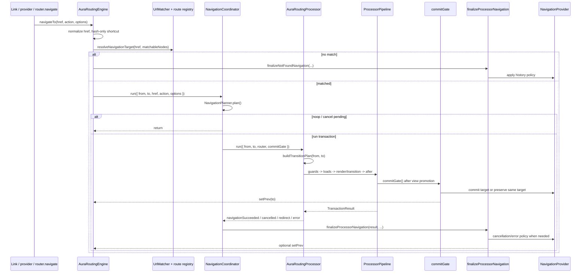

# Aura Routing Engine Architecture

This document is the top-level map for `aura-routing-engine/core`. The more
specific nested route tree model lives in `route-tree/README.md`.

## Module Map

| Area | Responsibility |
| --- | --- |
| `aura-routing-engine.ts` | Public engine adapter: provider/link/prefetch wiring, route registry, hash-only and not-found pre-match paths. |
| `navigation/` | Matched navigation coordination, pending dedupe, commit gate, terminal finalize, and history policy integration. |
| `processor/` | One navigation transaction: transition plan, cancellation scope, lifecycle pipeline, and rollback on supersede/cancel. |
| `lifecycle/` | Phase metadata (`PHASES`), lifecycle context, hook binding, phase execution, and error-phase orchestration. |
| `hooks/` | Global hook registry and hook result normalization. |
| `route-tree/` | Nested route tree, active chain, LCA branch diff, and `TransitionMap`. |
| `match/` | URL matching and `MatchedRouteInfo` creation. |
| `history/` | Browser/fake providers and post-outcome history policy. |
| `view-mount/` | View staging, commit tracking, and route render adapter. |
| `failure/` | Structured navigation errors, failure snapshots, and failure callbacks. |
| `content/` | Content descriptors, resolver/cache, and shared render/prefetch loading. |
| `prefetch/` | Intent-driven prefetch side channel. |

## Navigation Flow

## Ownership Boundaries

`AuraRoutingEngine` owns external I/O: history provider lifecycle, link tracking,
route registration, prefetch setup, hash-only navigation, and pre-match
`NOT_FOUND`.

`NavigationCoordinator` owns matched navigation control flow: duplicate pending
requests, aborting a pending transaction when the active route is clicked,
processor invocation, commit gate wiring, redirects, and terminal finalize.

`AuraRoutingProcessor` owns a single transaction. It builds `TransitionMap`,
starts a cancellable job, tracks view commit state, and delegates lifecycle work
to `ProcessorPipeline`.

`ProcessorPipeline` owns phase order, rendering, transitions, and the commit
gate. It delegates route lifecycle execution to `LifecycleRunner`. Blocking
phases may cancel or redirect before view commit. Post-commit phases warn/log
ignored cancel/redirect results.

## Commit Vocabulary

The engine keeps three related concepts separate:

- `TransactionResult.status === 'navigationSucceeded'`: the processor pipeline
  completed successfully.
- `ViewCommitSnapshot.view === 'committed'`: the target view was promoted and should
  be treated as user-visible.
- History commit: `provider.commit()` writes the target URL according to
  `resolveHistoryPolicy()`.

The commit gate is the success-path boundary where the staged view is already
promoted, history may be committed, `prev` is updated, and
`onNavigationCommitted` runs.

## Hook Registry Model

`defaultHookRegistry` is intentionally a process-wide singleton. `AuraRouter.use()`
and `AuraRouter.unuse()` mutate this shared registry, and every `AuraRouter`
instance created by the default wiring passes it to `AuraRoutingProcessor`.

Implications:

- Hooks registered through `AuraRouter.use()` are global for all router instances
  on the page.
- Tests that need isolation should construct `new HookRegistry()` and pass it to
  `new AuraRoutingProcessor(customRegistry)`.
- A future per-router hook model should be introduced explicitly rather than
  changing `defaultHookRegistry` semantics silently.

## Public Entry Points

Use `src/modules/aura-routing-engine/core.ts` as the canonical public API for
router/engine consumers and hook authors. Types such as `RouterInstance` should
be imported from this barrel.

`src/modules/aura-routing-engine/route-api.ts` is the lighter route-facing API
for `<aura-route>`. It deliberately avoids importing the engine orchestrator to
prevent route-tree cycles.
