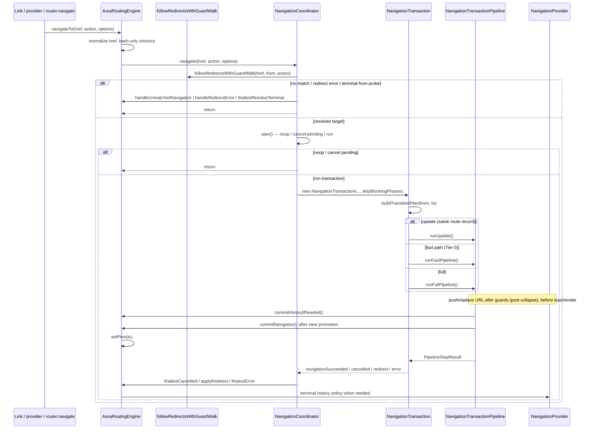

# Aura Routing Engine Architecture

This document is the top-level map for `aura-routing-engine/core`. The nested route
tree model lives in `route-tree/README.md`; view loading in `view-graph/README.md`;
failure handling in `failure/README.md`.

## Module Map

| Area | Responsibility |
| --- | --- |
| `aura-routing-engine.ts` | Public engine adapter: provider/link/prefetch wiring, route registry, hash-only and pre-match `NOT_FOUND`, `commitHistoryIfNeeded`, `commitNavigation`, `invalidateData()`. |
| `aura-routing-route-registry.ts` | Route catalog snapshot, tree rebuild, `matchableNodes` for matcher. |
| `navigation/` | Coordinator, transaction, pipeline, phase registry (`lifecycle-phases.ts` / `PHASES`), lifecycle execution (`navigation-transaction-pipeline-phase.ts`), failure lifecycle (`navigation-failure-handler.ts`, `not-found-exit-cleanup.ts`), history finalize (`navigation-finalize.ts`), outcome types. |
| `route/` | `RouteInstance`, lifecycle phase vocabulary (`RoutePhase`, `RouteLifecycleContext`, …), hook attr props. |
| `guard.types.ts` | Shared blocking-hook contract: `GuardResult`, `RedirectTarget` (normalized from hook return values). |
| `hooks/` | Global hook registry, `resolve-hook-names`, `normalizeHookResult`, hook result normalization. |
| `route-tree/` | Nested route tree, active chain, LCA branch diff, `TransitionMap` (+ derived `canUseFastPath`). |
| `match/` | URL matching (`url-matcher.ts`), `MatchedRouteInfo`. |
| `redirect/` | Declarative redirect hops (`followDeclarativeRedirects`), pre-commit blocking walk (`followRedirectsWithGuardWalk`). See `redirect/README.md`. |
| `history/` | Browser/fake providers and post-outcome history policy (`history-policy.ts`). |
| `view-mount/` | View staging/commit tracking, fast-path `runViewCommit`, branch resolve/mount (`branch-resolver`, `branch-mount`), staged-view rollback. |
| `failure/` | Structured navigation errors (`navigation-error.ts`), failure snapshots (`navigation-failure.ts`), app callbacks (`finalize-failure.ts`). |
| `view-graph/` | Route view attrs → `ViewGraph` → payload cache → loader payload. |
| `data-graph/` | Route `load` hooks, SWR cache, prefetch intent, cache invalidation. |
| `prefetch/` | `PrefetchPipeline`: intent bus → policy → plan → speculative prepare (`dataGraph` / `viewGraph`). |
| `user-actions/` | Link click interception (`link-navigation.ts`), href resolution (`link-resolve.ts`), link prefetch intent. |
| `link-active/` | App href resolution/comparison (`app-href.ts`), active link matching (`match.ts`), DOM class sync (`sync.ts`), and `router.trail` (`route-trail.ts`). |

## Navigation Flow

### Pipeline tiers

`NavigationTransaction.run()` picks one path after `buildTransitionPlan`:

| Tier | Entry | Skips | Order (high level) |
| --- | --- | --- | --- |
| **Update** | `runUpdate()` | guards, render, unmount, ready | history → loads → `update` → `commitNavigation` |
| **Fast (Tier 0)** | `runFastPipeline()` | guards, loads/prepare, transitions | history → single `runViewCommit` → after-render |
| **Full** | `runFullPipeline()` | `runGuards` when `skipBlockingPhases` | `runGuards`? → history → **prepare** (loads + resolve views) → commit + transitions → after-render |

`skipBlockingPhases`: redirect walk already ran `leave` → `guard` — see `redirect/README.md`.

Fast path eligibility: `TransitionMap.canUseFastPath` — flat swap (one exit, one enter), sync inline
content, no blocking hooks or `transition-order`.

Full render is always **branch prepare → commit**:

1. `runPrepare()` — `DataGraph.load` then parallel `resolveEnterBranch` (`ViewGraph.loadView`)
2. `commitEnterBranchToDom()` — sync `mountEnterBranch` / `applyPreResolved` (incl. `paramChangeRemount`)
3. `syncBranchMount` early-exit restores `cache.dom` when present
## Ownership Boundaries

`AuraRoutingEngine` owns external I/O: history provider lifecycle, link tracking,
route registration, prefetch setup, hash-only navigation, pre-match `NOT_FOUND`,
`commitHistoryIfNeeded` / `commitNavigation`, and `DataGraph` cache invalidation via
`invalidateData()`.

`NavigationCoordinator` owns matched navigation control flow: duplicate pending
requests, aborting a pending transaction when the active route is clicked,
superseding in-flight transactions, and routing terminal outcomes back to the
engine.

`NavigationTransaction` owns a single run: `AbortSignal`, transition plan,
`ViewCommitTracker`, staged-view rollback on cancel/supersede, and the lifecycle
runtime slice passed to hooks.

`NavigationTransactionPipeline` owns phase order, data loads, history commit step,
rendering, and the view success gate (`commitNavigation`). It delegates per-route
lifecycle execution to `NavigationTransactionPipelinePhase`. Blocking phases may
cancel or redirect before history commit and render.

`failure/` owns error normalization and app callbacks; it does not write history.
`navigation/navigation-failure-handler.ts` runs the terminal `error` phase after
pipeline failures. `navigation/not-found-exit-cleanup.ts` runs callback-only
`unmount` on the previous leaf before pre-match `NOT_FOUND`.

## Commit Vocabulary

The engine keeps three related concepts separate:

- `PipelineStepResult` with `status: 'navigationSucceeded'`: the pipeline
  completed successfully.
- `ViewCommitSnapshot.view`: `none` → `staged` → `committed` — DOM promotion
  state during the transaction.
- History commit: `provider.commit()` writes the target URL. For programmatic
  push/replace, the URL is written in `commitHistoryIfNeeded()` after guards (post
  redirect collapse) and **before** loads/render. Terminal outcomes use
  `resolveHistoryPolicy()`; load/render errors after early commit preserve the URL.

`commitNavigation()` on the engine is the view-success boundary: staged view is
promoted, `prev` is updated, scroll/hash and `onNavigationCommitted` run. It does
not perform a second `pushState` when history was already committed.

## Data Invalidation

`<aura-router>.invalidate()` delegates to `AuraRoutingEngine.invalidateData()`:

- Filters: exact `key`, route `path` prefix, or custom `match` predicate.
- `policy: 'stale'` (default) — keep readable values, mark outdated (SWR on next load).
- `policy: 'remove'` — drop entries immediately.
- Return value: number of affected entries; `-1` when a full invalidate ran against an empty cache.
- Clears related prefetch freshness records when `path` is set or on full invalidate.
- Dispatches `data-invalidated` on the router element.

`NavigationCoordinator.invalidate()` is unrelated — it aborts in-flight navigation
and bumps router generation on teardown.

## Hook Registry Model

`defaultHookRegistry` is intentionally a process-wide singleton. `AuraRouter.use()`
and `AuraRouter.unuse()` mutate this shared registry; `AuraRoutingEngine` reads it
via `hooksRegistry`.

Hook return values are normalized to `GuardResult` (`guard.types.ts`) by
`normalizeHookResult()` in `hooks/registry.ts` before the pipeline interprets
cancel/redirect.

Implications:

- Hooks registered through `AuraRouter.use()` are global for all router instances
  on the page.
- Tests that need isolation should construct `new HookRegistry()` and inject it
  when per-router registries become supported.
- A future per-router hook model should be introduced explicitly rather than
  changing `defaultHookRegistry` semantics silently.

Phase metadata (`PHASES`) and route callback bindings live in
`navigation/lifecycle-phases.ts`. Lifecycle context types live in `route/types.ts`.

## Public Entry Points

Use `src/modules/aura-routing-engine/core.ts` as the canonical public API for
router/engine consumers and hook authors. Types such as `RouterInstance` should
be imported from this barrel.

`src/modules/aura-routing-engine/route-api.ts` is the lighter route-facing API
for `<aura-route>`. It deliberately avoids importing the engine orchestrator to
prevent route-tree cycles.
