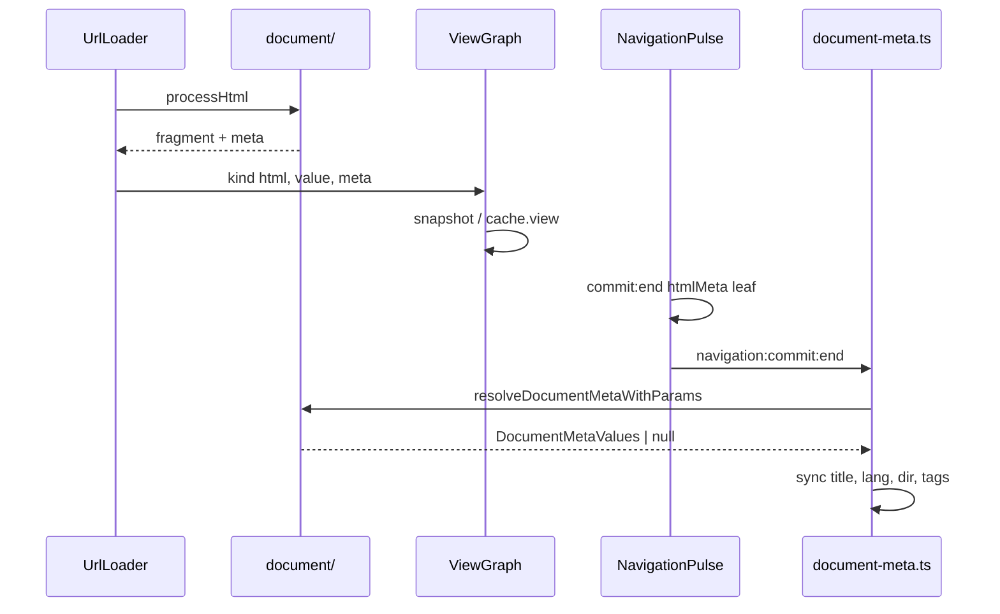

# document

При навигации роутер меняет не только контент view, но и метаданные страницы: заголовок вкладки, `lang`/`dir`, description, canonical, Open Graph и другие теги в `<head>`.

Модуль `core/document/` в **engine** готовит эти данные в три шага:

1. **Extract** — читает meta из HTML, полученного по url (title, атрибуты `<html>`, теги из `<head>`).
2. **Resolve** — накладывает атрибуты маршрута (`meta-title`, `meta-description`, …) поверх того, что пришло из HTML.
3. **Registry** — хранит список управляемых `<head>`-слотов; один и тот же список используется при чтении и при записи.

Запись в живой `document` engine **не делает**. После успешного commit host вызывает [`applyDocumentMeta`](../../../aura-router/core/document-meta.ts) из `aura-router` — это происходит на событии `navigation:commit:end`.

По подходу модуль ближе к Unpoly и Turbo (HTML-документ + overlay атрибутов маршрута), чем к компонентному `useHead` в SPA-фреймворках.

## Содержание

- [Разделение engine / host](#разделение-engine--host)
- [Модель данных](#модель-данных)
- [Слоты `<head>` (HeadTagSpec)](#слоты-head-headtagspec)
- [Пайплайн end-to-end](#пайплайн-end-to-end)
- [Extract](#extract)
- [Колокация с view](#колокация-с-view)
- [Resolve](#resolve)
- [Apply (host)](#apply-host)
- [Route attrs и inherit](#route-attrs-и-inherit)
- [Configure](#configure)
- [Только meta листа](#только-meta-листа)
- [Публичный API](#публичный-api)
- [Структура модуля](#структура-модуля)
- [См. также](#см-также)

---

## Разделение engine / host

Engine считает, *что* должно быть в meta; host — *записывает* это в DOM. Так DOM остаётся на стороне `<aura-router>`, а engine можно тестировать без браузерного `document`.

| Слой | Где | Что делает |
|------|-----|------------|
| **Engine** | `core/document/` | Парсит HTML → `DocumentMetaValues`; сливает attrs маршрута; ведёт список слотов |
| **ViewGraph** | `core/view-graph/` | Хранит `{ payload, meta }` в snapshot и `cache.view` |
| **Events** | `navigation:commit:end` | Передаёт `htmlMeta` листа в bus |
| **Host** | `aura-router/core/document-meta.ts` | `applyDocumentMeta` → `document.title`, `<html>`, owned-теги |

Engine **никогда** не трогает `document`. Единственный writer после commit — host.

---

## Модель данных

```ts
type DocumentMetaValues = {
  title?: string;
  lang?: string;   // из <html lang>
  dir?: string;    // из <html dir>
  tags?: Record<string, string>;  // ключ = HeadTagSpec.id
};
```

- Extract и resolve возвращают **одну и ту же форму** данных.
- `hasDocumentMeta(x)` — проверка «есть хотя бы одно поле»; используется как type guard.
- Extract ничего не нашёл → `undefined`. Resolve без attrs и с пустым `htmlMeta` → `null`.
- Ключи в `tags` стабильны, например `meta:name:description`, `link:rel:canonical` (см. `headTag()` в `schema.ts`).

---

## Слоты `<head>` (HeadTagSpec)

Один список `getHeadTags()` используется и при **чтении** HTML, и при **записи** в DOM — чтобы extract и apply всегда смотрели на одни и те же теги.

| Поле | Назначение |
|------|------------|
| `tag` | `meta` \| `link` |
| `attrs` | Идентификаторы (`name`, `property`, `rel`, …) → CSS selector |
| `valueAttr` | `content` (meta) или `href` (link) |
| `id` | Ключ в `DocumentMetaValues.tags` |

**Дефолт** (`DEFAULT_HEAD_TAGS`): description, canonical, `og:title|description|image|url`, `twitter:card|title|image`.

`document.title` и `<html lang|dir>` — **вне** registry (отдельные поля типа).

Доп. слоты: `configureDocumentMeta(tags)` append к дефолту (см. [Configure](#configure)).

---

## Пайплайн end-to-end

```text
Fetched HTML (UrlLoader)
        │
        ▼
  processHtml(html, extract, href)
        │  fragment ──► ViewGraph payload
        │  meta     ──► extractDocumentMeta(full doc)
        ▼
  ViewSnapshotEntry { payload, meta }  × enterRoutes (meta у каждого узла)
        │
        ▼
  commit: htmlMeta = viewSnapshot[last].meta
           ?? getCachedHtmlMeta(to)     // fast path / update без reload
        │
        ▼
  resolveDocumentMetaWithParams(to, htmlMeta)   // engine
        │
        ▼
  applyDocumentMeta(to, htmlMeta)               // host, engine-bridge
        │
        ▼
  document.title, <html lang|dir>, owned <meta>/<link>
```



---

## Extract

### `processHtml(html, selector, href)`

1. `stringToHtml(html)` — один parse.
2. `extractDocumentMeta(doc)` — meta из **полного** документа (не из extract-subtree).
3. Если `selector` нет — `fragment = html` как есть.
4. Если `selector` есть — `fragment = el.outerHTML` или warn + полный `html` при miss.

Используется в `UrlLoader` после fetch. Другие loaders (`html`, `template`, …) **не** несут `meta` — `htmlMeta` на commit будет `undefined`.

### `extractDocumentMeta(doc)`

| Источник DOM | Поле |
|--------------|------|
| `doc.title` | `title` |
| `<html lang>` | `lang` |
| `<html dir>` | `dir` |
| Каждый `getHeadTags()` selector | `tags[spec.id]` |

Пустой результат → `undefined` (не `{}`).

---

## Колокация с view

Meta хранится рядом с HTML-фрагментом view — в одной записи `{ payload, meta }`:

- snapshot при prepare и long cache `cache.view`;
- handoff buffer при settle view.

На prepare meta загружается для **каждого** узла в `enterRoutes`, но на commit в событие попадает только **meta листа** (см. [Только meta листа](#только-meta-листа)).

---

## Resolve

### `resolveDocumentMetaWithParams(to, htmlMeta?)`

**Без overlay:** если на matched route (с учётом **inherit**) все четыре атрибута равны `null` —
`metaTitle`, `metaDescription`, `metaTitleTemplate`, `metaCanonical` — функция возвращает `htmlMeta` как есть или `null`, если meta пустая.

**С overlay:**

```ts
meta = { ...htmlMeta };
// overlay attrs → tags[META_DESCRIPTION_ID], tags[CANONICAL_ID]
// title ← resolveTitle(route, htmlMeta?.title, vars)
```

`vars = { ...to.query, ...to.params }` — **path перекрывает query** при совпадении имени.

### Title (`resolveTitle`)

1. Если задан `meta-title-template` и есть «заголовок страницы»:
   - заголовок страницы = локальный `meta-title` (атрибут **на элементе route**), иначе `<title>` из HTML;
   - шаблон с `%s` → подставляет заголовок (`%s | App`); без `%s` → берётся заголовок страницы как есть.
2. Иначе: inherited / attr `meta-title`, иначе `<title>` из HTML.

**Локальный vs inherited:** `route.hasAttribute('meta-title')` — локальный attr перекрывает HTML для `%s`; inherited `meta-title` с `<aura-router>` не считается локальным, но участвует в fallback `attrTitle ?? htmlTitle`.

### Description / canonical

- `meta-description` → слот `META_DESCRIPTION_ID` (`meta:name:description`).
- `meta-canonical` → `CANONICAL_ID` (`link:rel:canonical`).
- Attr **перекрывает** значение из `htmlMeta.tags` при наличии.

### `lang` / `dir`

Пока только пробрасываются из `htmlMeta` (из fetched `<html>`). Отдельных route attrs для lang/dir **ещё нет**.

### Tokens

`:name` в attrs — `substituteTokens` (тот же helper, что и для `view`). `?` в строке — литерал, не view-search syntax.

---

## Apply (host)

`applyDocumentMeta(to, htmlMeta)` — единственное место, где meta попадает в живой DOM:

1. `resolved = resolveDocumentMetaWithParams(to, htmlMeta)`.
2. **Title:** если в `resolved` есть `title` — пишем; иначе возвращаем boot snapshot (значение `document.title` до первого apply).
3. **`lang` / `dir`:** та же логика; пустой boot `dir` → `removeAttribute`.
4. **Tags:** для каждого слота из `getHeadTags()`:
   - значение не задано → удаляем тег с `spec.selector[data-aura-head]`;
   - иначе находим или создаём элемент, пишем attrs и value, ставим `data-aura-head`.

### Откат к boot-состоянию

Apply **владеет** только тегами, которые сам пометил `data-aura-head`.

- Теги из boot shell без маркера **не удаляются**, но могут быть **перезаписаны**, если selector совпал.
- `resolved === null` — это не «ничего не делать»: title / lang / dir возвращаются к boot, owned-теги снимаются.

Скрипты, styles и reconcile ассетов — **вне scope** этого модуля.

---

## Route attrs и inherit

На `<aura-route>` и `<aura-router>` (inherit на детей):

| HTML attr | Свойство | Эффект |
|-----------|----------|--------|
| `meta-title` | `metaTitle` | Title overlay / `%s` source |
| `meta-title-template` | `metaTitleTemplate` | `%s \| App` wrap |
| `meta-description` | `metaDescription` | description slot |
| `meta-canonical` | `metaCanonical` | canonical href |

Opt-out от inherit: `none` / `off` / `false` / пустая строка → `null` (`parseOffableString`).

Пример:

```html
<aura-router meta-title-template="%s | My App">
  <aura-route path="/users/:id"
              meta-title="User :id"
              meta-description="Profile :id"
              meta-canonical="https://example.com/users/:id">
  </aura-route>
</aura-router>
```

---

## Configure

```ts
AuraRouter.configure({
  documentMeta: {
    tags: [
      { tag: 'meta', attrs: { name: 'theme-color' } },
      { tag: 'link', attrs: { rel: 'alternate', hreflang: 'en' } },
    ],
  },
});
```

- Engine: `configureDocumentMeta(tags)` — дополняет `DEFAULT_HEAD_TAGS`.
- Срабатывает только если в options есть `'tags' in documentMeta` (явный `tags: []` очищает список).
- Вызывать **до первого fetch** — иначе warm cache может не знать о новых слотах.

Site-wide meta без per-route attrs: boot shell `<head>`, inherit на `<aura-router>`, configure — предпочтительнее merge layout→leaf.

---

## Только meta листа

На commit в resolve/apply попадает meta **только листового** маршрута (`viewSnapshot[last]`). Meta layout-уровней сохраняется в snapshot при prepare, но в финальный commit **не сливается**.

**Почему не merge root→leaf:** при наивном слиянии defaults родителя «оживают», когда у листа поле omit — и ломается откат к boot: страница без description оставила бы description от layout. Общие defaults лучше задавать через boot shell `<head>`, inherit attrs на `<aura-router>` и `configureDocumentMeta`.

---

## Публичный API

Barrel `document/index.ts` / `aura-routing-engine/core.ts`:

| Symbol | Назначение |
|--------|----------|
| `DocumentMetaValues` | Тип meta |
| `hasDocumentMeta` | «Есть хотя бы одно поле» |
| `extractDocumentMeta` | DOM → meta |
| `processHtml` | Parse fetch + meta |
| `resolveDocumentMetaWithParams` | htmlMeta + attrs → итог |
| `getHeadTags` | Список слотов |
| `configureDocumentMeta` | Доп. слоты из configure |
| `META_DESCRIPTION_ID`, `CANONICAL_ID` | Стабильные ключи в `tags` |
| `HeadTagSpec`, `HeadTagInput` | Типы registry |

Host-only: `applyDocumentMeta` (`aura-router/core/document-meta.ts`).

---

## Структура модуля

```text
document/
  types.ts      DocumentMetaValues, hasDocumentMeta
  schema.ts     HeadTagSpec, DEFAULT_HEAD_TAGS, configureDocumentMeta
  extract.ts    processHtml, extractDocumentMeta
  resolve.ts    resolveDocumentMetaWithParams
  index.ts      barrel
```

Тесты: [`test/document/document-meta.test.ts`](../../test/document/document-meta.test.ts) (engine), [`aura-router/test/document-meta.test.ts`](../../../aura-router/test/document-meta.test.ts) (apply).

---

## См. также

- [`../view-graph/README.md`](../view-graph/README.md) — как meta хранится рядом с payload
- [`../ARCHITECTURE.md`](../ARCHITECTURE.md) — место модуля в engine
- [`../../../aura-router/core/engine-bridge.ts`](../../../aura-router/core/engine-bridge.ts) — вызов `applyDocumentMeta` на `navigation:commit:end`
- [`../../../aura-router/core/document-meta.ts`](../../../aura-router/core/document-meta.ts) — запись meta в DOM
